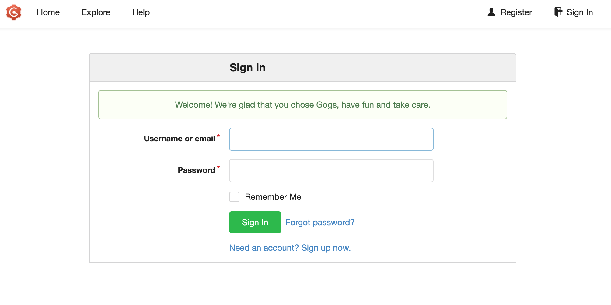

# Install Gogs on K1 to Implement a Git Server


The goal of Gogs is to create the simplest, fastest, and easiest way to set up a self-hosted Git service. Developed in the Go language, Gogs can be distributed as an independent binary and supports all platforms supported by the Go language, including Linux, Mac OS X, Windows, and ARM platforms.

Open Source Components
- Web Framework: [Macaron](http://go-macaron.com)
- UI Components:
    - [Semantic UI](http://semantic-ui.com/)
    - [GitHub Octicons](https://octicons.github.com/)
    - [Font Awesome](http://fontawesome.io/)
- Front-End Plugins:
    - [DropzoneJS](http://www.dropzonejs.com/)
    - [highlight.js](https://highlightjs.org/)
    - [clipboard.js](https://zenorocha.github.io/clipboard.js/)
    - [emojify.js](https://github.com/Ranks/emojify.js)
    - [jQuery Date Time Picker](https://github.com/xdan/datetimepicker)
    - [jQuery MiniColors](https://github.com/claviska/jquery-minicolors)
    - [CodeMirror](https://codemirror.net/)
    - [notebook.js](https://github.com/jsvine/notebookjs)
    - [marked](https://github.com/chjj/marked)
- ORM: [Xorm](https://github.com/go-xorm/xorm)
- Database Drivers:
    - [github.com/go-sql-driver/mysql](https://github.com/go-sql-driver/mysql)
    - [github.com/lib/pq](https://github.com/lib/pq)
    - [github.com/mattn/go-sqlite3](https://github.com/mattn/go-sqlite3)
    - [github.com/denisenkom/go-mssqldb](https://github.com/denisenkom/go-mssqldb)
- And all other third-party package dependencies of the Go language.

## Source Code Installation
### Install the Go Language
Gogs requires at least Go 1.20 or a higher version for compilation. For specific installation steps, please refer to the [official documentation](https://golang.org/doc/install).
### Set Up the Environment
We will create a user named `git` and complete the remaining installation steps within this user's space:
```sh
sudo adduser --disabled-login --gecos 'Gogs' git
```
### Compile Gogs
```sh
# Clone the repository into the "gogs" subdirectory
git clone --depth 1 https://github.com/gogs/gogs.git gogs
# Change the working directory
cd gogs
# Compile the main program. This step will download all dependencies.
go build -o gogs
```
### Test the Installation
You can check if Gogs works properly in the following way:
```sh
./gogs web
```
If you don't find any error messages, you can use `Ctrl-C` to stop the running process.
### Build with Tags
Gogs doesn't support some features by default. These features need to be explicitly supported using build tags ([build tags](https://golang.org/pkg/go/build/#hdr-Build_Constraints)) during the build process.
The currently available features built with tags are as follows:
- `pam`: PAM authorization and authentication support
- `cert`: Custom certificate generation support
- `minwinsvc`: Built-in support for Windows services (or you can use NSSM to create a service)
```sh
go build -tags "pam cert" -o gogs
```
## Configuration and Running
### Configuration Files
#### Default Configuration File
The default configuration is saved in `conf/app.ini`, and you **never need** to edit it. This file has been embedded into the binary since version `v0.6.0`.
#### Custom Configuration File
So, how can you customize the configuration without allowing modifications to the default configuration file `conf/app.ini`? It's very simple. Just create `custom/conf/app.ini`! Modify the values of the corresponding options in the `custom/conf/app.ini` file.
For example, if you need to change the path of the repository root directory:
```
[repository]
ROOT = /home/jiahuachen/gogs-repositories
```
Of course, you can also modify the database configuration:
```
[database]
PASSWORD = root
```
#### Why Do This?
At first glance, this seems a bit complicated, but it can effectively protect your custom configuration from being damaged:
- For users who install from binaries, they can directly replace the binary and other files without having to rewrite the custom configuration.
- For users who install from source code, it can avoid file modification conflicts caused by version management systems.
### Run the Gogs Service
#### Developer Mode
- You need to set the value of the option `security -> INSTALL_LOCK` in the `custom/conf/app.ini` file to `true`.
- You can use the powerful `make` command:
```sh
$ make
$./gogs web
```


### Deployment Mode
**Scripts are placed in the `scripts` directory, but please execute them in the repository root directory**
- Gogs supports multiple ways of starting:
    - Normal: Just execute `./gogs web`
    - Daemon: See details in the [scripts](https://github.com/gogs/gogs/tree/main/scripts) folder
- Then visit `/install` to complete the configuration work for the first run