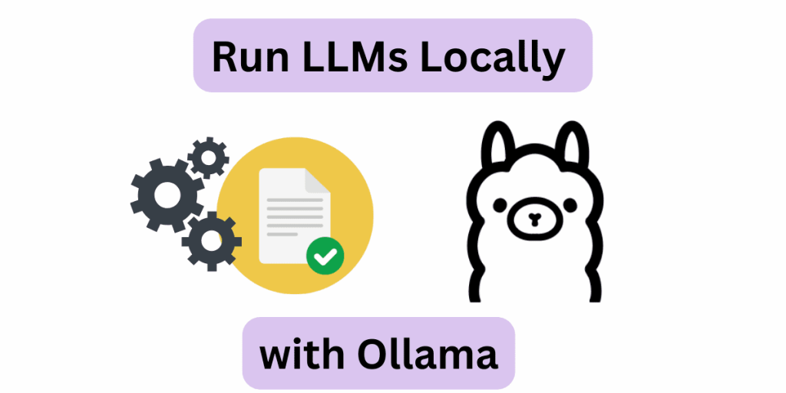
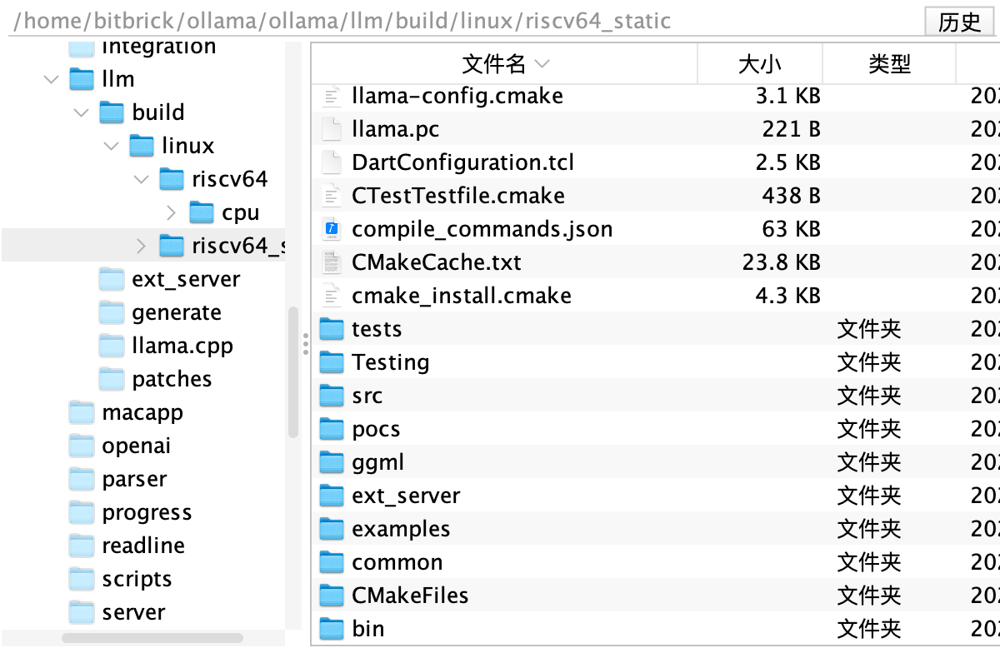
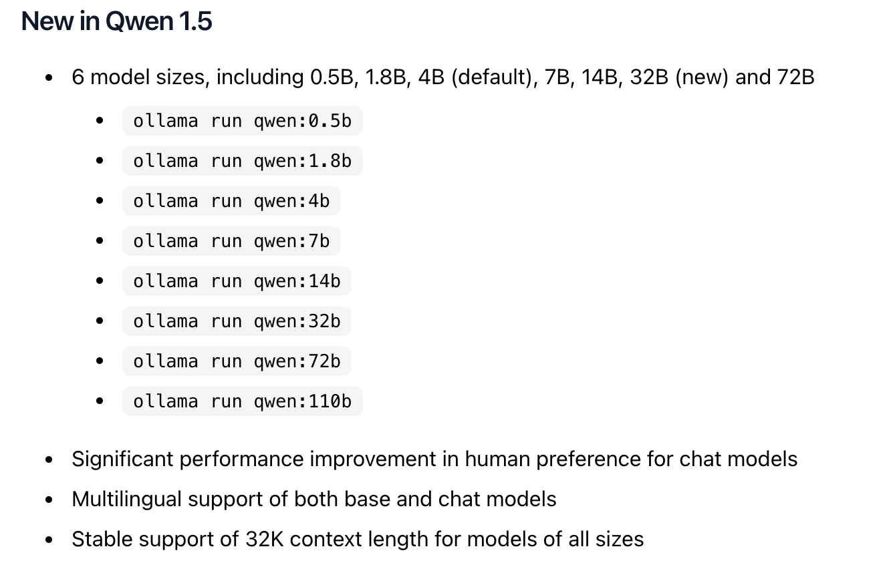
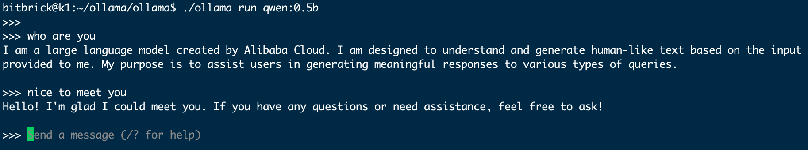

# 在K1 上使用 Ollama 运行大模型
## 什么是 Ollama？

Ollama 是在个人计算机上运行本地 LLM 的最佳解决方案之一，无需从头开始进行设置。只需几个命令，一切都可以顺利完成，并且在多种设备和型号上都能很好地运行。它甚至公开了一个用于模型推理的 REST API，因此您可以让它在 Raspberry Pi 上运行，并在需要时从其他应用程序和设备调用它。

## 1.安装Ollama
Ollama官方没有提供RISCV的安装方式，我们需要自己手动编译源码安装

### 安装Cmake
~~~
sudo apt install cmake
~~~

### 下载代码和子模块
Ollama官方暂时还没有支持RISCV的版本，开发者[mengzhuo](https://github.com/mengzhuo)提了一个[PR]（https://github.com/ollama/ollama/pull/6627）让其可以支持RISCV。感谢这位开发者。下面我们开始下载源码。
~~~
git clone --recurse-submodules https://github.com/mengzhuo/ollama.git
~~~
若是执行失败的话，再执行以下命令
~~~
git submodule update
~~~
至此我们就下来了源码

### 编译
进入到源码目录，执行`go build .`开始编译
~~~
bitbrick@k1:~/ollama/ollama$ go build .
go: downloading github.com/spf13/cobra v1.7.0
go: downloading github.com/containerd/console v1.0.3
go: downloading github.com/mattn/go-runewidth v0.0.14
go: downloading github.com/olekukonko/tablewriter v0.0.5
go: downloading golang.org/x/crypto v0.23.0
go: downloading golang.org/x/exp v0.0.0-20231110203233-9a3e6036ecaa
go: downloading golang.org/x/term v0.20.0
go: downloading github.com/emirpasic/gods v1.18.1
go: downloading golang.org/x/text v0.15.0
go: downloading github.com/gin-contrib/cors v1.7.2
go: downloading github.com/gin-gonic/gin v1.10.0
go: downloading golang.org/x/sync v0.3.0
go: downloading golang.org/x/sys v0.20.0
go: downloading github.com/rivo/uniseg v0.2.0
go: downloading github.com/spf13/pflag v1.0.5
go: downloading github.com/d4l3k/go-bfloat16 v0.0.0-20211005043715-690c3bdd05f1
go: downloading github.com/nlpodyssey/gopickle v0.3.0
go: downloading github.com/pdevine/tensor v0.0.0-20240510204454-f88f4562727c
go: downloading github.com/x448/float16 v0.8.4
go: downloading google.golang.org/protobuf v1.34.1
go: downloading github.com/agnivade/levenshtein v1.1.1
go: downloading github.com/gin-contrib/sse v0.1.0
go: downloading github.com/mattn/go-isatty v0.0.20
go: downloading golang.org/x/net v0.25.0
go: downloading github.com/pkg/errors v0.9.1
go: downloading github.com/apache/arrow/go/arrow v0.0.0-20211112161151-bc219186db40
go: downloading github.com/chewxy/hm v1.0.0
go: downloading github.com/chewxy/math32 v1.11.0
go: downloading github.com/google/flatbuffers v24.3.25+incompatible
go: downloading go4.org/unsafe/assume-no-moving-gc v0.0.0-20231121144256-b99613f794b6
go: downloading gonum.org/v1/gonum v0.15.0
go: downloading gorgonia.org/vecf32 v0.9.0
go: downloading gorgonia.org/vecf64 v0.9.0
go: downloading github.com/go-playground/validator/v10 v10.20.0
go: downloading github.com/pelletier/go-toml/v2 v2.2.2
go: downloading github.com/ugorji/go/codec v1.2.12
go: downloading gopkg.in/yaml.v3 v3.0.1
go: downloading golang.org/x/xerrors v0.0.0-20200804184101-5ec99f83aff1
go: downloading github.com/gogo/protobuf v1.3.2
go: downloading github.com/golang/protobuf v1.5.4
go: downloading github.com/xtgo/set v1.0.0
go: downloading github.com/gabriel-vasile/mimetype v1.4.3
go: downloading github.com/go-playground/universal-translator v0.18.1
go: downloading github.com/leodido/go-urn v1.4.0
go: downloading github.com/go-playground/locales v0.14.1
llm/llm_linux.go:8:12: pattern build/linux/*/*/bin/*: no matching files found

~~~
执行遇到这个错误的话，我们需要编译 llama.cpp 的代码。

首先添加环境变量
~~~
export GOARCH=riscv64

~~~
然后执行如下命令编译llama.cpp
~~~
bitbrick@k1:~/ollama/ollama$ cd llm/generate/
bitbrick@k1:~/ollama/ollama/llm/generate$ bash gen_linux.sh 
~~~
然后经过漫长的编译，就而可以生成了在 build 文件夹。里面有相关的lib库了。

再执行编译
~~~
go build 
~~~
编译成功后，我们即可运行ollama
~~~
ls -lha ollama 
-rwxrwxr-x 1 test test 34M 3月 9 22:13 ollama
~~~

## 2. 通过命令行运行 LLM

先启动服务
~~~
./ollama serve
~~~

我们运行一个Qwen 0.5b的模型，先查看官方 [Ollama Qwen模型库](https://ollama.com/library/qwen)

在终端中运行如下命令：
~~~
  ./ollama run qwen:0.5b
~~~

一旦您看到类似于以下输出的内容，您就已经在 K1 上运行了 LLM！就这么简单。

您可以尝试其他模型，如 Mistral、Llama-2 等，只需确保 SD 卡上有足够的空间容纳模型重量。