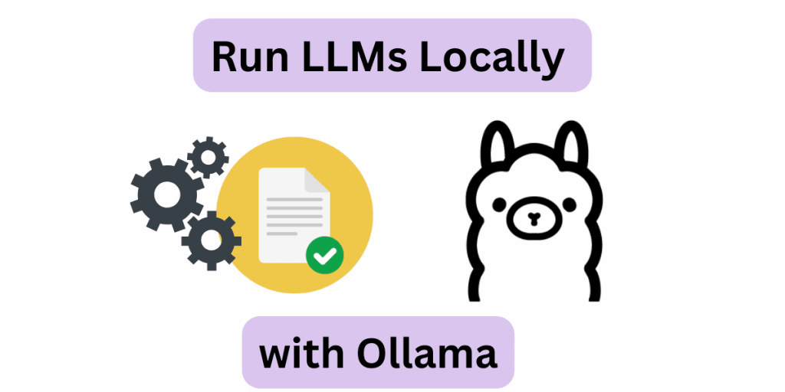
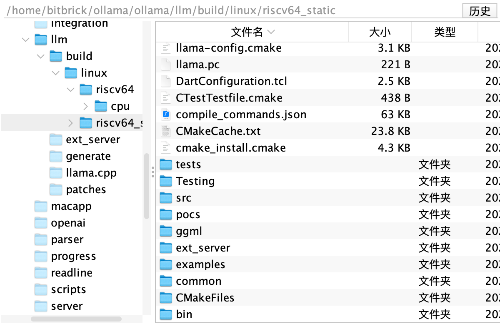
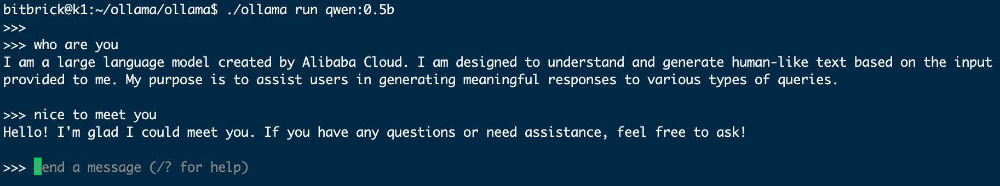

# Running Large Models with Ollama on K1
## What is Ollama?

Ollama is one of the best solutions for running local LLMs on personal computers without the need for a setup from scratch. With just a few commands, everything can be done smoothly and it runs well on various devices and models. It even exposes a REST API for model inference, so you can have it running on a Raspberry Pi and call it from other applications and devices when needed.

## 1. Install Ollama
The Ollama official does not provide an installation method for RISCV. We need to manually compile the source code for installation.
### Install Cmake
~~~
sudo apt install cmake
~~~
### Download the Code and Submodules
The Ollama official has not yet supported the RISCV version. The developer [mengzhuo](https://github.com/mengzhuo) has submitted a [PR](https://github.com/ollama/ollama/pull/6627) to make it support RISCV. Thanks to this developer. Now let's start downloading the source code.

~~~
git clone --recurse-submodules https://github.com/mengzhuo/ollama.git
~~~
If the execution fails, then execute the following command:
~~~
git submodule update
~~~

At this point, we have downloaded the source code.
### Compile
Enter the source code directory and execute `go build.` to start compilation.

~~~
bitbrick@k1:~/ollama/ollama$ go build.
go: downloading github.com/spf13/cobra v1.7.0
go: downloading github.com/containerd/console v1.0.3
go: downloading github.com/mattn/go-runewidth v0.0.14
go: downloading github.com/olekukonko/tablewriter v0.0.5
go: downloading golang.org/x/crypto v0.23.0
go: downloading golang.org/x/exp v0.0.0-20231110203233-9a304.4454
go: downloading golang.org/x/term v0.20.0
go: downloading github.com/emirpasic/gods v1.18.1
go: downloading golang.org/x/text v0.15.0
go: downloading github.com/gin-contrib/cors v1.7.2
go: downloading github.com/gin-gonic/gin v1.10.0
go: downloading golang.org/x/sync v0.3.0
go: downloading golang.org/x/sys v0.20.0
go: downloading github.com/rivo/uniseg v0.2.0
go: downloading github.com/spf13/pflag v1.0.5
go: downloading github.com/d4l3k/go-bfloat16 v0.0.0-20211005043715-690c3bdd05f1
go: downloading github.com/nlpodyssey/gopickle v0.3.0
go: dumping github.com/pdevine/tensor v0.0.0-20240510204454-f88f4562727c
go: downloading github.com/x448/float16 v0.8.4
go: downloading google.golang.org/protobuf v1.34.1
go: downloading github.com/agnivade/levenshtein v1.1.1
go: downloading github.com/gin-contrib/sse v0.1.0
go: downloading github.com/mattn/go-isatty v0.0.20
go: downloading golang.org/x/net v0.25.0
go: downloading github.com/pkg/errors v0.9.1
go: downloading github.com/apache/arrow/go/arrow v0.0.0-20211112161151-bc219186db40
go: downloading github.com/chewxy/hm v1.0.0
go: downloadinggithub.com/chewxy/math32 v1.11.0
go: downloadinggithub.com/google/flatbuffers v24.3.25+incompatible
go: downloadinggo4.org/unsafe/assume-no-moving-gc v0.0.0-20231121144256-b99613f794b6
go: downloadinggonum.org/v1/gonum v0.15.0
go: downloadinggorgonia.org/vecf32 v0.9.0
go: downloadinggorgonia.org/vecf64 v0.9.0
go: downloadinggithub.com/go-playground/validator/v10 v10.20.0
go: downloadinggithub.com/pelletier/go-toml/v2 v2.2.2
go: downloadinggithub.com/ugorji/go/codec v1.2.12
go: downloadinggopkg.in/yaml.v3 v3.0.1
go: downloadinggolang.org/x/xerrors v0.0.0-20200804184101-5ec99f83aff1
go: downloadinggithub.com/gogo/protobuf v1.3.2
go: downloadinggithub.com/golang/protobuf v1.5.4
go: downloadinggithub.com/xtgo/set v1.0.0
go: downloadinggithub.com/gabriel-vasile/mimetype v1.4.3
go: downloadinggithub.com/go-playground/universal-translator v0.18.1
go: downloadinggithub.com/leodido/go-urn v1.4.0
go: downloadinggithub.com/go-playground/locales v0.14.1
llm/llm_linux.go:8:12: pattern build/linux/*/*/bin/*: no matching files found
~~~

If you encounter this error during execution, we need to compile the llama.cpp code.
First, add an environment variable:

~~~
export GOARCH=riscv64
~~~

Then execute the following command to compile llama.cpp:

~~~
bitbrick@k1:~/ollama/ollama$ cd llm/generate/
bitbrick@k1:~/ollama/ollama/llm/generate$ bash gen_linux.sh 
~~~

Then, after a long compilation, it can be generated in the build folder. There are relevant lib libraries in it.

Then execute the compilation again:

~~~
go build 
~~~

After successful compilation, we can run Ollama.

~~~
ls -lha ollama 
-rwxrwxr-x 1 test test 34M Mar 9 22:13 ollama
~~~
## 2. Run LLM via Command Line
First, start the service:
~~~
./ollama serve
~~~

We run a Qwen 0.5b model. First, check the official [Ollama Qwen Model Library](https://ollama.com/library/qwen).

Run the following command in the terminal:

~~~
 ./ollama run qwen:0.5b
~~~

Once you see something similar to the following output, you have already run the LLM on K1! It's that simple.

You can try other models, such as Mistral, Llama-2, etc. Just make sure there is enough space on the SD card to hold the model weights.