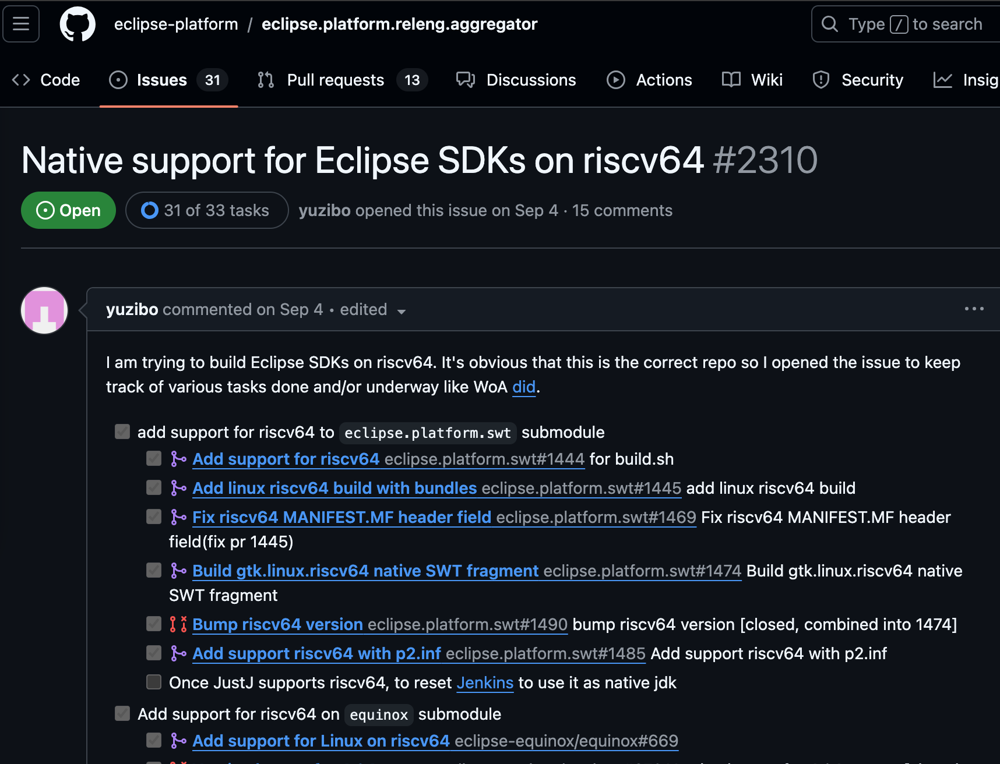

# Using Eclipse on K1

Eclipse is an open-source and powerful integrated development environment (IDE) that widely supports multiple programming languages and provides developers with a unified platform for writing, debugging, and managing code. Meanwhile, Eclipse also has a powerful plug-in system, which can flexibly expand functions according to requirements.

Recently, engineers from the RevyOS team of the Institute of Software, Chinese Academy of Sciences (ISCAS), together with other open-source community developers, successfully introduced the initial support for the riscv64 architecture into the Eclipse upstream code repository. During this process, more than twenty [Issues/PRs](https://github.com/eclipse-platform/eclipse.platform.releng.aggregator/issues/2310) were created, covering key components including SWT and Equinox. Currently, Eclipse already supports developing Java projects on the riscv64 platform based on OpenJDK.

## Installing Eclipse
According to the above PR, we download the corresponding `riscv64` Eclipse package from https://download.eclipse.org/technology/epp/downloads/release/2024-12/M2/.

Unzip and install it. Open the `eclipse` inside.

Create a new project and run a Hello World.

Thanks to the `RevyOS` team.