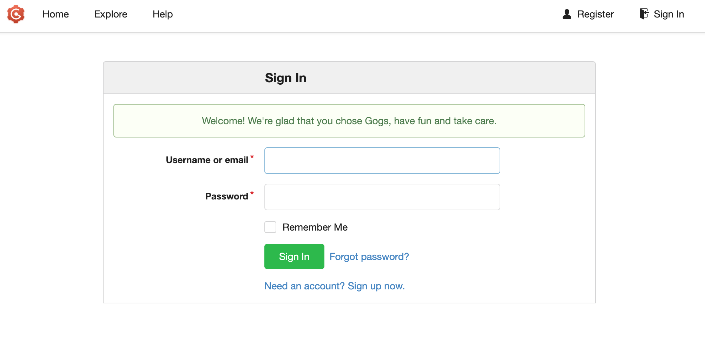

# 在K1上安装Gogs来实现git server


Gogs 的目标是打造一个最简单、最快速和最轻松的方式搭建自助 Git 服务。使用 Go 语言开发使得 Gogs 能够通过独立的二进制分发，并且支持 Go 语言支持的 所有平台，包括 Linux、Mac OS X、Windows 以及 ARM 平台。

开源组件
- Web 框架：[Macaron](http://go-macaron.com)
- UI 组件：
    - [Semantic UI](http://semantic-ui.com/)
    - [GitHub Octicons](https://octicons.github.com/)
    - [Font Awesome](http://fontawesome.io/)
- 前端插件：
    - [DropzoneJS](http://www.dropzonejs.com/)
    - [highlight.js](https://highlightjs.org/)
    - [clipboard.js](https://zenorocha.github.io/clipboard.js/)
    - [emojify.js](https://github.com/Ranks/emojify.js)
    - [jQuery Date Time Picker](https://github.com/xdan/datetimepicker)
    - [jQuery MiniColors](https://github.com/claviska/jquery-minicolors)
    - [CodeMirror](https://codemirror.net/)
    - [notebook.js](https://github.com/jsvine/notebookjs)
    - [marked](https://github.com/chjj/marked)
- ORM：[Xorm](https://github.com/go-xorm/xorm)
- 数据库驱动：
    - [github.com/go-sql-driver/mysql](https://github.com/go-sql-driver/mysql)
    - [github.com/lib/pq](https://github.com/lib/pq)
    - [github.com/mattn/go-sqlite3](https://github.com/mattn/go-sqlite3)
    - [github.com/denisenkom/go-mssqldb](https://github.com/denisenkom/go-mssqldb)
- 以及其它所有 Go 语言的第三方包依赖。

## 源码安装
### 安装 Go 语言

Gogs 要求至少使用 Go 1.20 或更高的版本进行编译，具体安装步骤请参考 [官方文档](https://golang.org/doc/install)。

### 设置环境

我们将创建一个名为 `git` 用户，并在该用户空间内完成剩余的安装步骤：

```sh
sudo adduser --disabled-login --gecos 'Gogs' git
```

### 编译 Gogs

```sh
# 克隆仓库到 "gogs" 子目录
git clone --depth 1 https://github.com/gogs/gogs.git gogs
# 修改工作目录
cd gogs
# 编译主程序，这个步骤会下载所有依赖
go build -o gogs
```

### 测试安装

您可以通过以下方式检查 Gogs 是否可以正常工作：

```sh
./gogs web
```

如果您没有发现任何错误信息，则可以使用 `Ctrl-C` 来终止运行。

### 使用标签构建

Gogs 默认并没有支持一些功能，这些功能需要在构建时明确使用构建标签（[build tags](https://golang.org/pkg/go/build/#hdr-Build_Constraints)）来支持。

目前使用标签构建的功能如下：

- `pam`：PAM 授权认证支持
- `cert`：生成自定义证书支持
- `minwinsvc`：Windows 服务内置支持（或者您可以使用 NSSM 来创建服务）

```sh
go build -tags "pam cert" -o gogs
```

## 配置与运行

### 配置文件

#### 默认配置文件

默认配置都保存在 `conf/app.ini`，您 **永远不需要** 编辑它。该文件从 `v0.6.0` 版本开始被嵌入到二进制中。

#### 自定义配置文件

那么，在不允许修改默认配置文件 `conf/app.ini` 的情况下，怎么才能自定义配置呢？很简单，只要创建 `custom/conf/app.ini` 就可以！在 `custom/conf/app.ini` 文件中修改相应选项的值即可。

例如，需要改变仓库根目录的路径：

```
[repository]
ROOT = /home/jiahuachen/gogs-repositories
```

当然，您也可以修改数据库配置：

```
[database]
PASSWORD = root
```

#### 为什么要这么做？

乍一看，这么做有些复杂，但是这么做可以有效地保护您的自定义配置不被破坏：

- 从二进制安装的用户，可以直接替换二进制及其它文件而不至于重新编写自定义配置。
- 从源码安装的用户，可以避免由于版本管理系统导致的文件修改冲突。

### 运行 Gogs 服务

#### 开发者模式

- 您需要在 `custom/conf/app.ini` 文件中将选项 `security -> INSTALL_LOCK` 的值设置为 `true`。
- 您可以使用超能的 `make` 命令：

```sh
$ make
$ ./gogs web
```



### 部署模式

**脚本均放置在 `scripts` 目录，但请在仓库根目录执行它们**

- Gogs 支持多种方式的启动：
	- 普通：只需执行 `./gogs web`
	- 守护进程：详见 [scripts](https://github.com/gogs/gogs/tree/main/scripts) 文件夹
- 然后访问 `/install` 来完成首次运行的配置工作