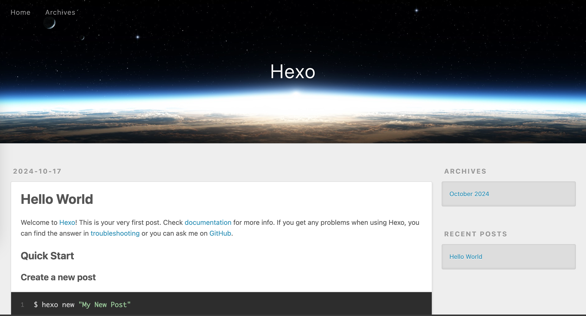

# 在K1上搭建自己的Blog

我们可以在K1上搭建自己的静态blog，来记录生活和学习。Blog的实现有很多种，今天我们使用Hexo来搭建自己的第一个blog。

## Hexo 简介
Hexo 是一个快速、简洁且高效的博客框架。 Hexo 使用 Markdown（或其他标记语言）解析文章，在几秒内，即可利用靓丽的主题生成静态网页。

## 安装Hexo
Hexo的安装需要nodejs环境和npm还有git。我们先来安装它的前置依赖，如果已经有了则可以跳过这一步
~~~
sudo apt install nodejs
sudo apt install npm
sudo apt install git
~~~
安装完成之后就可以开始安装Hexo了
~~~
sudo npm install -g hexo-cli
~~~
至此我们就完成了Hexo的安装
## Hexo的使用
安装 Hexo 完成后，请执行下列命令，Hexo 将会在指定文件夹中新建所需要的文件。
~~~
$ hexo init <folder>
$ cd <folder>
$ npm install
~~~

初始化后，您的项目文件夹将如下所示：
~~~
.
├── _config.yml
├── package.json
├── scaffolds
├── source
|   ├── _drafts
|   └── _posts
└── themes

~~~

运行 hexo server ,即可在本地访问到自己的blog了

~~~
bitbrick@k1:~$ cd blog
bitbrick@k1:~/blog$ hexo server
INFO  Validating config
INFO  Start processing
INFO  Hexo is running at http://localhost:4000/ . Press Ctrl+C to stop.
~~~

更多Hexo使用方法可以访问官网https://hexo.io/。