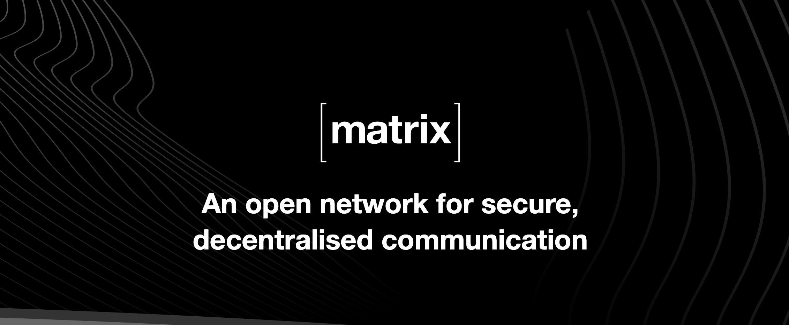
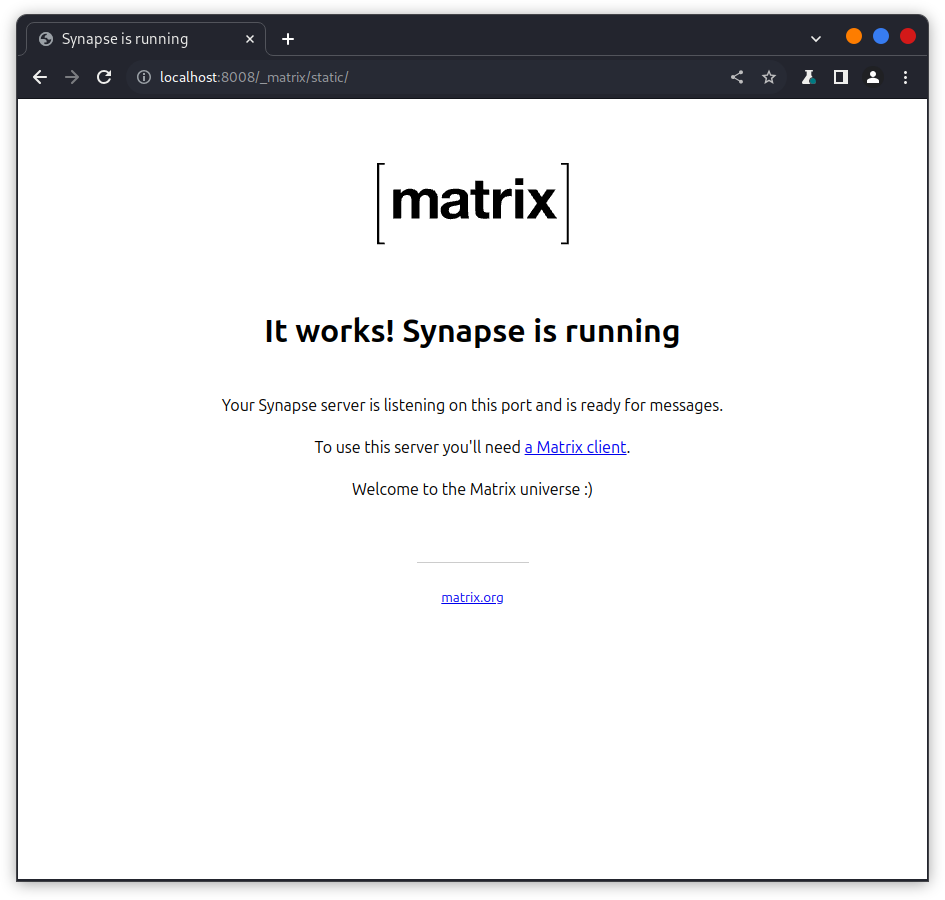
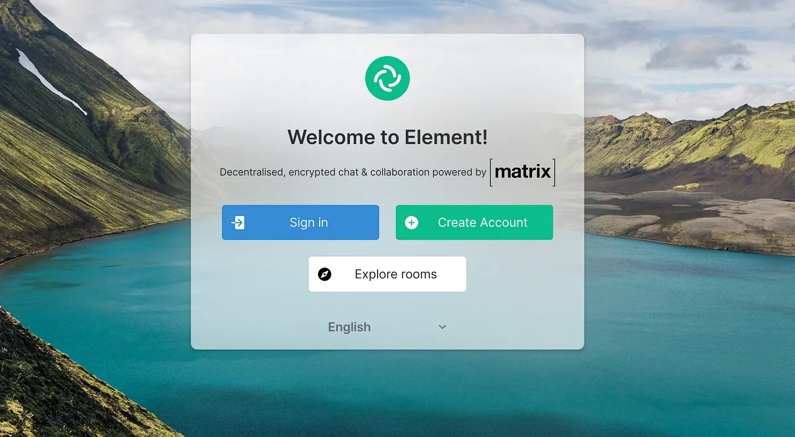
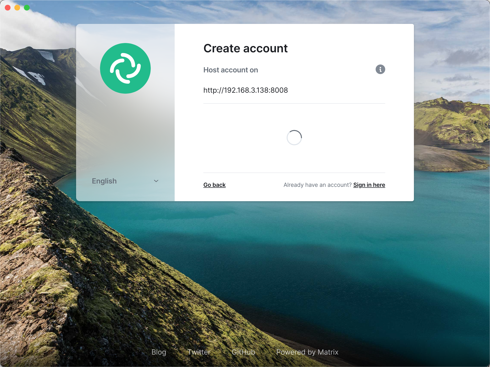
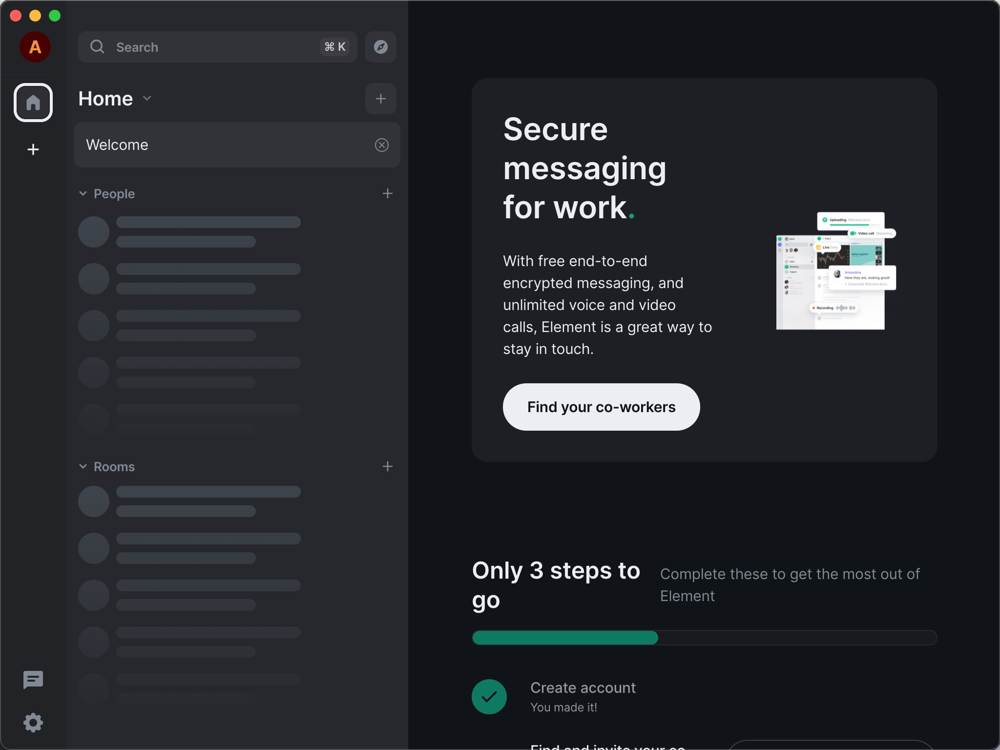
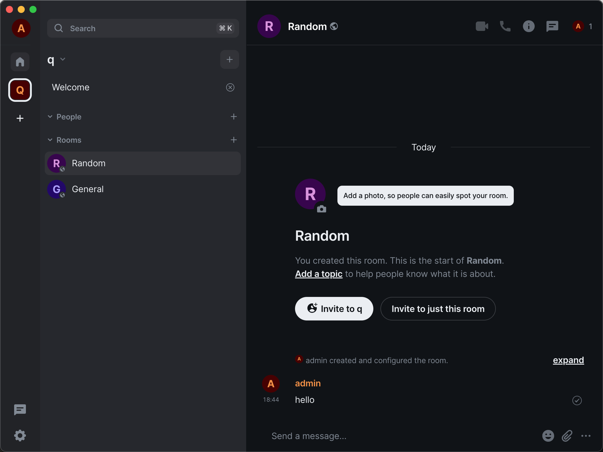

# 在K1上搭建端对端加密的聊天服务器

为满足私密通讯需求，开源社区一直在不断发展和改进即时通讯工具，Matrix 便是其中一个优秀的加密通信协议。本人在研究这东西的时候，发现网上的教程比较零碎分散，于是干脆自己整理一篇比较完整的，希望对后来者有点帮助。

Matrix 协议支持诸多特性：去中心化通信、端到端加密、WebRTC 语音通话 / 视频通话、消息已读提示、输入状态提示、群组聊天 ...

不仅于此，正如其名：“矩阵”，如果你是这台服务器的管理员，你还可以允许你的 Matrix 服务器与其它 Matrix 服务器组成矩阵网络，让用户与其它 Matrix 服务器的用户进行通信。

Matrix 服务器上的所有对话都支持端到端加密，非常安全。

Synapse是一个用Python写的基于Matrix协议的服务器实现，允许用户和组织部署自己的Matrix节点，这使我们可以通过Synapse来托管自己的聊天服务，保持对数据的完全控制。

## 安装Synapse

~~~
sudo apt install matrix-synapse
~~~

安装完成之后，启动synapse服务：
~~~
mkdir ~/synapse
cd ~/synapse
synctl start
~~~
有可能会碰到如下错误
~~~
synctl start Config file homeserver.yaml does not exist. To generate a config file, run: /usr/bin/python3 -m synapse.app.homeserver -c homeserver.yaml --generate-config --server-name=<server name> --report-stats=<yes/no>
~~~
这是因为没有生成配置文件，我们用下面命令来生成配置文件
~~~
python3 -m synapse.app.homeserver -c homeserver.yaml --generate-config --server-name=your.domain.com --report-stats=yes
~~~
这样我们就生成了配置文件，我们打开文件，修改如下

1、在内网使用的话，修改配置文件`bind_addresses: ['::']`

2、开放注册用户：
~~~
enable_registration: true
enable_registration_without_verification: true
~~~

完整的配置文件如下
~~~
server_name: "your.domain.com"
pid_file: /home/bitbrick/synapse/homeserver.pid
listeners:
  - port: 8008
    tls: false
    type: http
    x_forwarded: true
    bind_addresses: ['::']
    resources:
      - names: [client, federation]
        compress: false
database:
  name: sqlite3
  args:
    database: /home/bitbrick/synapse/homeserver.db
log_config: "/home/bitbrick/synapse/your.domain.com.config"
media_store_path: /home/bitbrick/synapse/media_store
registration_shared_secret: "zmutd~qyz^PUz9eYu,dc*l+l2#f4Hw+r#;1K5pFZsumiUH,aK*"
enable_registration: true
enable_registration_without_verification: true
report_stats: false
macaroon_secret_key: "R54t^eMDWXYF7_:9:3.M4dAQxMkclCMvsrfEt&VsGTg=.sM@16"
form_secret: "OVIUum_sYg48Fl.i=+SDy&@,ETr.,0aXIaJj.AwvWyZZ9YlbfK"
signing_key_path: "/home/bitbrick/synapse/im.iao.app.signing.key"
trusted_key_servers:
  - server_name: "matrix.org"
registration:
  open: true
  admin: true

# vim:ft=yaml
~~~

重启启动服务
~~~
synctl restart
~~~
访问http://localhost:8008/ 看到如下就代表服务启动成功

## 客户端配置
什么是Element？

Element 则是一个基于 Matrix 协议的客户端应用，支持即时消息、音频和视频通话。它有 Web、桌面和移动端多个版本，是 Matrix 生态系统中最受欢迎的客户端之一。

简单来说，Matrix 是一个通信协议，而 Element 是基于这个协议的客户端应用。我们的目标是利用 Matrix 的端到端加密，通过 Element 搭建一个去中心化的加密通讯服务，并支持语音和视频通话，适用于个人和团队。

与常见的通讯软件如 QQ 和微信相比，Matrix 的优势在于它的开源和可私有化部署，确保通信的安全和隐私。此外，Matrix 还具备去中心化的特点，任何运行 Matrix 的服务器都是一个独立的节点，用户可以选择注册和连接任意节点，且同一个节点的用户可以自由通信。同时，不同节点之间也可以通过联邦（Federation）机制进行通信，实现端到端的加密。

在 https://element.io/ 下载客户端

配置server地址为我们k1的地址并注册用户：

登录进来界面如下：

聊天界面如下：

客户端支持android/iOS,更多玩法可以去官网看看，https://element.io/