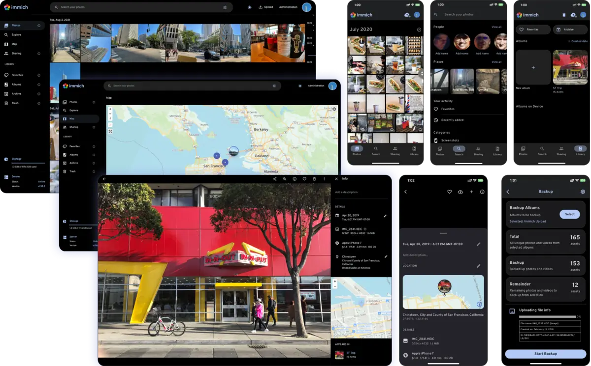
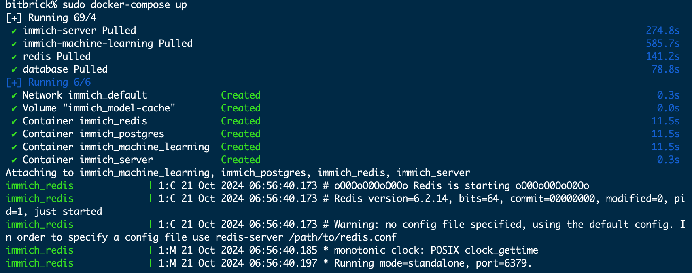

# 在K1上使用Immich管理自己的照片

Immich 是一个开源的自托管照片和视频备份解决方案，专为个人和家庭用户设计。它允许用户在自己的服务器上备份、管理和查看照片和视频内容，类似于 Google Photos 的功能。Immich 提供了自动化的备份功能，通过移动设备上的客户端应用自动同步媒体文件，支持高效的存储和快速的搜索。

## 安装Immich
我们使用docker-compos来安装Immich
### 安装docker

~~~
sudo apt update
sudo apt install docker.io
~~~

### 安装docker-compose
~~~
sudo curl -L "https://github.com/docker/compose/releases/download/v2.29.7/docker-compose-linux-riscv64" -o /usr/local/bin/docker-compose

sudo chmod+x /usr/local/bin/docker-compose
~~~

### 配置docker-compose.yml

~~~
name: immich

services:
  immich-server:
    container_name: immich_server
    image: harbor.spacemit.com/application/immich-server:${IMMICH_VERSION:-release}
    #extends:
    #  file: hwaccel.transcoding.yml
    #   service: cpu # set to one of [nvenc, quicksync, rkmpp, vaapi, vaapi-wsl] for accelerated transcoding
    volumes:
      - ${UPLOAD_LOCATION}:/usr/src/app/upload
      - /etc/localtime:/etc/localtime:ro
    # 映射视频解码设备
    devices:
      - /dev/video0:/dev/video0   # 可以映射多个USB摄像头
      - /dev/video1:/dev/video1
      - /dev/dri/card0:/dev/dri/card0
      - /dev/dri/renderD128:/dev/dri/renderD128
    env_file:
      - .env
    ports:
      - 2283:3001
    depends_on:
      - redis
      - database
    restart: always
    privileged: true

  immich-machine-learning:
    container_name: immich_machine_learning
    # For hardware acceleration, add one of -[armnn, cuda, openvino] to the image tag.
    # Example tag: ${IMMICH_VERSION:-release}-cuda
    image: harbor.spacemit.com/application/immich-machine-learning:${IMMICH_VERSION:-release}
    # extends: # uncomment this section for hardware acceleration - see https://immich.app/docs/features/ml-hardware-acceleration
    #   file: hwaccel.ml.yml
    #   service: cpu # set to one of [armnn, cuda, openvino, openvino-wsl] for accelerated inference - use the `-wsl` version for WSL2 where applicable
    volumes:
      - model-cache:/cache
    env_file:
      - .env
    ports:
      - 3003:3003
    restart: always

  redis:
    container_name: immich_redis
    image: harbor.spacemit.com/application/redis:6.2-alpine3.20
    healthcheck:
      test: redis-cli ping || exit 1
    restart: always

  database:
    container_name: immich_postgres
    image: harbor.spacemit.com/application/pgvector:pg15-bianbu-mantic
    environment:
      POSTGRES_PASSWORD: ${DB_PASSWORD}
      POSTGRES_USER: ${DB_USERNAME}
      POSTGRES_DB: ${DB_DATABASE_NAME}
      POSTGRES_INITDB_ARGS: '--data-checksums'
    volumes:
      - ${DB_DATA_LOCATION}:/var/lib/postgresql/data
    command: ["postgres", 
      "-c" ,"shared_preload_libraries=/usr/lib/postgresql/15/lib/vector.so", 
      "-c", 'search_path="$$user", public, vector', 
      "-c", "logging_collector=on", 
      "-c", "max_wal_size=2GB", 
      "-c", "shared_buffers=512MB", 
      "-c", "wal_compression=on"]
    restart: always

volumes:
  model-cache:
~~~

同目录下创建环境变量文件.env：
~~~
# The location where your uploaded files are stored
UPLOAD_LOCATION=./library
# The location where your database files are stored
DB_DATA_LOCATION=./postgres

# TZ=Etc/UTC

# The Immich version to use. You can pin this to a specific version like "v1.71.0"
IMMICH_VERSION="v1.107.2"

# Connection secret for postgres. You should change it to a random password
DB_PASSWORD=postgres

# The values below this line do not need to be changed
###################################################################################
DB_USERNAME=postgres
DB_DATABASE_NAME=immich
DB_VECTOR_EXTENSION=pgvector

~~~

执行 `sudo docker-compose up`即可成功运行Immich

## 访问 

用浏览器访问 2283 端口，正确的情况下会看到注册页面。注册后即可使用。如果无法访问，需进一步检查容器日志中的错误。
假设你的 Immich 部署在 192.168.1.1 上，那么浏览器访问地址是 192.168.1.1:2283
 

 

其它 Immich 客户端需输入 API 地址才能使用，这里整理了一些客户端下载地址：

API 地址是 http://192.168.1.1:2283/api。

Immich 客户端
 - [Immich Android 客户端（F-Droid）](https://f-droid.org/en/packages/app.alextran.immich/)
 - [Immich Android 客户端（Google Play）](https://play.google.com/store/apps/details?id=app.alextran.immich)
 - [Immich iOS 客户端](https://apps.apple.com/sg/app/immich/id1613945652)
 
通常在初次启动客户端以后，输入 API 地址就能使用了。

## 基础配置
* 切换中英文：点击 "设置 -> 账户设置 -> 应用设置 -> 语言 "。
* 查看和执行任务：点击“管理 -> 任务”，可以查看后台任务执行情况，同时可以手动执行单个任务。
* 人脸识别：Immich 可以识别照片和视频中的人脸，并将它们分组为人物，在“探索”页面可以查看。同时，可以为这些人物分配姓名并搜索他们。
* 智能搜索：Immich 支持文搜图和图搜图功能，在首页点击“搜索”，输入文字描述来搜索图片，或者点击人物来搜索特定人物，同时，可以设置条件过滤图片。
* 设置：点击“管理 -> 设置”，可以切换机器学习模型、设置视频转码参数等。

点击 [Immich Docs](https://immich.app/docs/overview/introduction) 查看 Immich 的更多介绍。

## 升级 

修改部署目录的 .env 文件，将 IMMICH_VERSION 的值改为最新版本，最后执行 docker-compose up -d 即可。

