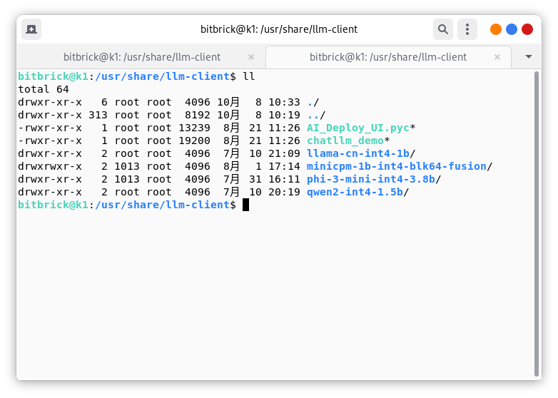
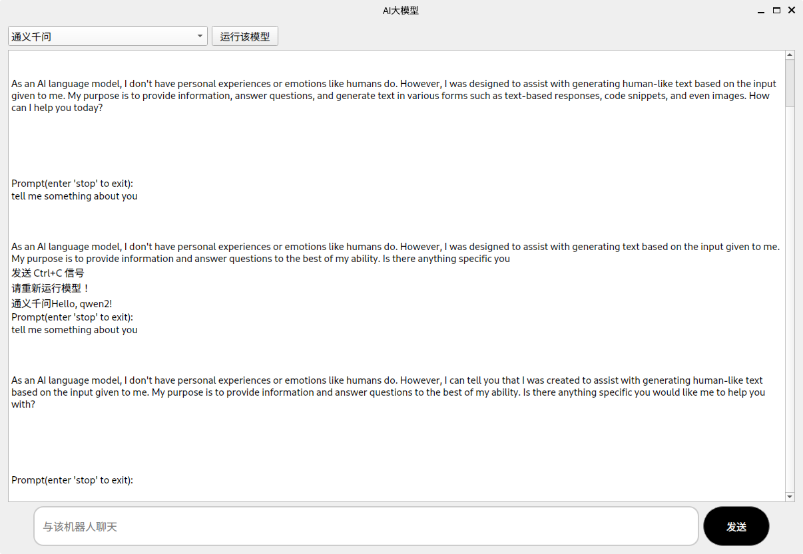

# Running Large Language Models on K1
The K1 has a computing power of 2.0T, and we can run end - side large language models on it. Today we will provide a method to run LLM on K1.

## Installing llm - client
Open the command line in Bianbu OS and enter the following commands to install llm - client:
~~~
sudo apt update
sudo apt install llm - client
~~~
After the installation is completed, an icon that can be run will be seen on the desktop.

Just run it.
Note: If the icon is not found on the desktop, we can also manually execute this program in the path `/usr/share/llm-client`:
~~~
python3 AI_Deploy_UI.pyc
~~~

After running, the following interface will be seen:

Select a certain model and click `运行该模型`, and then you can happily have a conversation with the LLM!