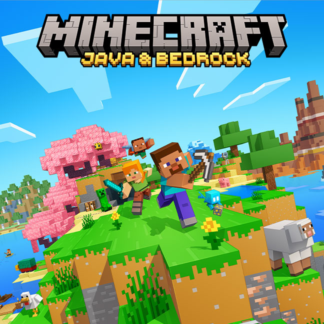

# 在K1上搭建Minecraft服务器，与朋友畅玩Minecraft

## Minecraft 介绍
Minecraft（《我的世界》）是由Mojang Studios开发的一款3D沙盒电子游戏。玩家可在游戏中无拘无束地在3个维度内与由方块和实体构成的世界互动。多种玩法可供玩家选择，带来无限可能。

## Minecraft 服务端安装
此次我们安装的是Java版。因此需要JDK环境。
查看官方关于jdk版本的[说明](https://minecraft.wiki/w/Tutorials/Setting_up_a_server)：
- Minecraft 1.16 requires Java 8.
- Minecraft 1.18 requires Java 17.
- Minecraft 1.20.5 or above requires Java 21.
我们直接下载最新版本 [1.21.3](https://www.minecraft.net/zh-hans/download/server) ,所以我们需要JDK 21.

### 安装jdk21
~~~
sudo apt install openjdk-21-jdk
~~~

### 运行服务端

去这里[1.21.3](https://www.minecraft.net/zh-hans/download/server)下载最新的jar包。运行以下命令跑起来服务端

~~~
java -jar server.jar -nogui
~~~

第一次运行会碰到如下错误

运行后提示一个错误,错误的意思是受EULA。首次运行服务器时，会自动生成一个eula.txt。使用文本编辑器（如记事本）打开eula.txt，将文件中的eula=false改为eula=true。这表示你已阅读并理解了EULA的内容，并会在使用服务端时遵守它。如果不这样做，服务器会在你尝试启动时立即关闭。

再次运行即可：
~~~
bitbrick@k1:~/game/Minecraft$ java -jar server.jar -nogui
Starting net.minecraft.server.Main
[15:09:01] [ServerMain/INFO]: Environment: Environment[sessionHost=https://sessionserver.mojang.com, servicesHost=https://api.minecraftservices.com, name=PROD]
[15:09:12] [ServerMain/INFO]: No existing world data, creating new world
[15:09:22] [ServerMain/INFO]: Loaded 1290 recipes
[15:09:26] [ServerMain/INFO]: Loaded 1399 advancements
[15:09:32] [Server thread/INFO]: Starting minecraft server version 1.21.1
[15:09:32] [Server thread/INFO]: Loading properties
[15:09:32] [Server thread/INFO]: Default game type: SURVIVAL
[15:09:32] [Server thread/INFO]: Generating keypair
[15:09:34] [Server thread/INFO]: Starting Minecraft server on *:25565
[15:09:34] [Server thread/INFO]: Using default channel type
[15:09:35] [Server thread/INFO]: Preparing level "world"
[15:10:32] [Server thread/INFO]: Preparing start region for dimension minecraft:overworld
[15:10:33] [Worker-Main-1/INFO]: Preparing spawn area: 2%
[15:11:18] [Worker-Main-3/INFO]: Preparing spawn area: 75%
[15:11:19] [Server thread/INFO]: Time elapsed: 46505 ms
[15:11:19] [Server thread/INFO]: Done (103.948s)! For help, type "help"
[15:11:21] [Server thread/WARN]: Can't keep up! Is the server overloaded? Running 2361ms or 47 ticks behind

~~~

服务跑起来了，并且可以看到端口为25565

## Minecraft 客户端连接服务端
局域网测试连接我的世界服务器，
在这里https://hmcl.huangyuhui.net/download/ 下载一个合适的启动器。
### 启动Minecraft启动器

下载游戏后启动游戏，选择多人游戏，服务器地址：填写本地k1 ip地址+mc端口号（默认为25565），如192.168.3.138:25565

点击连接，有可能会碰到如下提示：

这是由于默认开始了联网认证，修改k1 服务端目录下的server.properties文件，做如下改动：online-mode=false,改动完保存。再次启动服务重新连接即可。

至此我们就可以愉快的和局域网的小伙伴一起玩Minecraft了，再配合前面介绍的内网穿透，即使不在一个局域网也能一起玩Minecraft了