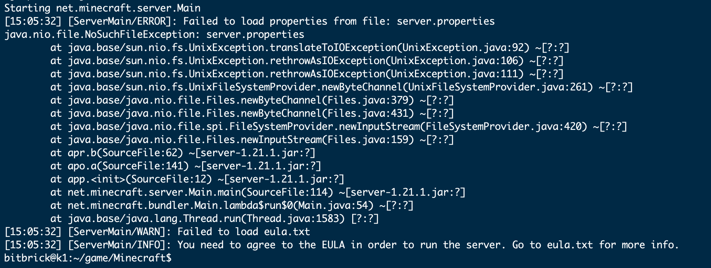
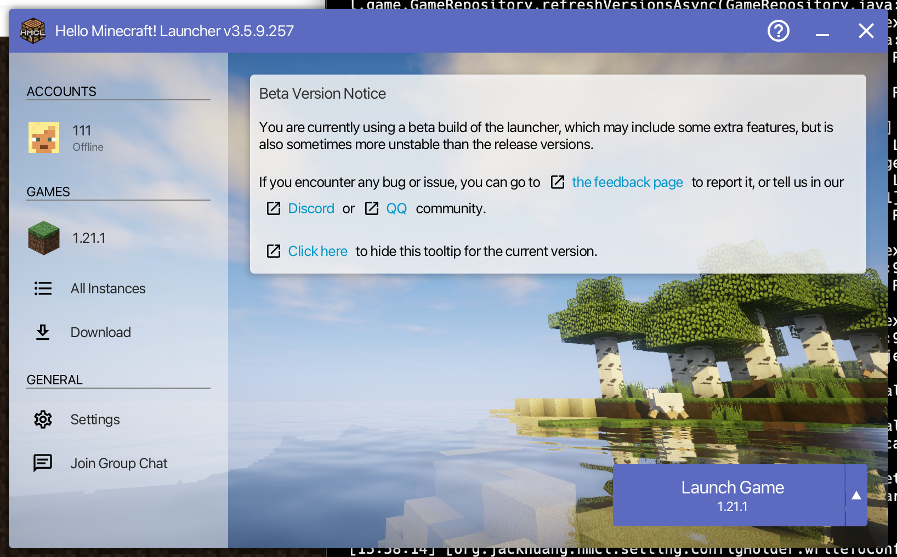
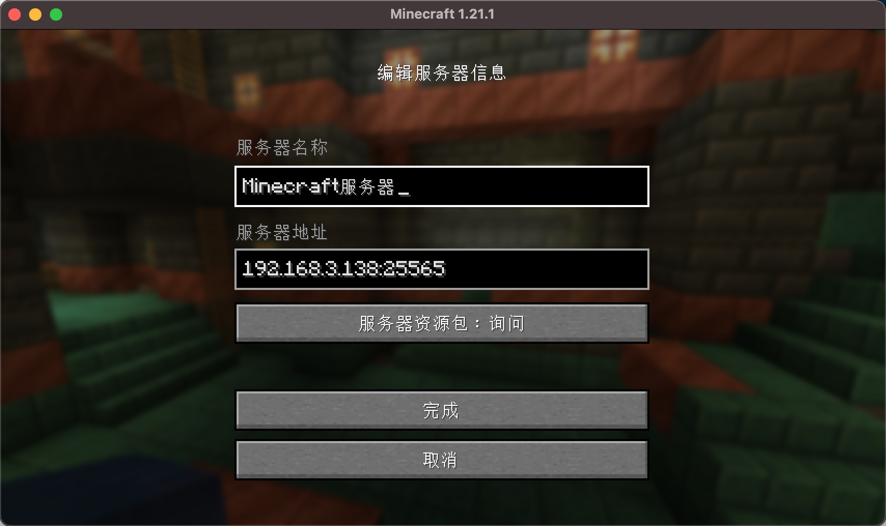
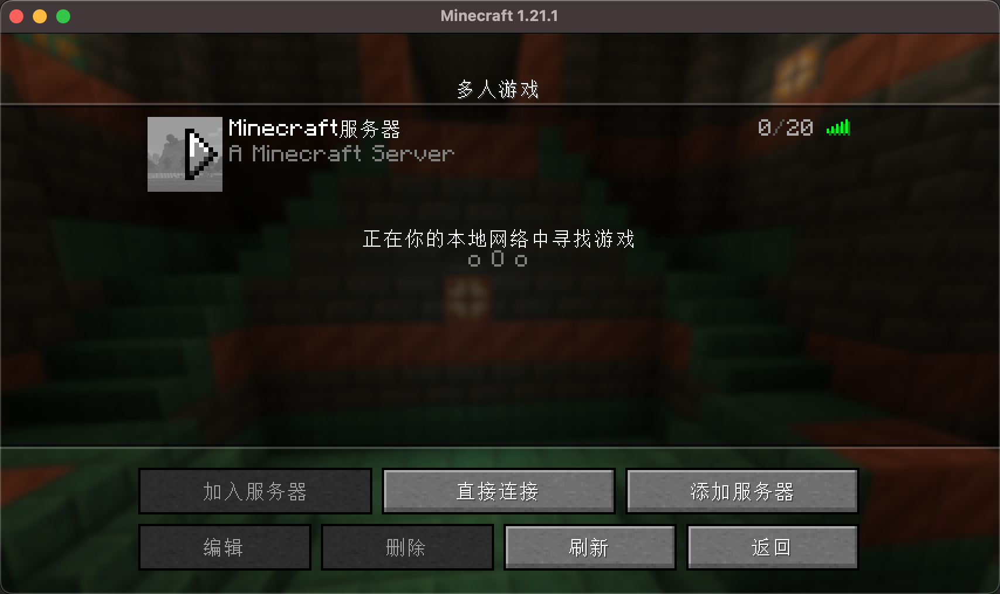
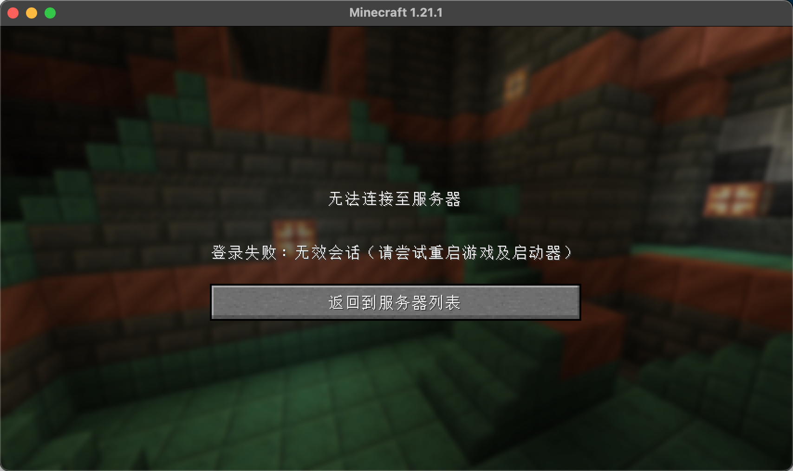
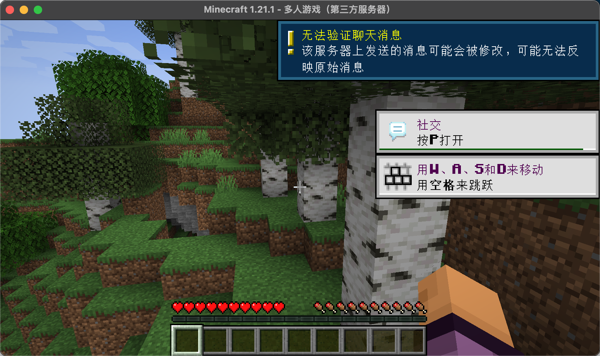

# Setting Up a Minecraft Server on K1 and Playing Minecraft with Friends
## Introduction to Minecraft
Minecraft is a 3D sandbox video game developed by Mojang Studios. Players can freely interact with a world composed of blocks and entities in three dimensions. There are various gameplay options available, offering unlimited possibilities.
## Installing the Minecraft Server
This time we are installing the Java version. Therefore, a JDK environment is required.
Check the official [instructions](https://minecraft.wiki/w/Tutorials/Setting_up_a_server) regarding the JDK version:
- Minecraft 1.16 requires Java 8.
- Minecraft 1.18 requires Java 17.
- Minecraft 1.20.5 or above requires Java 21.
We are directly downloading the latest version [1.21.3](https://www.minecraft.net/en-us/download/server), so we need JDK 21.
### Installing jdk21
~~~
sudo apt install openjdk-21-jdk
~~~
### Running the Server
Go to [1.21.3](https://www.minecraft.net/en-us/download/server) to download the latest jar file. Run the following command to start the server.
~~~
java -jar server.jar -nogui
~~~
The first time you run it, you will encounter the following error:

After running, it prompts an error. The meaning of the error is that you need to accept the EULA. When you run the server for the first time, an eula.txt will be automatically generated. Open eula.txt with a text editor (such as Notepad) and change eula=false in the file to eula=true. This indicates that you have read and understood the content of the EULA and will abide by it when using the server. If you don't do this, the server will shut down immediately when you try to start it.
Run it again:
~~~
bitbrick@k1:~/game/Minecraft$ java -jar server.jar -nogui
Starting net.minecraft.server.Main
[15:09:01] [ServerMain/INFO]: Environment: Environment[sessionHost=https://sessionserver.mojang.com, servicesHost=https://api.minecraftservices.com, name=PROD]
[15:09:12] [ServerMain/INFO]: No existing world data, creating new world
[15:09:22] [ServerMain/INFO]: Loaded 1290 recipes
[15:09:26] [ServerMain/INFO]: Loaded 1399 advancements
[15:09:32] [Server thread/INFO]: Starting minecraft server version 1.21.1
[15:09:32] [Server thread/INFO]: Loading properties
[15:09:32] [Server thread/INFO]: Default game type: SURVIVAL
[15:09:32] [Server thread/INFO]: Generating keypair
[15:09:34] [Server thread/INFO]: Starting Minecraft server on *:25565
[15:09:34] [Server thread/INFO]: Using default channel type
[15:09:35] [Server thread/INFO]: Preparing level "world"
[15:10:32] [Server thread/INFO]: Preparing start region for dimension minecraft:overworld
[15:10:33] [Worker-Main-1/INFO]: Preparing spawn area: 2%
[15:11:18] [Worker-Main-3/INFO]: Preparing spawn area: 75%
[15:11:19] [Server thread/INFO]: Time elapsed: 46505 ms
[15:11:19] [Server thread/INFO]: Done (103.948s)! For help, type "help"
[15:11:21] [Server thread/WARN]: Can't keep up! Is the server overloaded? Running 2361ms or 47 ticks behind
~~~
The server is up and running, and you can see that the port is 25565.
## Connecting the Minecraft Client to the Server
For a local area network test to connect to the Minecraft server, download a suitable launcher from https://hmcl.huangyuhui.net/download/.
### Starting the Minecraft Launcher

After downloading the game, start the game, select Multiplayer, and for the server address: fill in the local K1 IP address + the MC port number (default is 25565), such as 192.168.3.138:25565.

Click Connect. You may encounter the following prompt:

This is because the online authentication is enabled by default. Modify the server.properties file in the K1 server directory as follows: online-mode=false. Save the changes after modification.
 
Start the server again and reconnect.

At this point, we can happily play Minecraft with our local area network friends. And with the previously introduced intranet penetration, we can play Minecraft together even if we are not in the same local area network.