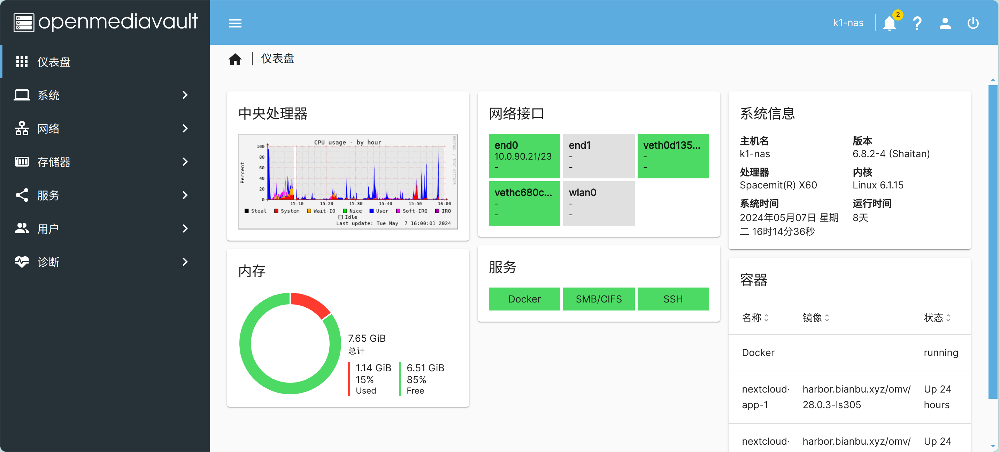

# Using NAS on K1
## Installation
Bianbu NAS is a system that is streamlined and deeply optimized based on the Bianbu operating system, specifically designed for NAS products. It integrates various components such as applications (such as openmediavault, docker, and commonly used software), frameworks, libraries, runtime environments, the Linux kernel, bootloader (U-Boot), and supervisor program interface (OpenSBI). The goal of this system is to provide customers with a reference design for NAS software and support the development of drivers and applications.

[Download Link for NAS Image](https://archive.spacemit.com/image/k1/version/bianbu/v1.0.15/bianbu-23.10-nas-k1-v1.0.15-release-20240907161818.img.zip)

For the installation method, please refer to the following link:
https://docs.bit-brick.com/docs/k1/getting-started/install


## System Login
The default password for the system `root` account is: `bianbu`.
To view the IP address of the NAS device via the serial port `HOST_IP`:
```Bash
ifconfig
```
After obtaining the IP address, log in to the system via SSH:
```Bash
ssh root@HOST_IP
```
### Login to the Openmediavault Web Management Interface
Bianbu NAS provides complete NAS functionality through the Openmediavault application, and Openmediavault provides a Web interface that allows users to conveniently manage NAS services.
- Openmediavault Web administrator account: `admin`
- Password: `openmediavault`
  
After the NAS device is powered on and connected to the network, enter http://HOST_IP in the browser to access the Web management interface of the Openmediavault application.


### Wi-Fi AP
Bianbu NAS integrates the Wi-Fi AP function, which starts automatically after flashing, allowing clients to connect to the NAS device via Wi-Fi and automatically assigns IP addresses through the DHCP service.
- Default SSID of the Wi-Fi AP: `BianbuAP` (Password: `12345678`)
- Default IP of the Wi-Fi AP: `10.0.0.1`
After connecting to the Wi-Fi, enter [http://10.0.0.1](http://10.0.0.1/) in the browser to access the Web management interface of the Openmediavault application.
## Necessary Settings
### Update Software Sources
Before downloading software packages for the first time, it is necessary to update the software sources (`apt update`). It is also recommended to update the software sources regularly to ensure that the system always downloads the latest software.
- Click "System -> Update Management -> Settings", check "Pre-release Updates", click "Save", and wait for the update.

## Mount rootfs
Bianbu NAS manages rootfs through the `sharerootfs` plugin. If you want to mount rootfs, please download the `sharerootfs` plugin first.
- Click "System -> Plugins", select the `sharerootfs` plugin, and click the download button.

- After downloading the `sharerootfs` plugin, click "Storage -> File Systems", and you can see that rootfs is already mounted.

For more information, you can refer to [bianbu NAS](https://bianbu.spacemit.com/bianbu-nas/base_setup)