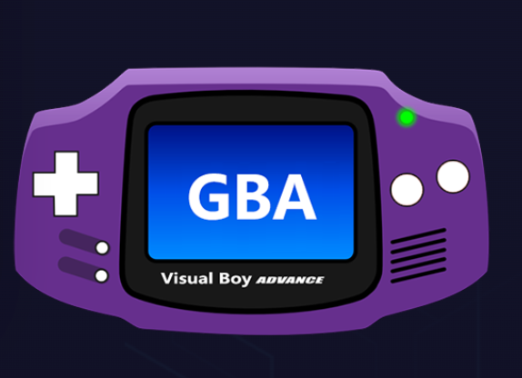
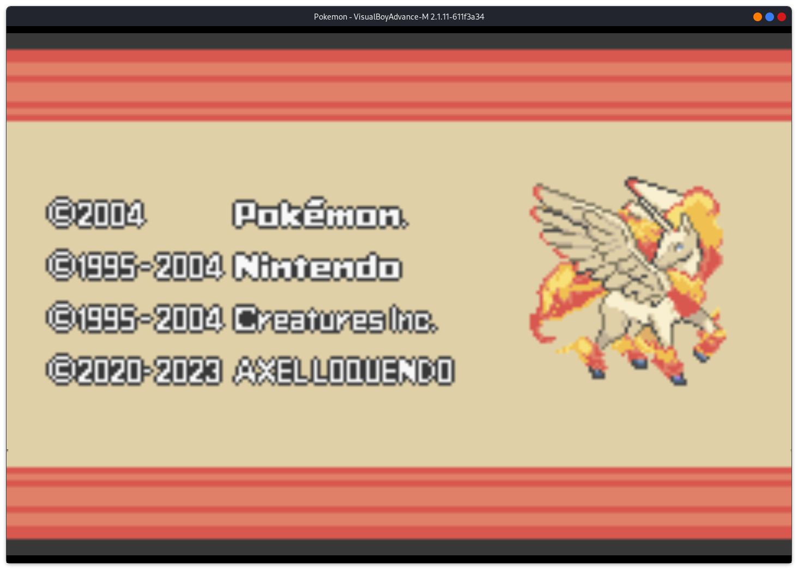

#  VisualBoyAdvance - GBA游戏机模拟器

VisualBoyAdvance是GBA游戏机的一个免费游戏模拟器，它能够在电脑上模拟任天堂所发行的掌上游戏机

## 安装 visualboyadvance-m
~~~
cd ~ && mkdir src && cd src
git clone https://github.com/visualboyadvance-m/visualboyadvance-m.git
cd visualboyadvance-m

./installdeps # On Linux or macOS

mkdir build
cd build
cmake .. -DCMAKE_BUILD_TYPE=Release -G Ninja
ninja
~~~

编译完成之后会在build路径下有个可执行文件`visualboyadvance-m `，执行这个文件即可启动模拟器。

