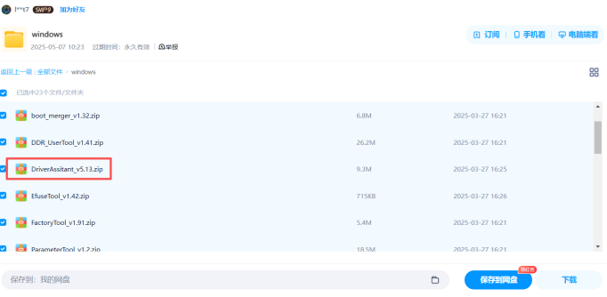
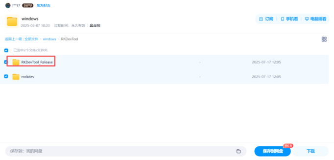
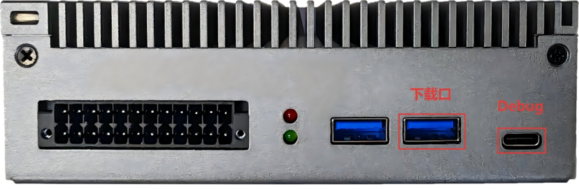
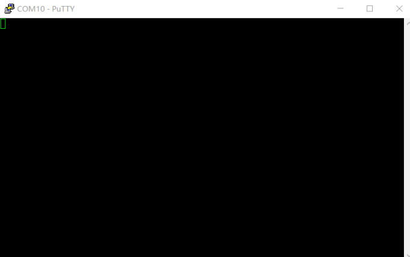
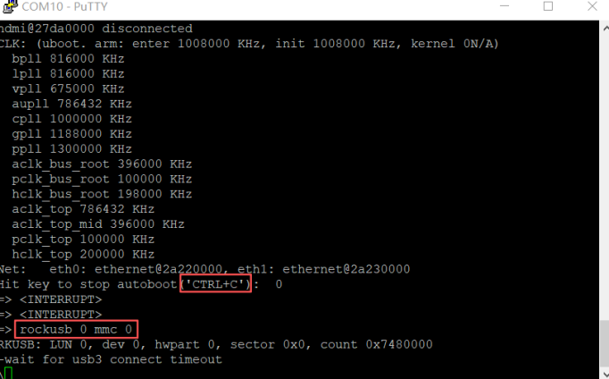
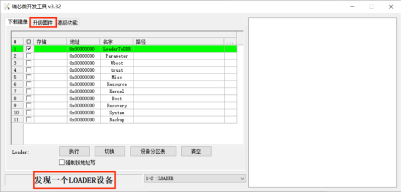
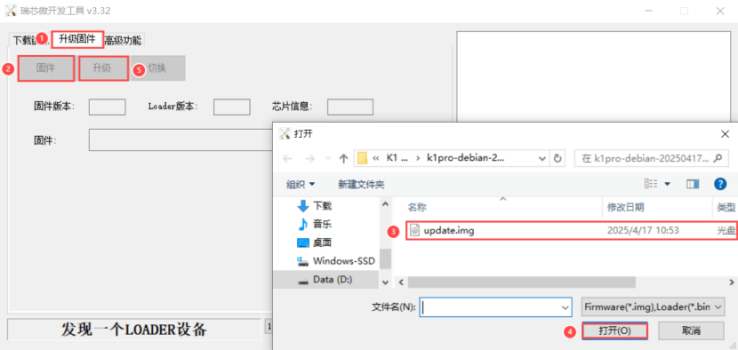

# Flashing Guide

1、Prepare a serial terminal tool that allows typing commands such as `putty` or `Mobaxterm`;

Putty

Mobaxterm

2、Download the RK flashing tool RKDevTool (version V3.30 or above) and the driver program DriverAssitant;
Flashing tool download link:
https://pan.baidu.com/s/1rsxSt4PT4A2Xqy7Y-3IAPg?pwd=1xtb#list/path=%2F

3、After extracting the archive, run `DriverAssitant` to install the driver (if already installed, uninstall the old driver first);

After downloading the flashing tool, double-click `RKDevTool.exe` to open the application interface

4、Connect the PC to the Debug port using an `A to C` cable, and connect the PC to the download port using an `A to A` cable；

5、Open PuTTY or another serial tool, set the parameters to connect to the Edge Computing Box; the baud rate should be `1500000`;

6、After connecting, power-cycle the box and immediately press `ctrl+c` in PuTTY or the serial tool to stop `autoboot`; then enter `rockusb 0 mmc 0` — the device will enter `loader` mode；

7、Return to the RKDevTool interface; it should display `loader device detected` at the bottom. Click into the `Upgrade Firmware` screen, click `Firmware` to import the firmware, then click `Upgrade` to start flashing.

8、After flashing is complete, power-cycle the device to boot the system