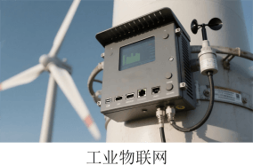
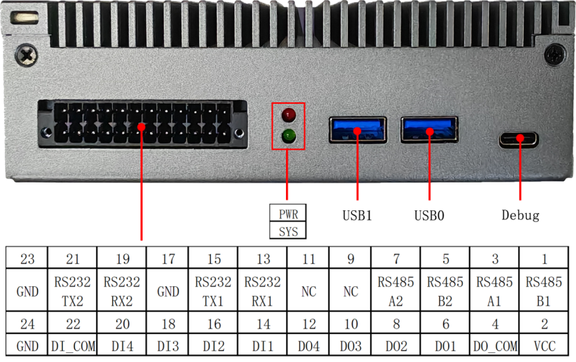

# EPC1001 Edge Computing Box

The EPC1001 Edge Computing Box is a highly cost-effective edge computing device, designed based on the domestic Rockchip RK3576 application processor. It integrates quad-core Cortex-A72 and quad-core Cortex-A53, with a maximum frequency of up to 2.2GHz, built-in 6 TOPS NPU, supports INT4/INT8/INT16/FP16/BF16/TF32 mixed operations, supports 8K video decoding and 4K video encoding. It adopts a compact industrial design, integrated structure, small size, powerful functions, featuring high performance, low power consumption, and domestic advantages.

EPC1001 Edge Computing Box has rich functional interfaces, including dual gigabit Ethernet ports, 4 USB3.0, 1 3.5mm headphone jack, 2 isolated RS485, 2 isolated RS232, 4 isolated DI, 4 isolated DO, 1 isolated CAN, supports 4G/5G, supports Beidou navigation and positioning, supports Micro SD card expansion, supports NVMe SSD expansion. It can be connected to display devices via HDMI and MIPI DSI for video output; external cameras can be connected for face recognition, attribute detection, etc. Supports multiple operating systems, including Debian, Ubuntu, and Android.

With rich interfaces and powerful functions, it can be widely used in industrial IoT edge control, smart transportation edge terminals, smart agriculture edge monitoring and control, security monitoring edge analysis nodes, vehicle-mounted mobile edge computing terminals, environmental monitoring and emergency terminals, as well as smart commercial display and edge interaction terminals.

## Application Scenarios

## Specifications

| Processor         | CPU          | Quad-core Cortex-A72 + Quad-core Cortex-A53, up to 2.2GHz          |
| ----------------- | ------------ | ------------------------------------------------------------ |
|                   | GPU          | ARM Mali-G52 MC3, supports OpenGL ES 1.1/2.0/3.2, OpenCL 2.0 and Vulkan 1.1 |
|                   | VPU          | Video decoding: 8K@30fps or 4K@120fps (H.265 HEVC/VP9/AVS2/AV1) 4K@60fps (H.264 AVC); 1080P@60fps (H.264 MVC) Video encoding: 4K@60fps (H.265/H.264) |
|                   | NPU          | 6.0TOPS                                                      |
| Memory            | RAM          | 4GB/8GB LPDDR4X                                              |
|                   | Storage      | 32GB/64GB eMMC 5.1 Supports 1x Micro SD card expansion Supports 1x 2280 NVMe SSD expansion |
| I/O               | Ethernet     | 2x Gigabit Ethernet ports                                    |
|                   | USB          | 4x USB3.0                                                    |
|                   | Video Output | 1x HDMI2.1 port, supports up to 4K@120fps output 1x MIPI DSI port, supports up to 2560x1600@60fps output |
|                   | Audio Output | 1x 3.5mm headphone jack                                      |
|                   | CAN          | 1x isolated CAN                                              |
|                   | RS485        | 2x isolated RS485                                            |
|                   | RS232        | 2x isolated RS232                                            |
|                   | DI           | 4x isolated DI                                               |
|                   | DO           | 4x isolated DO, default output level can be set              |
|                   | Micro SD Slot| 1x                                                           |
|                   | SIM Slot     | 1x, supports 4G/5G                                           |
|                   | Debug        | 1x USB-C debug port                                          |
|                   | Fan          | 1x 3Pin fan connector                                        |
|                   | RTC          | Supports internal RTC                                        |
|                   | Antenna      | 5x antenna connectors, 4 for 4G/5G, 1 for GPS/BDS            |
| Buttons           |              | 1x Reset button, 1x Recover button, 1x Power button          |
| Indicators        |              | 1x Power indicator, 1x Status indicator                      |
| General           | Power        | DC 9V~36V                                                    |
|                   | Operating Temp| -20 ~ +75 °C                                                 |
|                   | Operating Humidity| 95% relative humidity, non-condensing                      |
|                   | Dimensions   | 164.0x100.0x45.0mm                                           |
| OS                |              | Debian / Ubuntu / Android                                    |

## Interface Description
 
 

 

 ## Six Views of the Product

 