# Set up your Raspberry Pi

After installing an operating system image, connect your storage device to your Raspberry Pi.

First, unplug your Raspberry Pi's power supply to ensure that the Raspberry Pi is powered down while you connect peripherals. If you installed the operating system on a microSD card, you can plug it into your Raspberry Pi's card slot now. If you installed the operating system on any other storage device, you can connect it to your Raspberry Pi now.

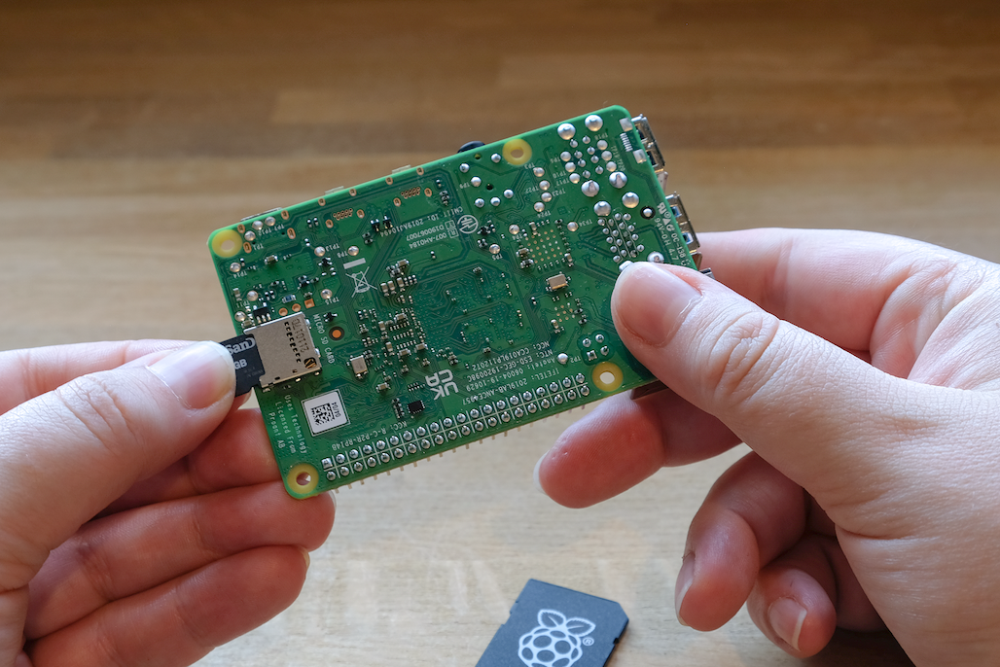

Then, plug in any other peripherals, such as your mouse, keyboard, and monitor.

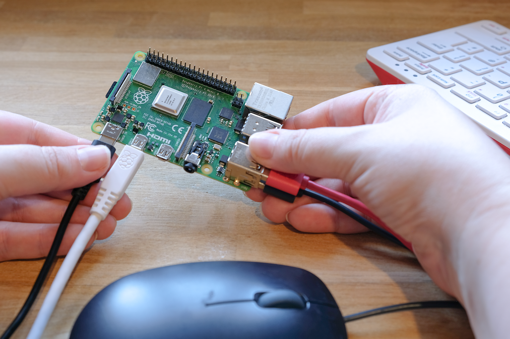

Finally, connect the power supply to your Raspberry Pi. You should see the status LED light up when your Pi powers on. If your Pi is connected to a display, you should see the boot screen within minutes.

## Configuration on first boot

If you used OS customisation in Imager to preconfigure your Raspberry Pi, **congratulations!** Your device is ready to use. Proceed to [next steps](getting-started.adoc#next-steps) to learn how you can put your Raspberry Pi to good use.

If your Raspberry Pi does not boot within 5 minutes, check the status LED. If it's flashing, see the [LED warning flash codes](configuration.adoc#led-warning-flash-codes) for more information. If your Pi refuses to boot, try the following mitigation steps:

- If you used a boot device other than an SD card, try booting from an SD card.
- [Re-image your SD card](getting-started.adoc#installing-the-operating-system); be sure to complete the entire verify step in Imager.
- [Update the bootloader](raspberry-pi.adoc#bootloader_update_stable) on your Raspberry Pi, then [re-image your SD card](getting-started.adoc#installing-the-operating-system).

If you chose to skip OS customisation in Imager, your Raspberry Pi will run a configuration wizard on first boot. You need a monitor and keyboard to navigate through the wizard; a mouse is optional.

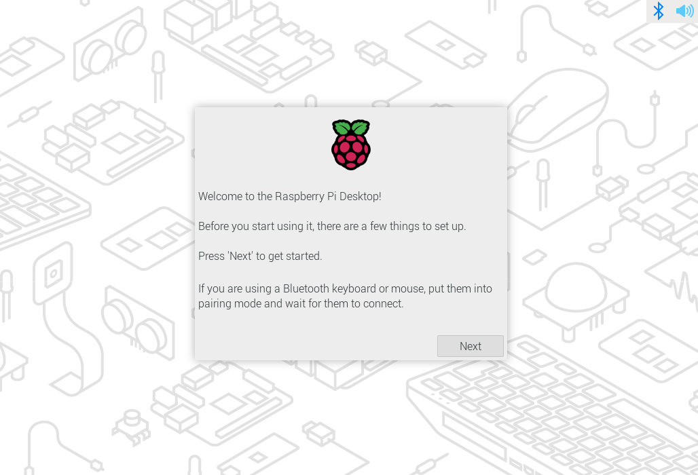

### Bluetooth

If you're using a Bluetooth keyboard or mouse, this step will walk you through device pairing. Your Raspberry Pi will scan for pairable devices and connect to the first device it finds for each item.

This process works with built-in or external USB Bluetooth adapters. If you use a USB adapter, plug it in before booting your Raspberry Pi.

### Locale

This page helps you configure your country, language, and time zone, and keyboard layout.

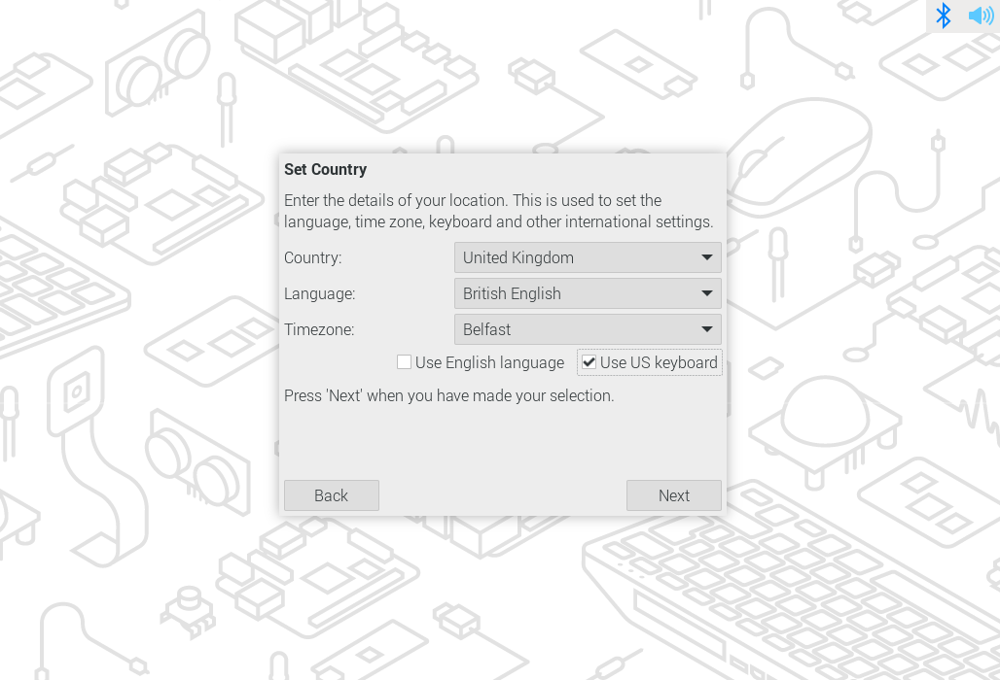

### User

This page helps you configure the username and password for the default user account.

By default, older versions of Raspberry Pi OS set the username to "pi". If you use the username "pi", avoid the old default password of "raspberry" to keep your Raspberry Pi secure.

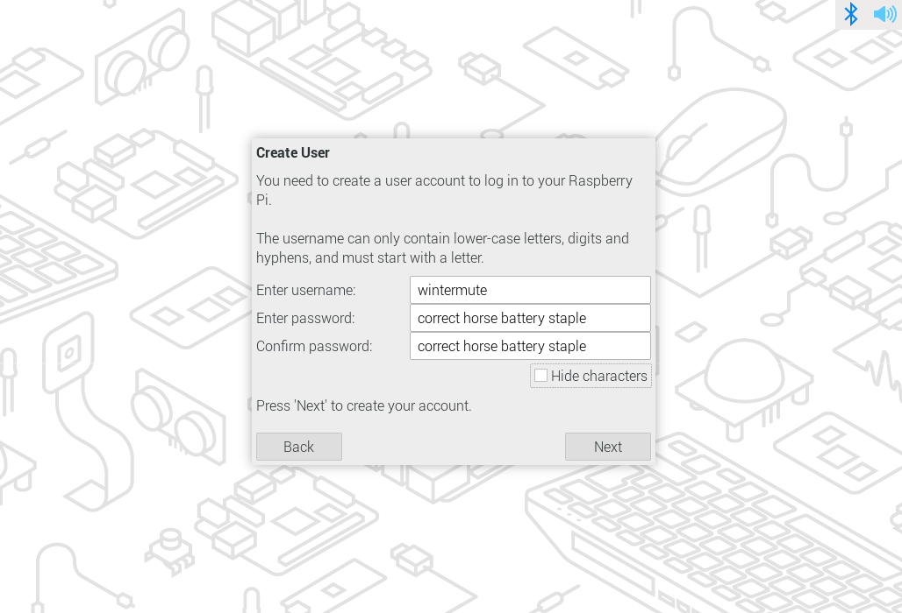

### Wi-Fi

This page helps you connect to a Wi-Fi network. Choose your preferred network from the list.

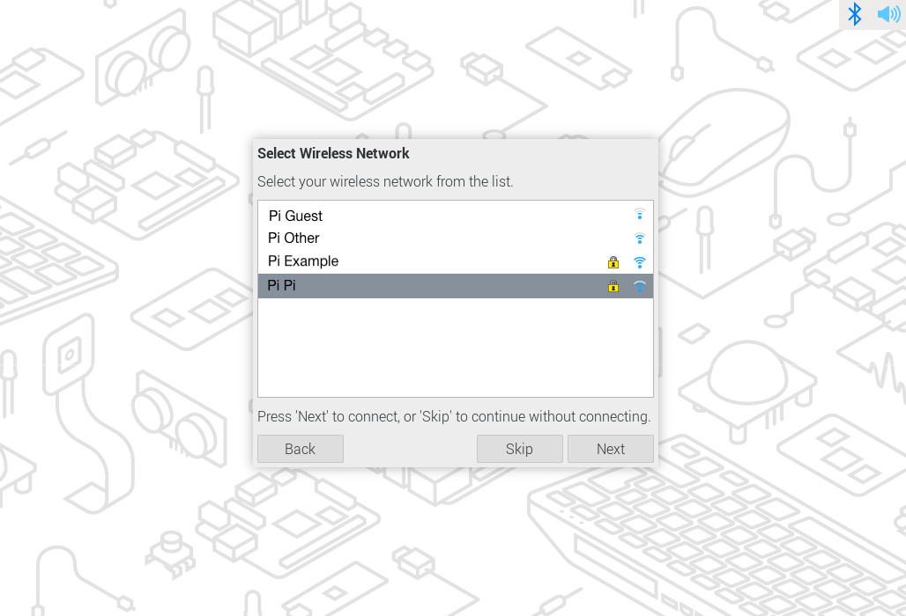

If your network requires a password, you can enter it here.

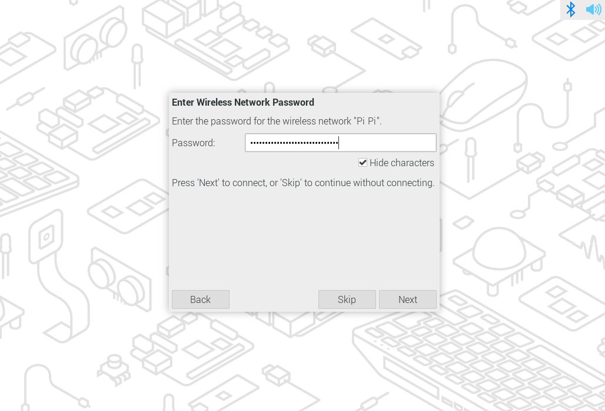

### Browser

This page lets you select Firefox or Chromium as your default internet browser. You can optionally uninstall the browser you don't set as default.

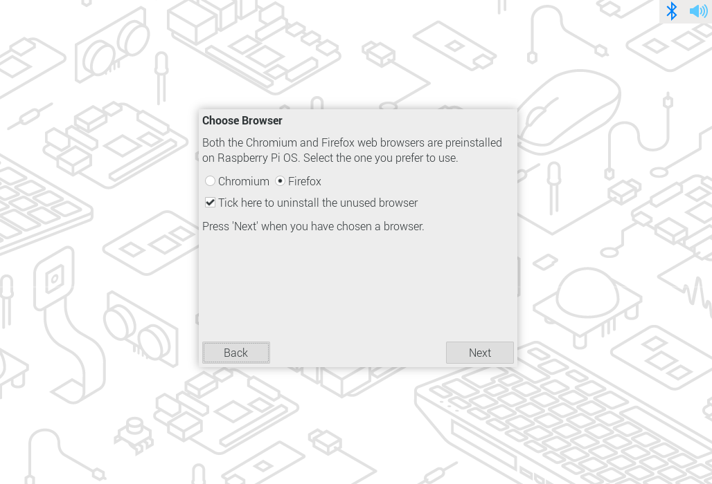

### Software updates

Once your Raspberry Pi has internet access, this page helps you update your operating system and software to the latest versions. During the software update process, the wizard will remove the non-default browser if you opted to uninstall it in the browser selection step. Downloading updates may take several minutes.

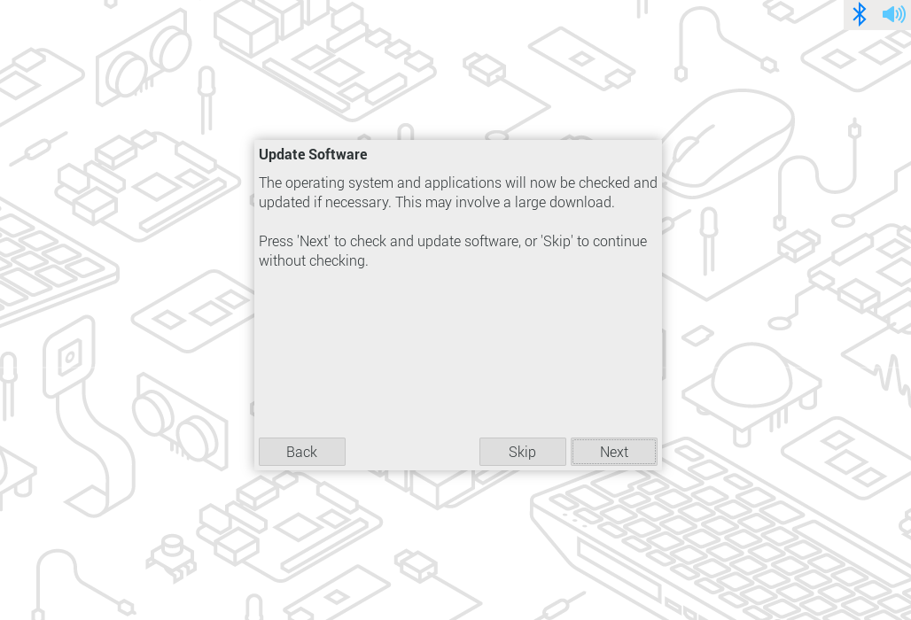

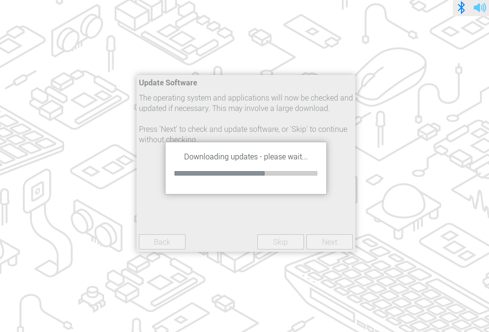

When you see a popup indicating that your system is up to date, click **OK** to proceed to the next step.

### Finish

At the end of the configuration wizard, click **Restart** to reboot your Raspberry Pi. Your Raspberry Pi will apply your configuration and boot to the desktop.

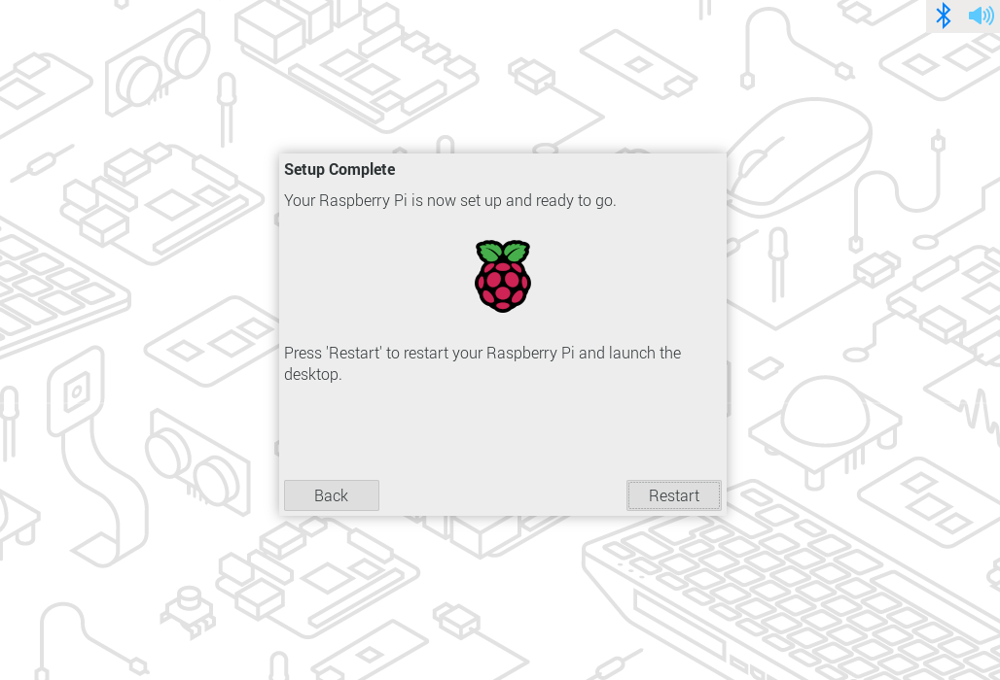