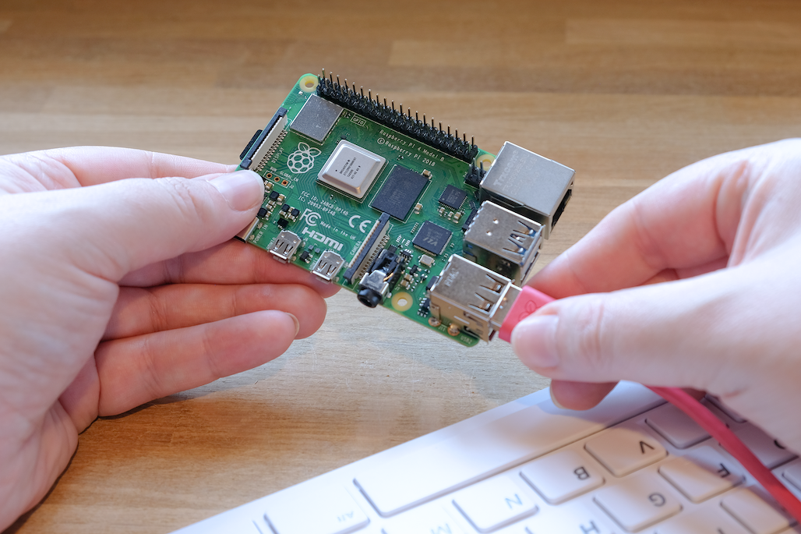
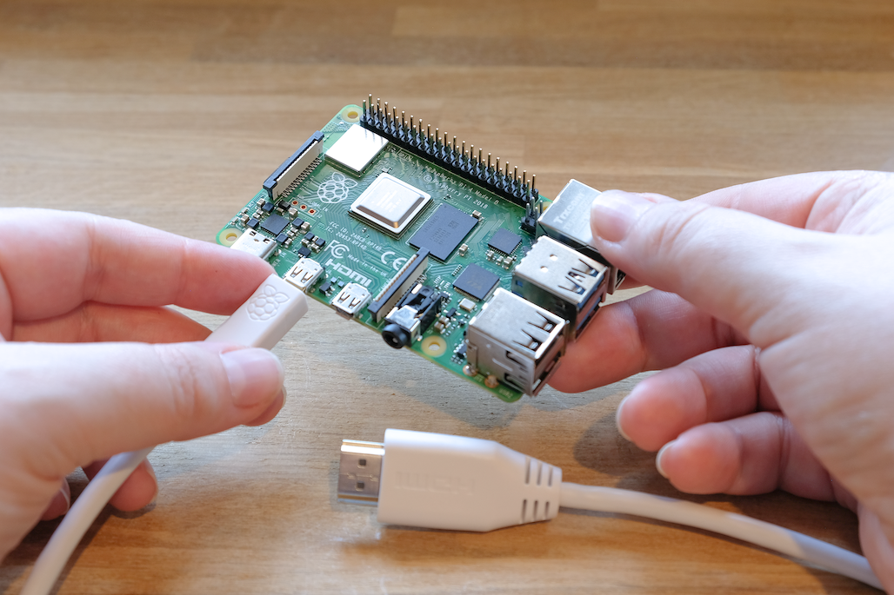

# Getting started with your Raspberry Pi

To get started with your Raspberry Pi, you'll need the following:

- a [power supply](raspberry-pi.adoc#power-supply)
- boot media (e.g. a [microSD card with ample storage and speed](getting-started.adoc#recommended-sd-cards))

You can set up your Raspberry Pi as an interactive computer with a desktop, or as a _headless_ computer accessible only over the network. To set your Raspberry Pi up headless, you don't need any additional peripherals: you can preconfigure a hostname, user account, network connection, and SSH when you [install an operating system](getting-started.adoc#installing-the-operating-system). If you want to use your Raspberry Pi directly, you'll need the following additional accessories:

- a display
- a cable to connect your Raspberry Pi to your display
- a keyboard
- a mouse

## Power supply

The following table shows the USB-PD power mode required to power various Raspberry Pi models. You can use any high-quality power supply that provides the correct power mode.

| Model | Recommended power supply (voltage/current) | Raspberry Pi power supply |
|-------|---------------------------------------------|----------------------------|
| Raspberry Pi 5 | 5V/5A, 5V/3A limits peripherals to 600mA | [27W USB-C power supply](https://www.raspberrypi.com/products/27w-power-supply/) |
| Raspberry Pi 4 Model B | 5V/3A | [15W USB-C power supply](https://www.raspberrypi.com/products/type-c-power-supply/) |
| Raspberry Pi 3 (all models) | 5V/2.5A | [12.5W Micro USB power supply](https://www.raspberrypi.com/products/micro-usb-power-supply/) |
| Raspberry Pi 2 (all models) | 5V/2.5A | [12.5W Micro USB power supply](https://www.raspberrypi.com/products/micro-usb-power-supply/) |
| Raspberry Pi 1 (all models) | 5V/2.5A | [12.5W Micro USB power supply](https://www.raspberrypi.com/products/micro-usb-power-supply/) |
| Raspberry Pi Zero (all models) | 5V/2.5A | [12.5W Micro USB power supply](https://www.raspberrypi.com/products/micro-usb-power-supply/) |

Plug your power supply into the port marked "POWER IN", "PWR IN", or "PWR". Some Raspberry Pi models, such as the Zero series, have output USB ports with the same form factor as the power port. Be sure to use the correct port on your Raspberry Pi!

## Boot Media

Raspberry Pi models lack onboard storage, so you have to supply it. You can boot your Raspberry Pi from an operating system image installed on any supported media: microSD cards are used commonly, but USB storage, network storage, and storage connected via a PCIe HAT are also available. However, only recent Raspberry Pi models support all of these media types.

All Raspberry Pi consumer models since the Raspberry Pi 1 Model A+ feature a microSD slot. Your Raspberry Pi automatically boots from the microSD slot when the slot contains a card.

### Recommended SD cards

We recommend using an SD card with at least 32GB of storage for Raspberry Pi OS installations. For Raspberry Pi OS Lite, we recommend at least 16GB. You can use any SD card with a capacity of less than 2TB. Capacities above 2TB are currently not supported due to limitations in the [MBR](https://en.wikipedia.org/wiki/Master_boot_record).

Because of a hardware limitation, the following devices will only boot from a boot partition of 256GB or less:

- Raspberry Pi Zero
- Raspberry Pi 1
- early Raspberry Pi 2 models with the BCM2836 SoC

Other operating systems have different requirements. Check the documentation for your operating system for capacity requirements.

## Keyboard

You can use any of the USB ports on your Raspberry Pi to connect a [wired keyboard](https://www.raspberrypi.com/products/raspberry-pi-keyboard-and-hub/) or USB Bluetooth receiver.

## Mouse

You can use any of the USB ports on your Raspberry Pi to connect a [wired mouse](https://www.raspberrypi.com/products/raspberry-pi-mouse/) or USB Bluetooth receiver.

## Display

Raspberry Pi models have the following display connectivity:

| Model | Display outputs |
|-------|-----------------|
| Raspberry Pi 5 | 2× micro HDMI |
| Raspberry Pi 4 (all models) | 2× micro HDMI, audio and composite out via 3.5mm [TRRS](http://en.wikipedia.org/wiki/Phone_connector_(audio)#TRRS_standards) jack |
| Raspberry Pi 3 (all models) | HDMI, audio and composite out via 3.5mm [TRRS](http://en.wikipedia.org/wiki/Phone_connector_(audio)#TRRS_standards) jack |
| Raspberry Pi 2 (all models) | HDMI, audio and composite out via 3.5mm [TRRS](http://en.wikipedia.org/wiki/Phone_connector_(audio)#TRRS_standards) jack |
| Raspberry Pi 1 Model B+ | HDMI, audio and composite out via 3.5mm [TRRS](http://en.wikipedia.org/wiki/Phone_connector_(audio)#TRRS_standards) jack |
| Raspberry Pi 1 Model A+ | HDMI, audio and composite out via 3.5mm [TRRS](http://en.wikipedia.org/wiki/Phone_connector_(audio)#TRRS_standards) jack |
| Raspberry Pi Zero (all models) | mini HDMI |

**Note**: No Raspberry Pi models support video over USB-C (DisplayPort alt mode).

If your Raspberry Pi has more than one HDMI port, plug your primary monitor into the port marked `HDMI0`.

Most displays don't have micro or mini HDMI ports. However, you can use a [micro-HDMI-to-HDMI cable](https://www.raspberrypi.com/products/micro-hdmi-to-standard-hdmi-a-cable/) or [mini-HDMI-to-HDMI cable](https://www.raspberrypi.com/products/standard-hdmi-a-male-to-mini-hdmi-c-male-cable/) to connect those ports on your Raspberry Pi to any HDMI display. For displays that don't support HDMI, consider an adapter that translates display output from HDMI to a port supported by your display.

## Audio

All Raspberry Pi models with HDMI, micro HDMI, or mini HDMI support audio output over HDMI. All Raspberry Pi models support audio over USB. All Raspberry Pi models equipped with Bluetooth support Bluetooth audio. All variants of the Raspberry Pi 1, 2, 3, and 4 include a 3.5mm auxiliary [TRRS](http://en.wikipedia.org/wiki/Phone_connector_(audio)#TRRS_standards) jack, which may require amplification for sufficient output volume.

## Networking

The following Raspberry Pi models come with Wi-Fi and Bluetooth connectivity:

- Raspberry Pi 5
- Raspberry Pi 4
- Raspberry Pi 3B+
- Raspberry Pi 3
- Raspberry Pi Zero W
- Raspberry Pi Zero 2 W

The "Model B" suffix indicates variants with an Ethernet port; "Model A" indicates no Ethernet port. If your Raspberry Pi doesn't have an Ethernet port, you can still connect to a wired internet connection using a USB-to-Ethernet adapter.

