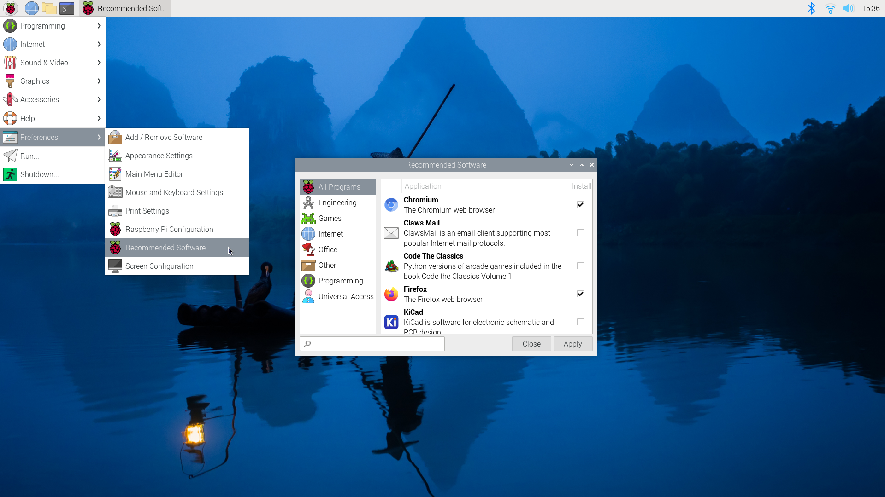

# Next steps

Now that your Raspberry Pi is set up and ready to go, what's next?

## Recommended software

Raspberry Pi OS comes with many essential applications pre-installed so you can start using them straight away. If you'd like to take advantage of other applications we find useful, click the raspberry icon in the top left corner of the screen. Select **Preferences > Recommended Software** from the drop-down menu, and you'll find the package manager. You can install a wide variety of recommended software here for free.

For example, if you plan to use your Raspberry Pi as a home computer, you might find LibreOffice useful for writing and editing documents and spreadsheets. You can also make your Raspberry Pi more accessible with apps like a screen magnifier and Orca screen reader, found under Universal Access.

## Tutorials

Our tutorials demonstrate various ways you can use your new computer. You can learn to code, control external devices, and build exciting new projects by following [tutorials](https://www.raspberrypi.com/tutorials) that pique your interest.

## Support

For support with official Raspberry Pi products, or to connect with other Raspberry Pi users, visit the [Raspberry Pi forums](https://forums.raspberrypi.com/).

## Further reading

You can find more information on how to get started with your Raspberry Pi in the latest edition of [The Official Raspberry Pi Beginners Guide](https://store.rpipress.cc/collections/latest-releases/products/the-official-raspberry-pi-beginners-guide-5th-edition) by Gareth Halfacree.

Learn how to:

- Set up your Raspberry Pi, install its operating system, and start using this fully functional computer.
- Start coding projects, with step-by-step guides using the Scratch 3, Python, and MicroPython programming languages.
- Experiment with connecting electronic components, and have fun creating amazing projects.

New in the 5th edition:

- Updated for the latest Raspberry Pi computers: Raspberry Pi 5 and Raspberry Pi Zero 2 W.
- Covers the latest Raspberry Pi OS.
- Includes a new chapter on the Raspberry Pi Pico!