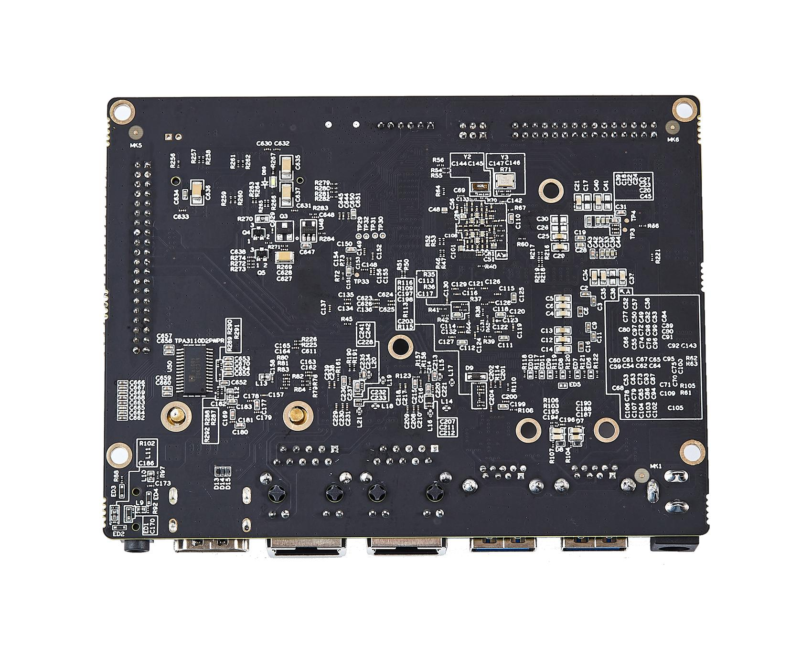
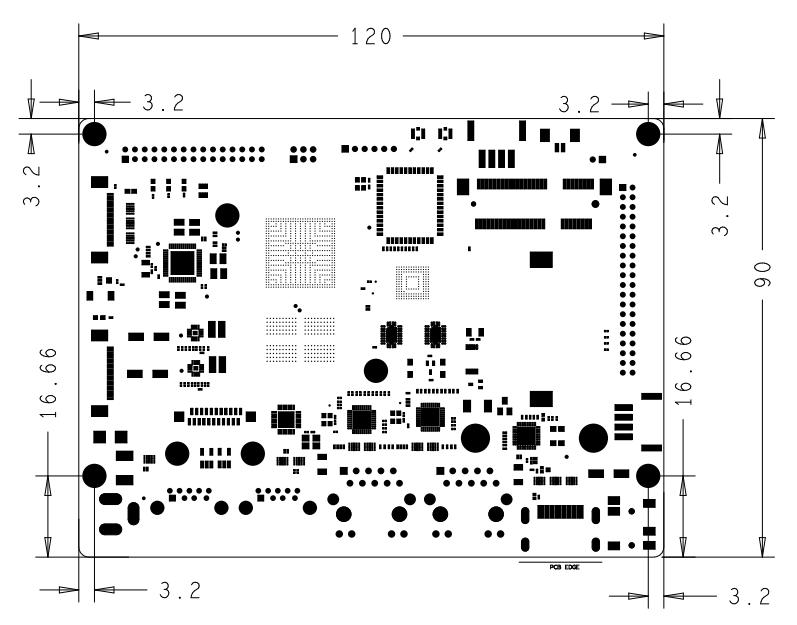
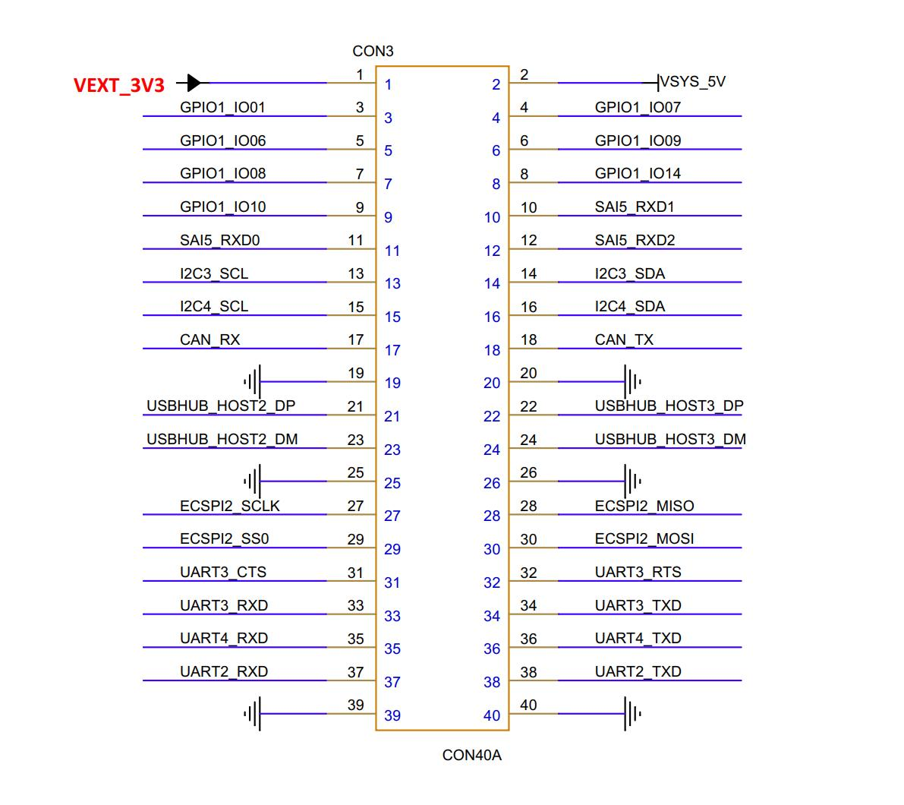

# Bit-Brick IMX8MP-HMI Datasheet

**Provisional version V 1.0**

**Bit Brick Technology Corporation**

**May 19, 2025**

BIT-BRICK IS THE TRADEMARK OF BIT BRICK TECHNOLOGY CORPORATION. ANYONE WANT TO USE THIS SHOULD GET THE PERMISSION FROM BIT BRICK COMPANY. All product specifications are subject to change without notice. Last updated: 16-May-2025

## 1. Product Introduction

Bit-Brick IMX8MP-HMI is a high-performance development board based on the NXP i.MX 8M Plus processor. It features a heterogeneous multi-core architecture combining a quad-core ARM Cortex-A53 and a single-core ARM Cortex-M7, with a clock speed up of to 1.8 GHz. Integrated with a 2.3 TOPS Neural Processing Unit, dual Image Signal Processors, and a dual-core GPU engine, the platform supports HDMI, MIPI-DSI, and LVDS display outputs, along with 1080p@60fps video encoding and decoding capabilities. This makes it well-suited for a wide range of applications, including industrial automation, smart devices, multimedia processing, and edge computing, etc.

The IMX8MP-HMI offers a rich set of interfaces—such as USB 3.0, PCIe, HDMI 2.0a, MIPI-CSI, MIPI-DSI, LVDS, 5G module support, RTC, and Gigabit Ethernet—meeting diverse connectivity and expansion requirements. It provides developers with a flexible and efficient platform for rapid prototyping, system evaluation, and early-stage technology verification.

## 2. Hardware Functional Block Diagram

## 3. Specifications

### Form Factor Specification

**Processor**
| **Processor** | Specification |
| --- | --- |
| CPU | NXP i.MX 8M Plus, Quad-core ARM Cortex-A53@1.8GHz + Cortex-M7@800MHz |
| GPU | GC520L 2D and GC7000UL 3D GPU, support OpenGL ES 1.1, 2.0, 3.0, OpenCL 1.2, Vulkan |
| NPU | 2.3 TOPS |
| VPU | Decoder: 1080p@60fps(H.265/H.264/VP9/VP8) Encoder: 1080p@60fps(H.265/H.264) |

**Memory** 

| **Memory** | Specification |
| --- | --- |
| **RAM** | 2GB/4GB LPDDR4 SDRAM (optional) |
| **Flash** | 16GB/32GB eMMC (optional) |

**Multimedia**

| Multimedia | Specification | 
| --- | --- |
| **Video Output** | 1x HDMI2.0a (up to 4K@30fps); 1x MIPI-DSI; 1x LVDS |
| **Input** | 2x ISP with HDR; 2x MIPI-CSI |
| **Audio** | 6x SAI; eARC; ASRC; SPDIF TX and RX; 1x 8-channel PDM |

 **IO**
 | IO | Specification |
| --- | --- |
| **PCIe** | 1x PCIe |
| **Ethernet** | 2x Gigabit Ethernet |
| **USB** | 2x USB3.0, 2x USB2.0 |
| **UART** | 3x |
| **I2C** | 2x |
| **SPI** | 2x |
| **CAN FD** | 2x |
| **PWM** | 4x |
| **MIPI DSI** | 1x |
| **MIPI CSI** | 1x |
| **HDMI** | 1x HDMI2.0a |
| **LVDS** | 1x |
| **RTC** | 1x |
| **5G Module** | 1x |
| **GPIO** | 10x |
| **Audio** | 1x 3.5mm Earphone interface; 1x Speaker header |

**Power Supply**
| **Power Supply** | Specification |
| --- | --- |
| **Power Supply Voltage** | DC 12V |

**Environment**
| **Environment** | Specification |
| --- | --- |
| **Operating Temperature** | -20 ~ 75°C |
| **Operating Humidity** | 95% relative humidity, non-condensing |

**Mechanical**
| **Mechanical** | Specification |
| --- | --- |
| **Dimensions (W x D)** | 120 x 90mm |

 **Operating System**

| **Linux** |

**Certifications**

| **CE/FCC Class B** |

## 4.Dimensions Specifications

 **Size** 120.0mm X 90.0mm 

## 5. GPIO Pin Definitions

## 6. Ordering Information

| **Part No.** | **CPU** | **Memory** | **Flash** | **Operating Temperature** |
| --- | --- | --- | --- | --- |
| Bit-Brick-IMX8MP-HMI-0216 | i.MX 8M Plus | 2GB | 16GB | -20~75°C |
| Bit-Brick-IMX8MP-HMI-0432 | i.MX 8M Plus | 4GB | 32GB | -20~75°C |

## 7. Update History

| **Version** | **Revision** | **Update Date** | **Content** |
| --- | --- | --- | --- |
| Provisional V 1.0 | 2025-5-16 | Initial the first version |

