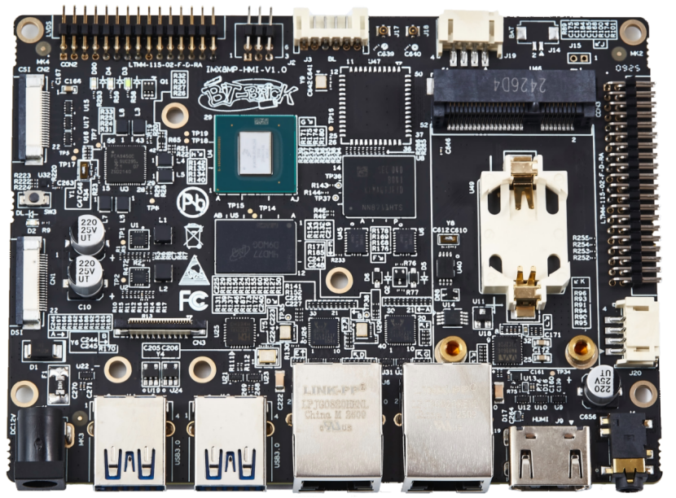
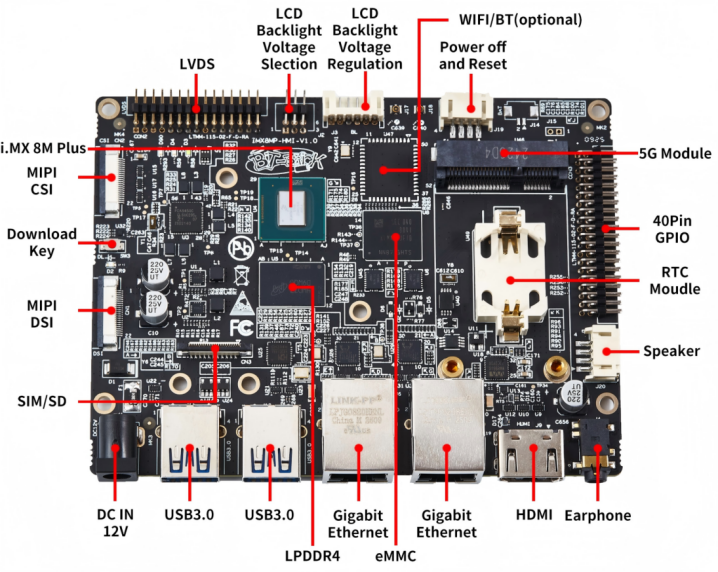
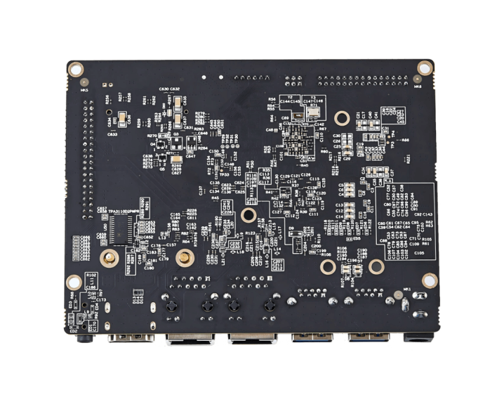
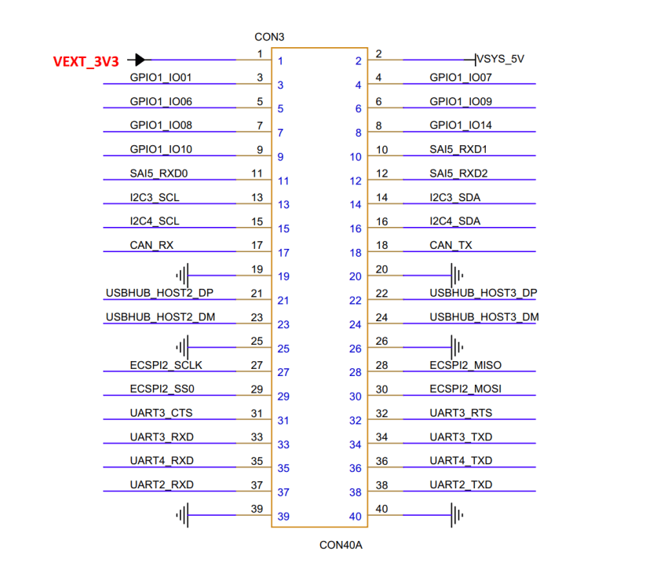
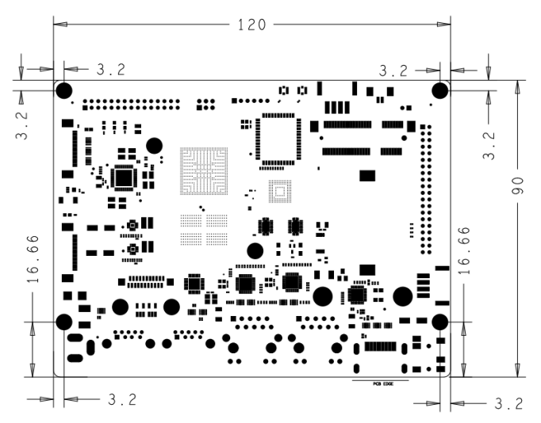

# Product Introduction

 

IMX8MP-HMI is a high-performance development board developed and designed based on the NXP i.MX 8M Plus processor. It integrates a quad-core ARM Cortex-A53 and a single-core ARM Cortex-M7 CPU, with a maximum frequency of up to 1.8 GHz. It features a 2.3 TOPS NPU, dual image signal processors, and a dual-core GPU engine. It supports HDMI, MIPI-DSI, and LVDS display outputs, as well as 1080p@60fps video encoding and decoding, making it suitable for a wide range of applications such as industrial automation, smart devices, multimedia processing, and edge computing.

IMX8MP-HMI provides a wealth of interfaces, such as USB3.0, PCIe, HDMI 2.0a, MIPI-CSI, MIPI-DSI, LVDS, 5G, RTC, and dual Gigabit Ethernet, meeting diverse functional expansion needs. It offers developers a flexible and efficient platform for rapid prototyping, system evaluation, and early technology verification.

## Functional Block Diagram

## 规格参数
| 参数          | 描述                                                         |
| ------------- | ------------------------------------------------------------ |
| CPU           | NXP i.MX 8M Plus, 四核ARM Cortex-A53@1.8GHz + Cortex-M7@800MHz |
| GPU           | GC520L 2D and GC7000UL 3D GPU, 支持OpenGL ES 1.1, 2.0, 3.0, OpenCL 1.2, Vulkan |
| NPU           | 2.3 TOPS                                                     |
| VPU           | 解码: 1080p@60fps(H.265/H.264/VP9/VP8)编码: 1080p@60fps(H.265/H.264) |
| RAM           | 2GB/4GB LPDDR4 SDRAM                                         |
| Flash         | 16GB/32GB eMMC                                               |
| PCIe          | 1x PCIe                                                      |
| 以太网        | 2x Gigabit Ethernet                                          |
| USB           | 2x USB3.0, 2xUSB2.0                                          |
| UART          | 3x                                                           |
| I2C           | 2x                                                           |
| SPI           | 2x                                                           |
| CAN FD        | 2x                                                           |
| PWM           | 4x                                                           |
| MIPI DSI      | 1x                                                           |
| MIPI CSI      | 1x                                                           |
| HDMI          | 1x HDMI2.0a                                                  |
| LVDS          | 1x                                                           |
| RTC           | 1x                                                           |
| 5G            | 1x                                                           |
| GPIO          | 10x                                                          |
| Audio         | 1x 3.5mm Earphone interface; 1x Speaker header               |
| 电源          | DC 12V                                                       |
| 工作温度      | -20 ~ 75 °C                                                  |
| 尺寸（长X宽） | 120 x 90mm                                                   |
| 操作系统      | Linux                                                        |

## 引脚定义

## Mechanical Dimensions

