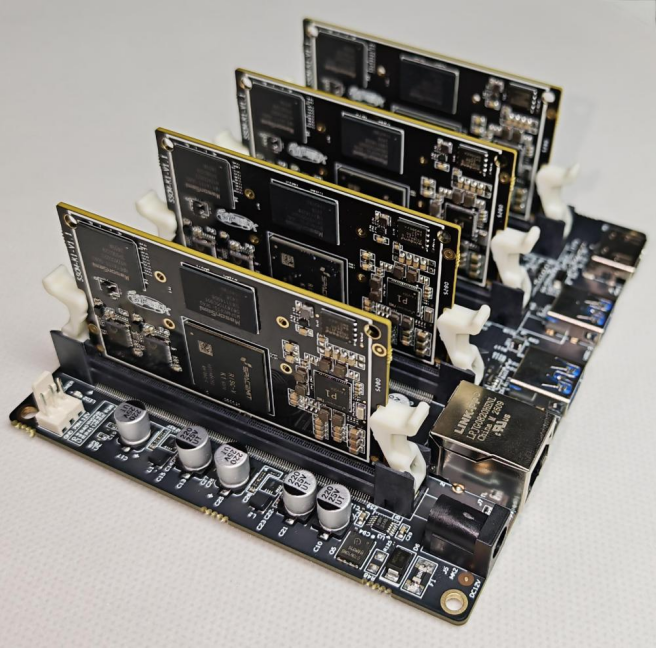
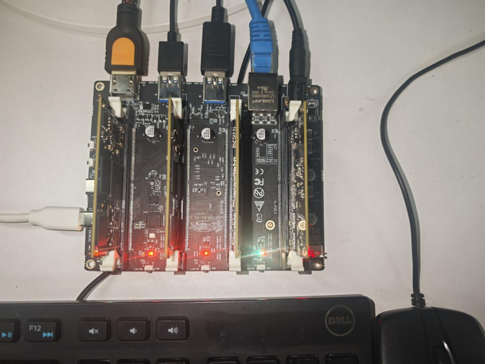

# Bit-Brick Cluster K1 User Manual

This chapter introduces Cluster K1 and its usage.

## 1. Product Overview

Bit-Brick Cluster K1 is a high-performance computing expansion device designed to connect multiple core boards into a cluster, significantly enhancing computing power to meet the needs of applications with high-performance requirements. Cluster K1 can mount up to 4 core boards at a time and is equipped with a variety of peripheral interfaces, allowing users to connect various external devices and expand system functionality.

## 2. Working Principle

Cluster K1 uses an Ethernet switch chip as the connection hub to establish a network connection between the four core boards. The Ethernet switch chip, as the core component of the cluster network, provides each core board with an independent network port, enabling fast packet forwarding. When the core boards are connected to the cluster board, the router assigns a unique network address to each core board. Each core board can communicate with others through the Ethernet switch chip, ensuring efficient and stable data transmission.

## 3. Cluster Board Resources

| Resource Name         | Description                                                        |
|-----------------------|--------------------------------------------------------------------|
| Ethernet Switch Chip  | 1x, connects core boards for fast packet forwarding               |
| Gigabit Ethernet Port | 1x, for network connection                                        |
| USB 3.0 Interface     | 1x, for high-speed data transfer                                  |
| USB 2.0 Interface     | 1x, for data transfer                                             |
| USB 2.0 OTG Interface | 1x, for connecting external devices                               |
| HDMI Interface        | 1x, for video output                                              |
| Power Interface       | 1x, for powering the cluster board                                |
| 3-Pin Fan Power Port  | 1x, for connecting fans to provide cooling                        |
| Type-C Debug Port     | 1x, for debugging and log output                                  |
| M.2 M-KEY Interface   | 1x, for storage expansion or other functionalities                |
| Core Board Slots      | 4x, for mounting core boards                                      |
| Download Button       | For downloading programs                                         |
| Reset Button          | For system reset                                                 |
| Power Button          | For power control                                                |

## 4. Usage Instructions

### (1) Core Board Mounting

1. **Preparation**: Ensure the cluster board is powered off and prepare the core boards to be mounted.
2. **Install Core Boards**: Align the core boards with the corresponding slots on the cluster board and insert them steadily, ensuring full contact between the core boards and the slots. Avoid excessive force during insertion to prevent damage.
3. **Secure Core Boards**: Use the provided fixtures to firmly secure the core boards on the cluster board to prevent loosening during use.

### (2) Peripheral Connection

Connect the required external devices to the corresponding peripheral interfaces on the cluster board. After connecting, check if the devices are securely connected.

### (3) System Startup

After mounting the core boards and connecting peripherals, power on the cluster board. The system will start automatically. During startup, users can observe the system logs via the serial port or other debugging tools to ensure normal startup.

> **Note**: Only the core board in the master slot has HDMI display functionality. It can be controlled using a display, keyboard, and mouse. Other core boards need to be controlled using serial tools or remote connections.

## 5. Precautions

1. Ensure the cluster board is powered off when mounting core boards or connecting non-hot-swappable devices to avoid damage caused by live operations.
2. Regularly check the connections of core boards and peripherals to ensure they are secure and prevent device failures due to loosening.
3. Keep the interfaces of the core boards and cluster board clean to avoid contact issues that may cause device failures.
4. In case of system failures or abnormalities, record the fault phenomena promptly and contact professional technicians for assistance.
