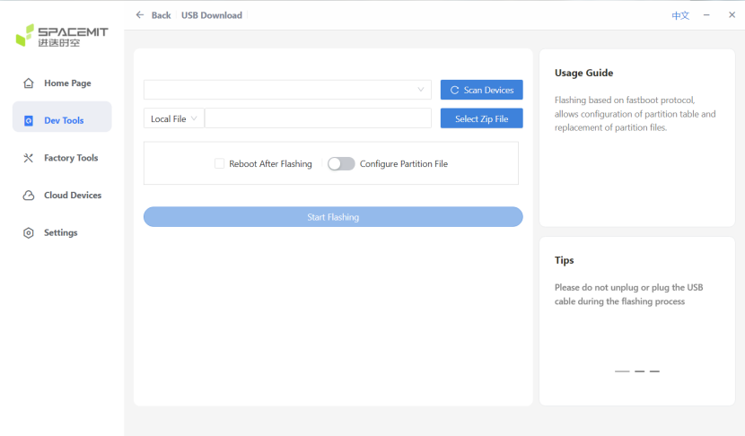
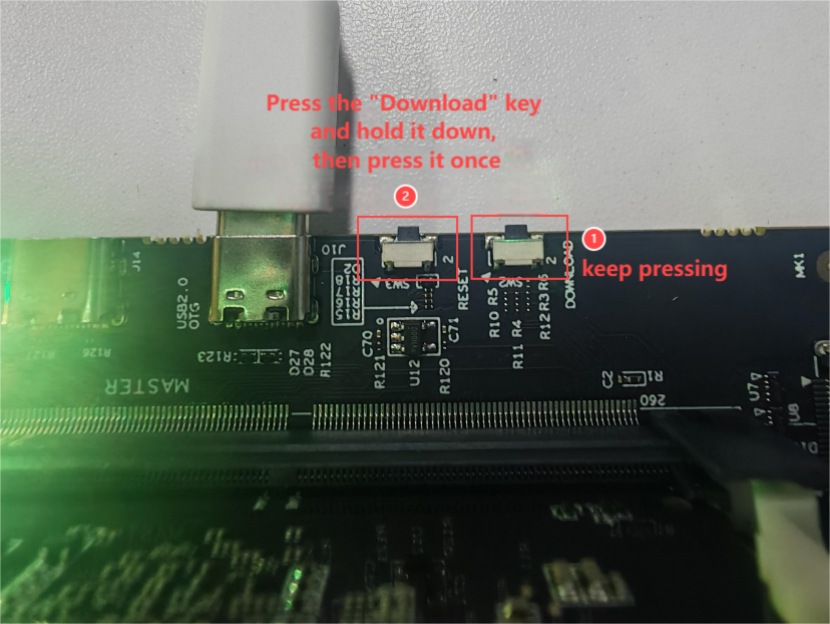
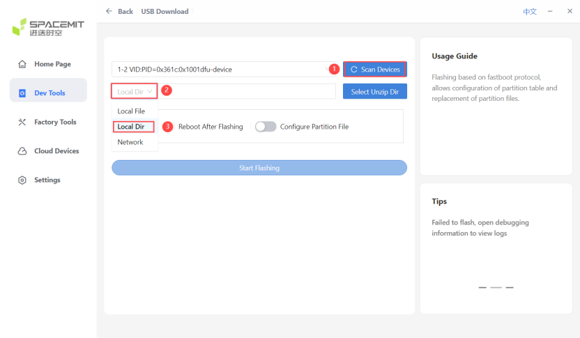
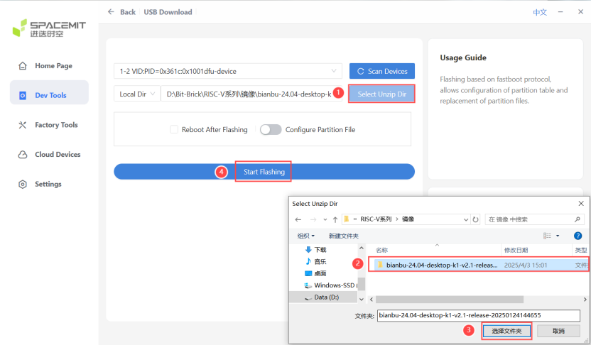
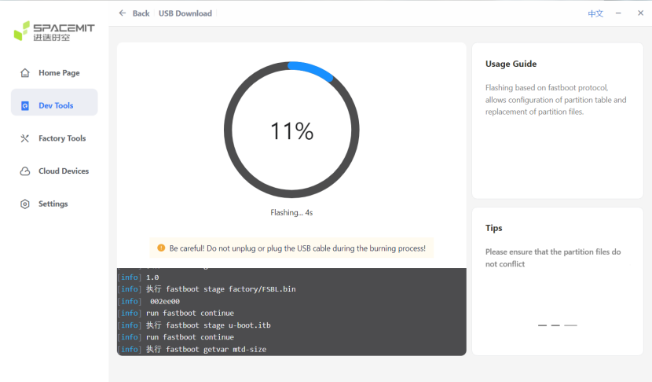

# SSOM-K1 Image Flashing Steps

## Flashing Tool and Image Download

To flash an image onto SSOM-K1, you need the **titanflasher** tool. Download links are as follows:

- [Windows Version](https://cloud.spacemit.com/prod-api/release/download/tools?token=titantools_for_windows_X86_X64)
- [Linux Version](https://cloud.spacemit.com/prod-api/release/download/tools?token=titantools_for_linux_64BIT_APPIMAGE)

Image link: [bianbu-24.04-desktop-v2.1](https://archive.spacemit.com/image/k1/version/bianbu/v2.1/bianbu-24.04-desktop-k1-v2.1-release-20250124144655.zip). After downloading, extract the files to speed up the flashing process.

## Flashing Steps

1. **Open titanflasher** and click "Dev Tools" to enter "USB Download".
 
   
   
   

3. **Connect the Device**:
   
   Insert the core board to be flashed into the master slot of the cluster board. Use a **USB-C cable** to connect the cluster board's **USB 2.0 OTG interface** to the computer. Power on the cluster board.
   
   
   

4. **Enter Flashing Mode**:
   
   Press and hold the **Download Button** on the cluster board, then press the **Reset Button** once and release it.
   
   
   

5. **Scan Devices**:
   
   In titanflasher, click "Scan Devices" and select the local directory.
   
   
   

6. **Select Image Directory**:
   
   Click "Flashing Directory" and select the extracted image directory. Then click "Start Flashing."
   
   
   

7. **Start Flashing the Image**:
   
   Wait for the flashing process to complete. Titanflasher will display the flashing progress.
   
   
   

## Flashing Complete

- Once flashing is complete, titanflasher will display a "Flashing Successful" message.
   
   
   

## System Startup

1. Insert the core board with the flashed image into the cluster board.
2. Connect peripherals (e.g., monitor, keyboard, mouse).
3. Power on the cluster board and wait for the system to start.

> **Note**: If the system fails to start, check if the flashing process was successful or try flashing again.
