# Booting
U - Boot and OpenSBI Development and Debugging Guide.
## uboot Function and Configuration
### Function Introduction
The main functions of uboot are as follows:
- Loading and Starting the Kernel
uboot loads the kernel image from the storage medium (emmc/sd/nand/nor/ssd, etc.) to the designated memory location and starts the kernel.
- Fastboot Flashing Function
Through the fastboot tool, the image is burned to the designated partition location.
- Boot Logo
uboot displays the boot logo and boot menu during the startup stage.
- Driver Debugging
Based on uboot to debug device drivers, such as mmc/spi/nand/nor/nvme and other drivers. uboot provides a shell command line to debug the functions of each driver.
The uboot driver is in the drivers/ directory.
### Compilation
This section introduces how to compile and generate the uboot image file based on the uboot code environment.
- Compilation Configuration
For the first compilation, or if you need to reselect another solution, you need to select the compilation configuration first. Here is an example for k1:
```shell
cd ~/uboot - 2022.10
make ARCH = riscv k1_defconfig - C ~/uboot - 2022.10/
```
To visually change the compilation configuration:
```shell
make ARCH = riscv menuconfig
```
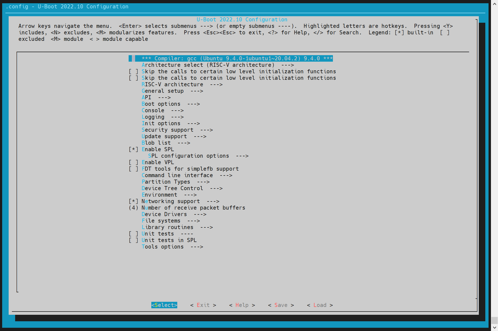
Use the keyboard "Y"/"N" to enable/disable the related function configuration. After saving, it will be updated to the.config file in the uboot root directory.
- Compiling uboot
```shell
cd ~/uboot - 2022.10
GCC_PREFIX = riscv64 - unknown - linux - gnu -
make ARCH = riscv CROSS_COMPILE = ${GCC_PREFIX} - C ~/uboot - 2022.10 - j4
```
- Compilation Products
```shell
~/uboot - 2022.10$ ls u - boot* - l
u - boot
u - boot.bin           # uboot image
u - boot.dtb           # dtb file
u - boot - dtb.bin       # uboot image with dtb
u - boot.itb           # Pack u - boot - nodtb.bin and dtb into the fit format
u - boot - nodtb.bin
bootinfo_emmc.bin    # Information used to record the spl location during emmc startup
bootinfo_sd.bin
bootinfo_spinand.bin
bootinfo_spinor.bin
FSBL.bin             # u - boot - spl.bin with header information. Loaded and started by brom
k1 - x_deb1.dtb        # dtb file for the deb1 solution
k1 - x_spl.dtb         # dtb file for spl
```
### dts Configuration
The uboot dts configuration is in the directory uboot - 2022.10/arch/riscv/dts/, and the dts of the solution is modified according to the different solutions, such as the deb1 solution.
```shell
~/uboot - 2022.10$ ls arch/riscv/dts/k1*.dts - l
arch/riscv/dts/k1 - x_deb1.dts
arch/riscv/dts/k1 - x_deb2.dts
arch/riscv/dts/k1 - x_evb.dts
arch/riscv/dts/k1 - x_fpga_1x4.dts
arch/riscv/dts/k1 - x_fpga_2x2.dts
arch/riscv/dts/k1 - x_fpga.dts
arch/riscv/dts/k1 - x_spl.dts
```
## uboot Driver Development and Debugging
This section mainly introduces the usage and debugging methods of the uboot driver. By default, all drivers have been configured.
### boot kernel
This subsection introduces how uboot starts the kernel, as well as the custom configuration and startup of the partition.
- After the development board is powered on, immediately press the "s" key on the keyboard to enter the uboot shell.
- You can enter the fastboot mode by executing fastboot 0, and send the image to the development board through the fastboot stage Image on the computer side. (Or other ways to download the image, such as the fatload command)
- Execute booti to start the kernel (or bootm to start the fit format image)
```shell
# Download the kernel image
=> fastboot - l 0x40000000 0
Starting download of 50687488 bytes
...
downloading/uploading of 50687488 bytes finished
# Execute the command on the computer side
C:\Users>fastboot stage Z:\k1\output\Image
Sending 'Z:\k1\output\Image' (49499 KB)           OKAY [  1.934s]
Finished. Total time: 3.358s
# After the download is completed, in the uboot shell, press CTRL + C on the keyboard to exit the fastboot mode.
# Download the dtb
=> fastboot - l 0x50000000 0
Starting download of 33261 bytes
downloading/uploading of 33261 bytes finished
# Execute the command on the computer side
C:\Users>fastboot stage Z:\k1\output\k1 - x_deb1.dtb
Sending 'Z:\k1\output\k1 - x_deb1.dtb' (32 KB)      OKAY [  0.004s]
Finished. Total time: 0.054s
```
Execute the startup command
```shell
=> booti 0x40000000 - 0x50000000
Moving Image from 0x40000000 to 0x200000, end = 3d4f000
## Flattened Device Tree blob at 50000000
   Booting using the fdt blob at 0x50000000
   Using Device Tree in place at 0000000050000000, end 0000000050014896
Starting kernel...
[    0.000000] Linux version 6.1.15+......
[    0.000000] OF: fdt: Ignoring memory range 0x0 - 0x200000
[    0.000000] Machine model: spacemit k1 - x deb1 board
[    0.000000] earlycon: sbi0 at I/O port 0x0 (options '')
[    0.000000] printk: bootconsole [sbi0] enabled
```
- Start the fit format image through the bootm command
Assume that partition 5 in emmc is a fat32 file system. And the uImage.itb file is saved in it, and the kernel is loaded and started through the following command.
```shell
=> fatls mmc 2:5
sdh@d4281000: 74 clk wait timeout(100)
 50896911   uImage.itb
     4671   env_k1 - x.txt
2 file(s), 0 dir(s)
=> fatload mmc 2:5 0x40000000 uImage.itb
50896911 bytes read in 339 ms (143.2 MiB/s)
=> bootm 0x40000000
## Loading kernel from FIT Image at 40000000...
Boot from fit configuration k1_deb1
   Using 'conf_2' configuration
   Trying 'kernel' kernel subimage
     Description:  Vanilla Linux kernel
     Type:         Kernel Image
     Compression:  uncompressed
     Data Start:   0x400000e8
     Data Size:    50687488 Bytes = 48.3 MiB
     Architecture: RISC - V
     OS:           Linux
     Load Address: 0x01400000
     Entry Point:  0x01400000
   Verifying Hash Integrity... OK
## Loading fdt from FIT Image at 40000000...
   Using 'conf_2' configuration
   Trying 'fdt_2' fdt subimage
     Description:  Flattened Device Tree blob for k1_deb1
     Type:         Flat Device Tree
     Compression:  uncompressed
     Data Start:   0x43067c90
     Data Size:    68940 Bytes = 67.3 KiB
     Architecture: RISC - V
     Load Address: 0x28000000
   Verifying Hash Integrity... OK
   Loading fdt from 0x43067c90 to 0x28000000
   Booting using the fdt blob at 0x28000000
   Loading Kernel Image
   Using Device Tree in place at 0000000028000000, end 0000000028013d4b
Starting kernel...
[    0.000000] Linux version 6.1.15+......
[    0.000000] OF: fdt: Ignoring memory range 0x0 - 0x1400000
[    0.000000] Machine model: spacemit k1 - x deb1 board
[    0.000000] earlycon: sbi0 at I/O port 0x0 (options '')
[    0.000000] printk: bootconsole [sbi0] enabled
```
### env
This section introduces how to configure the loading of env from the designated storage medium during the uboot startup stage.
- Execute make menuconfig and enter Environment,
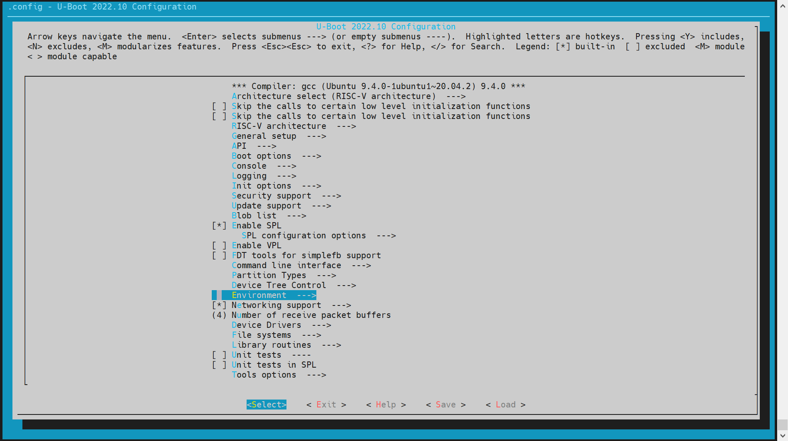
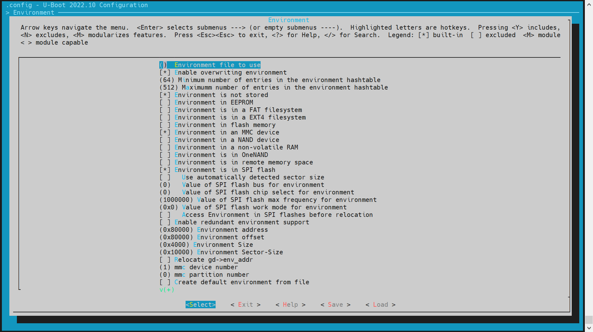
Currently, the supported optional media are mmc and mtd devices (where mtd devices include spinor, spinand).
The offset address of env needs to be determined according to the configuration of the partition table. For specific details, you can refer to the partition table configuration in the section of the boot settings for flashing. The default is 0x80000.
```shell
(0x80000) Environment address       # The env offset address for spinor
(0x80000) Environment offset        # The env offset address for mmc devices
```
### mmc
Both emmc and sd cards use the mmc driver, and the dev numbers are 2 and 0 respectively.
- config Configuration
Execute make menuconfig and enter Device Drivers ---> MMC Host controller Support to enable the following configurations
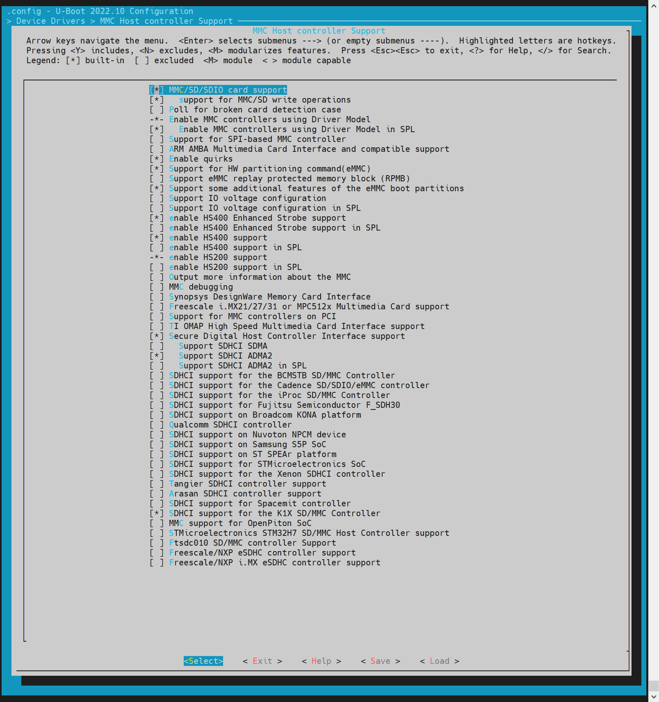
- dts Configuration
```c
//uboot - 2022.10/arch/riscv/dts/k1 - x.dtsi
         sdhci0: sdh@d4280000 {
             compatible = "spacemit, k1 - x - sdhci";
             reg = <0x0 0xd4280000 0x0 0x200>;
             interrupt - parent = <&intc>;
             interrupts = <99>;
             resets = <&reset RESET_SDH_AXI>,
                      <&reset RESET_SDH0>;
             reset - names = "sdh_axi", "sdh0";
             clocks = <&ccu CLK_SDH0>,
                      <&ccu CLK_SDH_AXI>;
             clock - names = "sdh - io", "sdh - core";
             status = "disabled";
         };
         sdhci2: sdh@d4281000 {
             compatible = "spacemit, k1 - x - sdhci";
             reg = <0x0 0xd4281000 0x0 0x200>;
             interrupt - parent = <&intc>;
             interrupts = <101>;
             resets = <&reset RESET_SDH_AXI>,
                      <&reset RESET_SDH2>;
             reset - names = "sdh_axi", "sdh2";
             clocks = <&ccu CLK_SDH2>,
                      <&ccu CLK_SDH_AXI>;
             clock - names = "sdh - io", "sdh - core";
             status = "disabled";
         };
//uboot - 2022.10/arch/riscv/dts/k1 - x_deb1.dts
&sdhci0 {
        pinctrl - names = "default";
        pinctrl - 0 = <&pinctrl_mmc1 &gpio80_pmx_func0>;
        bus - width = <4>;
        cd - gpios = <&gpio 80 0>;
        cd - inverted;
        cap - sd - highspeed;
        sdh - phy - module = <0>;
        status = "okay";
};
/* eMMC */
&sdhci2 {
        bus - width = <8>;
        non - removable;
        mmc - hs400 - 1_8v;
        mmc - hs400 - enhanced - strobe;
        sdh - phy - module = <1>;
        status = "okay";
};
```
- Debugging Verification
The uboot shell provides a command line to debug the mmc driver, and the compilation configuration item CONFIG_CMD_MMC needs to be enabled.
```shell
=> mmc list
sdh@d4280000: 0 (SD)
sdh@d4281000: 2 (eMMC)
=> mmc dev 2 # Switch to emmc
switch to partitions #0, OK
mmc2(part 0) is current device
# Read 0x1000 blk_cnt from the 0 offset to the memory at 0x40000000
=> mmc read 0x40000000 0 0x1000
MMC read: dev # 2, block # 0, count 4096... 4096 blocks read: OK
# Write from the memory address 0x40000000 to 0x1000 blk_cnt at the 0 offset
=> mmc write 0x40000000 0 0x1000
MMC write: dev # 2, block # 0, count 4096... 4096 blocks written: OK
# For other usages, refer to mmc - h
```
- Common Interfaces
Refer to the interfaces in cmd/mmc.c
### nvme
The nvme driver is mainly used to debug ssd hard drives.
- config Configuration
Execute make menuconfig and enter Device Driver to enable the following configurations,
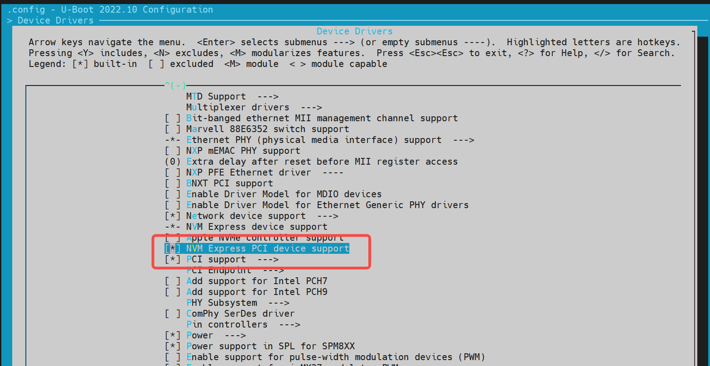
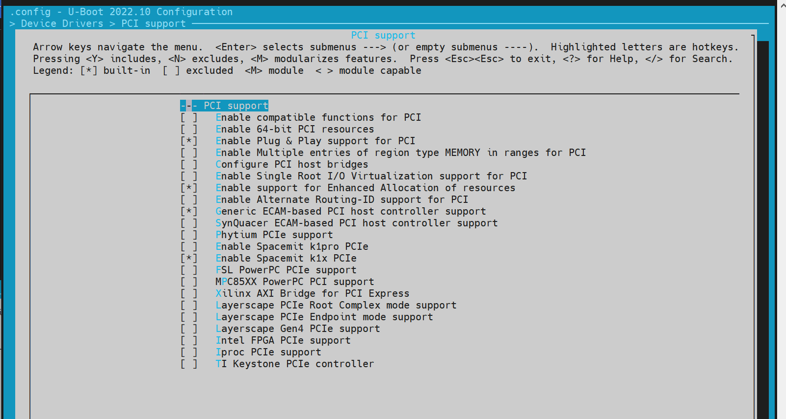
- dts Configuration
  

```c
//uboot-2022.10/arch/riscv/dts/k1-x.dtsi
         pcie1_rc: pcie@ca400000 {
             compatible = "k1x,dwc-pcie";
             reg = <0x0 0xca400000 0x0 0x00001000>, /* dbi */
                   <0x0 0xca700000 0x0 0x0001ff24>, /* atu registers */
                   <0x0 0x90000000 0x0 0x00100000>, /* config space */
                   <0x0 0xd4282bd4 0x0 0x00000008>, /*k1x soc config addr*/
                   <0x0 0xc0c20000 0x0 0x00001000>, /* phy ahb */
                   <0x0 0xc0c10000 0x0 0x00001000>, /* phy addr */
                   <0x0 0xd4282bcc 0x0 0x00000008>, /* conf0 addr */
                   <0x0 0xc0b10000 0x0 0x00001000>; /* phy0 addr */
             reg-names = "dbi", "atu", "config", 
                            "k1x_conf", "phy_ahb", 
                            "phy_addr", "conf0_addr", 
                            "phy0_addr";

             k1x,pcie-port = <1>;
             clocks = <&ccu CLK_PCIE1>;
             clock-names = "pcie-clk";
             resets = <&reset RESET_PCIE1>;
             reset-names = "pcie-reset";

             bus-range = <0x00 0xff>;
             max-link-speed = <2>;
             num-lanes = <2>;
             num-viewport = <8>;
             device_type = "pci";
             #address-cells = <3>;
             #size-cells = <2>;
             ranges = <0x01000000 0x0 0x90100000 
                          0 0x90100000 0x0 0x100000>,
                  <0x02000000 0x0 0x90200000 
                      0 0x90200000 0x0 0x0fe00000>;

             interrupts = <142>, <146>;
             interrupt-parent = <&intc>;
             #interrupt-cells = <1>;
             interrupt-map-mask = <0 0 0 0x7>;
             interrupt-map = <0000 0 0 1 &pcie1_intc 1>, /* int_a */
                     <0000 0 0 2 &pcie1_intc 2>, /* int_b */
                     <0000 0 0 3 &pcie1_intc 3>, /* int_c */
                     <0000 0 0 4 &pcie1_intc 4>; /* int_d */
             linux,pci-domain = <1>;
             status = "disabled";
             pcie1_intc: interrupt-controller@0 {
                 interrupt-controller;
                 reg = <0 0 0 0 0>;
                 #address-cells = <0>;
                 #interrupt-cells = <1>;
             };
         };


//uboot-2022.10/arch/riscv/dts/k1-x_deb1.dts
 &pcie1_rc {
     pinctrl-names = "default";
     pinctrl-0 = <&pinctrl_pcie1_3>;
     status = "okay";
 };
```

-  Debugging Verification
The compilation configuration CONFIG_CMD_NVME needs to be enabled, and the debugging method is as follows:


```shell
=> nvme scan
=> nvme detail
Blk device 0: Optional Admin Command Support:
        Namespace Management/Attachment: no
        Firmware Commit/Image download: yes
        Format NVM: yes
        Security Send/Receive: yes
Blk device 0: Optional NVM Command Support:
        Reservation: yes
        Save/Select field in the Set/Get features: yes
        Write Zeroes: yes
        Dataset Management: yes
        Write Uncorrectable: yes
Blk device 0: Format NVM Attributes:
        Support Cryptographic Erase: No
        Support erase a particular namespace: Yes
        Support format a particular namespace: Yes
Blk device 0: LBA Format Support:
        LBA Foramt 0 Support: (current)
                Metadata Size: 0
                LBA Data Size: 512
                Relative Performance: Good
Blk device 0: End-to-End DataProtect Capabilities:
        As last eight bytes: No
        As first eight bytes: No
        Support Type3: No
        Support Type2: No
        Support Type1: No
Blk device 0: Metadata capabilities:
        As part of a separate buffer: No
        As part of an extended data LBA: No
=> nvme read/write addr blk_off blk_cnt
```

- Common Interfaces
Refer to the code interfaces in cmd/nvme.c

### net
- config Configuration
Execute make menuconfig and enable the following configurations,
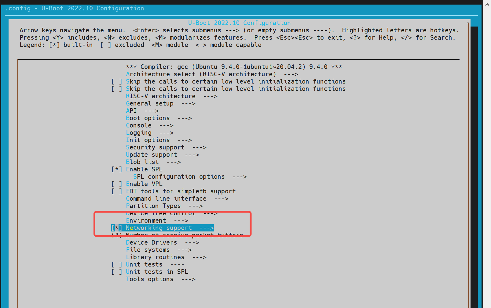
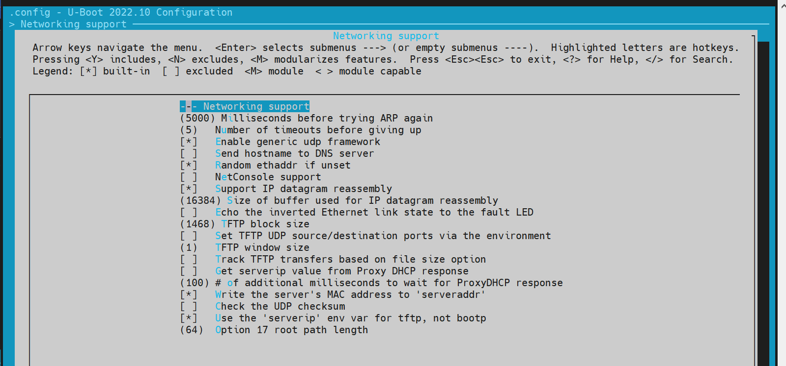
- dts Configuration
```c
//uboot - 2022.10/arch/riscv/dts/k1 - x.dtsi
         eth0: ethernet@cac80000 {
             compatible = "spacemit, k1x - emac";
             reg = <0x00000000 0xCAC80000 0x00000000 0x00000420>;
             ctrl - reg = <0x3e4>;
             dline - reg = <0x3e8>;
             clocks = <&ccu CLK_EMAC0_BUS>;
             clock - names = "emac - clk";
             resets = <&reset RESET_EMAC0>;
             reset - names = "emac - reset";
             status = "disabled";
         };
//uboot - 2022.10/arch/riscv/dts/k1 - x_deb1.dts
 &eth0 {
     status = "okay";
     pinctrl - names = "default";
     pinctrl - 0 = <&pinctrl_gmac0>;
     phy - reset - pin = <110>;
     clk_tuning_enable;
     clk - tuning - by - delayline;
     tx - phase = <90>;
     rx - phase = <73>;
     phy - mode = "rgmii";
     phy - addr = <1>;
     phy - handle = <&rgmii>;
     ref - clock - from - phy;
     mdio {
         #address - cells = <0x1>;
         #size - cells = <0x0>;
         rgmii: phy@0 {
             compatible = "ethernet - phy - id001c.c916";
             device_type = "ethernet - phy";
             reg = <0x1>;
         };
     };
 };
```
- Debugging Verification
You need to enable the compilation configuration CONFIG_CMD_NET first, connect the network cable to the network port of the development board, and prepare a tftp server (the method of setting up the tftp server can be searched online, and it is not introduced here)
```shell
=> dhcp # After executing dhcp, if an address is returned, it means that the connection to the network server is successful. In other cases, the connection fails.
ethernet@cac80000 Waiting for PHY auto negotiation to complete...... done
emac_adjust_link link:1 speed:1000 duplex:full
BOOTP broadcast 1
BOOTP broadcast 2
BOOTP broadcast 3
BOOTP broadcast 4
BOOTP broadcast 5
BOOTP broadcast 6
BOOTP broadcast 7
DHCP client bound to address 10.0.92.130 (7982 ms)
=> tftpboot 0x40000000 site11/uImage.itb
ethernet@cac80000 Waiting for PHY auto negotiation to complete...... done
emac_adjust_link link:1 speed:1000 duplex:full
Using ethernet@cac80000 device
TFTP from server 10.0.92.134; our IP address is 10.0.92.130
Filename 'site11/uImage.itb'.
Load address: 0x40000000
Loading: ##############################################################
         ########
         1.1 MiB/s
done
Bytes transferred = 66900963 (3fcd3e3 hex)
=>
# Start the kernel
=> bootm 0x40000000 
```
- Common Interfaces
Refer to the code interfaces in cmd/net.c
### spi
The spi only leads out one hardware interface, so it only supports nand or nor flash.
- config Configuration
Execute make menuconfig, enter Device Drivers, and enable the following configurations
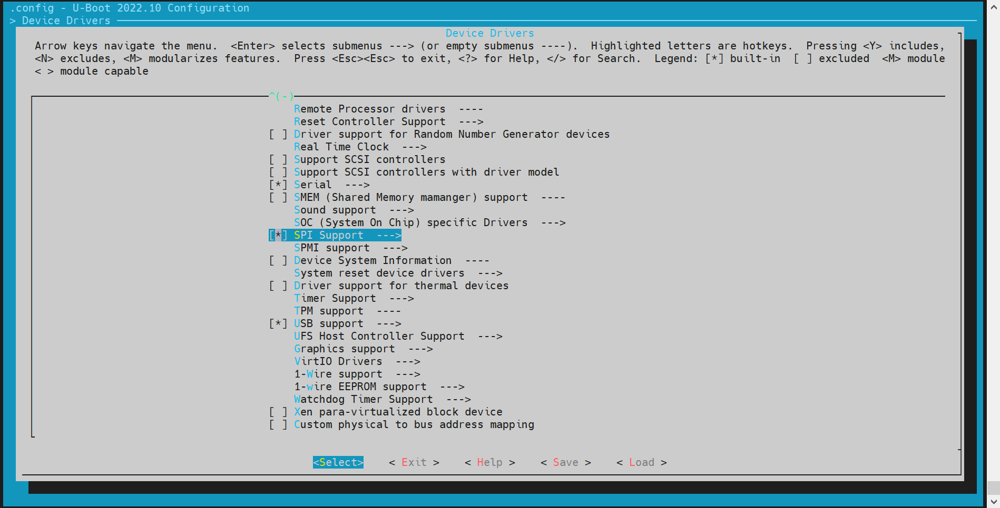

- dts Configuration
```c
//k1 - x.dtsi
/dts - v1/;
/ {
        compatible = "spacemit, k1x", "riscv";
        #address - cells = <2>;
        #size - cells = <2>;
        soc:soc {
                compatible = "simple - bus";
                #address - cells = <2>;
                #size - cells = <2>;
                ranges;
                qspi: spi@d420c000 {
                        compatible = "spacemit, k1x - qspi";
                        #address - cells = <1>;
                        #size - cells = <0>;
                        reg = <0x0 0xd420c000 0x0 0x1000>,
                              <0x0 0xb8000000 0x0 0xd00000>;
                        reg - names = "qspi - base", "qspi - mmap";
                        qspi - sfa1ad = <0xa00000>;
                        qspi - sfa2ad = <0xb00000>;
                        qspi - sfb1ad = <0xc00000>;
                        qspi - sfb2ad = <0xd00000>;
                        clocks = <&ccu CLK_QSPI>,
                                <&ccu CLK_QSPI_BUS>;
                        clock - names = "qspi_clk", "qspi_bus_clk";
                        resets = <&reset RESET_QSPI>,
                                <&reset RESET_QSPI_BUS>;
                        reset - names = "qspi_reset", "qspi_bus_reset";
                        qspi - pmuap - reg = <0xd4282860>;
                        spi - max - frequency = <26500000>;
                        qspi - id = <4>;
                        status = "disabled";
                };
        };
};
//k1 - x_deb1.dts
&qspi {
        status = "okay";
        pinctrl - names = "default";
        pinctrl - 0 = <&pinctrl_qspi>;
};
```
- Debugging Verification
Enable the configuration of the uboot shell command sspi, CONFIG_CMD_SPI,
Debugging command:
```c
sspi - h
    "SPI utility command",
    "[<bus>:]<cs>[.<mode>][@<freq>] <bit_len> <dout> - Send and receive bits\n"
    "<bus>     - Identifies the SPI bus\n"
    "<cs>      - Identifies the chip select\n"
    "<mode>    - Identifies the SPI mode to use\n"
    "<freq>    - Identifies the SPI bus frequency in Hz\n"
    "<bit_len> - Number of bits to send (base 10)\n"
    "<dout>    - Hexadecimal string that gets sent"
```
- Common Interfaces
Refer to the interfaces in cmd/spi.c
### nand
The nand driver is based on spi, so the spi driver function needs to be enabled first.
- config Configuration
Execute make menuconfig, enter Device Drivers ---> MTD Support
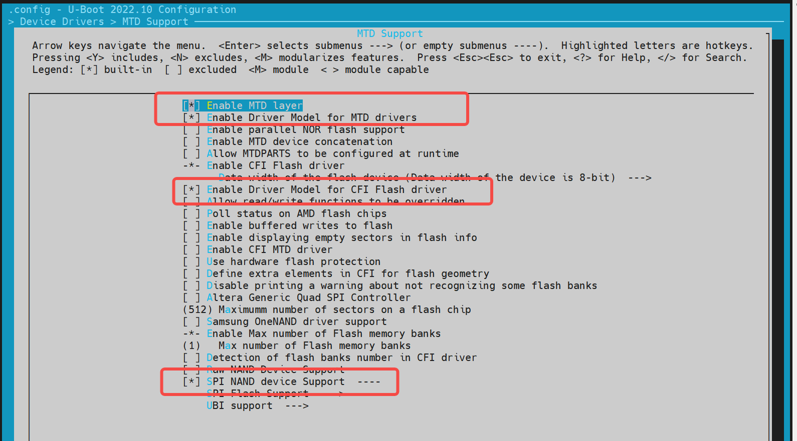
If you need to add a new nand flash, you can add the jedec id of the nand flash according to the supported manufacturer drivers.
```shell
~/uboot - 2022.10$ ls drivers/mtd/nand/spi/*.c - l
drivers/mtd/nand/spi/core.c
drivers/mtd/nand/spi/gigadevice.c
drivers/mtd/nand/spi/macronix.c
drivers/mtd/nand/spi/micron.c
drivers/mtd/nand/spi/other.c
drivers/mtd/nand/spi/toshiba.c
drivers/mtd/nand/spi/winbond.c
```
For example, to add a new flash in gigadevice
```c
//uboot - 2022.10/drivers/mtd/nand/spi/gigadevice.c
 static const struct spinand_info gigadevice_spinand_table[] = {
     SPINAND_INFO("GD5F1GQ4UExxG", 0xd1,
              NAND_MEMORG(1, 2048, 128, 64, 1024, 1, 1, 1),
              NAND_ECCREQ(8, 512),
              SPINAND_INFO_OP_VARIANTS(&gd5fxgq4_read_cache_variants,
                           &write_cache_variants,
                           &update_cache_variants),
              0,
              SPINAND_ECCINFO(&gd5fxgqxxexxg_ooblayout,
                      gd5fxgq4xexxg_ecc_get_status)),
     SPINAND_INFO("GD5F1GQ5UExxG", 0x51,
              NAND_MEMORG(1, 2048, 128, 64, 1024, 1, 1, 1),
              NAND_ECCREQ(4, 512),
              SPINAND_INFO_OP_VARIANTS(&gd5f1gq5_read_cache_variants,
                           &write_cache_variants,
                           &update_cache_variants),
              0,
              SPINAND_ECCINFO(&gd5fxgqxxexxg_ooblayout,
                      gd5fxgq5xexxg_ecc_get_status)),
 };
```
If it is a nand flash of another brand, you can refer to the driver of gigadevice to reimplement it.
- dts Configuration
The nand driver is hung under the spi driver, so the dts needs to be configured under the spi node.
```c
 &qspi {
     status = "okay";
     pinctrl - names = "default";
     pinctrl - 0 = <&pinctrl_qspi>;
     spi - nand@0 {
         compatible = "spi - nand";
         reg = <0>;
         spi - tx - bus - width = <1>;
         spi - rx - bus - width = <1>;
         spi - max - frequency = <6250000>;
         u - boot, dm - spl;
         status = "okay";
     };
 };
```
- Debugging Verification
The nand driver can be debugged based on the mtd command
```shell
=> mtd
mtd - MTD utils
Usage:
mtd - generic operations on memory technology devices
mtd list
mtd read[.raw][.oob]                  <name> <addr> [<off> [<size>]]
mtd dump[.raw][.oob]                  <name>        [<off> [<size>]]
mtd write[.raw][.oob][.dontskipff]    <name> <addr> [<off> [<size>]]
mtd erase[.dontskipbad]               <name>        [<off> [<size>]]
Specific functions:
mtd bad                               <name>
With:
        <name>: NAND partition/chip name (or corresponding DM device name or OF path)
        <addr>: user address from/to which data will be retrieved/stored
        <off>: offset in <name> in bytes (default: start of the part)
                * must be block - aligned for erase
                * must be page - aligned otherwise
        <size>: length of the operation in bytes (default: the entire device)
                * must be a multiple of a block for erase
                * must be a multiple of a page otherwise (special case: default is a page with dump)
The.dontskipff option forces writing empty pages, don't use it if unsure.
=> mtd list
[RESET]spacemit_reset_set assert = 1, id = 77
[RESET]spacemit_reset_set assert = 1, id = 78
clk qspi_bus_clk already disabled
clk qspi_clk already disabled
ccu_mix_set_rate of qspi_clk timeout
[RESET]spacemit_reset_set assert = 0, id = 77
[RESET]spacemit_reset_set assert = 0, id = 78
SF: Detected w25q32 with page size 256 Bytes, erase size 64 KiB, total 4 MiB
Could not find a valid device for spi - nand
List of MTD devices:
* nor0
  - device: flash@0
  - parent: spi@d420c000
  - driver: jedec_spi_nor
  - path: /soc/spi@d420c000/flash@0
  - type: NOR flash
  - block size: 0x10000 bytes
  - min I/O: 0x1 bytes
  - 0x000000000000 - 0x000000400000: "nor0"
          - 0x0000000a0000 - 0x000000100000: "opensbi"
          - 0x000000100000 - 0x000000300000: "uboot"
=> mtd read/write partname addr off size
```
- Common Interfaces
Refer to the code interface of cmd/mtd.c

### nor
The nor driver is based on the spi driver, so the spi driver function needs to be enabled first.
- config Configuration
Execute make menuconfig, enter Device Drivers ---> MTD Support ---> SPI Flash Support, and turn on the following configurations (they are enabled by default). The example shows how to enable the nor flash of winbond.
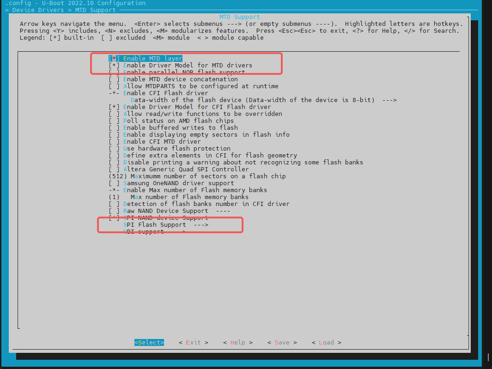
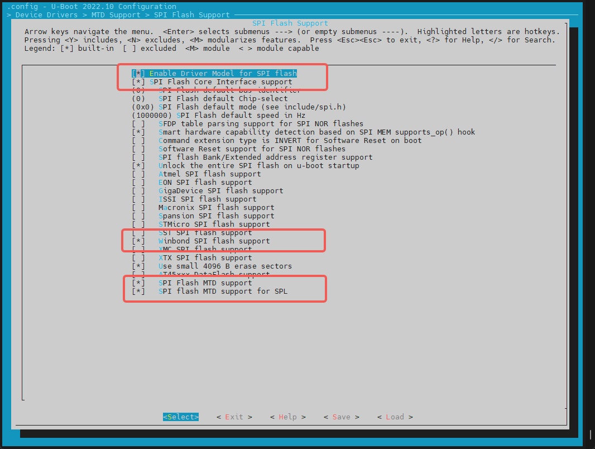
To add a new spi nor flash:
- For the manufacturer's nor flash already supported in the above figure, you can directly enable the corresponding compilation configuration, such as the flash of the gigadevice manufacturer.
- The jedec id list of the spi flash is maintained in uboot - 2022.10/drivers/mtd/spi/spi - nor - ids.c. If the specific jedec id of the nor flash is not in the list, you can add the jedec id to the list by yourself (the jedec id is the manufacturer code corresponding to the spi flash, and you can search for the keyword manufac according to the datasheet of the nor flash, such as 0xfe for winbond).
- dts Configuration
The nor driver relies on the spi driver interface. For the spi driver, please refer to the spi subsection. You need to add the dts node as follows:
```c
//k1/uboot - 2022.10/arch/riscv/dts/k1 - x_deb1.dts
 &qspi {
     status = "okay";
     pinctrl - names = "default";
     pinctrl - 0 = <&pinctrl_qspi>;
     flash@0 {
         compatible = "jedec, spi - nor";
         reg = <0>;
         spi - max - frequency = <26500000>;
         m25p, fast - read;
         broken - flash - reset;
         status = "okay";
     };
 };
```
- Debugging Verification
It can be debugged based on the mtd/sf commands of the uboot command line. The compilation configuration needs to enable CONFIG_CMD_MTD = y, CONFIG_CMD_SF
Reading and writing the nor flash based on the mtd command:
```shell
=> mtd list
List of MTD devices:
* nor0
  - device: flash@0
  - parent: spi@d420c000
  - driver: jedec_spi_nor
  - path: /soc/spi@d420c000/flash@0
  - type: NOR flash
  - block size: 0x1000 bytes
  - min I/O: 0x1 bytes
  - 0x000000000000 - 0x000000400000: "nor0"
          - 0x0000000a0000 - 0x0000000e0000: "opensbi"
          - 0x000000100000 - 0x000000200000: "uboot"
=>
=> mtd
mtd - MTD utils
Usage:
mtd - generic operations on memory technology devices
mtd list
mtd read[.raw][.oob]                  <name> <addr> [<off> [<size>]]
mtd dump[.raw][.oob]                  <name>        [<off> [<size>]]
mtd write[.raw][.oob][.dontskipff]    <name> <addr> [<off> [<size>]]
mtd erase[.dontskipbad]               <name>        [<off> [<size>]]
Specific functions:
mtd bad                               <name>
With:
        <name>: NAND partition/chip name (or corresponding DM device name or OF path)
        <addr>: user address from/to which data will be retrieved/stored
        <off>: offset in <name> in bytes (default: start of the part)
                * must be block - aligned for erase
                * must be page - aligned otherwise
        <size>: length of the operation in bytes (default: the entire device)
                * must be a multiple of a block for erase
                * must be a multiple of a page otherwise (special case: default is a page with dump)
The.dontskipff option forces writing empty pages, don't use it if unsure.
=>
=> mtd read uboot 0x40000000
Reading 1048576 byte(s) at offset 0x00000000
=> mtd dump uboot 0 0x10
Reading 16 byte(s) at offset 0x00000000
Dump 16 data bytes from 0x0:
0x00000000:     d0 0d fe ed 00 0d e8 95  00 00 00 38 00 0d e4 44
=>
```
Reading and writing the nor flash based on the sf command
```shell
=> sf
sf - SPI flash sub - system
Usage:
sf probe [[bus:]cs] [hz] [mode] - init flash device on given SPI bus
                                  and chip select
sf read addr offset|partition len       - read `len' bytes starting at
                                          `offset' or from start of mtd
                                          `partition'to memory at `addr'
sf write addr offset|partition len      - write `len' bytes from memory
                                          at `addr' to flash at `offset'
                                          or to start of mtd `partition'
sf erase offset|partition [+]len        - erase `len' bytes from `offset'
                                          or from start of mtd `partition'
                                         `+len' round up `len' to block size
sf update addr offset|partition len     - erase and write `len' bytes from memory
                                          at `addr' to flash at `offset'
                                          or to start of mtd `partition'
sf protect lock/unlock sector len       - protect/unprotect 'len' bytes starting
                                          at address 'sector'
=> sf probe
SF: Detected w25q32 with page size 256 Bytes, erase size 4 KiB, total 4 MiB
=> sf read 0x40000000 0 0x10
device 0 offset 0x0, size 0x10
SF: 16 bytes @ 0x0 Read: OK
=>
```
- Common Interfaces
```c
include <spi.h>
#include <spi_flash.h>
struct udevice *new, *bus_dev;
int ret;
static struct spi_flash *flash;
//bus,cs correspond to the bus and cs numbers of spi, such as 0, 0
ret = spi_find_bus_and_cs(bus, cs, &bus_dev, &new);
flash = spi_flash_probe(bus, cs, speed, mode);
ret = spi_flash_read(flash, offset, len, buf);
```

### hdmi
This subsection mainly introduces how to enable the hdmi driver.
- config Configuration
Execute make uboot_menuconfig, enter Device Drivers -> Graphics support, and enable the following configurations (they are enabled by default).
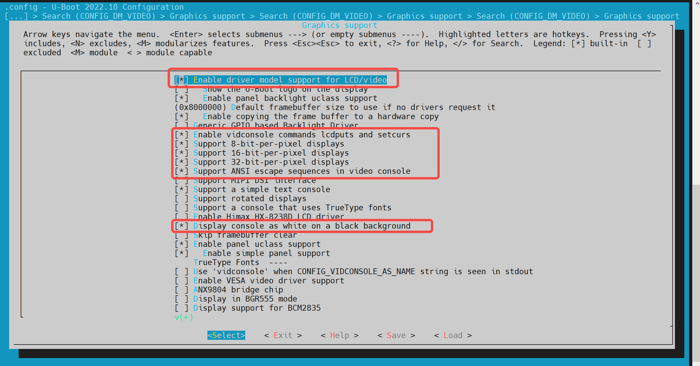
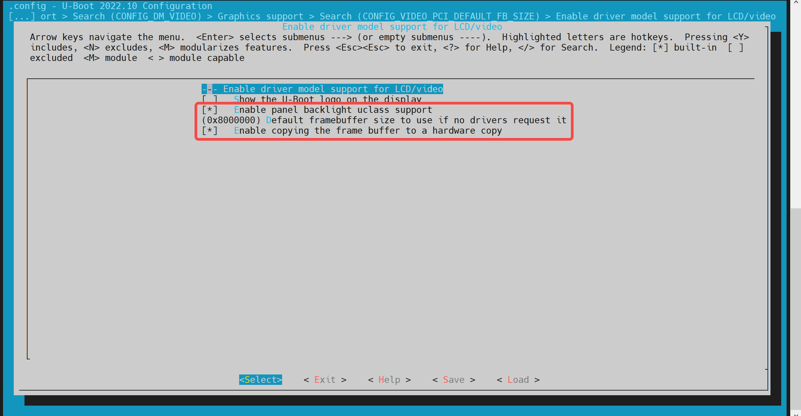
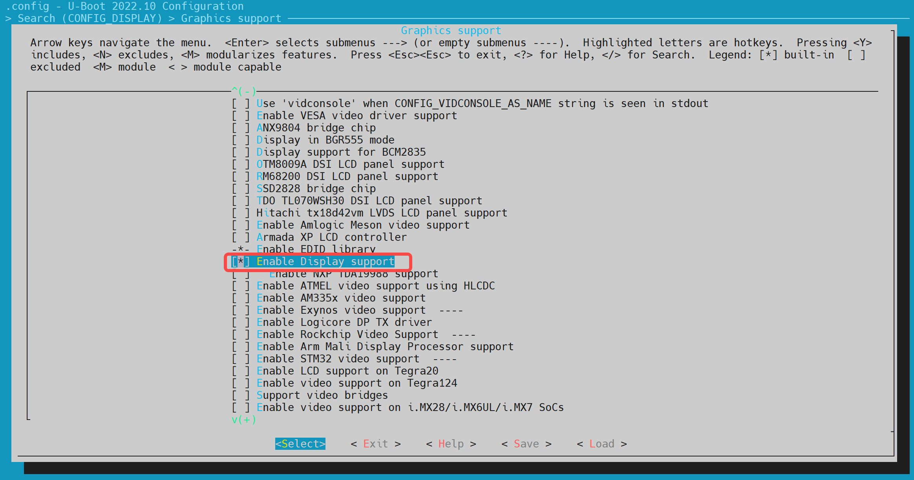
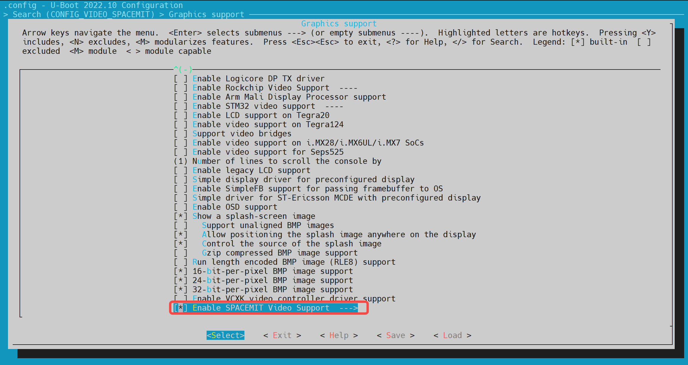
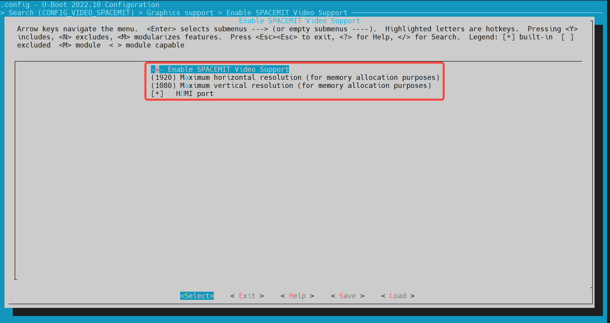
- dts Configuration
```c
&dpu {
        status = "okay";
};
&hdmi {
        pinctrl - names = "default";
        pinctrl - 0 = <&pinctrl_hdmi_0>;
        status = "okay";
};
```
### boot logo
This subsection mainly introduces how to display the bootlogo during the uboot startup stage.
- config Configuration
Execute make menuconfig and enable the following configuration.
1. First, enable the hdmi support under uboot, refer to Section 5.12.
2. Then, enable the bootlogo support under uboot, enter Device Drivers -> Graphics support, and enable the following option.
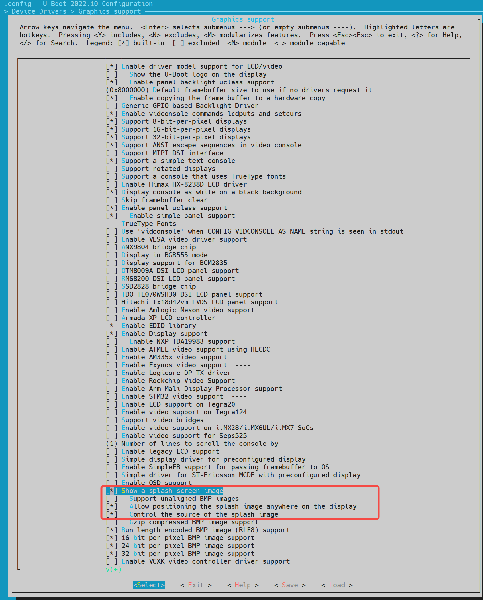
- env Configuration
In the k1 - x.h file in the uboot - 2022.10/include/configs directory, add the three env variables required for the bootlogo: splashimage, splashpos, and splashfile.
```c
//uboot - 2022.10/include/configs/k1 - x.h
   ......
   ......
 #define CONFIG_EXTRA_ENV_SETTINGS \
     "fdt_high = 0xffffffffffffffff\0" \
     "initrd_high = 0xffffffffffffffff\0" \
       ......
       ......
     "splashimage = " __stringify(CONFIG_FASTBOOT_BUF_ADDR) "\0" \
     "splashpos = m,m\0" \
     "splashfile = k1 - x.bmp\0" \
       ......
       ......
     BOOTENV_DEVICE_CONFIG \
     BOOTENV
 #endif /* __CONFIG_H */
```
Where splashimage represents the address in memory where the bootlogo image is loaded;
splashpos represents the position where the image is displayed, "m,m" represents that the image is displayed in the center of the screen;
splashfile refers to the name of the bmp file to be displayed, and this image needs to be placed in the partition where bootfs is located.
- Packaging the.bmp Image into bootfs
Package the bmp image to be displayed into bootfs:
Place the k1 - x.bmp file in the./buildroot - ext/board/spacemit/k1 directory, and the file name should be consistent with the UBOOT_LOGO_FILE in the buildroot - ext/board/spacemit/k1/prepare_img.sh and the environment variable splashfile, such as k1 - x.bmp.
After the compilation and packaging, the bmp image will be packaged into bootfs.
```shell
//buildroot - ext/board/spacemit/k1/prepare_img.sh
#!/bin/bash
######################## Prepare sub - iamges and pack ####################
#$0 is this file path
#$1 is buildroot output images dir
IMGS_DIR = $1
DEVICE_DIR = $(dirname $0)
......
UBOOT_LOGO_FILE = "$DEVICE_DIR/k1 - x.bmp"
```
- How to Modify the bootlogo
1. Directly replace the k1 - x.bmp in the buildroot - ext/board/spacemit/k1 directory, or add a new image according to the above description.
### boot menu
This subsection mainly introduces how to enable the bootmenu function of uboot.
- config Configuration
Execute make menuconfig, enter Command line interface > Boot commands, and enable the following configuration
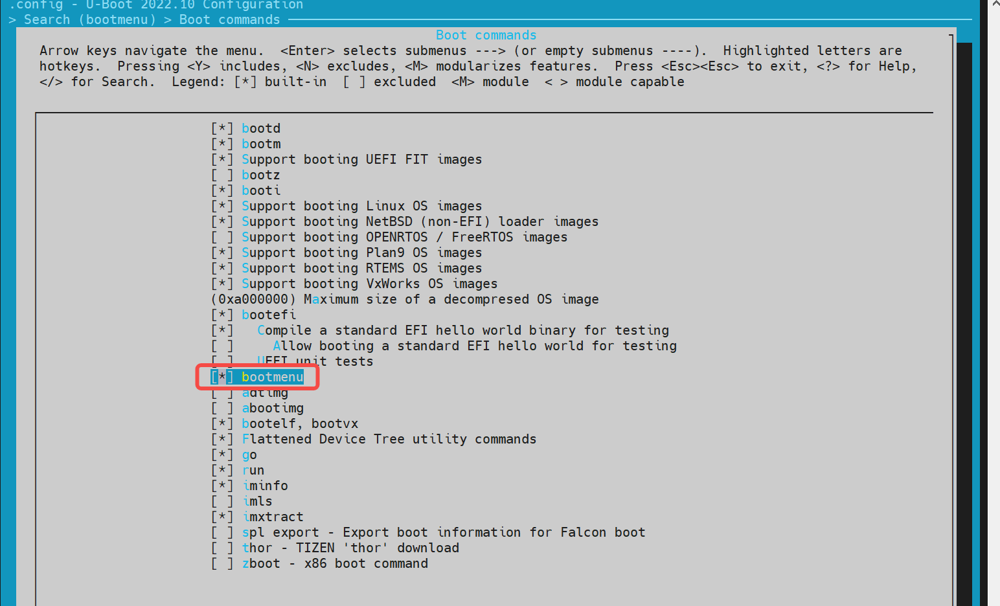
Then enter Boot options > Autoboot options and enable the following option
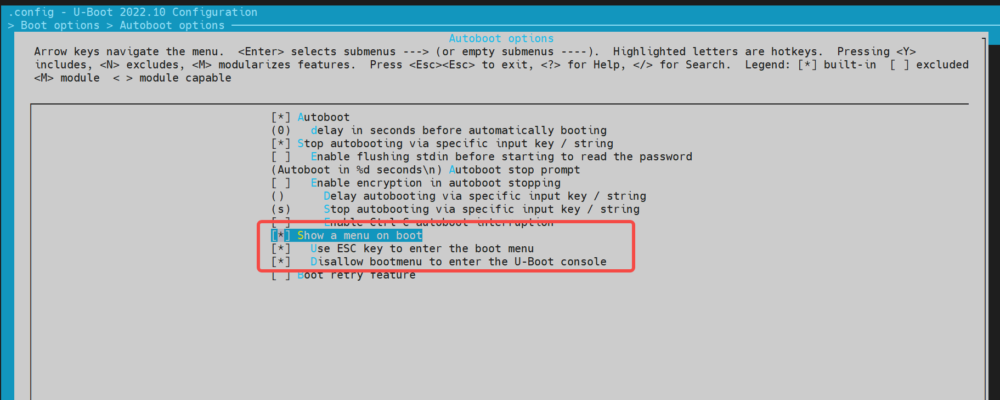
- env Configuration
In the buildroot - ext/board/spacemit/k1/env_k1 - x.txt, you need to add bootdelay and bootmenu_delay, for example, bootdelay = 5, bootmenu_delay = 5, where 5 represents the waiting time for the bootmenu, in seconds.
```c
//buildroot - ext/board/spacemit/k1/env_k1 - x.txt
bootdelay = 5
# Boot menu definitions
boot_default = echo "Current Boot Device: ${boot_device}"
flash_default = echo "Returning to Boot Menu..."
spacemit_flashing_usb = echo "recovery from usb...... "; \
                      spacemit_flashing usb;
spacemit_flashing_mmc = echo "recovery from mmc...... " \
                      spacemit_flashing mmc;
spacemit_flashing_net = echo "recovery from net...... " \
                      spacemit_flashing net;
bootmenu_delay = 5
bootmenu_0 = "-------- Boot Options --------" = run boot_default
bootmenu_1 = "Boot from Nor" = run nor_boot
bootmenu_2 = "Boot from Nand" = run nand_boot
bootmenu_3 = "Boot from MMC" = run try_mmc
bootmenu_4 = "Autoboot" = run autoboot
bootmenu_5 = "Show current Boot Device" = run boot_default
bootmenu_6 = "-------- Flash Options --------" = run flash_default
bootmenu_7 = "recovery from usb" = run spacemit_flashing_usb
bootmenu_8 = "recovery from mmc" = run spacemit_flashing_mmc
bootmenu_9 = "recovery from net" = run spacemit_flashing_net
```
- Entering the bootmenu
Press and hold the Esc key on the keyboard after powering on to enter the bootmenu.
### fastboot command
This subsection mainly introduces the fastboot commands supported by the k1 - deb1 solution.
- Compilation Configuration
Execute make menuconfig, enter Device Drivers ---> Fastboot support, and enable the following compilation configuration
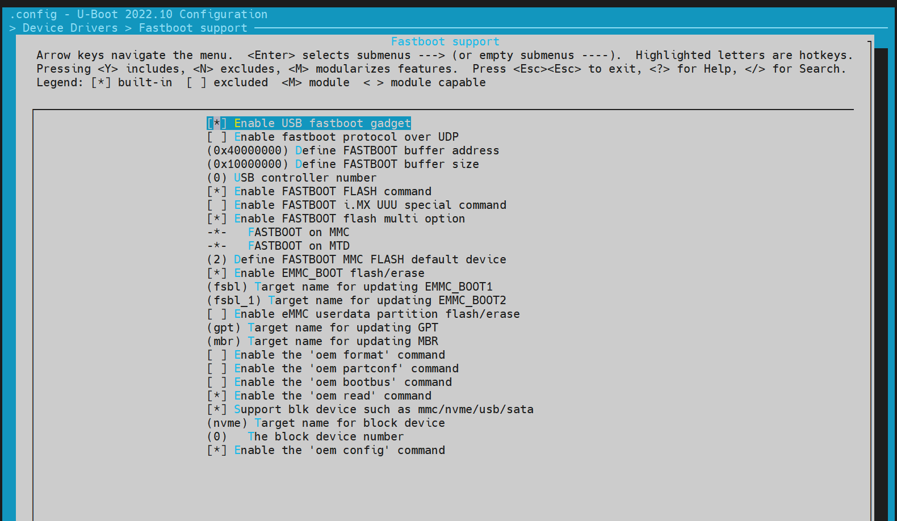
fastboot relies on the usb driver, and the configuration of USB support needs to be enabled for usb.
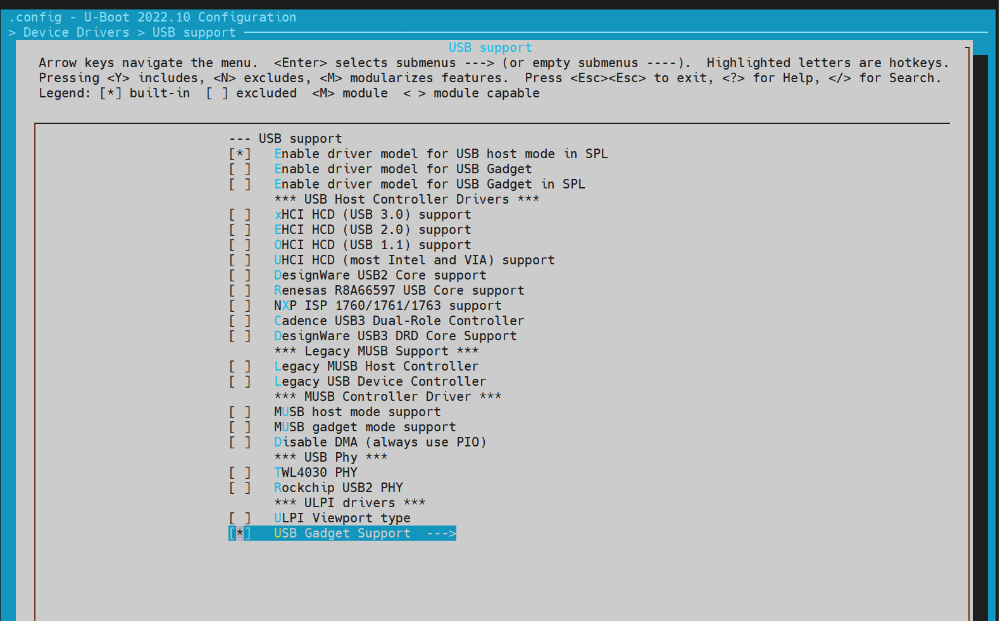
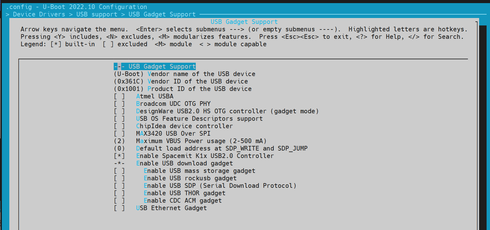
- Entering the fastboot mode
1. You can enter the uboot shell by pressing the "s" key after the system starts, and execute fastboot 0 to enter the fastboot mode.
The default fastboot buffer addr/size of the system is defined by the macros CONFIG_FASTBOOT_BUF_ADDR/CONFIG_FASTBOOT_BUF_SIZE
```shell
# Or fastboot - l 0x30000000 - s 0x10000000 0, specifying the buff addr/size
=> fastboot 0
k1xci_udc: phy_init
k1xci_udc probe
k1xci_udc: pullup 1
-- suspend --
handle setup GET_DESCRIPTOR, 0x80, 0x6 index 0x0 value 0x100 length 0x40
handle setup SET_ADDRESS, 0x0, 0x5 index 0x0 value 0x22 length 0x0
handle setup GET_DESCRIPTOR, 0x80, 0x6 index 0x0 value 0x100 length 0x12
..
```
1. After the device boots into the bianbu os, send the command adb reboot bootloader, and the system will restart and enter the fastboot mode.
- Supported fastboot commands
For the configuration of the fastboot environment on the computer side, please refer to the Computer Environment Installation section.
```shell
# Native protocol commands of fastboot
fastboot devices              # Display available devices
fastboot reboot               # Reboot the device
fastboot getvar [version/product/serialno/max - download - size]
fastboot flash partname image # Burn the image to the partname partition
fastboot erase partname       # Erase the partname partition
fastboot stage file           # Download the file file to the buff addr in memory
# Custom commands and functions of the oem manufacturer
fastboot getvar [mtd - size/blk - size] # Get the size of the mtd/blk device, and return NULL if not available
fastboot oem read part              # Read the data in part to the buff addr
fastboot get_staged file       # Upload the data and name it file. Depends on the oem read part command
```
### File System
- fat
```shell
=> fat
  fatinfo fatload fatls fatmkdir fatrm fatsize fatwrite
=> fatls mmc 2:5
 50896911   uImage.itb
     4671   env_k1 - x.txt
2 file(s), 0 dir(s)
=> fatload mmc 2:5 0x40000000 uImage.itb # Load uImage.itb to 0x40000000
50896911 bytes read in 339 ms (143.2 MiB/s)
=>
```
- ext4
Similar to the fat command
```shell
=> ext4
  ext4load ext4ls ext4size
=> ext4load
ext4load - load binary file from a Ext4 filesystem
Usage:
ext4load <interface> [<dev[:part]> [addr [filename [bytes [pos]]]]]
    - load binary file 'filename' from 'dev' on 'interface'
      to address 'addr' from ext4 filesystem
=>
```

### Other shell commands
Common commands, common tools
```shell
printenv - print environment variables
md - memory display
mw - memory write (fill)
fdt - flattened device tree utility commands
help - print command description/usage
```
- fdt
The fdt command is mainly used to print the content of the dts, such as the dtb file currently loaded after uboot starts.
```shell
=> fdt
fdt - flattened device tree utility commands
Usage:
fdt addr [-c] [-q] <addr> [<size>]  - Set the [control] fdt location to <addr>
fdt move   <fdt> <newaddr> <length> - Copy the fdt to <addr> and make it active
fdt resize [<extrasize>]            - Resize fdt to size + padding to 4k addr + some optional <extrasize> if needed
fdt print  <path> [<prop>]          - Recursive print starting at <path>
fdt list   <path> [<prop>]          - Print one level starting at <path>
fdt get value <var> <path> <prop> [<index>] - Get <property> and store in <var>
                                      In case of stringlist property, use optional <index>
                                      to select string within the stringlist. Default is 0.
fdt get name <var> <path> <index>   - Get name of node <index> and store in <var>
fdt get addr <var> <path> <prop>    - Get start address of <property> and store in <var>
fdt get size <var> <path> [<prop>]  - Get size of [<property>] or num nodes and store in <var>
fdt set    <path> <prop> [<val>]    - Set <property> [to <val>]
fdt mknode <path> <node>            - Create a new node after <path>
fdt rm     <path> [<prop>]          - Delete the node or <property>
fdt header [get <var> <member>]     - Display header info
                                      get - get header member <member> and store it in <var>
fdt bootcpu <id>                    - Set boot cpuid
fdt memory <addr> <size>            - Add/Update memory node
fdt rsvmem print                    - Show current mem reserves
fdt rsvmem add <addr> <size>        - Add a mem reserve
fdt rsvmem delete <index>           - Delete a mem reserves
fdt chosen [<start> <size>]         - Add/update the /chosen branch in the tree
                                        <start>/<size> - initrd start addr/size
NOTE: Dereference aliases by omitting the leading '/', e.g. fdt print ethernet0.
=>
=> fdt addr $fdtcontroladdr
=> fdt print
/ {
        compatible = "spacemit, k1x", "riscv";
        #address - cells = <0x00000002>;
        #size - cells = <0x00000002>;
        model = "spacemit k1 - x deb1 board";
......
        memory@0 {
                device_type = "memory";
                reg = <0x00000000 0x00000000 0x00000000 0x80000000>;
        };
        chosen {
                bootargs = "earlycon = sbi console = ttyS0, 115200 debug loglevel = 8, initcall_debug = 1 rdinit = /init.tmp";
                stdout - path = "serial0:115200n8";
        };
};
=> fdt print /chosen
chosen {
        bootargs = "earlycon = sbi console = ttyS0, 115200 debug loglevel = 8, initcall_debug = 1 rdinit = /init.tmp";
        stdout - path = "serial0:115200n8";
};
=>
```
- shell commands
uboot supports shell - style commands, such as if/fi, echo, etc.
```shell
=> if test ${boot_device} = nand; then echo "nand boot"; else echo "not nand boot"; fi
not nand boot
=> printenv boot_device
boot_device = nor
=> if test ${boot_device} = nor; then echo "nor boot"; else echo "not nor boot"; fi
nor boot
=>
```
## opensbi Function and Configuration
### opensbi Compilation
```shell
cd ~/opensbi/
# Note that the compilation toolchain here needs to be provided by spacemit, and using a non - spacemit - provided toolchain may cause compilation exceptions.
GCC_PREFIX = riscv64 - unknown - linux - gnu -
CROSS_COMPILE = ${GCC_PREFIX} PLATFORM = generic \
PLATFORM_DEFCONFIG = k1 - x_deb1_defconfig \
PLATFORM_RISCV_ISA = rv64gc \
FW_TEXT_START = 0x0 \
make
```
### Generated Compilation Files
```shell
~/opensbi$ ls build/platform/generic/firmware/ - l
fw_dynamic.bin     # The dynamic image for jumping will transfer configuration parameters
fw_dynamic.elf
fw_dynamic.elf.dep
fw_dynamic.itb     # Pack fw_dynamic.bin into the fit format
fw_dynamic.its
fw_dynamic.o
fw_jump.bin       # The jump image is only for jumping
fw_payload.bin    # The payload image will contain the uboot image
```
### opensbi Function Configuration
You can enable or disable certain functions by executing menuconfig.
```shell
make PLATFORM = generic PLATFORM_DEFCONFIG = k1 - x_deb1_defconfig menuconfig
```
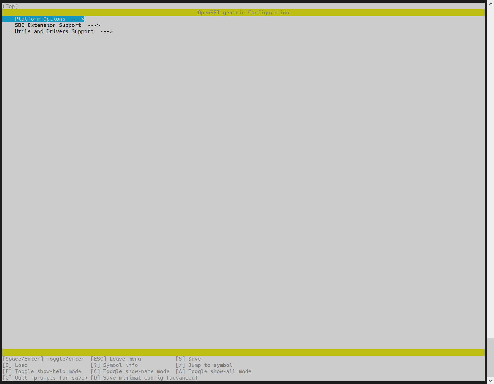
### Burning the opensbi Image
For a device that has started normally, you can burn the opensbi image separately based on fastboot.
```shell
# The device enters the uboot shell by entering adb reboot bootloader or pressing and holding the keyboard "s" after powering on.
# In the uboot shell, enter fastboot 0.
# After entering the fastboot mode, you can burn the image using the fastboot tool.
# Tool - side command
# Burn the opensbi image
fastboot flash opensbi ~/opensbi/fw_dynamic.itb
```
## Boot Settings
This subsection introduces the configuration methods for different storage media. For the boot process of all storage media, the startup flow after the board is powered on is as shown in the following figure:
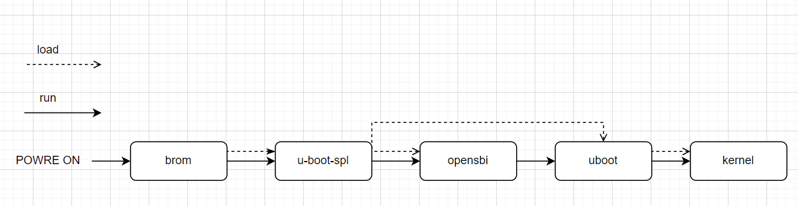
According to the boot pin select of the hardware, the software will select the driver medium of the corresponding storage medium to boot the next - level image. The specific boot pin select is introduced in the flashing chapter.
After K1 is powered on, it will first try to boot from sd, and then load the uboot and opensbi images from the emmc, nand, nor, or other storage media according to the boot pin select.
The following subsections will introduce the configuration of the spl and uboot stages, including the partition table configuration, menuconfig configuration, dts, etc.
For the partition table configuration, the mtd storage media (nand/nor flash) will be represented by the form of partition_2M.json and other capacities, and the blk devices will be named partition_universal.json. The partition table is stored in buildroot - ext/board/spacemit/k1/flash_config/partition_xxx.json.
Note:
1. The partition table is written in json format, and the definitions of all partitions are in the partitions list.
2. The name/size of each partition is a required option. offset/image is optional. If there is no offset, the sum of the sizes of all previous partitions will be used as the offset. If there is no image, the partition will not be burned but will be retained.
3. The bootinfo partition is a required option and cannot be changed. Its main function is to guide brom to load the FSBL.bin image.
4. The fsbl is a required option, and the offset address is specified by bootinfo, and a backup partition fsbl_1 can be added. FSBL.bin is composed of u - boot - spl.bin plus address information and other header information.
5. The env partition is related to the loading of uboot's env.

### sd Boot Configuration
By default, it will try to boot from sd, and if it fails, it will try other media. Ensure that the mmc driver configuration is enabled in uboot. For specific mmc driver configurations, refer to the mmc section in the uboot driver development and debugging chapter.
- Partition Table Configuration
The partition table is stored in buildroot - ext/board/spacemit/k1/partition_universal.json. Among them, bootinfo is not an explicit partition and is used to store information related to the boot medium.
```json
  "version": "1.0",
  "format": "gpt",
  "partitions": [
    {
      "name": "bootinfo",
      "offset": "0",
      "size": "80B",
      "image": "factory/bootinfo_sd.bin"
    },
    {
      "name": "fsbl",
      "offset": "256K",
      "size": "256K",
      "image": "factory/FSBL.bin"
    },
    {
      "name": "env",
      "offset": "512K",
      "size": "128K"
    },
    {
      "name": "opensbi",
      "offset": "1M",
      "size": "1M",
      "image": "opensbi.itb"
    },
    {
      "name": "uboot",
      "offset": "2M",
      "size": "2M",
      "image": "u - boot.itb"
    },
    {
      "name": "bootfs",
      "offset": "4M",
      "size": "128M",
      "image": "bootfs.img"
    },
    {
      "name": "rootfs",
      "size": "-"
    }
  ]
```
- spl Configuration
Execute make uboot_menuconfig and select SPL configuration options

Enable MMC Raw mode: by partition, Support MMC (Enter Y on the keyboard to select, N to cancel)
Partition to use to load U - Boot from indicates from which partition to load the next - level boot image, which needs to be determined according to the partition table.
The K1 solution defaults to loading opensbi and uboot independently, and loads the image files from the opensbi and uboot partitions of mmc respectively.
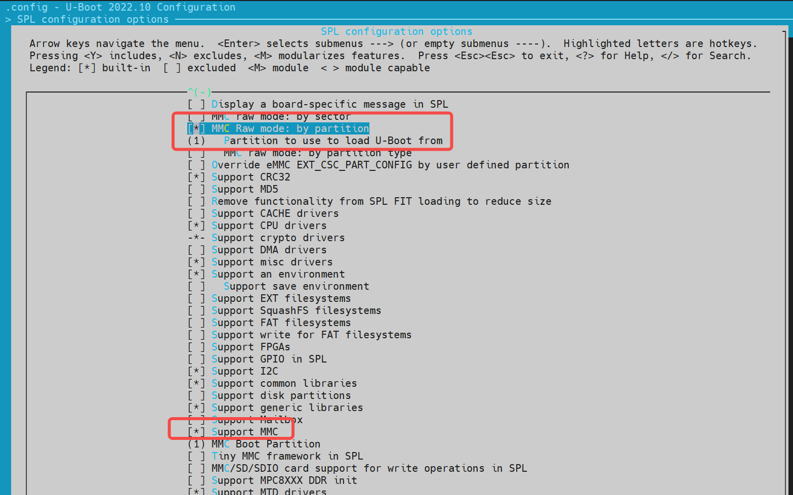
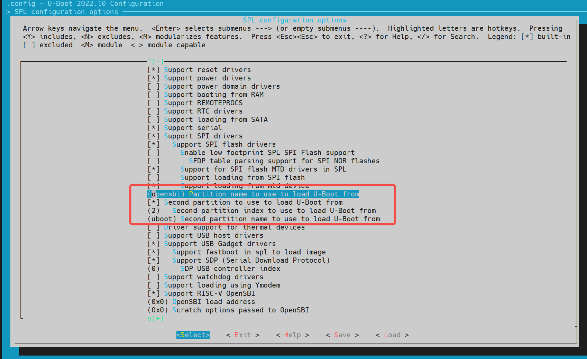
Note:
If separate loading and booting of opensbi/uboot is supported, enable Support loading from mtd device. The first partition must be opensbi, followed by uboot. spl will first load the image according to the partition table, and if the loading fails, it will load the image according to the partition number.
The partition name and partition number positions should be consistent with the partition table.
- spl - dts Configuration
The dts of spl needs to enable the mmc driver, as shown in the following dts configuration
```c
//uboot - 2022.10/arch/riscv/dts/k1 - x_spl.dts
        /* eMMC */
        sdh@d4281000 {
                bus - width = <8>;
                non - removable;
                mmc - hs400 - 1_8v;
                mmc - hs400 - enhanced - strobe;
                sdh - phy - module = <1>;
                status = "okay";
                u - boot, dm - spl;
        };
```
### emmc Boot Configuration
Both emmc and sd use the mmc driver, and in the code flow of uboot, emmc or sd will be selected based on the boot pin select during startup.
The boot configuration is the same as the sd boot configuration.
### nor + ssd Boot Configuration
For nor medium boot, k1 will provide nor (u - boot - spl/uboot/opensbi) + ssd (bootfs/rootfs) or pure nor (u - boot - spl/uboot/opensbi/kernel) boot. The following will introduce the nor + ssd boot scheme configuration.
Ensure that the driver configurations for nor, spi, nvme, etc. are all enabled normally.
- Partition Table Configuration
Nor partition table, such as buildroot - ext/board/spacemit/k1/partition_4M.json. For nand/nor devices, the partition tables are named partiton_xM.json and need to be renamed according to the actual flash capacity, otherwise it will lead to the failure to find the corresponding partition table during flashing.
Nor flash partition table modification:
1. The partition start address and size are aligned by default to 64KB (corresponding to an erasesize of 64KB).
2. If the start address and size need to be changed to 4KB alignment, enable the compilation configuration "CONFIG_SPI_FLASH_USE_4K_SECTORS" in uboot.
```json
//buildroot - ext/board/spacemit/k1/partition_4M.json
  "version": "1.0",
  "format": "mtd",
  "partitions": [
    {
      "name": "bootinfo",
      "offset": "0",
      "size": "64K",
      "image": "factory/bootinfo_spinor.bin"
    },
    {
      "name": "fsbl",
      "offset": "64K",
      "size": "256K",
      "image": "factory/FSBL.bin"
    },
    {
      "name": "env",
      "offset": "512K",
      "size": "128K",
      "image": "env.bin"
    },
    {
      "name": "opensbi",
      "offset": "640K",
      "size": "384K",
      "image": "opensbi.itb"
    },
    {
      "name": "uboot",
      "offset": "1M",
      "size": "1M",
      "image": "u - boot.itb"
    }
  ]
```
ssd partition table. For the partition tables of blk devices, they are all partition_universal.json. At this time, the partitions such as bootinfo, fsbl, env, opensbi, uboot, and the data inside them will not affect the normal boot.
```json
//buildroot - ext/board/spacemit/k1/partition_universal.json
  "version": "1.0",
  "format": "gpt",
  "partitions": [
    {
      "name": "bootinfo",
      "offset": "0",
      "size": "80B",
      "image": "factory/bootinfo_sd.bin"
    },
    {
      "name": "fsbl",
      "offset": "256K",
      "size": "256K",
      "image": "factory/FSBL.bin"
    },
    {
      "name": "env",
      "offset": "512K",
      "size": "128K"
    },
    {
      "name": "opensbi",
      "offset": "1M",
      "size": "1M",
      "image": "opensbi.itb"
    },
    {
      "name": "uboot",
      "offset": "2M",
      "size": "2M",
      "image": "u - boot.itb"
    },
    {
      "name": "bootfs",
      "offset": "4M",
      "size": "128M",
      "image": "bootfs.img"
    },
    {
      "name": "rootfs",
      "size": "-"
    }
  ]
```
- spl Configuration
Execute make uboot_menuconfig, select SPL configuration options

Enable "Support MTD drivers", "Support SPI DM drivers in SPL", "Support SPI drivers", "Support SPI flash drivers", "Support for SPI flash MTD drivers in SPL", "Support loading from mtd device",
"Partition name to use to load U - Boot from" should be consistent with the partition name in the partition table.
If separate images of opensbi/uboot are enabled, enable "Second partition to use to load U - Boot from", and the opensbi/uboot partitions must be in the order of first/second.
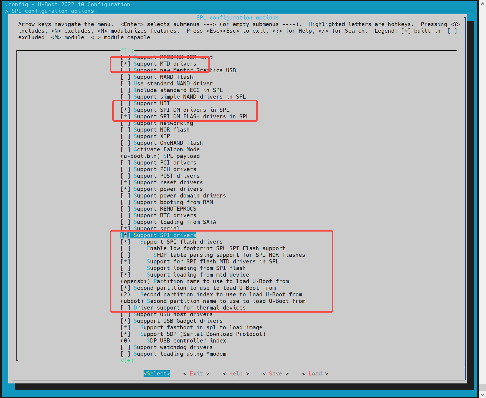
For mtd devices, enable env to ensure that after spl starts, it can obtain mtd partition information from env.
Execute make uboot_menuconfig, select Environment, and select to enable the env loading of spi. The env offset address here needs to be consistent with the env partition in the partition table, such as 0x80000.
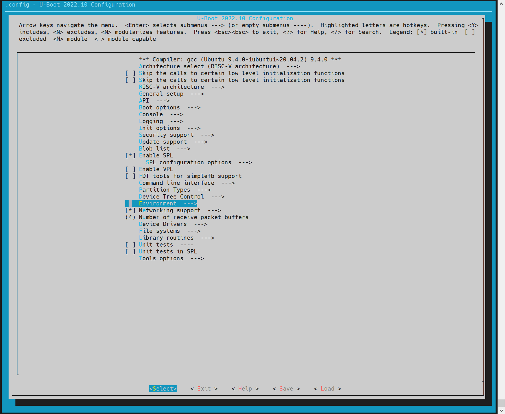
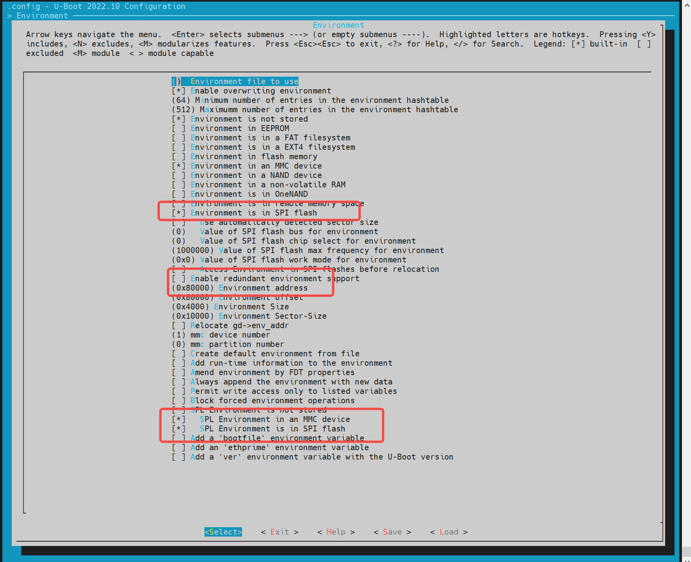
The spi flash driver needs to adapt to the corresponding manufacturer's model of the spi flash on the hardware. Select the corresponding driver program for the hardware's spi flash in menuconfig.
Execute make uboot_menuconfig, select Device Drivers ---> MTD Support ---> SPI Flash Support
According to the spi flash manufacturer of the hardware, select the corresponding driver.
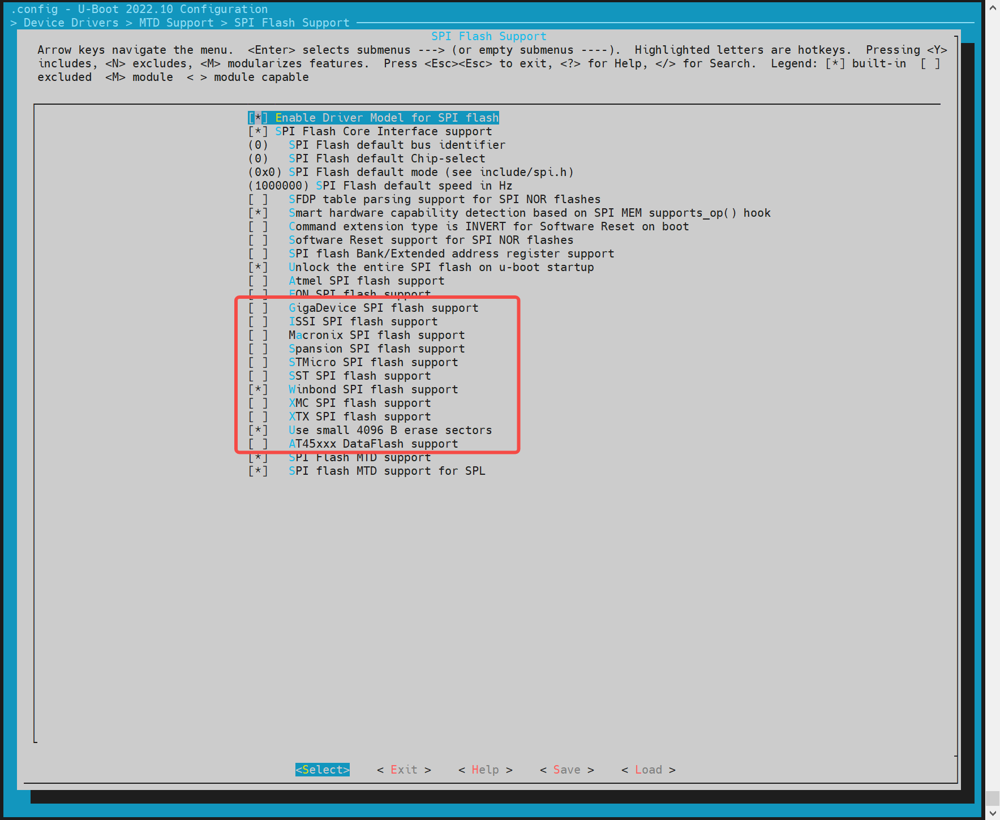
If there is no corresponding driver, you can directly add it in the code. The flash_name can be customized, usually the name of the hardware flash, 0x1f4501 is the jedecid of the flash, and other parameters can be added according to the flash of the hardware.
```c
//uboot - 2022.10/drivers/mtd/spi/spi - nor - ids.c
const struct flash_info spi_nor_ids[] = {
     { INFO("flash_name",    0x1f4501, 0, 64 * 1024,  16, SECT_4K) },
```
- blk Device Configuration
Execute make uboot_menuconfig, select Device Drivers ---> Fastboot support
Select Support blk device, here it supports blk devices such as ssd/emmc, such as nvme for ssd and mmc for emmc.
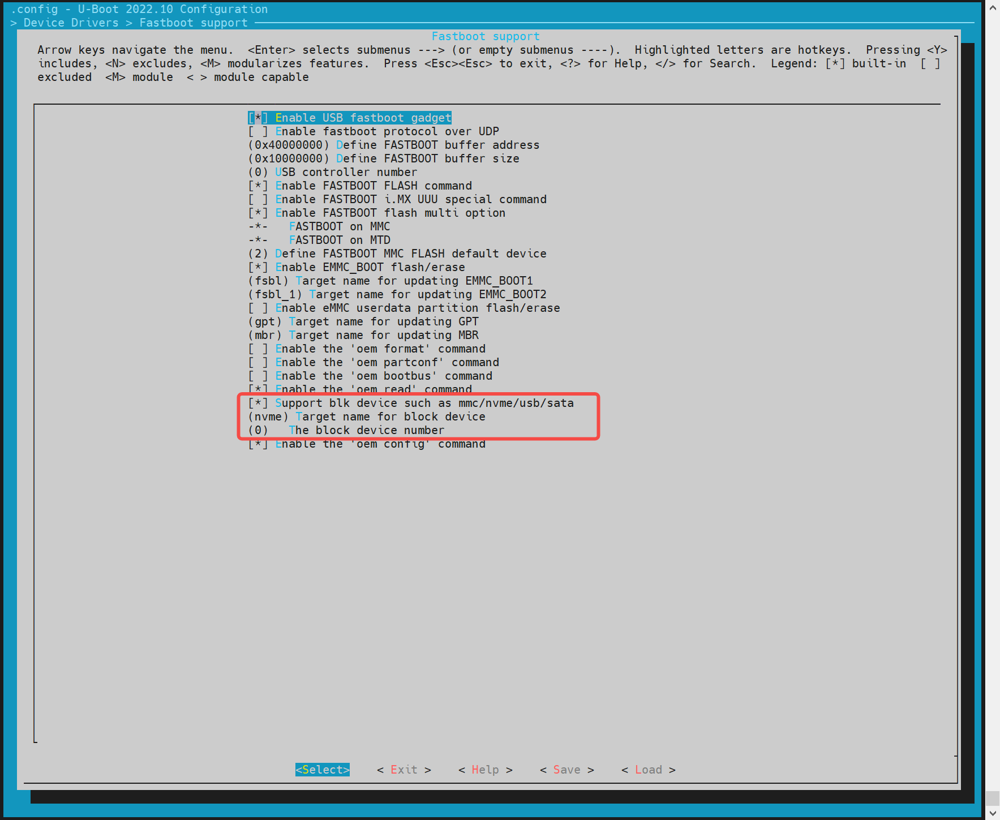
- spl - dts Configuration
```c
//uboot - 2022.10/arch/riscv/dts/k1 - x_spl.dts
        spi@d420c000 {
                status = "okay";
                pinctrl - names = "default";
                pinctrl - 0 = <&pinctrl_qspi>;
                u - boot, dm - spl;
                spi - max - frequency = <15140000>;
                flash@0 {
                        compatible = "jedec, spi - nor";
                        reg = <0>;
                        spi - max - frequency = <26500000>;
                        m25p, fast - read;
                        broken - flash - reset;
                        u - boot, dm - spl;
                        status = "okay";
                };
        };
```

### nand Boot Configuration
For nand medium boot, K1 will provide nand (u - boot - spl/uboot/opensbi) + ssd (bootfs/rootfs) or pure nand (u - boot - spl/uboot/opensbi/kernel) boot. The following will introduce the configuration of the pure nand boot scheme.
Ensure that the nand and spi drivers are configured properly.
- Partition Table Configuration
For a 256MB nand, the partition table is partition_256M.json
```json
//buildroot - ext/board/spacemit/k1/partition_256M.json
  "version": "1.0",
  "format": "mtd",
  "partitions": [
    {
      "name": "bootinfo",
      "offset": "0",
      "size": "128K",
      "image": "factory/bootinfo_spinand.bin"
    },
    {
      "name": "fsbl",
      "offset": "256K",
      "size": "256K",
      "image": "factory/FSBL.bin"
    },
    {
      "name": "env",
      "offset": "512K",
      "size": "128K"
    },
    {
      "name": "opensbi",
      "offset": "640K",
      "size": "384K",
      "image": "opensbi.itb"
    },
    {
      "name": "uboot",
      "offset": "1M",
      "size": "1M",
      "image": "u - boot.itb"
    },
    {
      "name": "user",
      "offset": "2M",
      "size": "-",
      "volume_images": {"bootfs": "bootfs.img", "rootfs": "rootfs.img"}
    }
  ]
```
- spl Configuration
Execute make uboot_menuconfig and select SPL configuration options
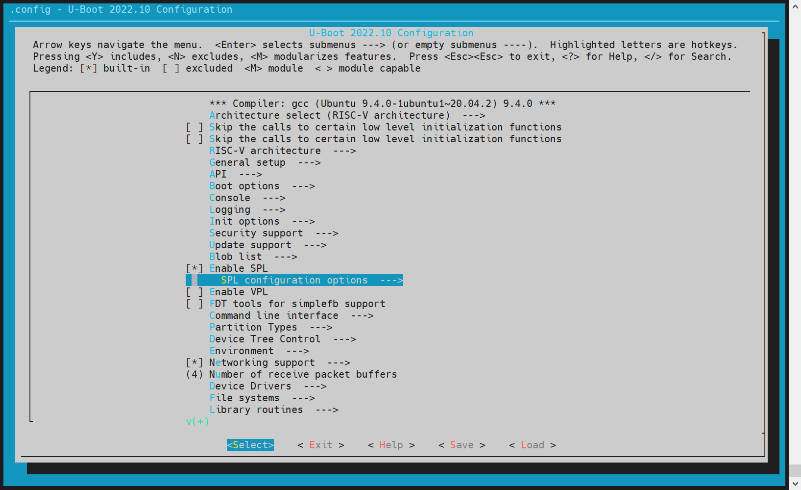
Enable
Support MTD drivers
Support SPI DM drivers in SPL
Support SPI drivers
Use standard NAND driver
Support simple NAND drivers in SPL
Support loading from mtd device,
Partition name to use to load U - Boot from should be consistent with the partition name in the partition table.
If separate images of opensbi/uboot are enabled, enable Second partition to use to load U - Boot from, and the order of opensbi/uboot must be maintained.
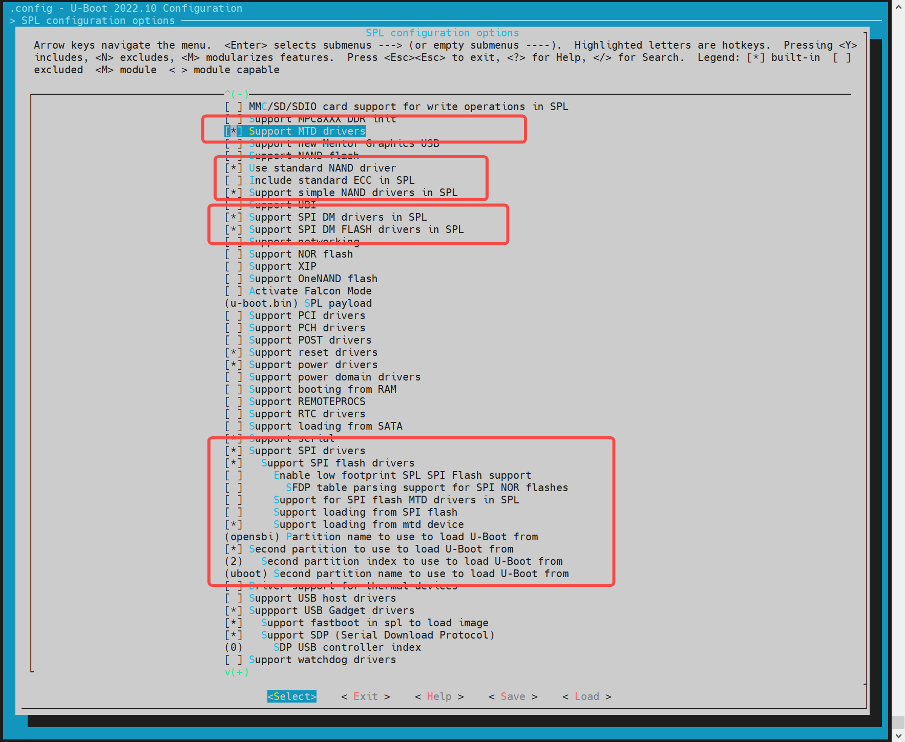
For mtd devices, enable env to ensure that after spl starts, it can obtain mtd partition information from env.
Execute make uboot_menuconfig, select Environment, and select to enable the env loading of spi. The env offset address here needs to be consistent with the env partition in the partition table, such as 0x80000.
The nand flash driver needs to adapt to the corresponding manufacturer's model of the spi flash on the hardware. Currently supported nand flashes are shown in the following drivers. If there is no corresponding driver, you can add the manufacturer's jedecid in the other.c driver.
```c
~/uboot - 2022.10$ ls drivers/mtd/nand/spi/*.c
uboot - 2022.10/drivers/mtd/nand/spi/core.c
uboot - 2022.10/drivers/mtd/nand/spi/micron.c
uboot - 2022.10/drivers/mtd/nand/spi/winbond.c
uboot - 2022.10/drivers/mtd/nand/spi/gigadevice.c
uboot - 2022.10/drivers/mtd/nand/spi/other.c
uboot - 2022.10/drivers/mtd/nand/spi/macronix.c
uboot - 2022.10/drivers/mtd/nand/spi/toshiba.c
//uboot - 2022.10/drivers/mtd/nand/spi/other.c
 static int other_spinand_detect(struct spinand_device *spinand)
 {
     u8 *id = spinand -> id.data;
     int ret = 0;
     /*
      * dosilicon nand flash
      */
     if (id[1] == 0xe5)
        ret = spinand_match_and_init(spinand, dosilicon_spinand_table,
                     ARRAY_SIZE(dosilicon_spinand_table),
                     id[2]);
     /* FORESEE nand flash */
     if (id[1] == 0xcd)
        ret = spinand_match_and_init(spinand, foresee_spinand_table,
                     ARRAY_SIZE(foresee_spinand_table),
                     id[2]);
     if (ret)
         return ret;
     return 1;
 }
```
- spl - dts Configuration
```c
//uboot - 2022.10/arch/riscv/dts/k1 - x_spl.dts
        spi@d420c000 {
                status = "okay";
                pinctrl - names = "default";
                pinctrl - 0 = <&pinctrl_qspi>;
                u - boot, dm - spl;
                spi - max - frequency = <15140000>;
                spi - nand@0 {
                       compatible = "spi - nand";
                       reg = <0>;
                       spi - tx - bus - width = <1>;
                       spi - rx - bus - width = <1>;
                       spi - max - frequency = <6250000>;
                       u - boot, dm - spl;
                       status = "okay";
               };
        };
```