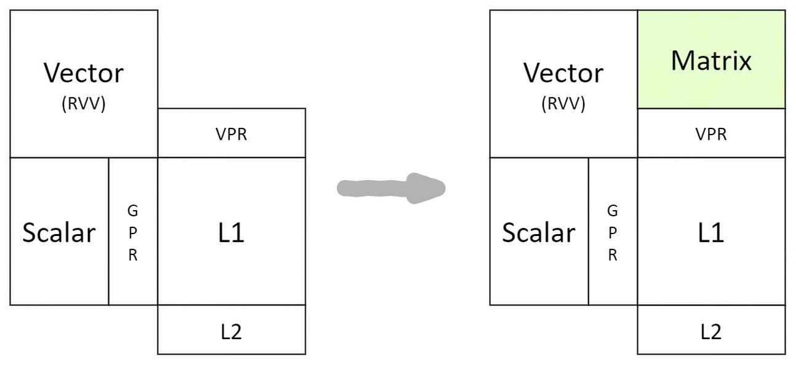

# 架构

## 设计理念

### 概述
为了保证 AI 算力的通用性和易用性，进迭时空基于自身 CPU 核的研发能力，以标准 RISC - V 核为基础，通过扩展 AI 指令的方式，打造了带有 AI 融合算力的 CPU。我们把这种具有完整 CPU 功能和强大 AI 算力的融合处理器，命名为智算核。完整的 CPU 功能保证了 AI 算力的通用性及易用性，让智算核可以非常便捷的接入开源生态；强大的 AI 算力可以给 AI 应用带来 10 倍以上的性能提升。

并且，我们遵循 RISCV 社区 IME group 的理念，复用 Vector 寄存器资源进行 AI 计算，以极小的硬件代价就为智算核注入澎湃的 AI 算力。

### 算力构成
在 AI 计算中，会用到 Scalar 算力，Vector 算力及 Matrix 算力。我们最大限度的遵循 RISC - V 社区标准，仅对 matrix 算力进行了指令扩展。




智算核（单 core）算力构成详细描述如下：
- **Scalar 算力**，采用 RISC - V 64GCB 标准指令；
- **Vector 算力**，采用 RISC - V Vector 1.0 标准指令；
- **Matrix 算力**，以专用加速指令的方式提供，采用 RISC - V custom - 1 的编码空间，操作数和结果保存复用 RVV 的 VPR 寄存器。详细扩展指令描述可以参考我们开源在 github 的指令集手册 [https://github.com/space-mit/riscv-ime-extension-spec](https://github.com/space-mit/riscv-ime-extension-spec)。

## X60 智算核
X60 是我们基于以上架构理念实现的第一代智算核。在该核心中，我们添加了 int8 数据类型的 Matrix 算力。

### 理论算力
在 X60 智算核中，RISC - V Vector 的位宽为 256 位，其 matrix 及 vector 理论算力展示如下。
- **Matrix 算力**：0.5 TOPS/Core (Int8), 2 TOPS/Cluster (Int8)
- **Vector 算力**：
    - 0.128 TOPS/Core (Int8), 0.5 TOPS/Cluster (Int8)
    - 0.064 TOPS/Core (FP16), 0.25 TOPS/Cluster (FP16)
    - 0.032 TOPS/Core (FP32)

### 算力实测
以开源项目 [https://github.com/pigirons/cpufp](https://github.com/pigirons/cpufp) 为基础，对 K1 AI CPU 中的 X60 智算核进行测试，实测数据如下：
```
$./cpufp --thread_pool=[0]
Number Threads: 1
Thread Pool Binding: 0
---------------------------------------------------------------
| Instruction Set | Core Computation       | Peak Performance |
| ime             | vmadot(s32,s8,s8)      | 511.53 GOPS      |
| ime             | vmadotu(u32,u8,u8)     | 511.5 GOPS       |
| ime             | vmadotus(s32,u8,s8)    | 511.53 GOPS      |
| ime             | vmadotsu(s32,s8,u8)    | 511.51 GOPS      |
| ime             | vmadotslide(s32,s8,s8) | 511.51 GOPS      |
| vector          | vfmacc.vf(f16,f16,f16) | 66.722 GFLOPS    |
| vector          | vfmacc.vv(f16,f16,f16) | 63.936 GFLOPS    |
| vector          | vfmacc.vf(f32,f32,f32) | 33.36 GFLOPS     |
| vector          | vfmacc.vv(f32,f32,f32) | 31.968 GFLOPS    |
| vector          | vfmacc.vf(f64,f64,f64) | 16.679 GFLOPS    |
| vector          | vfmacc.vv(f64,f64,f64) | 15.985 GFLOPS    |
---------------------------------------------------------------
For cluster 0(with ime extension), 4 cores:
$./cpufp --thread_pool=[0-3]
Number Threads: 4
Thread Pool Binding: 0 1 2 3
---------------------------------------------------------------
| Instruction Set | Core Computation       | Peak Performance |
| ime             | vmadot(s32,s8,s8)      | 2.046 TOPS       |
| ime             | vmadotu(u32,u8,u8)     | 2.0462 TOPS      |
| ime             | vmadotus(s32,u8,s8)    | 2.0461 TOPS      |
| ime             | vmadotsu(s32,s8,u8)    | 2.0462 TOPS      |
| ime             | vmadotslide(s32,s8,s8) | 2.0461 TOPS      |
| vector          | vfmacc.vf(f16,f16,f16) | 266.88 GFLOPS    |
| vector          | vfmacc.vv(f16,f16,f16) | 255.75 GFLOPS    |
| vector          | vfmacc.vf(f32,f32,f32) | 133.43 GFLOPS    |
| vector          | vfmacc.vv(f32,f32,f32) | 127.85 GFLOPS    |
| vector          | vfmacc.vf(f64,f64,f64) | 66.709 GFLOPS    |
| vector          | vfmacc.vv(f64,f64,f64) | 63.935 GFLOPS    |
---------------------------------------------------------------
For 2 clusters, 8 cores:
$./cpufp --thread_pool=[0-7]
Number Threads: 8
Thread Pool Binding: 0 1 2 3 4 5 6 7
---------------------------------------------------------------
| Instruction Set | Core Computation       | Peak Performance |
| vector          | vfmacc.vf(f16,f16,f16) | 533.65 GFLOPS    |
| vector          | vfmacc.vv(f16,f16,f16) | 511.45 GFLOPS    |
| vector          | vfmacc.vf(f32,f32,f32) | 266.89 GFLOPS    |
| vector          | vfmacc.vv(f32,f32,f32) | 255.75 GFLOPS    |
| vector          | vfmacc.vf(f64,f64,f64) | 133.42 GFLOPS    |
| vector          | vfmacc.vv(f64,f64,f64) | 127.86 GFLOPS    |
---------------------------------------------------------------
```