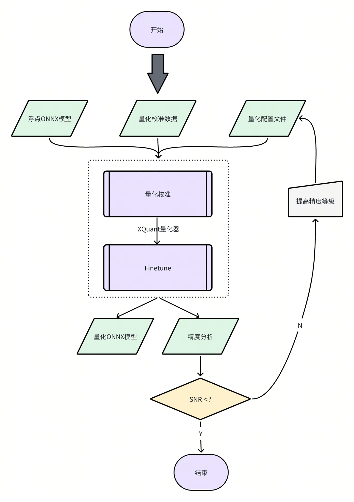
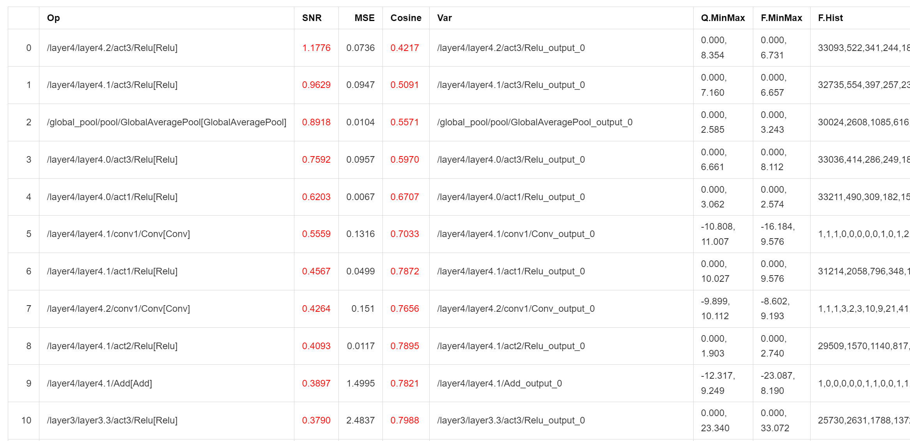

# Model Quantization

This chapter mainly introduces the usage details of the model quantization tool. The RISC-V series chips of Jidie Shikong support the direct deployment of floating-point (FP32) models, but we strongly recommend that you further quantize the floating-point model into a fixed-point (INT8) model. The accuracy loss of the quantized model can generally be controlled within 1%, but the inference performance can be improved by dozens of times!

## 1 Introduction to Model Quantization

XQuant is a quantization tool developed based on PPQ (0.6.6 +), which integrates the adjusted quantization strategy adapted to the chip and uses the Json configuration file to call the unified interface to implement model quantization.



## 2 Description of the Quantization Tool

Currently, the model quantization function has been integrated into the `spine convert` command, and you can specify the path of the relevant quantization configuration file through the `-c` or `--config` option.

【Note】The quantization tool installation package is located in the `spacengine-wheel/xquant` directory in the SDK, and you can also install it in the specified Python virtual environment. 

Installation example:
```
$ python3 -m pip install spacengine-wheel/xquant/xquant-1.1.0-py3-none-any.whl --extra-index-url https://pypi.ngc.nvidia.com
```
### 2.1 QuickStart

The Python Code and Shell examples have the source code in `xquant_samples` to facilitate a quick start with model quantization

#### Python Code Usage
```python
import xquant
demo_json = dict()
# The following defaults to filling in the content of demo_json
demo_json_path = "./demo_json.json"
# Using the dictionary method
xquant.quantize_onnx_model(demo_json)
# Using the json file method
xquant.quantize_onnx_model(demo_json_path)
# Supports passing the model path or model Proto when calling the API
# xquant.quantize_onnx_model("resnet18.json", "/home/share/modelzoo/classification/resnet18/resnet18.onnx")
# xquant.quantize_onnx_model(
#    "resnet18.json", "/home/share/modelzoo/classification/resnet18/resnet18.onnx", "resnet18_output.onnx"
# )
# import onnx
# onnx_model = onnx.load("/home/share/modelzoo/classification/resnet18/resnet18.onnx")
# quantized_onnx_model = xquant.quantize_onnx_model("resnet18.json", onnx_model)
```
#### Shell Usage
```
python -m xquant --config./demo_json.json
# Specify the input and output model paths
# python -m xquant -c./demo_json.json -i demo.onnx -o demo.q.onnx
```
### 2.2 Description of the Configuration File
Json configuration example:
```json
    "model_parameters": {
        "onnx_model": "",
        "output_prefix": "",
        "working_dir": "",
        "skip_onnxsim": false
    },
    "calibration_parameters": {
        "calibration_step": 100,
        "calibration_device": "cpu",
        "calibration_type": "default",
        "input_parametres": [
            {
                "input_name": "data",
                "input_shape": [1, 3, 224, 224],
                "dtype": "float32",
                "file_type": "img",
                "color_format": "bgr",
                "mean_value": [103.94, 116.78, 123.68],
                "std_value": [57, 57, 57],
                "preprocess_file": "",
                "data_list_path": ""
            },
            {
                "input_name": "data1",
                "input_shape": [1, 3, 224, 224],
                "dtype": "float32",
                "file_type": "img",
                "mean_value": [103.94, 116.78, 123.68],
                "std_value": [57, 57, 57],
                "preprocess_file": "",
                "data_list_path": ""
            }
        ]
    },
    "quantization_parameters": {
        "analysis_enable": true,
        "precision_level": 0,
        "finetune_level": 1,
        "max_percentile": 0.9999,
        "custom_setting": [
            {
                "input_names": ["aaa", "bbb"],
                "output_names": ["ccc"],
                "max_percentile": 0.999,
                "precision_level": 2,
                "calibration_type": "default"
            }
        ],
        "truncate_var_names": ["/Concat_5_output_0", "/Transpose_6_output_0"] "Truncate the model"
    }
```
Supported omitted fields:
|Field Name|Default Value|Optional Values|Remarks|
|---|---|---|---|
|output_prefix|The file name of the onnx_model without the suffix, and the output ends with.q.onnx|/|/|
|working_dir|The directory where the onnx_model is located|/|/|
|calibration_step|100|It is generally recommended to set it in the range of 100 - 1000|/|
|calibration_device|cuda|cuda, cpu|Automatically detected by the system|
|calibration_type|default|default, kl, minmax, percentile, mse|It is recommended to use default first, then percentile or minmax. If you feel that the default calibration takes too long, you can switch to percentile|
|input_name|Read from the onnx model|/|/|
|input_shape|Read from the onnx model|The shape needs to be all int, supports batch as a symbol, and is defaulted to 1|/|
|dtype|Read from the onnx model|float32, int8, uint8, int16|Currently only float32 is supported|
|file_type|img|img, npy, raw|Only raw data consistent with dtype can be read, that is, float32 by default|
|preprocess_file|None|PT_IMAGENET, IMAGENET|The system presets two IMAGENET standard preprocessing methods, or you can customize the py preprocessing method, "py file path:py method name", and the relevant example is in resnet18_custom_preprocess.json in the sample|


Rules for the calibration data list file:
Each line in `img_list.txt` represents a path to a calibration data file, which can be a relative path relative to the directory where `img_list.txt` is located, or an absolute path. If the model has multiple inputs, please ensure that the order of each file list is corresponding.

```
QuantZoo/Data/Imagenet/Calib/n01440764/ILSVRC2012_val_00002138.JPEG
QuantZoo/Data/Imagenet/Calib/n01443537/ILSVRC2012_val_00000994.JPEG
QuantZoo/Data/Imagenet/Calib/n01484850/ILSVRC2012_val_00014467.JPEG
QuantZoo/Data/Imagenet/Calib/n01491361/ILSVRC2012_val_00003204.JPEG
QuantZoo/Data/Imagenet/Calib/n01494475/ILSVRC2012_val_00015545.JPEG
QuantZoo/Data/Imagenet/Calib/n01496331/ILSVRC2012_val_00008640.JPEG
```

Rules for preprocess_file:
For example, this is a `custom_preprocess.py` script file, then in the configuration file, set preprocess_file to `custom_preprocess.py:preprocess_impl` to point to the specific method in the specific py file. If it is a multi-input situation, and the code difference is not significant, you can directly reuse your own preprocessing method.
The following preprocessing method is used when preprocess_file = None:

```python
from typing import Sequence
import torch
import cv2
import numpy as np
def preprocess_impl(path_list: Sequence[str], input_parametr: dict ) -> torch.Tensor:
    """
    Read path_list, preprocess according to the parameters in input_parametr, and return a torch.Tensor
    Args:
        path_list (Sequence[str]): A file list of a calibration batch
        input_parametr (dict): Equivalent to calibration_parameters.input_parametres[idx] in the configuration
    Returns:
        torch.Tensor: A batch of calibration data
    """
    batch_list = []
    mean_value = input_parametr["mean_value"]
    std_value = input_parametr["std_value"]
    input_shape = input_parametr["input_shape"]
    for file_path in path_list:
        img = cv2.imread(file_path)
        img = cv2.resize(img, (input_shape[-1], input_shape[-2]), interpolation=cv2.INTER_AREA)
        img = img.astype(np.float32)
        img = (img - mean_value) / std_value
        img = np.transpose(img, (2, 0, 1))
        img = torch.from_numpy(img)
        img = torch.unsqueeze(img, 0)
        batch_list.append(img)
    return torch.cat(batch_list, dim=0)
```

Rules for custom_setting:

You can refer to mobilenet_v3_small in the samples

```json
"custom_setting": [
    {
        "input_names": ["input_0"],
        "output_names": ["/features/features.1/block/block.0/block.0.0/Conv_output_0"],
        "precision_level": 2
     }
  ]
```

The tool uses the method of surrounding the subgraph with the in-edge and out-edge of the computation graph to capture a subgraph and set the custom quantization parameters. As shown in the example in the figure below, if we want to adjust the operators in the red box of the computation graph to the precision mode of precision_level = 2, we need to first determine all the non-constant in-edges and out-edges of the current subgraph, that is, the in-edge is the input n2 of the first Conv in the subgraph, and the side input n7 of the Add, and the out-edge is the output y of the Add


That is, the following configuration is generated:

```json
"custom_setting": [
     {
         "input_names": ["n2", "n7"],
         "output_names": ["y"],
         "precision_level": 2
     }
  ]
```

Rules for truncate_var_names:
truncate_var_names supports sending the complete ONNX model with the post-processing layer to the quantization tool, and the quantized output model will also retain the post-processing structure, but the user needs to specify the separation point between the main structure and the post-processing structure of the model, that is, truncate_var_names


For example, for the yolov6p5_n model, only the outputs of the Sigmoid and Concat (red box) operators need to be specified to divide the model into two parts and only quantize the upper part.

### 2.3 Description of the Quantization Output
After the quantization tool is executed, the following two products will be output.
1. ONNX Quantized Model: The ONNX quantized model in the QDQ format, which is parsed by the inference library into the corresponding quantized operators and performs fixed-point inference.
2. Quantization Analysis File: After enabling analysis_enable, a quantization analysis file will be generated in the output directory and presented in the form of a markdown file.



Outputs with SNR higher than 0.1 and Cosine less than 0.99 will be marked. If there are too many marked outputs in a model, it may cause quantization errors. A low Cosine does not necessarily cause quantization errors, and the credibility of SNR is higher. The result shown in the above figure indicates that the model may not be suitable for quantization or requires special adjustment of the quantization parameters.
### 2.4 Quantization Sample

To make it easier for users to get started, we provide corresponding quantization samples.
You can see it in the SDK package, spacengine-xquant/xquant_sample.tar.gz

## 3 Frequently Asked Questions (FAQ)

Everyone is welcome to ask questions

### 3.1 Configuration Related

1. Error: Calibration input_parametres size should equal to model inputs size.
Answer: The number of model inputs set in the current configuration json file is inconsistent with the actual number of model inputs.
2. Error: calibration_type xxx not implemented yet.
Answer: The quantization calibration algorithm is not supported. Currently, only default, minmax, percentile, kl, and mse are supported.
3. Error: file_type xxx not implemented yet.
Answer: The file format of the quantization calibration dataset is not supported. Currently, only images, Npy, and Raw files are supported.
4. Error: Calibration input xxx finds 0 items.
Answer: The calibration dataset is set incorrectly or cannot find any valid calibration data, which may be due to an incorrect data path or file format issue.
5. Error: truncate graph failed.
Answer: There is an error in truncating the model. It may be that the tensor name in the model is set incorrectly (does not exist or is misspelled) in the quantization configuration json file. You can open the model file with netron to view/confirm the name of the target input tensor. It may also be that the currently set tensor name is not enough to divide the model into two.
### 3.2 Accuracy Related

1. Example: The inference results of the quantized model on the PC side and the `chip side` are inconsistent
Answer: Currently, the operator implementation on the chip side emphasizes inference efficiency and may have a slight gap with the x86 or other platforms. However, in the case of no obvious bugs in the operator implementation, its batch accuracy should be consistent with other platforms.
2. Example: The measured accuracy on the PC side and the `chip side` after quantization is inconsistent
Answer: It is generally believed that a reasonable batch accuracy difference between multiple platforms is within ±0.5%. If the accuracy on the chip side is significantly reduced (>2%), it is likely caused by a calculation bug during inference on the chip side. Please feedback to us in time.
### 3.3 Performance Related

1. Example
The inference time of INT8 quantized Resnet18 at 1.2GHz per core is about 52 times that of FP32, 38ms vs 1992ms.
The inference time of INT8 quantized MobileNetV2 at 1.2GHz per core is about 9.6 times that of FP32, 45ms vs 431ms.