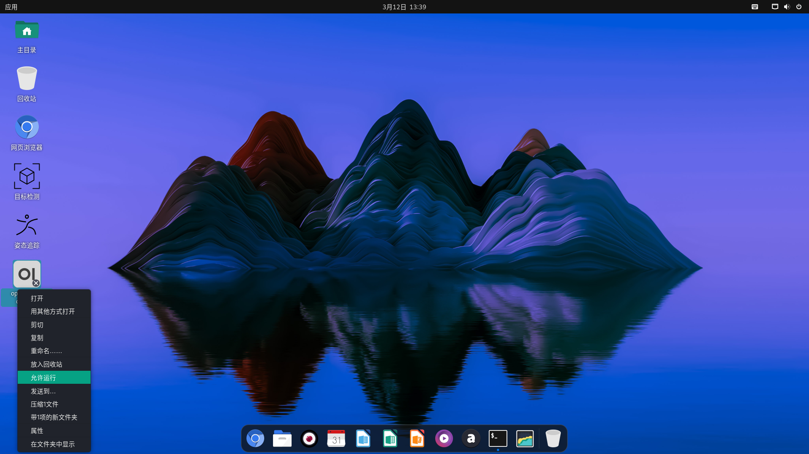

# Open-WebUI

Open-WebUI (formerly Ollama WebUI) is an open-source, self-hosted web management tool designed for the local or private deployment of large language models (LLMs). Its core objective is to deliver a ChatGPT-like interactive experience while supporting offline operation and highly customizable functionality.

## Installation

To simplify the process of using large language models (LLMs) on your K1 device, we have developed an Open-WebUI deb package for K1, enabling one-click installation and deployment (requires system version 2.1.1 or later):
```shell
sudo apt update
sudo apt install openwebui
```
Wait for the installation to complete.

## Usage

Right-click the openwebui desktop icon, select "Allow Execution" to launch the application.


## Model Creation (Optional)

This `.deb` package consists of the Open-WebUI and Ollama container images. To create a model, simply enter the Ollama container and follow the steps below. Here is an example of how to create a model. First of all, Access the container shell:
```shell
sudo docker exec -it ollama bash
```
```shell
apt update
apt install wget vim
cd /root
wget https://huggingface.co/second-state/Qwen2.5-0.5B-Instruct-GGUF/blob/main/Qwen2.5-0.5B-Instruct-Q4_0.gguf
wget https://archive.spacemit.com/spacemit-ai/modelfile/qwen2.5:0.5b.modelfile
ollama create qwen2.5:0.5b -f qwen2.5:0.5b.modelfile
```
Afterward, restart the Ollama container and re-enter Open-WebUI to use the accelerated model:
```shell
sudo docker restart ollama
```
