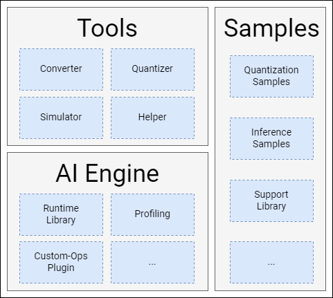

# Tool Overview
## 1. Overview of Tools
Spacengine™ is a set of AI algorithm model deployment tools developed by Spacemit, aiming to help users quickly and efficiently deploy AI algorithm models on Spacemit's RISC-V series chip products (hereinafter referred to as "device end" or "chip end"). Spacengine™ relies on Spacemit's self-developed AI instructions and quantization technology, and has conducted in-depth performance optimization for its self-developed RISC-V series chips such as X60 and X100, thereby significantly improving the inference performance of common algorithm models on the "chip end".
Spacengine™ is mainly composed of the toolset (Tools), AI engine (Engine), and sample package (Samples):



Spacengine™ Toolset (Tools)
The functional commands in the Spacengine™ toolset all start with `spine`. During the deployment process, the main commands you will encounter include: `spine convert`, `spine simulate`, and `spine helper`:
```
$ spine -h
usage: spine [-h] {convert,simulate,helper}...
Spacemit AI Toolkit(Version: 2024/01/15)
positional arguments:
  {convert,simulate,helper}
optional arguments:
  -h, --help            show this help message and exit
```
Among them:
- `spine convert` is mainly responsible for the one-click conversion and/or quantization of the algorithm model.
- `spine simulate` provides the model simulation test function on the PC end (currently limited to x86).
- `spine helper` provides a series of auxiliary functions.

**[Note] The relevant `functional commands` and their subcommands support auto-completion.**

Spacengine™ AI Engine (AI Engine)
Thanks to the Spacemit intelligent computing core architecture, the Spacengine™ AI engine is integrated into the open-source frameworks such as ONNXRuntime in the form of a lightweight plugin, combined with a deeply tuned acceleration backend, to successfully deploy the model to our chips efficiently. Currently, it mainly includes components such as the Runtime Library, Profiling tool, and Custom-Ops Plugin.
Spacengine™ Sample Package (Samples)

The Spacengine™ sample package provides you with rich code examples for model quantization and inference running, facilitating your quick and efficient evaluation and adaptation of Spacemit's RISC-V series chips. Among them, the model application scenarios include but are not limited to image classification, object detection, text recognition, etc., and the backbone networks involve but are not limited to MobileNet, ResNet, etc.
## 2. Deployment Process
The AI model deployment process with the Spacengine™ tool mainly involves four stages: model conversion, model quantization, simulation running, and model deployment (on the "chip end"):


Model Conversion

The conversion tool currently supports the content in Chapter  Model Conversion.

Model Quantization

To improve the running performance of the model on the "chip end" and fully utilize the computing power of the chip, we strongly recommend that you quantize the floating-point model into a fixed-point model. After quantization, the accuracy loss of most typical models can be controlled within 1%. For specific usage details, you can refer to Chapter  Model Quantization.

Simulation Testing

For the converted or quantized ONNX model, you can perform simulation inference testing on the x86 platform. Under normal circumstances, the inference result is exactly the same as the running result on the "chip end". You can refer to the content in Chapter Simulation Testing for more usage details.

Model Deployment

When the model performance and accuracy meet the expectations, you can refer to the content in Chapter  Model Deployment to realize the development of specific upper-layer applications on the "chip end".