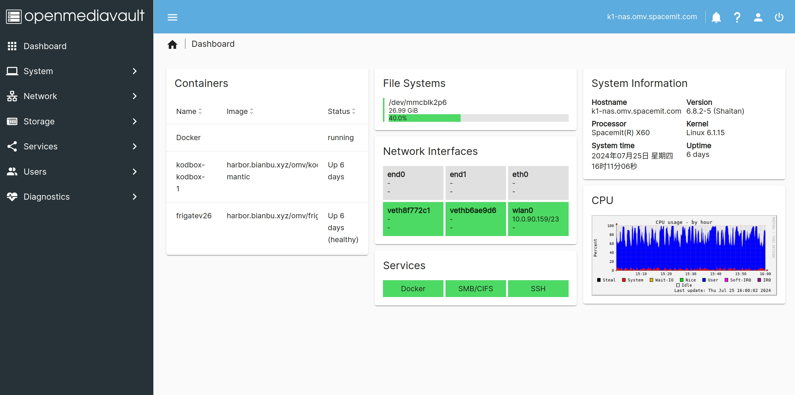

# Introduction

**Bianbu NAS** (Network Attached Storage) is a system derived from the [Bianbu](https://bianbu.spacemit.com/) operating system, specifically tailored for NAS products. It includes applications (openmediavault, Docker, and other common softwares), frameworks, libraries, runtime environments, the Linux kernel, bootloader (U-Boot), and supervisor binary interface (OpenSBI). Our goal is to provide a reference design for NAS software, enabling the development of drivers and applications.

## Software Components

The components of Bianbu NAS are as follows:

- Applications
- Frameworks
- Runtimes
- Libraries
- Linux Kernel
- U-Boot
- OpenSBI

Bianbu NAS manages these components and their subpackages through the [APT repository](http://archive.spacemit.com/bianbu-ports/), with all packages in the standard Debian format.

**Applications**

- Openmediavault
- Docker
- Wi-Fi AP (Wi-Fi Access Point)
- Soft Router
- Fast USB Drive
- SMB (Server Message Block)

**Multimedia Frameworks**

- FFmpeg (with Hardware Accelerated)
- GStreamer (with Hardware Accelerated)
- PipeWire

**AI Inference Frameworks**

- onnxruntime (with Hardware Acceleration)

**Runtimes**

- Python
- Java
- Node.js
- Rust
- Go

**Libraries**

- OpenCV (with RVV Acceleration)
- OpenSSL (with Hardware Acceleration)
- MPP, a multimedia processing platform developed by Spacemit, providing a C API and samples
- OpenGLES/Vulkan/OpenCL

### Linux Kernel

The Linux kernel manages the processor and hardware resources, serving as an interface between users, applications, and hardware. Its core functions encompass interrupt handling, clock management, process scheduling, memory management, file system management, device driver management, and the implementation of the network protocol stack.

Version: 6.1.

Source Code: https://gitee.com/bianbu-linux/linux-6.1

### U-Boot

U-Boot is a bootloader responsible for initializing specific hardware and loading the Linux kernel image, device tree, and initial RAM filesystem from various media such as SD cards, eMMC, SPI Flash, SSDs, and networks.

Version：u-boot-2022.10。

Source Code：[https://gitee.com/bianbu-linux/uboot-2022.10](https://gitee.com/bianbu-linux/uboot-2022.10)

### OpenSBI

OpenSBI is an implementation of the Supervisor Binary Interface for RISC-V architecture processors. It runs as firmware in M-mode, providing an interface for bootloaders, hypervisors, and operating systems to access hardware.

Version：1.3。

Source Code：[https://gitee.com/bianbu-linux/opensbi](https://gitee.com/bianbu-linux/opensbi)

## Supported Devices

Bianbu NAS currently supports the following hardware devices:

- BPI-F3
- [MUSE N1](device_list/muse_n1.md)
- [MUSE Pi](device_list/muse_pi.md)

## Firmware

Bianbu NAS firmware is available in two versions, based on Bianbu OS 23.10 and Bianbu OS 24.04, referred to as Bianbu NAS 23.10 and Bianbu NAS 24.04, respectively. The former has undergone several iterations and is more stable; it is recommended for download. However, if you require the latest OS and SDK, you may opt for the latter, though it is still under development and may have stability risks.

- **Bianbu NAS 23.10** (Latest version: v1.0.14)
- **Bianbu NAS 24.04** (Latest version: v2.0beta2)

Download: https://archive.spacemit.com/image/k1/version/bianbu/

- `bianbu-*-nas-*.img.zip` is the SD card firmware. Flash it to an SD card using the `dd` command or [balenaEtcher](https://etcher.balena.io/).
- `bianbu-*-nas-*.zip` is for flashing via fastboot. Flash it to eMMC using the `fastboot` command or Titan Flasher by referring to the [Flashing Tool User Manual](https://developer.spacemit.com/#/documentation?token=O6wlwlXcoiBZUikVNh2cczhin5d).

The `root` password is: `bianbu`.
