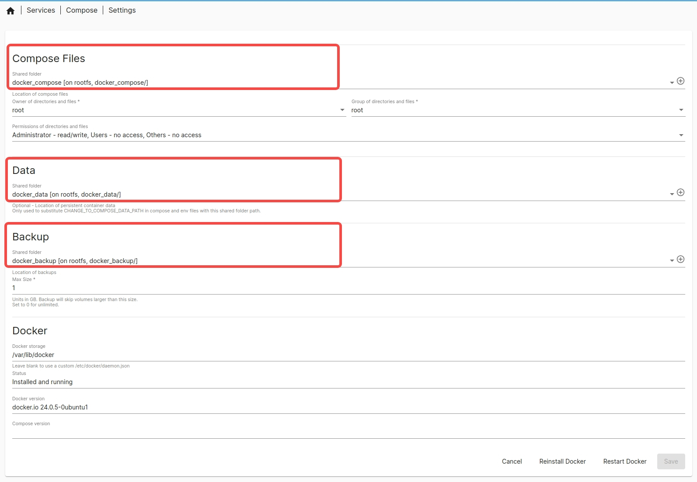
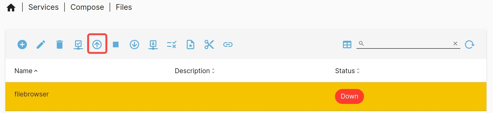

# docker-compose Plugin

Bianbu NAS uses the docker-compose tool to deploy Docker services. When a single container is insufficient for the application’s runtime environment, docker-compose allows for easy definition and management of multiple containers.

## Starting the Docker Daemon

Before creating a Docker service instance, ensure that the Docker daemon is running. Follow these steps to start the Docker service:

1. Mount the disk and create shared folders, with at least three shared folders.
2. Download the `compose` plugin, and then view it on the “Services” page.
3. Go to “Services -> Compose -> Settings,” select the shared folders, and start the Docker service.



## Creating a Docker Service Instance

Using the Filebrowser program (an open-source web-based file management tool) as an example, here’s how to create and access a Docker service instance on Bianbu NAS.

- Go to “Services -> Compose -> Files” and click “➕” to add a docker-compose.yml file:


Fill in the following content:

```yaml
version: '3.8'

services:
  filebrowser:
    image: harbor.spacemit.com/application/filebrowser:2.28.0
    container_name: filebrowser
    volumes:
      - ./filebrowser_data:/srv        # Mount the files to the host directory
      - ./filebrowser_config:/config   # Configuration file directory
    ports:
      - "8080:8080"                      # Map port 8080 to the container's port 8080
    restart: unless-stopped
```

After filling in the content, click "Save" and wait for the docker-compose.yml file format to be checked. Once verified, click the "⬆️" button to pull the service.



If the Docker image is not available locally, the first pull may take longer. Once completed, access Filebrowser via `https://HOST_IP:8080` with the default username and password `admin`.

## docker-compose Command Overview

- **docker-compose up**


Parse the `docker-compose.yml` file, pull images (if not available locally), create networks, containers, and volumes, then start the service.

- **docker-compose stop**


Stop running containers while preserving their state and data, which can be restored using the `docker-compose up` command.

- **docker-compose down**


Stop containers and remove related data such as containers, networks, and volumes. This cannot be restored using the `docker-compose up` command.

- **View service logs**

