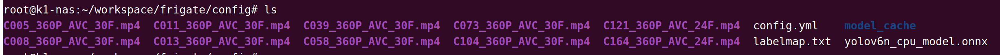

# Frigate

Frigate is an open-source video surveillance system optimized for real-time object detection, commonly used for managing home security cameras. Leveraging machine learning models like YOLO, it detects and identifies motion-triggered objects such as person and vehicles in real-time. Frigate supports hardware acceleration with devices like GPUs or Google Coral TPUs, enhancing video processing capabilities. It integrates seamlessly with Home Assistant, offering features like recording, event detection, and notifications, making it a great choice for smart home monitoring setups.

The docker-compose.yml configuration for Frigate is as follows:

```yaml
version: '3'

services:
  frigatev26:
    image: harbor.spacemit.com/application/frigate:v26
    container_name: frigatev26
    restart: unless-stopped
    tmpfs:
      - /tmp/cache:rw,exec,size=1000000000
    devices:
      - /dev/dri/renderD128
      - /dev/tcm
      - /dev/udma
      - /dev/udmabuf
      - /dev/video0
      
    shm_size: 64m
    volumes:
      - /root/workspace/frigate/storage:/media/frigate
      - /root/workspace/frigate/config:/config
      - /etc/localtime:/etc/localtime:ro
    environment:
      - FRIGATE_RTSP_PASSWORD=password
    ports:
      - "5000:5000"
      - "8554:8554"
      - "8555:8555/udp"
```

Log in to the system via serial port or SSH, and add the configuration files in the `/root/workspace/frigate/config/` directory. Download the `frigate-config.tar` archive from https://pan.baidu.com/s/1rejOs5FukCM6gq6AjTlgxw?pwd=pc9w (password: pc9w) and extract it into the config directory. The extracted files are as follows:



After configuring, pull the service again. Once the pull is complete, wait for about 30 seconds and then access Frigate via `http://HOST_IP:5000`.