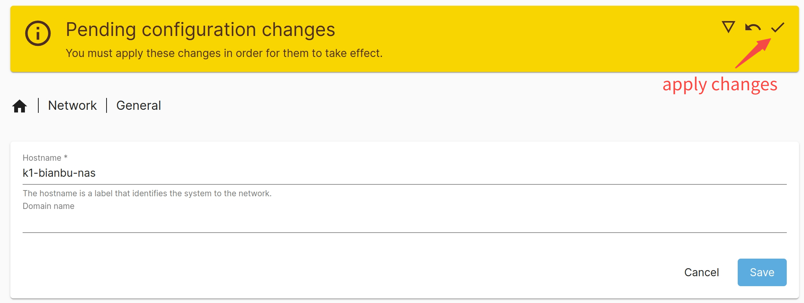
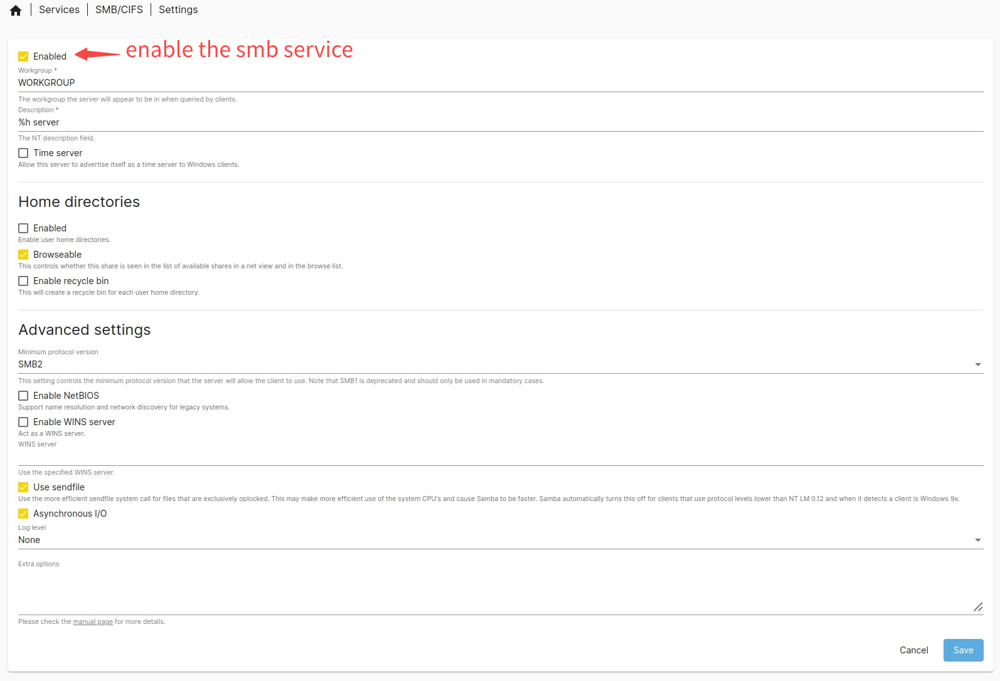
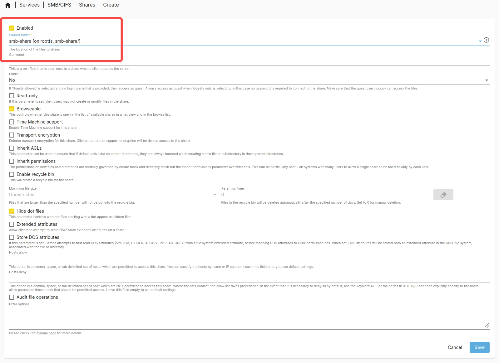
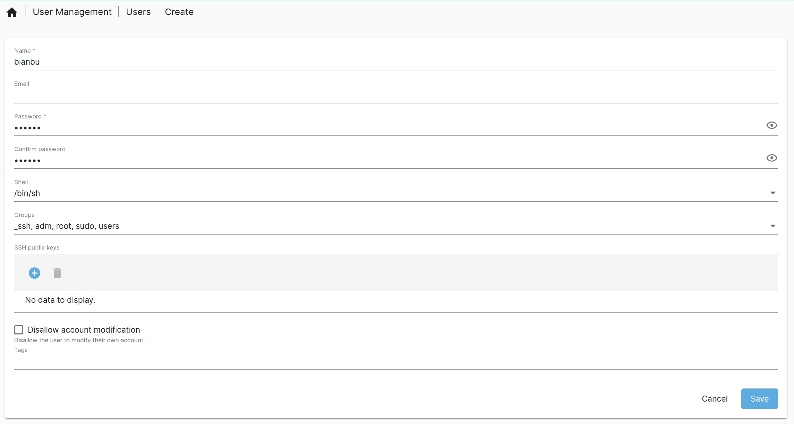
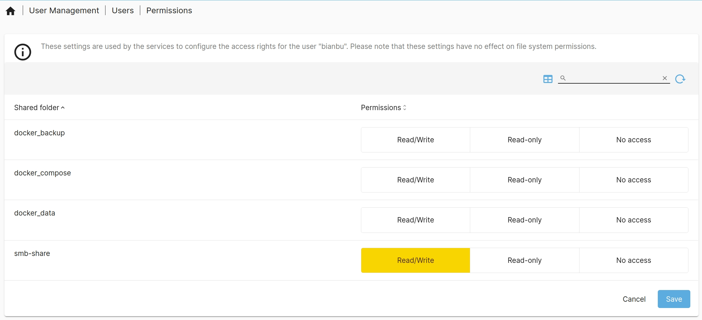

# File Sharing Protocol

The file sharing protocol allows files on Bianbu NAS to be shared over the network with other hosts within the local network, making it one of the core features of NAS products. Typically, file sharing protocols are registered as `systemd` services in the system and are thus referred to as file sharing services. This section demonstrates the process of configuring a file sharing service using the SMB protocol as an example. The same approach can be applied to the setup of other services.

## Server Configurations

### **Hostname Modification**

Since the SMB service requires the hostname to be under 15 characters, it’s necessary to change the default hostname. This step is not required for other services.

> [!NOTE]
>
> Changing the hostname will cause the system to reassign an IP address, which may result in a new IP address. If you experience issues such as page redirects or errors indicating that the page is unavailable after the change, it's likely due to the IP address being updated. In that case, check the new IP address and log in again to continue with the setup.

- Navigate to **"Network -> General"**, set the **Hostname**, and click **"Save"** to apply the changes.


Clicking **"Save"** only stores the changes in the database. To apply these changes to the system, you need to click **"Apply Changes"**. This triggers the system to execute the `salt` command, which updates the system configuration with the database records and restarts the necessary services to implement the new settings.



### Mount the shared disk

Since the shared data is stored on a disk, you must mount the disk first. If the disk partition is not yet formatted, format it beforehand (proceed with caution!).

- Go to **"Storage -> File System"**, select the disk you want to share, and mount it.


### **Creating a Shared Folder**

Once the disk is mounted, it cannot be used immediately. You must create a shared folder to enable efficient permission management and data isolation.

- Navigate to **"Storage -> Shared Folder"**, select the target disk, and create a shared folder on it (e.g., `smb-share`). This folder will then be shared via the network.


### **Creating an SMB Service Instance**

- Go to **"Services -> SMB/CIFS -> Settings"** to configure the SMB service. These settings are global and apply to all SMB service instances.



- Next, go to **"Services -> SMB/CIFS -> Shares"** to configure a specific SMB service instance. At this stage, select the shared folder (e.g., `smb-share`).



### Assign user permissions for the shared folder

The purpose of the File Shared Service is to allow remote access to server resources. When accessing remotely, proper permissions are required to ensure the user has the necessary rights to the shared folder. As an example, we'll demonstrate how to create a user and set their permissions.

- Go to **"Users -> User"** and create a new user. For example, you can create a user named `bianbu` with the username and password both set to `bianbu`.



- Click **"Permissions"** to assign the user permissions for the shared folder. For example, grant the `bianbu` user read and write access to the `smb-share` folder.



Clients will log in with the user account when connecting to the SMB service, inheriting the assigned permissions.

## Client Connection

This section outlines how to connect different clients to the SMB service. The setup assumes the following:

- The server IP is `HOST_IP`.
- An SMB service instance is configured with the shared folder named `smb-share`.
- A user with read and write access to `smb-share` has been created, using the username and password `bianbu`.

### **Windows File Explorer**

Open **File Explorer**, select **"Computer -> Map Network Drive"**, and enter the address of the shared folder:

```Bash
\\HOST_IP\smb-share
```

### **Linux Nautilus File Manager**

Open **Nautilus**, then select **"Other Locations"** and enter the shared folder address:

```Bash
smb://HOST_IP/smb-share
```

### Linux CLI

```Bash
mount.cifs //{HOST_IP}/smb-share /your_mount_path -o user=bianbu,password=bianbu
```