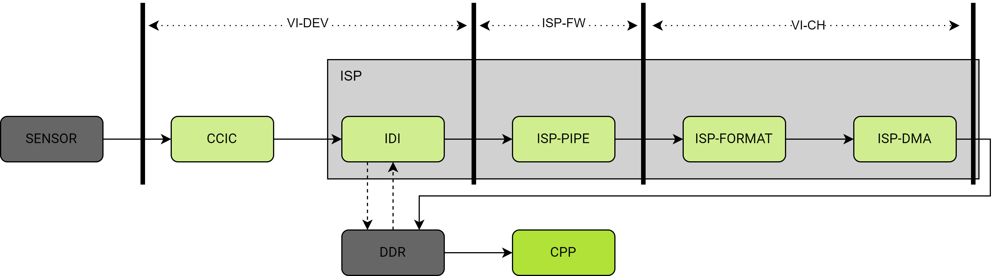
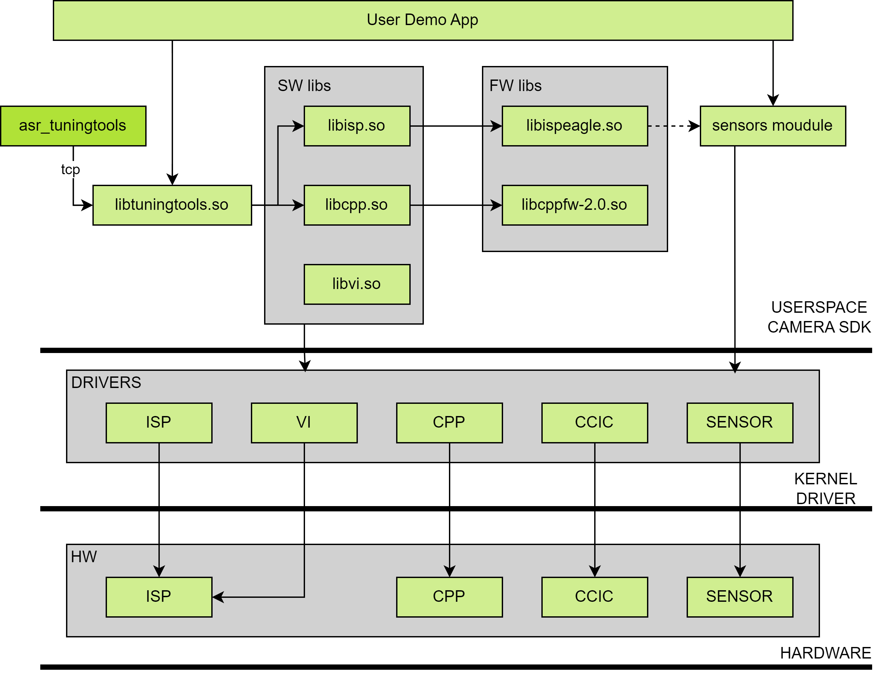
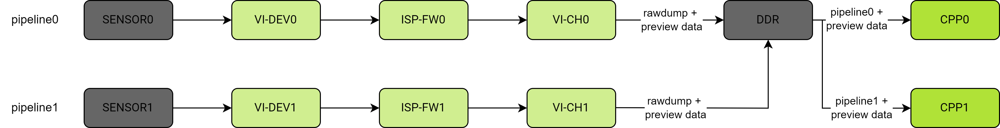
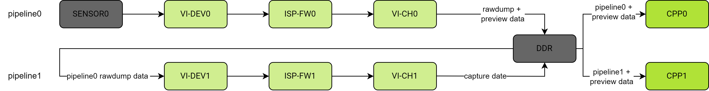

# Camera Development Guide

This guide mainly introduces the quick start development of the Camera module on the Spacemit K1 platform.

K1 only supports MIPI interface and uses the Spacemit camera driver framework.


## Quick Start Guide for Camera

* **To light up a supported camera, only two steps are needed:**
1. Determine which MIPI CSI interface the camera is connected to on the development board. If it is connected to the MIPI CSI1 hardware interface, run the following command (if it is connected to the MIPI CSI1 hardware interface, use csi1_camera_auto.json)
```
cam-test /usr/share/camera_json/csi1_camera_detect.json
```
The result is as follows, cam-test will automatically detect the supported camera ID on MIPI CSI1. If the camera is successfully detected, a usable JSON file will be generated in the /usr/share/camera_json/ directory. If not detected, it means the camera is not supported or there is a hardware issue. In this case, it is recommended to request support from the engineer.
```
......
I: ./sensors/cam_sensors_module.c(235): "detect ov16a10_spm sensors in csi1: success, set 3840x2160 to 1920x1080"
I: auto_detect_camera(1401): "auto detect sensor ===================== finish "
I: update_json_file(672): "save json to /usr/share/camera_json/csi1_camera_auto.json success"
```
From the above log, it can also be concluded that the JSON generated by the ov16a10 sensor uses mode 0 by default, with a sensor output resolution of 3840x2160 and an ISP output resolution of 1920x1080. For more descriptions of the JSON configuration file, please refer to the JSON Parameter Description section below.

2. Run the following command to start the camera and capture 500 frames, saving the 250th frame. For the normal running output log, please refer to the Normal Running Single Online Test Log section. If the operation fails, it is recommended to request support from the engineer.
```
cam-test /usr/share/camera_json/csi1_camera_auto.json
```
3. If the camera needs to achieve screen preview, you can refer to the MIPI camera description in the camera application section of the gstreamer_user_guide document.


* **To light up a new camera, usually only the application layer code of cam-test needs to be adjusted to quickly support it. All camera-related kernel configurations and DTS do not need to be modified.**

Because the hardware function configurations such as power-on GPIO, MCLK clock, MIPI lane configuration, etc., required to light up the sensor have been developed and verified by internal engineers before the solution is released. In rare cases, it is necessary to modify the DTS and driver configuration. For example, due to external irresistible reasons, the MIPI CSI interface circuit of the motherboard must be changed, such as changing the power-on GPIOA to GPIOB, MCLKA to MCLKB, etc. In this case, it is recommended to request support from the engineer.

If special circumstances are not considered, it is recommended to follow the steps below to light up a new camera:

1. According to the current camera model, reuse the application code of a similar model in the list (mainly reuse the code structure layout of the camera application to reduce development workload), modify the function names, structure names, etc., to the current camera model. For details, refer to [4.4 bring up section content](https://spacemit.feishu.cn/wiki/SQxSwlUJKiNwWGk3ldkcLzaenyh#WyFfdSraRon43ox45NrcJNkLn0c).
2. Read the camera's datasheet to determine the camera's register bit width, I2C address, power-on process, ID register, and ID value, and modify the sensor application code. The power-on process can refer to [3.4 sensor driver section content](https://spacemit.feishu.cn/wiki/SQxSwlUJKiNwWGk3ldkcLzaenyh#FDqvd68hQo5zwZxTDVTclr26nTg).
3. Configure the setting tab register array of the camera, and according to the information provided by the manufacturer or calculated values, determine the configuration used for lane number/HTS/VTS/MCLK/FPS/PCLK/resolution/data Lane, etc., and complete the function content (mainly focus on xxx_spm_get_sensor_capability and xxx_spm_get_sensor_work_info functions).
4. Adjust the register addresses used for exposure gain, etc., in the xxx_sensor.c source file.
5. Try to power on and read the ID test. If the ID reading fails, please recheck step 1.
6. Try the image output test. The image output test can choose the single online test. For details, refer to [5.3 scene introduction section content](https://spacemit.feishu.cn/wiki/SQxSwlUJKiNwWGk3ldkcLzaenyh#WP0wdBFKcomb5bxp5BkcLjbMndb). If the image output fails, you can use only the viisp case to test again. If it still fails, please carefully check steps 3 and 4, or seek assistance from the engineer for analysis.
7. The normal image output log of the single online test can be referred to in [6.2 section content](https://spacemit.feishu.cn/wiki/SQxSwlUJKiNwWGk3ldkcLzaenyh#EtjKd2NkDofQOSxLWv8cX6KLngd).

Note: For the introduction of test applications and various tests, please refer to [Chapter 5](https://spacemit.feishu.cn/wiki/SQxSwlUJKiNwWGk3ldkcLzaenyh#BaRbd8qCdoM9W2xMrUJcGGimnSh).

Additionally:
For the specifications and characteristics of the camera module, please refer to the chip specification manual in the Spacemit Developer Community: https://developer.spacemit.com/documentation?token=BWbGwbx7liGW21kq9lucSA6Vnpb#part779

For ISP effect debugging of the camera module, please refer to the ISP PQ Tool User Guide in the Spacemit Developer Community: https://bianbu-linux.spacemit.com/development_guide/isp_pq_tools_user_guide

For ISP API development of the camera module, please refer to the ISP API Development Guide in the Spacemit Developer Community: https://bianbu-linux.spacemit.com/development_guide/isp_api_development_guide

## Camera Subsystem Hardware Block Diagram



**Figure - Camera Hardware Subsystem Diagram**

The functions of each module are as follows:

1. **SENSOR:** Converts the light transmitted from the lens into electrical signals, then converts it into digital signals through internal AD, and finally outputs MIPI raw data.
2. **CCIC:** Short for CMOS Camera Image Controller, parses and receives MIPI data sent by the sensor.
3. **IDI:** An internal module of ISP hardware, receives data sent by CCIC or reads data from DDR and sends it to the ISP Pipeline; it can also dump data sent by CCIC to DDR.
4. **ISP-PIPE:** An internal pipeline of ISP hardware that processes a series of image-related algorithms.
5. **ISP-FORMAT:** An internal module of ISP hardware that controls the output image format.
6. **ISP-DMA:** An internal module of ISP hardware that outputs images to DDR.
7. **CPP:** Image noise reduction processing and edge enhancement.

## Camera Driver Framework

The content of this chapter is for learning and understanding only. Except for the sensor driver part, the rest is not used in the basic bring-up of the sensor.

### Framework Introduction

The Spacemit camera driver framework is implemented based on the Linux kernel v4l2 framework and mainly provides the following functions:

- Access hardware registers of each camera module
- Respond to interrupts
- Manage buffers and events
- Provide calling interfaces for user space SDK

The relationship between each module in the camera subsystem is shown in the figure below:



From the perspective of software calling relationships, it is divided into the following three layers from top to bottom:

- **userspace**: Runs in user space. Mainly includes ISP, CPP, VI, and tuning tools software libraries, ISP, CPP firmware libraries, and sensor module source code. Users mainly call the interfaces of ISP, CPP, VI, and sensor modules to achieve camera application scenarios. The interfaces in the firmware library are internally called by the ISP and CPP software libraries. Additionally, if users need to use ASR's tuning tool to debug the output image effect of ISP/CPP, they need to call the interface of libtuningtools.so in the application to create a tuning server.
- **kernel space**: Runs in kernel space. Mainly provides drivers for ISP, CPP, VI, CCIC, and sensors.
- **hardware layer**: The hardware modules actually called by the drivers.

For users' sensor bring-up needs, the main focus is on the code in userspace, especially the APP demo part, i.e., how to call the SDK dynamic library interfaces according to the scene requirements.

### Source Code Structure

```
~/k1x/linux-6.6/drivers/media/platform/spacemit/camera$ tree
.
|-- built-in.a
|-- cam_ccic
|   |-- ccic_drv.c
|   |-- ccic_drv.h
|   |-- ccic_hwreg.c
|   |-- ccic_hwreg.h
|   |-- csiphy.c
|   |-- csiphy.h
|   |-- dptc_drv.c
|   |-- dptc_drv.h
|   `-- dptc_pll_setting.h
|-- cam_cpp 
|   |-- cpp_compat_ioctl32.c
|   |-- cpp_compat_ioctl32.h
|   |-- cpp_dmabuf.c
|   |-- cpp_dmabuf.h
|   |-- cpp_iommu.c
|   |-- cpp_iommu.h
|   |-- cpp-v2p0.c
|   |-- k1x_cpp.c
|   |-- k1x_cpp.h
|   |-- regs-cpp-iommu.h
|   |-- regs-cpp-v2p0.h
|   `-- regs-fbc-v2p0.h
|-- cam_isp
|   |-- k1x_isp_drv.c
|   |-- k1x_isp_drv.h
|   |-- k1x_isp_pipe.c
|   |-- k1x_isp_pipe.h
|   |-- k1x_isp_reg.c
|   |-- k1x_isp_reg.h
|   |-- k1x_isp_statistic.c
|   `-- k1x_isp_statistic.h
|-- cam_plat
|   |-- cam_plat.c
|   `-- cam_plat.h
|-- cam_sensor
|   |-- cam_sensor.c
|   `-- cam_sensor.h
|-- cam_util
|   |-- cam_dbg.c
|   `-- cam_dbg.h
|-- Kconfig
|-- Makefile
|-- modules.order
`-- vi
    |-- cam_block.c
    |-- cam_block.h
    |-- k1xvi
    |   |-- fe_isp.c
    |   |-- fe_isp.h
    |   |-- hw-seq
    |   |   |-- hw_ccic.c
    |   |   |-- hw_ccic.h
    |   |   |-- hw_dma.c
    |   |   |-- hw_dma.h
    |   |   |-- hw_iommu.c
    |   |   |-- hw_iommu.h
    |   |   |-- hw_isp.c
    |   |   |-- hw_isp.h
    |   |   |-- hw_postpipe.c
    |   |   |-- hw_postpipe.h
    |   |   |-- hw_reg.h
    |   |   `-- hw_reg_iommu.h
    |   |-- k1xvi.c
    |   `-- k1xvi.h
    |-- mlink.c
    |-- mlink.h
    |-- spacemit_videobuf2.h
    |-- subdev.c
    |-- subdev.h
    |-- vdev.c
    |-- vdev.h
    |-- vsensor.c
    `-- vsensor.h

```

### Driver Configuration

Execute the make linux-menuconfig command to enter the kernel configuration of bianbu-linux, find the corresponding macro configuration, and open it in sequence.

```bash
 Symbol: SPACEMIT_K1X_CAMERA_V2 [=y]                                                                                                                                                                                                                                                   │
  │ Type  : tristate                                                                                                                                                                                                                                                                      │
  │ Defined at drivers/media/platform/spacemit/camera/Kconfig:8                                                                                                                                                                                                                           │
  │   Prompt: SPACEMIT K1X camera and video capture V2 support                                                                                                                                                                                                                            │
  │   Depends on: MEDIA_SUPPORT [=y] && MEDIA_PLATFORM_SUPPORT [=y] && MEDIA_PLATFORM_DRIVERS [=y]                                                                                                                                                                                        │
  │   Location:                                                                                                                                                                                                                                                                           │
  │     -> Device Drivers                                                                                                                                                                                                                                                                 │
  │       -> Multimedia support (MEDIA_SUPPORT [=y])                                                                                                                                                                                                                                      │
  │         -> Media drivers                                                                                                                                                                                                                                                              │
  │           -> Media platform devices (MEDIA_PLATFORM_DRIVERS [=y])                                                                                                                                                                                                                     │
  │ (1)         -> SPACEMIT K1X camera and video capture V2 support (SPACEMIT_K1X_CAMERA_V2 [=y])                                                                                                                                                                                         │
  │ Selects: MEDIA_CONTROLLER [=y] && VIDEO_V4L2_SUBDEV_API [=y]
```

The above is the path of CONFIG_SPACEMIT_K1X_CAMERA_V2 configuration. After selecting and opening it, open the remaining camera-related configurations and save them. After opening and saving, you can confirm through the output saved ./output/k1/build/linux-custom/.config file, as shown below.

```bash
#
# SPACEMIT K1X Camera And Video V2
#
CONFIG_SPACEMIT_K1X_CAMERA_V2=y
CONFIG_SPACEMIT_K1X_CCIC_V2=y
CONFIG_SPACEMIT_K1X_VI_V2=y
CONFIG_SPACEMIT_K1X_VI_IOMMU=y
CONFIG_SPACEMIT_K1X_ISP_V2=y
CONFIG_SPACEMIT_K1X_CPP_V2=y
CONFIG_SPACEMIT_K1X_SENSOR_V2=y

```

### Sensor Driver

The sensor-related driver code is located in the linux/drivers/media/platform/spacemit/camera/cam_sensor directory. After the driver is loaded, a device node /dev/cam_sensorX ('X' is the sensor device ID, i.e., the camera ID mentioned below) is generated.

The sensor driver is a lightweight string driver, mainly used to control power and encapsulate I2C read/write operations. Pay special attention during bring-up:

- The camsnr_of_parse() function indicates the attribute content of the sensor DTS node currently supported for parsing.
- Whether the power on/off process defined in the cam_sensor_power_set() function is consistent with the new sensor operation process.

  - If the operation is consistent, like the imx135 sensor. Directly call the ioctl CAM_SENSOR_UNRESET. In the imx135_init function, call the sensor_hw_unreset function to complete the power-on operation. In the imx135_deinit function, call the sensor_hw_reset function to complete the power-off operation.
  - If the operation is inconsistent, like the gc2375h sensor. It is necessary to combine the ioctl interface exposed by the sensor string driver and customize the gc2375h_power_on function to meet the power-on requirements of the gc2375h sensor. The power-off operation is similar.

(The power-on and power-off requirements of the sensor are described in the sensor datasheet)

### **DTS Introduction**

The DTS configuration related to the camera is mainly distributed in the following files (there may be slight differences between solutions):

```bash
Path: arch/riscv/boot/dts/spacemit/k1-x-camera-sensor.dtsi
Function: Configuration information of various sensors

Path: arch/riscv/boot/dts/spacemit/k1-x-camera-sdk.dtsi
Function: Configuration information of ccic, csiphy, isp, vi, cpp

Path: arch/riscv/boot/dts/spacemit/k1-x_pinctrl.dtsi
Function: Configuration information of pinctrl relied on by the camera

Path: arch/riscv/boot/dts/spacemit/k1-xxxx.dts
Function: Board-related configuration of different solutions
```

#### Pinctrl

Currently, only the configuration of the camera MCLK pin is defined through pinctrl.

```
Path: arch/riscv/boot/dts/spacemit/k1-x_pinctrl.dtsi

pinctrl_camera0: camera0_grp {
    pinctrl-single,pins =<
        K1X_PADCONF(GPIO_53,    MUX_MODE1, (EDGE_NONE | PULL_DOWN | PAD_1V8_DS2))  /* cam_mclk0 */
    >;
};

pinctrl_camera1: camera1_grp {
    pinctrl-single,pins =<
        K1X_PADCONF(GPIO_58,    MUX_MODE1, (EDGE_NONE | PULL_DOWN | PAD_1V8_DS2))  /* cam_mclk1 */
    >;
};

pinctrl_camera2: camera2_grp {
    pinctrl-single,pins =<
        K1X_PADCONF(GPIO_120,    MUX_MODE1, (EDGE_NONE | PULL_DOWN | PAD_1V8_DS2))  /* cam_mclk2 */
    >;
};

Path: arch/riscv/boot/dts/spacemit/k1-x-camera-sensor.dtsi

/* imx315 */
backsensor: cam_sensor@0 {
    ......

    pinctrl-names = "default";
    pinctrl-0 = <&pinctrl_camera0>;

    ......
    status = "okay";
};

```

#### GPIO

Check the development board schematic to find the reset signal GPIO and power-on signal GPIO of the MIPI CSI (0/1/2) hardware interface. Usually, there will be at least one set of GPIO. Suppose the reset GPIO of the MIPI CSI0 hardware interface is GPIO 111, and the power-on signal GPIO is GPIO 113, and it is connected to camera0: imx135 MIPI. (It is recommended that the camera ID corresponds to the MIPI CSI number)

The backsensor configuration in the solution DTS is as follows.

```bash
Path: arch/riscv/boot/dts/spacemit/k1-xxxx.dts

//To improve efficiency, GPIO needs to be used as follows
//The 2 after GPIO_111 indicates the number of consecutive GPIOs to be configured. In the example, it indicates GPIO_111 and GPIO_112.
&pinctrl {
        pinctrl-single,gpio-range = <
                &range GPIO_111 2 (MUX_MODE0 | EDGE_NONE | PULL_DOWN | PAD_1V8_DS2)
        >;
};

&gpio {
        gpio-ranges = <
                &pinctrl 111  GPIO_111  2
        >;
};

/* imx315 */
&backsensor {
        pwdn-gpios = <&gpio 113 0>;
        reset-gpios = <&gpio 111 0>;

        ......
        status = "okay";
};

Path: arch/riscv/boot/dts/spacemit/k1-x-camera-sensor.dtsi
//camera ID0 corresponds to imx135
&soc {

    /*imx315 */
    backsensor: cam sensor@0 {
        cell-index =<0>;
        status ="okay";
    };
};
```

pwdn-gpios, reset-gpios are related to the power supply configuration of the sensor module. The sensor driver uses this set of configurations to complete the power-on, power-off, and reset operations of the sensor. The configuration of different sensor modules may be different, and it needs to be carefully modified during bring-up.

#### Sensor DTS Configuration

The sensor configuration defined in k1-x-camera-sensor.dtsi is as follows

```bash
        /* imx315 */
        backsensor: cam_sensor@0 {
                cell-index = <0>;
                twsi-index = <0>;
                dphy-index = <0>;
                compatible = "spacemit,cam-sensor";
                clocks = <&ccu CLK_CAMM0>;
                clock-names = "cam_mclk0";

                /* This part has been moved to the top-level DTS
                afvdd28-supply = <&ldo_12>;
                avdd28-supply = <&ldo_10>;
                dvdd12-supply = <&ldo_20>;
                iovdd18-supply = <&ldo_11>;
                cam-supply-names = "afvdd28", "avdd28", "dvdd12", "iovdd18";
                */

                ......
                status = "okay";
        };
```

- cell-index indicates the device ID of the entire sensor, which completely matches the sensor device ID used by the upper layer
- twsi-index indicates the ID of the I2C core used by the sensor. Before use, ensure that the corresponding I2C bus DTS configuration has been enabled. For details, please refer to the I2C section.
- dphy-index indicates the PHY ID used by the sensor.
- clocks/clock-names indicate the clock source used by the sensor's MCLK.

### Bring-up Summary

During the bring-up process, the main modifications to the driver are as follows:

1. If it is the first time to bring up the sensor module at the current position of the hardware platform, it is necessary to check whether the csiphy and ccic configurations defined in k1-x-camera-sdk.dtsi are correct; if not, this step can be ignored.
2. Modify the sensor configuration defined in k1-x-camera-sensor.dtsi or the top-level DTS to adapt to the new sensor.
3. Check whether the power on/off process in the sensor driver is adapted to the new sensor. If not, it may be necessary to modify the sensor driver.

## User Layer cam_sensors Library

In the user layer, the operations of the sensor module will be encapsulated in the libcam_sensors library after compilation. The source code directory of this module is located in xxxx/package-src/k1x-cam/sensors.

### Common Operations

The common operation code of the sensor is located in the sensor subdirectory. The cam_sensor.c file defines the common operations of all sensors, and this file does not need to be modified. The xxx_sensor.c file corresponds to the common operations of a specific sensor model. If the xxx_sensor.c file of the sensor to be brought up is already in the sensor subdirectory, the current subdirectory does not need to be modified; if not, a new xxx_sensor.c file needs to be added for the new sensor.

We will briefly explain the functions defined in the xxx_sensor.c file.

#### Operation Function Set

The file defines the struct SENSOR_OBJ structure as the operation function set exposed by the sensor. The structure contains the following member variables:

- const char* name;

sensor name.

- int (*pfnInit)(void** pHandle, int sns_id, uint8_t sns_addr);

sensor initialization.

- int (*pfnDeinit)(void* handle);

sensor deinitialization.

- int (*pfnGloablConfig)(void* handle, SENSOR_WORK_INFO_S* work_info);

Global configuration of the sensor based on the input work info.

- int (*pfnSetParam)(void* handle, const SENSOR_INIT_ATTR_S* init_attr);

Set the 3A parameters of the sensor before initialization.

- int (*pfnStreamOn)(void* handle);

sensor streamOn.

- int (*pfnStreamOff)(void* handle);

sensor streamOff.

- int (*pfnGetSensorOps)(void* handle, ISP_SENSOR_REGISTER_S* pSensorFuncOps);

Get the callback operation function set registered by the sensor to the ISP.

- int (*pfnDetectSns)(void* handle, SENSOR_VENDOR_ID_S* vendor_id);

Detect sensor.

- int (*pfnWriteReg)(void* handle, uint16_t regAddr, uint16_t value);

Write register.

- int (*pfnReadReg)(void* handle, uint16_t regAddr, uint16_t* value);

Read register.

##### ISP Callback Operation Function Set

The file defines the struct spmISP_SENSOR_FUNC_S structure as the callback function set registered by the sensor to the ISP. The structure contains the following member variables:

- int (*pfn_sensor_write_reg)(void *snsHandle, uint32_t regAddr, uint32_t value);

Write sensor register.

- int (*pfn_sensor_get_isp_default)(void *snsHandle, uint32_t u32ChanelId, uint32_t camScene, ISP_SENSOR_DEFAULT_S *pstDef);

Get the Tuning data parameters used by the ISP.

- int (*pfn_sensor_get_isp_black_level)(void *snsHandle, uint32_t u32ChanelId, ISP_SENSOR_BLACK_LEVEL_S *pstBlackLevel);

Get the default Black level of the sensor.

- int (*pfn_sensor_get_reg_info)(void *snsHandle, ISP_SENSOR_REGS_INFO_S *pstSensorRegsInfo);

Get the basic configuration of the sensor register operation.

- int (*pfn_sensor_dump_info)(void *snsHandle);

Dump the required sensor information during debugging.

- int (*pfn_sensor_group_regs_start)(void *snsHandle);

Start operation of the sensor group writer.

- int (*pfn_sensor_group_regs_done)(void *snsHandle);

End operation of the sensor group writer.

##### ISP AE Callback Operation Function Set

The file defines the struct spmISP_SENSOR_AE_FUNC_S structure as the callback function set registered by the sensor to the ISP AE algorithm. The structure contains the following member variables:

- int (*pfn_sensor_get_ae_default)(void *snsHandle, uint32_t u32ChanelId, ISP_SENSOR_AE_DEFAULT_S *pstSensorAeDft);

Get the default AE parameters of the sensor.

- int (*pfn_sensor_fps_set)(void *snsHandle, float f32Fps);

Set the fps of the sensor.

- int (*pfn_sensor_get_expotime_by_fps)(void *snsHandle, float f32Fps);

Get the maximum exposure time of the sensor based on the set fps.

- int (*pfn_sensor_expotime_update)(void *snsHandle, uint32_t u32ChanelId, uint32_t u32ExpoTime, ISP_SENSOR_VTS_INFO_S *pstSensorVtsInfo);

Update the register values related to the sensor and exposure time, only update the software values, and do not actually write the register.

- int (*pfn_sensor_gain_update)(void *snsHandle, uint32_t u32ChanelId, uint32_t *pAgainVal, uint32_t *pDgainVal);

Update the register values related to the sensor and gain, only update the software values, and do not actually write the register.

- int (*pfn_get_aelib_default_settings)(void *snsHandle, uint32_t u32ChanelId, AE_LIB_DEFAULT_SETTING_S **ppstAeLibDefault);

Get the Tuning data parameters used by the AE algorithm of the specified ISP pipeline.

##### ISP AWB Callback Operation Function Set

The file defines the struct spmISP_SENSOR_AWB_FUNC_S structure as the callback function set registered by the sensor to the ISP AWB algorithm. The structure contains the following member variables:

- int(*pfn_sensor_get_awb_default)(void*snsHandle,uint32_tu32ChanelId, ISP_SENSOR_AWB_DEFAULT_S *pstSensorAwbDft);

Get the default AWB parameters of the sensor.

- int(*pfn_get_awblib_default_settings)(void*snsHandle,uint32_tu32ChanelId, AWB_LIB_DEFAULT_SETTING_S **ppstAwbLibDefault);

Get the Tuning data parameters used by the AWB algorithm of the specified ISP pipeline.

### Differentiated Operations

For a sensor module, even if the same sensor is used, different modules may have many differentiated configurations in different projects, such as sensor settings or ISP tuning data. The differentiated code of the sensor is located in the module subdirectory. For a new sensor module, a subdirectory needs to be created to define related operations.

The xxx_setting.h file in the subdirectory defines the sensor settings supported by the current module sensor.

The xxx.c file in the subdirectory defines the struct MODULE_OBJ structure as the operation function set exposed by the module sensor. The structure contains the following variables:

- const char* name;

module name.

- int (*pfnGetsnrCapSize)(int32_t* capArraySize);

Get the number of working modes of the module sensor (corresponding to the sensor settings one by one)

- int (*pfnGetsnrCapbility)(int32_t capArraySize, SENSOR_CAPABILITY_S* sensor_capability);

Get the capabilities of all working modes of the module sensor (corresponding to the sensor settings one by one).

- int (*pfnGetSnrWorkInfo)(int32_t work_mode, SENSOR_WORK_INFO_S* snr_info);

Get the capabilities of the specified working mode of the module sensor (corresponding to the sensor settings one by one).

- int (*pfnGetSnrVendorId)(SENSOR_VENDOR_ID_S* vendor_id);

Get the vendor ID of the module sensor.

- int (*pfnGetSnrI2cAddr)(uint8_t* i2c_addr);

Get the I2C address of the module sensor.

### SENSORS_MODULE_OBJ_S

Each sensor module includes a sensor, lens motor, and Flash (flashlight). In the cam_sensors_module_list.h header file, the struct SENSORS_MODULE_OBJ structure is defined, which defines the specific components of a sensor module, including the following 4 parts:

- MODULE_OBJ_S* module_obj_p;

module sensor, corresponding to the module subdirectory. The name of the module sensor is the name of the entire sensor module.

- SENSOR_OBJ_S* sensor_obj_p;

common operation set of the sensor, corresponding to the sensor subdirectory.

- VCM_OBJ_S* vcm_obj_p;

motor, corresponding to the vcm subdirectory.

- FLASH_OBJ_S* flash_obj_p;

Flash (flashlight), corresponding to the flash subdirectory.

Each time a new sensor module is added, this new sensor module needs to be added to the SENSORS_MODULE_OBJ_S sensors_module_list[] array. This list represents the list of sensor modules currently supported by the software.

### Bring-up Summary

During the bring-up process, the main modifications to the user layer cam_sensors library are as follows:

1. Check whether the sensor subdirectory has already defined the relevant files of the sensor to be brought up. If not, add the common operation code of the new sensor.
2. Add a subdirectory for the differentiated operations of the sensor to be brought up in the module subdirectory, mainly for the sensor settings to be supported and the related operations of the tuning data.
3. Add this new module to the SENSORS_MODULE_OBJ_S sensors_module_list[].
4. (If any) Add the new source files to the CUR_SOURCE variable in the Makefile.

## User Layer Demo Example

### Source Code Structure

```bash
lizhirong@lnode1:~/bianbu-linux/package-src/k1x-cam$ tree
.
|-- CMakeLists.txt
|-- Config.in
|-- debian
|   |-- bianbu.conf
|   |-- changelog
|   |-- compat
|   |-- control
|   |-- copyright
|   |-- README.Debian
|   |-- rules
|   |-- source
|   |   |-- format
|   |   `-- local-options
|   `-- watch
|-- demo
|   |-- camtest.sh
|   |-- cfgs
|   |   |-- 0
|   |   |   |-- camtest_sensor0_mode0.json
|   |   |   |-- camtest_sensor0_mode1.json
|   |   |   |-- camtest_sensor0_mode2.json
|   |   |   |-- camtest_sensor1_mode0.json
|   |   |   `-- camtest_sensor2_mode0.json
|   |   |-- 1
|   |   |   |-- camtest_main_aux.json
|   |   |   `-- camtest_main_front.json
|   |   |-- 2
|   |   |   |-- camtest_sensor0_mode0.json
|   |   |   |-- camtest_sensor1_mode0.json
|   |   |   `-- camtest_sensor2_mode0.json
|   |   |-- 3
|   |   |   |-- camtest_sensor0_mode0.json
|   |   |   |-- camtest_sensor1_mode0.json
|   |   |   `-- camtest_sensor2_mode0.json
|   |   |-- 4
|   |   |   |-- camtest_sensor0_mode0_nv12.json
|   |   |   |-- camtest_sensor0_mode0_p010.json
|   |   |   |-- camtest_sensor0_mode0_p210.json
|   |   |   |-- camtest_sensor0_mode0_rgb565.json
|   |   |   |-- camtest_sensor0_mode0_rgb888.json
|   |   |   `-- camtest_sensor0_mode0_y210.json
|   |   |-- 5
|   |   |   `-- camtest_1920x1080_raw12.json
|   |   |-- 6
|   |   |   `-- camtest_1920x1080.json
|   |   `-- files
|   |       |-- 1920x1080_raw12_long_packed.vrf
|   |       `-- cpp_case_in_data
|   |           `-- 1920x1080
|   |               |-- L0.nv12
|   |               |-- L1.raw
|   |               |-- L2.raw
|   |               |-- L3.raw
|   |               `-- L4.raw
|   |-- CMakeLists.txt
|   |-- config.c
|   |-- config.h
|   |-- cpp_common.c
|   |-- cpp_common.h
|   |-- dual_pipeline_capture_test.c
|   |-- dual_pipeline_capture_test.h
|   |-- extern
|   |   |-- cjson.c
|   |   |-- cjson.h
|   |   |-- sstr.c
|   |   `-- sstr.h
|   |-- gst_cam_api.c
|   |-- gst_cam_api.h
|   |-- include
|   |   |-- bufferPool.c
|   |   |-- bufferPool.h
|   |   |-- cam_interface.h
|   |   |-- dmabufheap
|   |   |   |-- BufferAllocator.cpp
|   |   |   |-- BufferAllocator.h
|   |   |   |-- BufferAllocatorWrapper.cpp
|   |   |   |-- BufferAllocatorWrapper.h
|   |   |   `-- dmabufheap-defs.h
|   |   |-- dmabufheapAllocator.c
|   |   `-- dmabufheapAllocator.h
|   |-- main.c
|   |-- online_pipeline_test.c
|   |-- online_pipeline_test.h
|   |-- sensor_common.c
|   |-- sensor_common.h
|   |-- tuning_server.c
|   |-- tuning_server.h
|   |-- utils
|   |   |-- cam_list.c
|   |   |-- cam_list.h
|   |   |-- cam_log.h
|   |   |-- condition.c
|   |   `-- condition.h
|   |-- viisp_common.c
|   `-- viisp_common.h
|-- libs
|   |-- include
|   |   |-- cam_cpp.h
|   |   |-- cam_module_interface.h
|   |   |-- CPPGlobalDefine.h
|   |   |-- ISPGlobalDefine.h
|   |   |-- spm_cam_isp.h
|   |   |-- spm_cam_tuning_assistant.h
|   |   |-- spm_cam_vi.h
|   |   |-- spm_comm_cam.h
|   |   |-- spm_comm_tuning.h
|   |   |-- spm_comm_vi.h
|   |   |-- spm_isp_comm.h
|   |   `-- spm_isp_sensor_comm.h
|   `-- lib64
|       |-- libcppfw-2.0.so
|       |-- libcpp.so
|       |-- libispeagle.so
|       |-- libisp.so
|       |-- libtuningtools.so
|       `-- libvi.so
|-- pkgconfig
|   `-- k1x-cam.pc.cmake
`-- sensors
    |-- camera_base.h
    |-- cam_log.h
    |-- cam_sensors_module.c
    |-- cam_sensors_module.h
    |-- cam_sensors_module_list.h
    |-- cam_sensor_uapi.h
    |-- cam_spm_otp_handle.c
    |-- cam_spm_otp_handle.h
    |-- CMakeLists.txt
    |-- flash
    |   |-- aw36515_led.c
    |   |-- cam_led.h
    |   `-- flash_aw36515.h
    |-- include
    |   |-- spm_cam_sensors.h
    |   `-- spm_comm_sensors.h
    |-- module
    |   |-- common
    |   |   |-- common_FlickerSetting.h
    |   |   `-- common_rawhdr_default_setting.h
    |   |-- gc2375h_spm
    |   |   |-- gc2375h_spm.c
    |   |   |-- gc2375h_spm.h
    |   |   |-- gc2375h_spm_rear_secondary_cpp_nightshot_setting.h
    |   |   |-- gc2375h_spm_rear_secondary_cpp_preview_setting.h
    |   |   |-- gc2375h_spm_rear_secondary_cpp_snapshot_setting.h
    |   |   |-- gc2375h_spm_rear_secondary_cpp_video_setting.h
    |   |   |-- gc2375h_spm_rear_secondary_isp_setting.h
    |   |   |-- gc2375h_spm_rear_secondary_isp_setting_video.h
    |   |   |-- gc2375h_spm_rear_secondary_nightshot_setting.h
    |   |   `-- gc2375h_spm_setting.h
    |   |-- gc5035_spm
    |   |   |-- gc5035_spm.c
    |   |   |-- gc5035_spm.h
    |   |   |-- gc5035_spm_rear_secondary_cpp_nightshot_setting.h
    |   |   |-- gc5035_spm_rear_secondary_cpp_preview_setting.h
    |   |   |-- gc5035_spm_rear_secondary_cpp_snapshot_setting.h
    |   |   |-- gc5035_spm_rear_secondary_cpp_video_setting.h
    |   |   |-- gc5035_spm_rear_secondary_isp_setting.h
    |   |   |-- gc5035_spm_rear_secondary_isp_setting_video.h
    |   |   |-- gc5035_spm_rear_secondary_nightshot_setting.h
    |   |   `-- gc5035_spm_setting.h
    |   |-- imx135_spm
    |   |   |-- imx135_spm.c
    |   |   |-- imx135_spm.h
    |   |   |-- imx135_spm_rear_primary_cpp_nightshot_setting.h
    |   |   |-- imx135_spm_rear_primary_cpp_preview_setting.h
    |   |   |-- imx135_spm_rear_primary_cpp_snapshot_setting.h
    |   |   |-- imx135_spm_rear_primary_cpp_video_setting.h
    |   |   |-- imx135_spm_rear_primary_isp_setting.h
    |   |   |-- imx135_spm_rear_primary_isp_setting_video.h
    |   |   |-- imx135_spm_rear_primary_nightshot_setting.h
    |   |   `-- imx135_spm_setting.h
    |   |-- os05a10_spm
    |   |   |-- os05a10_spm.c
    |   |   |-- os05a10_spm.h
    |   |   `-- os05a10_spm_setting.h
    |   |-- ov08d10_spm
    |   |   |-- ov08d10_spm.c
    |   |   |-- ov08d10_spm_front_cpp_nightshot_setting.h
    |   |   |-- ov08d10_spm_front_cpp_preview_setting.h
    |   |   |-- ov08d10_spm_front_cpp_snapshot_setting.h
    |   |   |-- ov08d10_spm_front_cpp_video_setting.h
    |   |   |-- ov08d10_spm_front_isp_setting.h
    |   |   |-- ov08d10_spm_front_isp_setting_video.h
    |   |   |-- ov08d10_spm_front_nightshot_setting.h
    |   |   |-- ov08d10_spm.h
    |   |   `-- ov08d10_spm_setting.h
    |   |-- ov13b10_spm
    |   |   |-- ov13b10_spm.c
    |   |   |-- ov13b10_spm.h
    |   |   |-- ov13b10_spm_rear_primary_cpp_nightshot_setting.h
    |   |   |-- ov13b10_spm_rear_primary_cpp_preview_setting.h
    |   |   |-- ov13b10_spm_rear_primary_cpp_snapshot_setting.h
    |   |   |-- ov13b10_spm_rear_primary_cpp_video_setting.h
    |   |   |-- ov13b10_spm_rear_primary_isp_setting.h
    |   |   |-- ov13b10_spm_rear_primary_isp_setting_video.h
    |   |   |-- ov13b10_spm_rear_primary_nightshot_setting.h
    |   |   `-- ov13b10_spm_setting.h
    |   |-- ov16a10_spm
    |   |   |-- ov16a10_spm.c
    |   |   |-- ov16a10_spm.h
    |   |   |-- ov16a10_spm_rear_primary_cpp_nightshot_setting.h
    |   |   |-- ov16a10_spm_rear_primary_cpp_preview_setting.h
    |   |   |-- ov16a10_spm_rear_primary_cpp_snapshot_setting.h
    |   |   |-- ov16a10_spm_rear_primary_cpp_video_setting.h
    |   |   |-- ov16a10_spm_rear_primary_isp_setting.h
    |   |   |-- ov16a10_spm_rear_primary_isp_setting_video.h
    |   |   |-- ov16a10_spm_rear_primary_nightshot_setting.h
    |   |   `-- ov16a10_spm_setting.h
    |   `-- s5k5e3yx_spm
    |       |-- s5k5e3yx_spm.c
    |       |-- s5k5e3yx_spm_front_cpp_nightshot_setting.h
    |       |-- s5k5e3yx_spm_front_cpp_preview_setting.h
    |       |-- s5k5e3yx_spm_front_cpp_snapshot_setting.h
    |       |-- s5k5e3yx_spm_front_cpp_video_setting.h
    |       |-- s5k5e3yx_spm_front_isp_setting.h
    |       |-- s5k5e3yx_spm_front_isp_setting_video.h
    |       |-- s5k5e3yx_spm_front_nightshot_setting.h
    |       |-- s5k5e3yx_spm.h
    |       `-- s5k5e3yx_spm_setting.h
    |-- sensor
    |   |-- cam_sensor.c
    |   |-- cam_sensor.h
    |   |-- gc2375h_sensor.c
    |   |-- gc5035_sensor.c
    |   |-- imx135_sensor.c
    |   |-- os05a10_sensor.c
    |   |-- ov08d10_sensor.c
    |   |-- ov13b10_sensor.c
    |   |-- ov16a10_sensor.c
    |   `-- s5k5e3yx_sensor.c
    |-- test
    |   |-- cam_sensors_test.c
    |   `-- CMakeLists.txt
    `-- vcm
        |-- cam_vcm.c
        |-- cam_vcm.h
        |-- dw9714_vcm.c
        |-- dw9763_vcm.c
        |-- gt9772_vcm.c
        `-- i2c
            |-- i2c_common.c
            `-- i2c_common.h

```

### Demo Compilation

**Clean Application**

```
~/bianbu-linux$ make k1x-cam-dirclean
```

**Compile Application**

```
~/bianbu-linux$ make k1x-cam
```

**Recompile Application**

```go
~/bianbu-linux$ make k1x-cam-rebuild
```

From the output log, you can see the generated files:

```go
>>> k1x-cam 1.0.0 Installing to target
GIT_DIR=. PATH="/home/lizhirong/bianbu-linux/output/k1/host/bin:/home/lizhirong/bianbu-linux/output/k1/host/sbin:/home/lizhirong/k1x/out/toolchain/bin:/home/lizhirong/k1x/vendor/tool/sign-tools:/home/lizhirong/bin/spacemit-gcc-linux-glibc-x86_64-jdsk-v0.1.8-20230609T064501/bin:/home/lizhirong/.local/bin:/home/lizhirong/bianbu-dev/scripts:/usr/share/safe-rm/bin:/usr/local/sbin:/usr/local/bin:/usr/sbin:/usr/bin:/sbin:/bin:/usr/games:/usr/local/games:/snap/bin:/home/lizhirong/bianbu-devscripts"  /usr/bin/make -j65  DESTDIR=/home/lizhirong/bianbu-linux/output/k1/target install/fast -C /home/lizhirong/bianbu-linux/output/k1/build/k1x-cam-1.0.0/
Install the project...
-- Install configuration: "Release"
-- Installing: /home/lizhirong/bianbu-linux/output/k1/target/usr/lib/libsdkcam.so
-- Set runtime path of "/home/lizhirong/bianbu-linux/output/k1/target/usr/lib/libsdkcam.so" to ""
-- Installing: /home/lizhirong/bianbu-linux/output/k1/target/usr/bin/cam-test
-- Set runtime path of "/home/lizhirong/bianbu-linux/output/k1/target/usr/bin/cam-test" to ""
-- Up-to-date: /home/lizhirong/bianbu-linux/output/k1/target/usr/lib
-- Installing: /home/lizhirong/bianbu-linux/output/k1/target/usr/lib/libcpp.so
-- Installing: /home/lizhirong/bianbu-linux/output/k1/target/usr/lib/libcppfw-2.0.so
-- Installing: /home/lizhirong/bianbu-linux/output/k1/target/usr/lib/libtuningtools.so
-- Installing: /home/lizhirong/bianbu-linux/output/k1/target/usr/lib/libisp.so
-- Installing: /home/lizhirong/bianbu-linux/output/k1/target/usr/lib/libispeagle.so
-- Installing: /home/lizhirong/bianbu-linux/output/k1/target/usr/lib/libvi.so
-- Installing: /home/lizhirong/bianbu-linux/output/k1/target/usr/include
-- Installing: /home/lizhirong/bianbu-linux/output/k1/target/usr/include/include
-- Installing: /home/lizhirong/bianbu-linux/output/k1/target/usr/include/include/bufferPool.h
-- Installing: /home/lizhirong/bianbu-linux/output/k1/target/usr/include/include/cam_interface.h
-- Installing: /home/lizhirong/bianbu-linux/output/k1/target/usr/include/include/dmabufheapAllocator.h
-- Installing: /home/lizhirong/bianbu-linux/output/k1/target/usr/include/include/dmabufheap
-- Installing: /home/lizhirong/bianbu-linux/output/k1/target/usr/include/include/dmabufheap/dmabufheap-defs.h
-- Installing: /home/lizhirong/bianbu-linux/output/k1/target/usr/include/include/dmabufheap/BufferAllocator.h
-- Installing: /home/lizhirong/bianbu-linux/output/k1/target/usr/include/include/dmabufheap/BufferAllocatorWrapper.h
-- Installing: /home/lizhirong/bianbu-linux/output/k1/target/usr/include/dual_pipeline_capture_test.h
-- Installing: /home/lizhirong/bianbu-linux/output/k1/target/usr/include/config.h
-- Installing: /home/lizhirong/bianbu-linux/output/k1/target/usr/include/cfgs
-- Installing: /home/lizhirong/bianbu-linux/output/k1/target/usr/include/cfgs/files
-- Installing: /home/lizhirong/bianbu-linux/output/k1/target/usr/include/cfgs/files/cpp_case_in_data
-- Installing: /home/lizhirong/bianbu-linux/output/k1/target/usr/include/cfgs/files/cpp_case_in_data/1920x1080
-- Installing: /home/lizhirong/bianbu-linux/output/k1/target/usr/include/cfgs/1
-- Installing: /home/lizhirong/bianbu-linux/output/k1/target/usr/include/cfgs/2
-- Installing: /home/lizhirong/bianbu-linux/output/k1/target/usr/include/cfgs/0
-- Installing: /home/lizhirong/bianbu-linux/output/k1/target/usr/include/cfgs/3
-- Installing: /home/lizhirong/bianbu-linux/output/k1/target/usr/include/cfgs/6
-- Installing: /home/lizhirong/bianbu-linux/output/k1/target/usr/include/cfgs/4
-- Installing: /home/lizhirong/bianbu-linux/output/k1/target/usr/include/cfgs/5
-- Installing: /home/lizhirong/bianbu-linux/output/k1/target/usr/include/gst_cam_api.h
-- Installing: /home/lizhirong/bianbu-linux/output/k1/target/usr/include/CMakeFiles
-- Installing: /home/lizhirong/bianbu-linux/output/k1/target/usr/include/CMakeFiles/cam-test.dir
-- Installing: /home/lizhirong/bianbu-linux/output/k1/target/usr/include/CMakeFiles/sdkcam.dir
-- Installing: /home/lizhirong/bianbu-linux/output/k1/target/usr/include/CMakeFiles/sdkcam.dir/include
-- Installing: /home/lizhirong/bianbu-linux/output/k1/target/usr/include/CMakeFiles/sdkcam.dir/include/dmabufheap
-- Installing: /home/lizhirong/bianbu-linux/output/k1/target/usr/include/CMakeFiles/sdkcam.dir/utils
-- Installing: /home/lizhirong/bianbu-linux/output/k1/target/usr/include/CMakeFiles/sdkcam.dir/extern
-- Installing: /home/lizhirong/bianbu-linux/output/k1/target/usr/include/utils
-- Installing: /home/lizhirong/bianbu-linux/output/k1/target/usr/include/utils/condition.h
-- Installing: /home/lizhirong/bianbu-linux/output/k1/target/usr/include/utils/cam_list.h
-- Installing: /home/lizhirong/bianbu-linux/output/k1/target/usr/include/utils/cam_log.h
-- Installing: /home/lizhirong/bianbu-linux/output/k1/target/usr/include/online_pipeline_test.h
-- Installing: /home/lizhirong/bianbu-linux/output/k1/target/usr/include/sensor_common.h
-- Installing: /home/lizhirong/bianbu-linux/output/k1/target/usr/include/viisp_common.h
-- Installing: /home/lizhirong/bianbu-linux/output/k1/target/usr/include/cpp_common.h
-- Installing: /home/lizhirong/bianbu-linux/output/k1/target/usr/include/extern
-- Installing: /home/lizhirong/bianbu-linux/output/k1/target/usr/include/extern/sstr.h
-- Installing: /home/lizhirong/bianbu-linux/output/k1/target/usr/include/extern/cjson.h
-- Installing: /home/lizhirong/bianbu-linux/output/k1/target/usr/include/tuning_server.h
-- Up-to-date: /home/lizhirong/bianbu-linux/output/k1/target/usr/include
-- Installing: /home/lizhirong/bianbu-linux/output/k1/target/usr/include/spm_cam_isp.h
-- Installing: /home/lizhirong/bianbu-linux/output/k1/target/usr/include/spm_comm_vi.h
-- Installing: /home/lizhirong/bianbu-linux/output/k1/target/usr/include/spm_comm_cam.h
-- Installing: /home/lizhirong/bianbu-linux/output/k1/target/usr/include/spm_cam_vi.h
-- Installing: /home/lizhirong/bianbu-linux/output/k1/target/usr/include/spm_isp_sensor_comm.h
-- Installing: /home/lizhirong/bianbu-linux/output/k1/target/usr/include/spm_isp_comm.h
-- Installing: /home/lizhirong/bianbu-linux/output/k1/target/usr/include/cam_module_interface.h
-- Installing: /home/lizhirong/bianbu-linux/output/k1/target/usr/include/CPPGlobalDefine.h
-- Installing: /home/lizhirong/bianbu-linux/output/k1/target/usr/include/spm_comm_tuning.h
-- Installing: /home/lizhirong/bianbu-linux/output/k1/target/usr/include/spm_cam_tuning_assistant.h
-- Installing: /home/lizhirong/bianbu-linux/output/k1/target/usr/include/ISPGlobalDefine.h
-- Installing: /home/lizhirong/bianbu-linux/output/k1/target/usr/include/cam_cpp.h
-- Up-to-date: /home/lizhirong/bianbu-linux/output/k1/target/usr/include
-- Installing: /home/lizhirong/bianbu-linux/output/k1/target/usr/include/spm_cam_sensors.h
-- Installing: /home/lizhirong/bianbu-linux/output/k1/target/usr/include/spm_comm_sensors.h
-- Up-to-date: /home/lizhirong/bianbu-linux/output/k1/target/usr/include
-- Installing: /home/lizhirong/bianbu-linux/output/k1/target/usr/include/bufferPool.h
-- Installing: /home/lizhirong/bianbu-linux/output/k1/target/usr/include/cam_interface.h
-- Installing: /home/lizhirong/bianbu-linux/output/k1/target/usr/include/dmabufheapAllocator.h
-- Installing: /home/lizhirong/bianbu-linux/output/k1/target/usr/include/dmabufheap
-- Installing: /home/lizhirong/bianbu-linux/output/k1/target/usr/include/dmabufheap/dmabufheap-defs.h
-- Installing: /home/lizhirong/bianbu-linux/output/k1/target/usr/include/dmabufheap/BufferAllocator.h
-- Installing: /home/lizhirong/bianbu-linux/output/k1/target/usr/include/dmabufheap/BufferAllocatorWrapper.h
-- Up-to-date: /home/lizhirong/bianbu-linux/output/k1/target/usr/include
-- Installing: /home/lizhirong/bianbu-linux/output/k1/target/usr/include/dmabufheap-defs.h
-- Installing: /home/lizhirong/bianbu-linux/output/k1/target/usr/include/BufferAllocator.h
-- Installing: /home/lizhirong/bianbu-linux/output/k1/target/usr/include/BufferAllocatorWrapper.h
-- Up-to-date: /home/lizhirong/bianbu-linux/output/k1/target/usr/include
-- Installing: /home/lizhirong/bianbu-linux/output/k1/target/usr/include/condition.h
-- Installing: /home/lizhirong/bianbu-linux/output/k1/target/usr/include/cam_list.h
-- Installing: /home/lizhirong/bianbu-linux/output/k1/target/usr/include/cam_log.h
-- Up-to-date: /home/lizhirong/bianbu-linux/output/k1/target/usr/include
-- Installing: /home/lizhirong/bianbu-linux/output/k1/target/usr/include/sstr.h
-- Installing: /home/lizhirong/bianbu-linux/output/k1/target/usr/include/cjson.h
-- Installing: /home/lizhirong/bianbu-linux/output/k1/target/usr/lib/pkgconfig/k1x-cam.pc
-- Installing: /home/lizhirong/bianbu-linux/output/k1/target/usr/lib/libcam_sensors.so
-- Installing: /home/lizhirong/bianbu-linux/output/k1/target/usr/usr/bin/cam_sensors_test
-- Set runtime path of "/home/lizhirong/bianbu-linux/output/k1/target/usr/usr/bin/cam_sensors_test" to ""
make[1]: Leaving directory '/home/lizhirong/bianbu-linux/output/k1'

```

### Scene Introduction

This chapter will take three typical scenes as examples, focusing on the implementation process around the demo code.

#### case1: single_pipeline_online_test

This case is used to achieve the function of single pipeline online image processing. The image will be processed by ISP and CPP in sequence and supports ISP rawdump function.

In this case, ISP uses firmware0, CPP uses pipeline0, and VI work mode uses dev0 and its associated physical, rawdump CHN.

The data flow is shown in the figure below:


**Figure - case1 Data Flow Diagram**

When configuring each module, pay attention to filling in the input and output information. As shown in the table below:

**Table - case1 Input and Output**
| Module    | Input      | Output               | Note                    |
| ------- | --------- | ------------------ | ----------------------- |
| senosor | NA        | 1920x1080          | NA                      |
| ISP     | 1920x1080 | 1920x1080,NV12_DWT | CAM_ISP_CH_ID_PREVIEW   |
| VI      | 1920x1080 | 1920x1080          | CAM_VI_WORK_MODE_ONLINE |
| CPP     | 1920x1080 | 1920x1080          | NA                      |

For buffer processing in this case, pay attention to the following callbacks:

- isp_buffer_callback: ISP's frameInfo callback. When the ISP firmware gets the image frameInfo, this callback is called. Users can get the frameInfo of the online image through this callback and perform specific operations.
- vi_buffer_callback: VI's PHYSICAL CHN buffer callback. When the VI user layer gets the buffer of the ISP processing result, this callback is called. Since the ISP has a subsequent module CPP, this callback should be responsible for sending the output buffer to the CPP module as its input (call cpp_post_buffer to achieve this function).
- vi_rawdump_buffer_callback: When the VI application layer gets the ISP rawdump data, this callback is called. Users can perform operations such as saving rawdump data in this callback.
- cpp_buffer_callback: CPP buffer callback. For the CPP input buffer, in this callback, the buffer should be returned to the resource pool and continue to be used as the ISP output buffer; for the CPP output buffer, users can get the result data processed by the CPP from this buffer.

#### case2: dual_pipeline_online_test

This case implements the function of dual pipeline online processing. Based on the single_pipeline_online_test pipeline0, pipeline1 processing is added. The data flow is shown in the figure below:



**Figure - case2 Data Flow Diagram**

In addition to the data source of the sensor coming from two different physical devices, the processing methods of the two pipelines are exactly the same in software, i.e., Sensor, ISP, VI, CPP are configured in duplicate for the pipeline. The buffer callback processing of each pipeline is also the same as in the single pipeline.

For the first pipeline, ISP uses firmware0, CPP uses pipeline0, and VI uses DEV0 and its related CHN.

For the second pipeline, ISP uses firmware1, CPP uses pipeline1, and VI uses DEV1 and its related CHN.

#### case3: dual_pipeline_capture_test

In this case, ISP pipeline0 works in online mode, and ISP pipeline1 works in offline mode. The rawdump result of ISP pipeline0 will be used as the input data of ISP pipeline1, and the capture function will be realized after executing ASR_ISP_TriggerRawCapture. The data flow is shown in the figure below:



**Figure - case3 Data Flow Diagram**

Compared with the previous two cases, the process of pipeline1 is slightly different.

The VI module of pipeline1 uses the bayerRead CHN of DEV1 to read the rawdump result of pipeline0 from DDR, uses the physical CHN to output the capture result data to DDR, and the rawdump CHN of pipeline1 does not work. Related to this, the callback processing of the two pipelines will also change.

- vi_buffer_callback: VI PHYSICAL CHN buffer callback of pipeline0 and pipeline1. Similar to the previous two cases, it is mainly responsible for sending the output buffer to their respective CPP modules as their input (call cpp_post_buffer to achieve this function).
- isp_buffer_callback: ISP frameInfo callback of pipeline0. Same as the previous two cases.
- vi_rawdump_buffer_callback: rawdump callback of pipeline0. In addition to performing operations such as storing rawdump images, it is also necessary to notify pipeline1 of the rawdump result, so that its bayerRead CHN reads the rawdump data and triggers the ISP to execute the capture command.
- cpp_buffer_callback: CPP buffer callback of pipeline0 and pipeline1. Similar to the previous two cases.

### Executable Application

The test programs of k1x-cam mainly include the following test programs:

- **cam-test:** Used for single pipeline, dual pipeline, single raw pipeline, single CPP processing, and other test verification
- **cam_sensors_test:** Used for simple sensor detect -> init -> stream on process debugging and verification

#### cam-test

**Some Basic Usage**

```bash
Usage example: cam-test <file.json>

//Single pipeline online test: imx135 (4208x3120@30fps raw10 4lane) -> ISP -> DDR (1080p@30fps) -> CPP
Command: cam-test demo/cfgs/0/camtest_sensor0_mode0.json

//Single pipeline online test: imx135 (4208x2416@30fps raw10 4lane) -> ISP -> DDR (1080p@30fps) -> CPP
Command: cam-test demo/cfgs/0/camtest_sensor0_mode1.json

//Single pipeline online test: imx135 (2104x1560@30fps raw10 4lane) -> ISP -> DDR (1080p@30fps) -> CPP
Command: cam-test demo/cfgs/0/camtest_sensor0_mode2.json

//Single pipeline online test: imx135 (2104x1560@30fps raw10 4lane) -> ISP -> DDR (1080p@30fps) -> CPP
Command: cam-test demo/cfgs/0/camtest_sensor0_mode2.json

//Dual pipeline capture test: imx135 (2104x1560@30fps raw10 4lane) -> ISP -> DDR (1080p@30fps) -> CPP
Command: cam-test demo/cfgs/2/camtest_sensor0_mode0.json

//Only raw dump pipeline test: imx135 (4208x3120@30fps raw10 4lane) -> ISP (VI) -> DDR
Command: cam-test demo/cfgs/3/camtest_sensor0_mode0.json

//Only ISP online pipeline test: imx135 -> ISP -> DDR (NV12)
Command: cam-test demo/cfgs/4/camtest_sensor0_mode0_nv12.json

//Only ISP online pipeline test: imx135 -> ISP -> DDR (p010)
Command: cam-test demo/cfgs/4/camtest_sensor0_mode0_p010.json

//Only ISP online pipeline test: imx135 -> ISP -> DDR (p210)
Command: cam-test demo/cfgs/4/camtest_sensor0_mode0_p210.json

//Only ISP online pipeline test: imx135 -> ISP -> DDR (rgb565)
Command: cam-test demo/cfgs/4/camtest_sensor0_mode0_rgb565.json

//Only ISP online pipeline test: imx135 -> ISP -> DDR (rgb888)
Command: cam-test demo/cfgs/4/camtest_sensor0_mode0_rgb888.json

//Only ISP online pipeline test: imx135 -> ISP -> DDR (y210)
Command: cam-test demo/cfgs/4/camtest_sensor0_mode0_y210.json

//Dual pipeline online test: imx135 + gc2375h -> ISP -> DDR -> CPP
Command: cam-test demo/cfgs/1/camtest_main_aux.json
```

**JSON Parameter Description, explained with sdktest_main_aux.json as an example:**

```bash
{
    "tuning_server_enable":1, //Enable ISP tuning service, effective in only ISP online, single pipeline online, and dual pipeline online tests
    "show_fps":1,    //Calculate the average frame rate from 0 to 120 frames
    "auto_run": 1,    //Automatic test, no user interaction process, default is off
    "cpp_node": [    //CPP module
            {
                    "name": "cpp0",    //cpp group0
                    "enable": 1,
                    "format":"NV12",
                    "src_from_file": 0,    //If ISP and CPP are both enabled, the input of CPP comes from the output of ISP
                    "src_path":"/tmp/cpp_case_in_data/1920x1080/",
                    "size_width":1920,
                    "size_height":1080,
            },
            {
                    "name": "cpp1",    //cpp group1
                    "enable": 1,
                    "format":"NV12",
                    "src_from_file": 0,    //
                    "src_path":"/vendor/etc/camera/",
                    "size_width":1920,
                    "size_height":1080,
            },
        ],
    "isp_node":[    //ISP module, one ISP can access two video stream inputs
            {
                    "name": "isp0",    //isp0 works in online mode, output 1080p@30fps NV12
                    "enable": 1,
                    "work_mode":"online",
                    "format":"NV12",
                    "out_width":1920,
                    "out_height":1080,
                    "sensor_name":"imx135_asr",    //imx135 corresponds to /dev/cam_sensor0, working in mode 0
                    "sensor_id" : 0,
                    "sensor_work_mode":0,
                    "fps":30,
                    "src_file":"/tmp/1920x1080_raw12_long_packed.vrf",    //Not effective (used in other modes)
                    "bit_depth": 12,    //Not effective
                    "in_width":1920,    //Not effective
                    "in_height":1080,    //Not effective
            },
            {
                    "name": "isp1",    //isp1 works in online mode, output 1600x1200@30fps NV12
                    "enable": 1,
                    "work_mode":"online",
                    "format":"NV12",
                    "out_width":1600,
                    "out_height":1200,
                    "src_file":"/tmp/1920x1080_raw12_long_packed.vrf",    //Not effective
                    "bit_depth": 12,    //Not effective
                    "in_width":1920,    //Not effective
                    "in_height":1080,    //Not effective
                    "sensor_name":"gc2375h_asr",    //gc2375h corresponds to /dev/cam_sensor1, working in mode 0
                    "sensor_id" : 1,
                    "sensor_work_mode":0,
                    "fps":30,
            },
    ]
}
```

**Check the Image Output**

If the JSON does not enable auto_run, user input interaction commands are required for testing. Common interaction methods are: (explained with camtest_sensor0_mode0.json as an example)

```bash
~ # cam-test camtest_sensor0_mode0.json
....
...
s    //Enter the character s, then press Enter to activate the pipeline stream

...
...    //After a period of time, you can observe the frame rate information printing from the log, indicating that image data has been received, similar to "I: cpp_client_receive_mctf_buffers(1833): "CPP0: frameid 342, fps 16.9""

d    //Enter the character d, then press Enter to dump a frame of CPP processed NV12 data (CPP input and output can only process NV12)

...
...
r    //Enter the character r, then press Enter to dump a frame of unprocessed RAW data. The RAW data header contains custom data, which needs to be viewed using the AsrVRFViewer.exe tool

...
...
c    //Enter the character c, then press Enter to stop the pipeline stream

...
...
q    //Enter the character q, then press Enter to exit the application

```

The actual supported interaction methods of the test are based on the code. Additionally, the more detailed functions of the JSON parameters can also be obtained by analyzing the specific application scenarios of config.c and online_pipeline_test.c/main.c.

## Practical Log (For Reference Only)

### Kernel Startup Camera Related Log

```bash
......

[    3.084917] d420a000.csiphy begin to probe
[    3.089254] d420a000.csiphy probed
[    3.089375] d420a800.csiphy begin to probe
[    3.097208] d420a800.csiphy probed
[    3.097322] d4206000.csiphy begin to probe
[    3.105140] d4206000.csiphy probed
[    3.116857] d420a000.ccic begin to probe
[    3.124589] k1xccic d420a000.ccic: ipe irq: 21
[    3.129299] d420a000.ccic probed
[    3.148853] d420a800.ccic begin to probe
[    3.156341] k1xccic d420a800.ccic: ipe irq: 22
[    3.161199] d420a800.ccic probed
[    3.180854] d4206000.ccic begin to probe
[    3.188371] k1xccic d4206000.ccic: ipe irq: 23
[    3.193052] d4206000.ccic probed
[    3.255478] acquire ccic0 ctrl dev succeed
[    3.263109] acquire ccic1 ctrl dev succeed
[    3.267377] acquire ccic2 ctrl dev succeed

......

[    4.573603] cam_sensor soc:cam_sensor@1: supply af_2v8 not found, using dummy regulator
[    4.582230] cam_sensor soc:cam_sensor@1: supply dvdd_1v2 not found, using dummy regulator
[    4.591115] cam_sensor soc:cam_sensor@2: supply af_2v8 not found, using dummy regulator

```

After normal startup, you can check the registered device nodes:

**Character Device Nodes**

Sensor (up to 3)

```bash
~ # ls /dev/cam_sensor*
/dev/cam_sensor0  /dev/cam_sensor1  /dev/cam_sensor2
```

isp (one isp node corresponds to two pipes)

```bash
~ # ls /dev/mars11isp-pipe*
/dev/mars11isp-pipe0  /dev/mars11isp-pipe1
```

**v4l2 Related Nodes**

```bash
~ # ./test.sh
Name for /sys/class/video4linux/v4l-subdev0: mars-cpp
Name for /sys/class/video4linux/v4l-subdev1: sensor0
Name for /sys/class/video4linux/v4l-subdev10: dwt0_layer1
Name for /sys/class/video4linux/v4l-subdev11: dwt0_layer2
Name for /sys/class/video4linux/v4l-subdev12: dwt0_layer3
Name for /sys/class/video4linux/v4l-subdev13: dwt0_layer4
Name for /sys/class/video4linux/v4l-subdev14: dwt1_layer1
Name for /sys/class/video4linux/v4l-subdev15: dwt1_layer2
Name for /sys/class/video4linux/v4l-subdev16: dwt1_layer3
Name for /sys/class/video4linux/v4l-subdev17: dwt1_layer4
Name for /sys/class/video4linux/v4l-subdev18: pipe0
Name for /sys/class/video4linux/v4l-subdev19: pipe1
Name for /sys/class/video4linux/v4l-subdev2: sensor1
Name for /sys/class/video4linux/v4l-subdev20: hdr_combine
Name for /sys/class/video4linux/v4l-subdev21: csi0_main
Name for /sys/class/video4linux/v4l-subdev22: csi1_main
Name for /sys/class/video4linux/v4l-subdev23: csi2_main
Name for /sys/class/video4linux/v4l-subdev24: csi0_vcdt
Name for /sys/class/video4linux/v4l-subdev25: csi1_vcdt
Name for /sys/class/video4linux/v4l-subdev26: csi2_vcdt
Name for /sys/class/video4linux/v4l-subdev3: sensor2
Name for /sys/class/video4linux/v4l-subdev4: rawdump0
Name for /sys/class/video4linux/v4l-subdev5: rawdump1
Name for /sys/class/video4linux/v4l-subdev6: offline_channel0
Name for /sys/class/video4linux/v4l-subdev7: offline_channel1
Name for /sys/class/video4linux/v4l-subdev8: formatter0
Name for /sys/class/video4linux/v4l-subdev9: formatter1
~ # cat test.sh
#!/bin/sh

for directory in /sys/class/video4linux/v4l-subdev*; do
    echo -n "Name for $directory: "
    cat "$directory/name"
done

```

### Normal Running Single Online Test Log

Execute the command cat /proc/sys/kernel/printk to know that the current kernel print level is: 4 4 1 7. The following test log is the test output when auto_run is 1. If the cam-test command execution process has E: printed, please confirm with the engineer whether it is normal.

```bash
root@spacemit-k1-x-deb1-board:~# cam-test /usr/share/camera_json/csi1_camera_auto.json
I: getTestConfig(438): "json size:1141"
I: getCppNodeConfig(31): "cpp node num: 2"
I: getIspNodeConfig(138): "isp node num: 2"
I: getSensorNodeConfig(323): "no sensor_node, use default config"
tuningServerScene: 1
show_fps: 1
auto_run: 1
test_frame: 500                 //Indicates the number of frames to be tested
dump_one_frame: 250             //Indicates which frame to save
use_v4l: 0
auto_detect: 0
cpp0 enable: 1
cpp0 src_path: /tmp/cpp_case_in_data/1920x1080/
cpp0 size_width: 1920
cpp0 size_height: 1080
cpp1 enable: 0
cpp1 src_path:
cpp1 size_width: 0
cpp1 size_height: 0
isp0 enable: 1
isp0 work_mode: 0
isp0 format: NV12               //Indicates the YUV format output by ISP
isp0 out_width: 1920            //Indicates the resolution size output by ISP
isp0 out_height: 1080
isp0 sensor_name: ov16a10_spm   //Indicates the type of camera
isp0 sensor_id: 0
isp0 sensor_work_mode: 0
isp0 fps: 30
isp0 src_file:
isp0 bit_depth: 0
isp0 in_width: 0
isp0 in_height: 0
isp1 enable: 0
isp1 work_mode: 0
isp1 format:
isp1 out_width: 0
isp1 out_height: 0
isp1 sensor_name:
isp1 sensor_id: 0
isp1 sensor_work_mode: 0
isp1 fps: 0
isp1 src_file:
isp1 bit_depth: 0
isp1 in_width: 0
isp1 in_height: 0
I: single_pipeline_online_test(1420): "test start"
I: ./sensors/sensor/cam_sensor.c(28): "open device /dev/cam_sensor0"
I: ./sensors/sensor/ov16a10_sensor.c(867): "detect sensor0 success"
I: testSensorInit(75): "sensor config info number 1"
I: testSensorInit(77): "sensor_config_info[0].width 3840"
I: testSensorInit(78): "sensor_config_info[0].height 2160"
I: testSensorInit(80): "sensor_config_info[0].bitDepth 10"
I: testSensorInit(82): "sensor_config_info[0].fps 30.000000"
I: testSensorInit(83): "sensor_config_info[0].image_mode 0"
I: testSensorInit(85): "sensor_config_info[0].lane_num 4"
I: testSensorInit(87): "sensor_config_info[0].work_mode 0"
I: ./sensors/sensor/cam_sensor.c(28): "open device /dev/cam_sensor0"
I: VI_ConfigDev(341): "map viDev(0) workMode(0) bindSensorIdx0(0) bindSensorIdx1(0) to topology:online_offline"
I: VI_ConfigDev(344): "VI switch to topology:online_offline"
I: VI_HAL_SmartSwitchTopologyWithoutApply(2053): "switch topology to online_offline"
I: SetupTopologyPipelineLinks(1402): "enable link(sensor0==>csi0_main)"
I: SetupTopologyPipelineLinks(1402): "enable link(csi0_main==>rawdump0)"
I: SetupTopologyPipelineLinks(1402): "enable link(rawdump0==>aout12)"
I: SetupTopologyPipelineLinks(1402): "enable link(csi0_main==>pipe0)"
I: SetupTopologyPipelineLinks(1402): "enable link(pipe0==>formatter0)"
I: SetupTopologyPipelineLinks(1402): "enable link(formatter0==>aout0)"
I: SetupTopologyPipelineLinks(1402): "enable link(formatter0==>dwt0_layer1)"
I: SetupTopologyPipelineLinks(1402): "enable link(formatter0==>dwt0_layer2)"
I: SetupTopologyPipelineLinks(1402): "enable link(formatter0==>dwt0_layer3)"
I: SetupTopologyPipelineLinks(1402): "enable link(formatter0==>dwt0_layer4)"
I: SetupTopologyPipelineLinks(1402): "enable link(dwt0_layer1==>aout6)"
I: SetupTopologyPipelineLinks(1402): "enable link(dwt0_layer2==>aout7)"
I: SetupTopologyPipelineLinks(1402): "enable link(dwt0_layer3==>aout8)"
I: SetupTopologyPipelineLinks(1402): "enable link(dwt0_layer4==>aout11)"
I: SetupTopologyPipelineLinks(1402): "enable link(ain1==>offline_channel1)"
I: SetupTopologyPipelineLinks(1402): "enable link(offline_channel1==>pipe1)"
I: SetupTopologyPipelineLinks(1402): "enable link(pipe1==>formatter1)"
I: SetupTopologyPipelineLinks(1402): "enable link(formatter1==>aout1)"
I: SetupTopologyPipelineLinks(1402): "enable link(formatter1==>dwt1_layer1)"
I: SetupTopologyPipelineLinks(1402): "enable link(formatter1==>dwt1_layer2)"
I: SetupTopologyPipelineLinks(1402): "enable link(formatter1==>dwt1_layer3)"
I: SetupTopologyPipelineLinks(1402): "enable link(formatter1==>dwt1_layer4)"
I: SetupTopologyPipelineLinks(1402): "enable link(dwt1_layer1==>aout2)"
I: SetupTopologyPipelineLinks(1402): "enable link(dwt1_layer2==>aout3)"
I: SetupTopologyPipelineLinks(1402): "enable link(dwt1_layer3==>aout4)"
I: SetupTopologyPipelineLinks(1402): "enable link(dwt1_layer4==>aout5)"
I: VI_ConfigDev(361): "map viDev(0) workMode(0) to pipe:pipe0"
I: VI_ConfigDev(362): "setup pipe(pipe0) input(mcode:12557 3840x2160)"
I: VI_ConfigDev(372): "apply pipe(pipe0) input"
I: ApplyTopologyPipelineInput(1701): "mipi_lane_num:4"
I: VI_ConfigDev(379): "apply pipe(pipe0)"
I: VI_OpenChnFds(506): "open video6"
I: VI_OpenChnFds(506): "open video12"
I: VI_OpenChnFds(506): "open video13"
I: VI_OpenChnFds(506): "open video14"
I: VI_OpenChnFds(506): "open video17"
I: VI_ConfigChn(562): "VI_ConfigChn set fmt(fourcc:0x3231564e 1920x1080 planes:2) for viChn(0) viChnData(0)"
I: VI_ConfigChn(562): "VI_ConfigChn set fmt(fourcc:0x31313044 960x540 planes:2) for viChn(0) viChnData(1)"
I: VI_ConfigChn(562): "VI_ConfigChn set fmt(fourcc:0x32313044 480x270 planes:2) for viChn(0) viChnData(2)"
I: VI_ConfigChn(562): "VI_ConfigChn set fmt(fourcc:0x33313044 240x135 planes:2) for viChn(0) viChnData(3)"
I: VI_ConfigChn(562): "VI_ConfigChn set fmt(fourcc:0x34313044 120x68 planes:2) for viChn(0) viChnData(4)"
I: CAM_ISP_FwCreate(23): "create isp firmware(version=10326)!"
open /dev/ion failed!
Using DMA-BUF heap named: system
I: CAM_ISP_FWGetStatsSize(48): "all stat size(ae:3864,awb:3456,ltm:6144,af:1300!"
Using DMA-BUF heap named: linux,cma
I: CAM_ISP_FwCreate(23): "create isp firmware(version=10326)!"
I: _ISP_PIPELINE_ConfigFwFromSensor(199): "isp pipeline0 use sensor scene0 setting."
I: CAM_ISP_SensorGetExpoTimeByFps(412): "get fps(25.000000) exposure time from sensor return exp:40014!"
I: CAM_ISP_SensorSetFps(383): "set fps(30.000000) to sensor success!"
I: _ISP_PIPELINE_LoadFwSettingFile(495): "no isp setting file, use settings from user or sensor!"
I: CAM_ISP_DRV_OpenDev(31): "open /dev/mars11isp-pipe0 success, fd=59!"
I: CAM_ISP_3A_InitAeParams(92): "isp use init ae from sensor default exp=33332,again=256,tgain=256,snsdgain=4096,!"
I: _ISP_PIPELINE_InitChannel(633): "no af motor callback for isp init on pipeline0!"
I: CAM_ISP_FwGetAeProcessMode(789): "isp fw ae process at eof with 1 frame!"
I: CAM_ISP_SensorGetExpoTimeByFps(412): "get fps(25.000000) exposure time from sensor return exp:40014!"
I: _ISP_PIPELINE_LoadFwSettingFile(495): "no isp setting file, use settings from user or sensor!"
I: CAM_ISP_DRV_OpenDev(31): "open /dev/mars11isp-pipe0 success, fd=60!"
I: CAM_ISP_SensorUpdateInitAeInfo(125): "isp update sensor init ae exp=20000,again=426,snsdgain=4096,sensor default is (33332-256-4096)!"
I: _ISP_PIPELINE_SetCaptureSliceWidth(1758): "set isp slice width(1728), pad(36), in_w=3840, sns_line_time=13.000000us"
I: cpp_fw_inst_create(429): "Firmware Version: 9333"
I: subdev_node_find_by_name(52): "mars-cpp device node found: /dev/v4l-subdev0"
I: cpp_hardware_create(219): "Hardware Version: 0x00020001"
I: cam_cpp_create_grp(440): "CPP0: cam_cpp_create_grp: X"
I: cpp_init(28): "cpp attr.mode is 0\n"
I: cam_cpp_set_grp_attr(721): "CPP0: cam_cpp_set_grp_attr: 1920x1080, format 1, workmode 0"
I: cam_cpp_set_callback(623): "CPP0: cam_cpp_set_callback: X"
I: buffer_pool_continous_alloc(346): "pool(vi channel0 out buffer) buffer_size=4421120 buffer_count=4 block_size=0\n"
I: buffer_pool_continous_alloc(346): "pool(cpp channel0 out buffer) buffer_size=4421120 buffer_count=4 block_size=0\n"
I: buffer_pool_continous_alloc(346): "pool(vi rawdump channel0 out buffer) buffer_size=11059200 buffer_count=1 block_size=0\n"
I: cam_cpp_load_settingfile(746): "CPP0: cam_cpp_load_settingfile: /usr/share/camera_json/sensor_rear_primary_cpp_preview_setting.data X"
I: cpp_load_fw_settingfile(103): "cpp: load setting file OK\n"
open /dev/ion failed!
Using DMA-BUF heap named: linux,cma
I: cam_cpp_start_grp(502): "CPP0: cam_cpp_start_grp 1920x1080, mctf"
I: VI_EnableDev(467): "start pipe(pipe0)"
I: VI_OpenChnFds(506): "open video6"
I: VI_OpenChnFds(506): "open video12"
I: VI_OpenChnFds(506): "open video13"
I: VI_OpenChnFds(506): "open video14"
I: VI_OpenChnFds(506): "open video17"
I: VI_ConfigChn(562): "VI_ConfigChn set fmt(fourcc:0x3231564e 1920x1080 planes:2) for viChn(0) viChnData(0)"
I: VI_ConfigChn(562): "VI_ConfigChn set fmt(fourcc:0x31313044 960x540 planes:2) for viChn(0) viChnData(1)"
I: VI_ConfigChn(562): "VI_ConfigChn set fmt(fourcc:0x32313044 480x270 planes:2) for viChn(0) viChnData(2)"
I: VI_ConfigChn(562): "VI_ConfigChn set fmt(fourcc:0x33313044 240x135 planes:2) for viChn(0) viChnData(3)"
I: VI_ConfigChn(562): "VI_ConfigChn set fmt(fourcc:0x34313044 120x68 planes:2) for viChn(0) viChnData(4)"
I: VI_NormalCaptureLoop(797): "VI_NormalCaptureLoop chnDataTypeCnt=5\n"
I: VI_OpenChnFds(506): "open video18"
I: VI_ConfigChn(562): "VI_ConfigChn set fmt(fourcc:0x41575270 3840x2160 planes:1) for viChn(2) viChnData(0)"
I: VI_OpenChnFds(506): "open video18"
I: VI_ConfigChn(562): "VI_ConfigChn set fmt(fourcc:0x41575270 3840x2160 planes:1) for viChn(2) viChnData(0)"
I: VI_NormalCaptureLoop(797): "VI_NormalCaptureLoop chnDataTypeCnt=1\n"
I: single_pipeline_online_test(1504): "sensor stream on"

//Frame rate output after streaming, and log of saving frame data
I: cpp_client_receive_mctf_buffers(1833): "CPP0: frameid 1, fps 0.0"
I: vi_buffer_callback(508): "chn0 preview fps: 29.961245"
I: vi_buffer_callback(499): "dump one raw frame"
I: image_buffer_save(204): "save img fileName /tmp/cpp0_output_1920x1080_s1920.nv12"
I: vi_rawdump_buffer_callback(904): "VI chn 2 rawdump buffer frameId 252, buffer 0x3f96be0000, closeDown: 0"
I: raw_buffer_save(258): "save raw img fileName /tmp/raw_output0_3840x2160.raw"
I: cpp_client_receive_mctf_buffers(1833): "CPP0: frameid 301, fps 29.9"

I: VI_DisableDev(487): "stop pipe(pipe0)"
I: _ISP_PIPELINE_DeinitThreads(1672): "start thread exit"
I: _ISP_PIPELINE_DeinitThreads(1676): "end thread exit"
I: _ISP_PIPELINE_DeinitThreads(1680): "af thread exit"
I: _ISP_PIPELINE_DeinitThreads(1684): "capture thread exit"
I: cpp_client_fsm_fn_working(237): "wait for flush, event ident 0x00000000"
I: cpp_client_fsm_fn_working(243): "flush complete"
I: cam_cpp_stop_grp(527): "CPP0: cam_cpp_stop_grp X"
I: single_pipeline_online_test(1513): "sensor stream off"
I: VI_HAL_SmartSwitchTopologyWithoutApply(2069): "detach current topology(online_offline)"
I: SetupTopologyPipelineLinks(1409): "disable link(sensor0==>csi0_main)"
I: SetupTopologyPipelineLinks(1409): "disable link(csi0_main==>rawdump0)"
I: SetupTopologyPipelineLinks(1409): "disable link(rawdump0==>aout12)"
I: SetupTopologyPipelineLinks(1409): "disable link(csi0_main==>pipe0)"
I: SetupTopologyPipelineLinks(1409): "disable link(pipe0==>formatter0)"
I: SetupTopologyPipelineLinks(1409): "disable link(formatter0==>aout0)"
I: SetupTopologyPipelineLinks(1409): "disable link(formatter0==>dwt0_layer1)"
I: SetupTopologyPipelineLinks(1409): "disable link(formatter0==>dwt0_layer2)"
I: SetupTopologyPipelineLinks(1409): "disable link(formatter0==>dwt0_layer3)"
I: SetupTopologyPipelineLinks(1409): "disable link(formatter0==>dwt0_layer4)"
I: SetupTopologyPipelineLinks(1409): "disable link(dwt0_layer1==>aout6)"
I: SetupTopologyPipelineLinks(1409): "disable link(dwt0_layer2==>aout7)"
I: SetupTopologyPipelineLinks(1409): "disable link(dwt0_layer3==>aout8)"
I: SetupTopologyPipelineLinks(1409): "disable link(dwt0_layer4==>aout11)"
I: SetupTopologyPipelineLinks(1409): "disable link(ain1==>offline_channel1)"
I: SetupTopologyPipelineLinks(1409): "disable link(offline_channel1==>pipe1)"
I: SetupTopologyPipelineLinks(1409): "disable link(pipe1==>formatter1)"
I: SetupTopologyPipelineLinks(1409): "disable link(formatter1==>aout1)"
I: SetupTopologyPipelineLinks(1409): "disable link(formatter1==>dwt1_layer1)"
I: SetupTopologyPipelineLinks(1409): "disable link(formatter1==>dwt1_layer2)"
I: SetupTopologyPipelineLinks(1409): "disable link(formatter1==>dwt1_layer3)"
I: SetupTopologyPipelineLinks(1409): "disable link(formatter1==>dwt1_layer4)"
I: SetupTopologyPipelineLinks(1409): "disable link(dwt1_layer1==>aout2)"
I: SetupTopologyPipelineLinks(1409): "disable link(dwt1_layer2==>aout3)"
I: SetupTopologyPipelineLinks(1409): "disable link(dwt1_layer3==>aout4)"
I: SetupTopologyPipelineLinks(1409): "disable link(dwt1_layer4==>aout5)"
I: cam_cpp_destroy_grp(478): "CPP0: cam_cpp_destroy_grp: X"
I: single_pipeline_online_test(1577): "test end"


```
