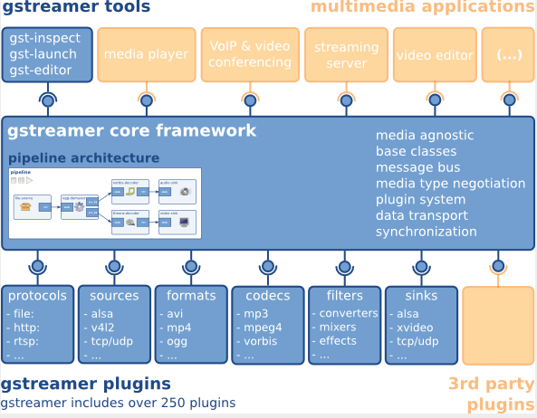

# Gstreamer User Guide


| ----------------- | ------------------ | --------------- | ---------------------- |
| 1.0      | 2025-1-10 | lizhirong  | Initial draft |

## GStreamer Introduction

GStreamer is an open-source multimedia framework. The framework is designed based on plugins, and all plugins can be linked into any predefined data stream pipeline.

Official website: [https://gstreamer.freedesktop.org](https://gstreamer.freedesktop.org/)

### GStreamer Framework

GStreamer can create a series of elements and connect them to allow data streams to be transmitted between these connected elements, thereby creating a pipeline to complete a specific task, such as media playback or recording.

The GStreamer framework is shown in the figure below:

<span style={{display: 'flex',justifyContent: 'center',margin: '10px 0'}}></span>

### Gstreamer Source Code Distribution Structure

Gstreamer divides its various modules into multiple repositories based on functionality. The framework and basic libraries are stored in the gstreamer and gst-plugins-base repositories, while other repositories store various plugins and only depend on these two repositories without interdependencies. The gst-plugins-good repository mainly contains mature plugins, gst-plugins-bad mainly contains plugins under development, and gst-plugins-ugly contains plugins with licensing issues. Users can selectively avoid or install them based on region and regulations.
| Repository          | Function                                    |
|------------------|---------------------------------------|
| gstreamer        | Framework and basic libraries                |
| gst-plugins-base | Framework and basic libraries                |
| gst-plugins-good | Mature plugins                               |
| gst-plugins-bad  | Plugins under development, may have issues   |
| gst-plugins-ugly | Plugins with licensing issues, users can selectively avoid or install based on region and regulations |
| gst-libav        | Plugins for libav codec library              |

### Gstreamer Installation

To install Gstreamer-1.0, run the command:

```
sudo apt-get update

sudo apt-get install gstreamer1.0-tools gstreamer1.0-alsa gstreamer1.0-plugins-base gstreamer1.0-plugins-good  gstreamer1.0-plugins-bad gstreamer1.0-plugins-ugly gstreamer1.0-libav

sudo apt-get install libgstreamer1.0-dev libgstreamer-plugins-base1.0-dev libgstreamer-plugins-good1.0-dev libgstreamer-plugins-bad1.0-dev  
```

To check the version of Gstreamer-1.0, execute the command:

```
gst-inspect-1.0 --version  
```

### Gstreamer Plugin Description

Use the following command to query the default supported plugins of Gstreamer in the bianbu os/bianbu linux system

```
gst-inspect-1.0
```

Adding the plugin name after the gst-inspect-1.0 command will output detailed information about the corresponding plugin.

#### Video Decoder Plugins

The role of video decoders is to convert the video source format into a raw format that can be interpreted by the target receiver (e.g., display). **Spacemit GStreamer supports the proprietary spacemitdec plugin, which can help users achieve better results.**

| Video Decoder | Package            | Description                                             | Bianbu OS(Y/N) | Bianbu Linux(Y/N) |
|---------------|--------------------|---------------------------------------------------------|----------------|-------------------|
| decodebin     | gst-plugins-base   | Autoplug and decode to raw media                        | Y              | Y                 |
| spacemitdec   | gst-plugins-bad    | Decodes H264/H265/MJPEG/VP8/VP9/MPEG2/MPEG4 via MPP API | Y              | Y                 |
| avdec_xxxx    | gstreamer1.0-libav | ffmpeg plugin for GStreamer                             | Y              | Y                 |
| mpeg2dec      | gst-plugins-ugly   | mpeg1 and mpeg2 video decoder                           | Y              | N                 |
| openh264dec   | gst-plugins-bad    | OpenH264 video decoder                                  | Y              | N                 |
| jpegdec       | gst-plugins-good   | Decode images from JPEG format                          | Y              | N                 |
| vp8dec        | gst-plugins-good   | On2 VP8 Decoder                                         | Y              | N                 |
| vp9dec        | gst-plugins-good   | On2 VP9 Decoder                                         | Y              | N                 |
|               |                    |                                                         |                |                   |


#### Video Encoder Plugins

The role of video encoders is to convert raw data into encoded video formats, such as H.264 format. **Spacemit GStreamer supports proprietary spacemit\*enc plugins, which can help users achieve better results.**
| Video Encoder    | Package            | Description                         | Bianbu OS(Y/N) | Bianbu Linux(Y/N) |
|------------------|--------------------|-------------------------------------|----------------|-------------------|
| encodebin        | gst-plugins-base   | Convenience encoding/muxing element | Y              | N                 |
| spacemith264enc  | gst-plugins-bad    | Encodes H264 via MPP API            | Y              | Y                 |
| spacemith265enc  | gst-plugins-bad    | Encodes H265 via MPP API            | Y              | Y                 |
| spacemitmjpegenc | gst-plugins-bad    | Encodes MJPEG via MPP API           | Y              | Y                 |
| spacemitmpegenc  | gst-plugins-bad    | Encodes MPEG2/MPEG4 via MPP API     | Y              | Y                 |
| spacemitvp8enc   | gst-plugins-bad    | Encodes vp8 via MPP API             | Y              | Y                 |
| spacemitvp9enc   | gst-plugins-bad    | Encodes vp9 via MPP API             | Y              | Y                 |
| avenc_xxxx       | gstreamer1.0-libav | ffmpeg plugin for GStreamer         | Y              | Y                 |
| mpeg2enc         | gst-plugins-ugly   | mpeg2enc video encoder              | Y              | N                 |
| openh264enc      | gst-plugins-bad    | OpenH264 video encoder              | Y              | N                 |
| jpegenc          | gst-plugins-good   | JPEG image encoder                  | Y              | N                 |
| vp8enc           | gst-plugins-good   | On2 VP8 Encoder                     | Y              | N                 |
| vp9enc           | gst-plugins-good   | On2 VP9 Encoder                     | Y              | N                 |
|                  |                    |                                     |                |                   |


#### Video Sink Plugins

The role of video sink plugins is to display the processed data through display output. **Spacemit GStreamer optimizes the glimagesink/gtkglsink/waylandsink plugins, which can help users achieve better results.**
| Video Encoder  | Package          | Description                                             | Bianbu OS(Y/N) | Bianbu Linux(Y/N) |
|----------------|------------------|---------------------------------------------------------|----------------|-------------------|
| autovideosink  | gst-plugins-good | Wrapper video sink for automatically detected videosink | Y              | Y                 |
| glimagesink    | gst-plugins-base | Infrastructure to process GL textures                   | Y              | N                 |
| waylandsink    | gst-plugins-bad  | Output to wayland surface                               | Y              | Y                 |
| gtkglsink      | gst-plugins-good | A video sink that renders to a GtkWidget using OpenGL   | Y              | N                 |
| fpsdisplaysink | gst-plugins-bad  | Video sink with current and average framerate           | Y              | N                 |


#### Demux Plugins

The role of demuxer plugins is to convert different video/audio formats into raw data.
| Video Demux   | Package          | Description                        | Bianbu OS(Y/N) | Bianbu Linux(Y/N) |
|---------------|------------------|------------------------------------|----------------|-------------------|
| qtdemux       | gst-plugins-good | Demux a .mov/.mp4 file to raw data | Y              | Y                 |
| matroskedemux | gst-plugins-good | Demux a .mkv file to raw data      | Y              | N                 |
| flvdemux      | gst-plugins-good | Demux a .flv file to raw data      | Y              | N                 |
| avidemux      | gst-plugins-good | Demux a .avi file to raw data      | Y              | Y                 |


#### Mux Plugins

The role of muxer plugins is to convert raw unparsed data into specific video/audio data.
| Video Mux   | Package          | Description                   | Bianbu OS(Y/N) | Bianbu Linux(Y/N) |
|-------------|------------------|-------------------------------|----------------|-------------------|
| qtmux       | gst-plugins-good | Mux raw data to a .mov file   | Y              | Y                 |
| matroskemux | gst-plugins-good | Mux raw data to a .mkv file   | Y              | N                 |
| flvmux      | gst-plugins-good | Mux raw data to a .flv file   | Y              | N                 |
| avimux      | gst-plugins-good | Mux raw data to a .avi file   | Y              | Y                 |
| mp4mux      | gst-plugins-good | Mux raw data to a .mp4 file   | Y              | Y                 |
|             |                  |                               |                |                   |


#### Audio Plugins

The role of audio plugins is to process data from raw audio formats or specific audio data formats (e.g., WAV).
| Audio Plugin   | Package          | Description                                     | Bianbu OS(Y/N) | Bianbu Linux(Y/N) |
|----------------|------------------|-------------------------------------------------|----------------|-------------------|
| mpg123audiodec | gst-plugins-good | MP3 decoding plugin based on the mpg123 library | Y              | N                 |
| vorbisdec      | gst-plugins-base | Decodes raw vorbis streams to float audio       | Y              | N                 |
| vorbisenc      | gst-plugins-base | Encodes audio in Vorbis format                  | Y              | N                 |
| alsasink       | gst-plugins-base | Output to a sound card via ALSA                 | Y              | N                 |
| pulsesink      | gst-plugins-good | Plays audio to a PulseAudio server              | Y              | N                 |


#### Image Plugins

The role of image plugins is to process data from raw image formats or specific data formats (e.g., JPEG).
| Image Plugin     | Package          | Description                                             | Bianbu OS(Y/N) | Bianbu Linux(Y/N) |
|------------------|------------------|---------------------------------------------------------|----------------|-------------------|
| spacemitdec      | gst-plugins-bad  | Decodes H264/H265/MJPEG/VP8/VP9/MPEG2/MPEG4 via MPP API | Y              | Y                 |
| spacemitmjpegenc | gst-plugins-bad  | Encodes MJPEG via MPP API                               | Y              | Y                 |
| imagefreeze      | gst-plugins-good | Generates a still frame stream from an image            | Y              | N                 |
| jpegdec          | gst-plugins-good | Decode images from JPEG format                          | Y              | N                 |
| jpegenc          | gst-plugins-good | JPEG image encoder                                      | Y              | N                 |
| pngdec           | gst-plugins-good | Decode a png video frame to a raw image                 | Y              | N                 |
| pngenc           | gst-plugins-good | Encode a video frame to a .png image                    | Y              | N                 |
|                  |                  |                                                         |                |                   |


#### Network Protocol Plugins

The role of network protocol plugins is to establish network connections between devices.
| Network Plugins | Package          | Description                                                      | Bianbu OS(Y/N) | Bianbu Linux(Y/N) |
|-----------------|------------------|------------------------------------------------------------------|----------------|-------------------|
| udpsink         | gst-plugins-good | Send data over the network via UDP                               | Y              | Y                 |
| multiudpsink    | gst-plugins-good | Send data over the network via UDP to one or multiple recipients | Y              | Y                 |
| udpsrc          | gst-plugins-good | Receive data over the network via UDP                            | Y              | Y                 |
| tcpserversink   | gst-plugins-base | Send data as a server over the network via TCP                   | Y              | N                 |
| tcpclientsrc    | gst-plugins-base | Receive data as a client over the network via TCP                | Y              | N                 |
| rtspsrc         | gst-plugins-good | Receive data over the network via RTSP                           | Y              | N                 |


#### Payload/Depayload Plugins

Payload plugins are responsible for transmitting data over the network, while depayload plugins are used in conjunction with these plugins to receive and unpack data.
| Network Plugins | Package          | Description                                                           | Bianbu OS(Y/N) | Bianbu Linux(Y/N) |
|-----------------|------------------|-----------------------------------------------------------------------|----------------|-------------------|
| gdppay          | gst-plugins-bad  | Payloads GStreamer Data Protocol buffers                              | Y              | N                 |
| gdpdepay        | gst-plugins-bad  | Depayloads GStreamer Data Protocol buffers                            | Y              | N                 |
| rtpvrawpay      | gst-plugins-good | Payload raw video as RTP packets                                      | Y              | Y                 |
| rtpvrawdepay    | gst-plugins-good | Extracts raw video as RTP packets                                     | Y              | Y                 |
| rtph264pay      | gst-plugins-good | Payload-encode H264 video into RTP packets                            | Y              | Y                 |
| rtph264depay    | gst-plugins-good | Extracts H264 video from RTP packets                                  | Y              | Y                 |
| rtpmpapay       | gst-plugins-good | Payload MPEG audio as RTP packets                                     | Y              | Y                 |
| rtpmpadepay     | gst-plugins-good | Extracts MPEG audio from RTP packets                                  | Y              | Y                 |
| rtpjitterbuffer | gst-plugins-good | A buffer that deals with network jitter and other transmission faults | Y              | Y                 |


## Gstreamer Basic Commands

### gst-launch-1.0

gst-launch-1.0: Used to start a pipeline to complete a specific task, such as media playback or recording. Below are some common usage examples (mainly using spacemit adapted gstreamer plugins):

#### Camera Application Scenarios

##### UVC Camera

- UVC camera information can be obtained using the following command:

```
$ gst-device-monitor-1.0
Device found:

        name  : UvcH264 HD Pro Webcam C920
        class : Video/CameraSource
        caps  : video/x-raw, format=YUY2, width=2304, height=1536, pixel-aspect-ratio=1/1, framerate=2/1
                video/x-raw, format=YUY2, width=2304, height=1296, pixel-aspect-ratio=1/1, framerate=2/1
                video/x-raw, format=YUY2, width=1920, height=1080, pixel-aspect-ratio=1/1, framerate=5/1
                video/x-raw, format=YUY2, width=1600, height=896, pixel-aspect-ratio=1/1, framerate={ (fraction)15/2, (fraction)5/1 }
                video/x-raw, format=YUY2, width=1280, height=720, pixel-aspect-ratio=1/1, framerate={ (fraction)10/1, (fraction)15/2, (fraction)5/1 }
                video/x-raw, format=YUY2, width=960, height=720, pixel-aspect-ratio=1/1, framerate={ (fraction)15/1, (fraction)10/1, (fraction)15/2, (fraction)5/1 }
                video/x-raw, format=YUY2, width=1024, height=576, pixel-aspect-ratio=1/1, framerate={ (fraction)15/1, (fraction)10/1, (fraction)15/2, (fraction)5/1 }
                video/x-raw, format=YUY2, width=800, height=600, pixel-aspect-ratio=1/1, framerate={ (fraction)24/1, (fraction)20/1, (fraction)15/1, (fraction)10/1, (fraction)15/2, (fraction)5/1 }
                video/x-raw, format=YUY2, width=864, height=480, pixel-aspect-ratio=1/1, framerate={ (fraction)24/1, (fraction)20/1, (fraction)15/1, (fraction)10/1, (fraction)15/2, (fraction)5/1 }
                video/x-raw, format=YUY2, width=800, height=448, pixel-aspect-ratio=1/1, framerate={ (fraction)30/1, (fraction)24/1, (fraction)20/1, (fraction)15/1, (fraction)10/1, (fraction)15/2, (fraction)5/1 }
                video/x-raw, format=YUY2, width=640, height=480, pixel-aspect-ratio=1/1, framerate={ (fraction)30/1, (fraction)24/1, (fraction)20/1, (fraction)15/1, (fraction)10/1, (fraction)15/2, (fraction)5/1 }
                video/x-raw, format=YUY2, width=640, height=360, pixel-aspect-ratio=1/1, framerate={ (fraction)30/1, (fraction)24/1, (fraction)20/1, (fraction)15/1, (fraction)10/1, (fraction)15/2
