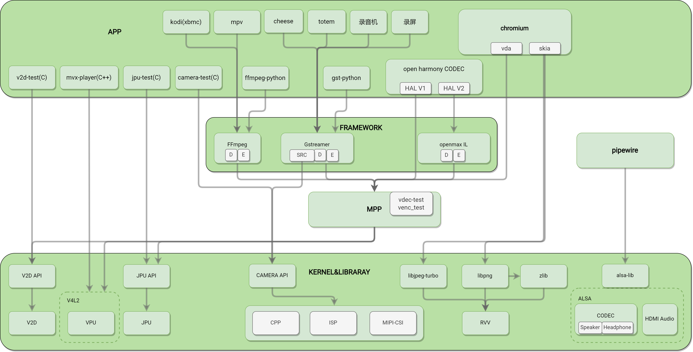
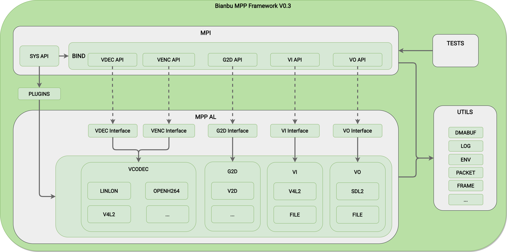
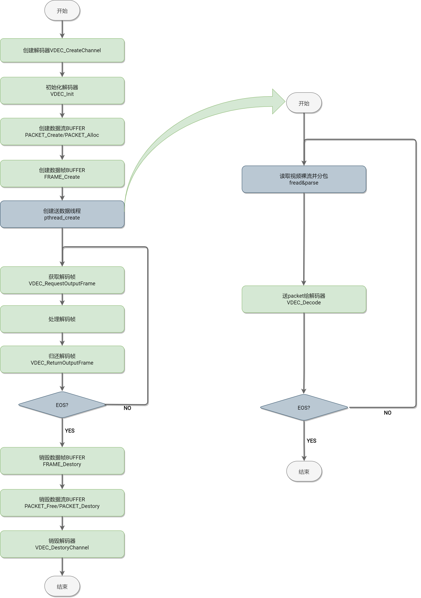
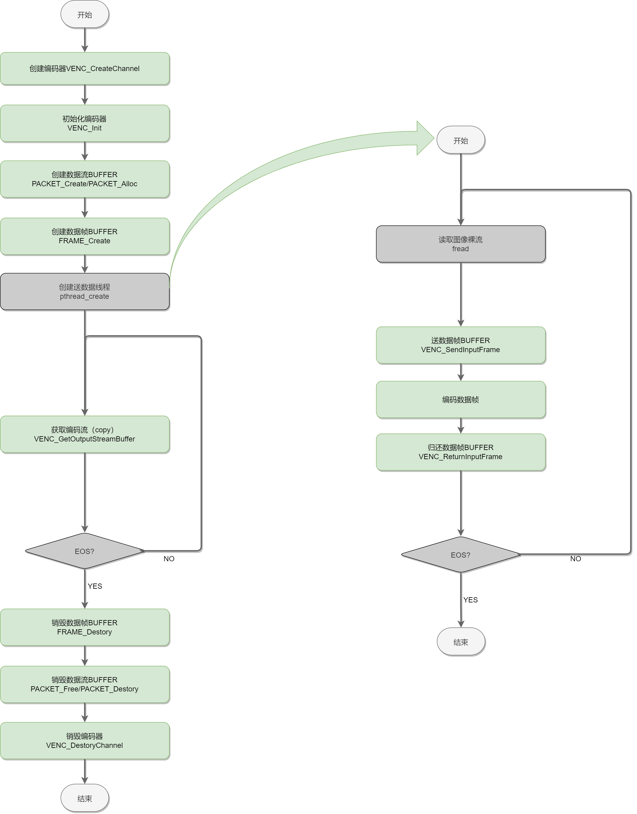
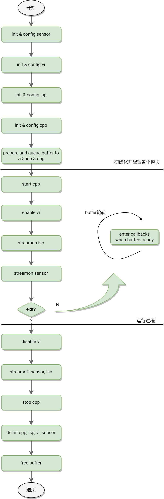
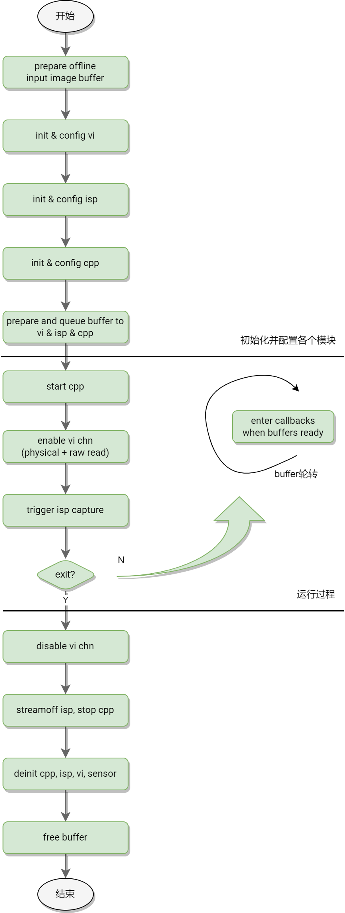

# MPP

MPP (Multimedia Processing Platform) Development Guide.

## 1. Overview

### 1.1 Purpose

This document primarily introduces the framework hierarchy and open API interfaces related to multimedia in SpacemiT, facilitating developers to quickly get started or perform secondary development.

### 1.2 Scope

Applicable to SpacemiT's K1 series SOC.

### 1.3 Target Audience

- Application Development Engineers
- Multimedia Middleware Development and Maintenance Engineers

### 1.4 Document Structure

This document first introduces the overall multimedia framework structure and its brief description, followed by detailed explanations of the MPP module, VPU module, JPU module, ISP/CPP/MIPI-CSI module, etc.

## 2 Multimedia Framework

### 2.1 Framework Hierarchy Diagram and Description



The framework is divided into 4 layers, from top to bottom:

- **APP Layer**: Includes third-party apps and self-developed apps. Third-party apps generally use open-source frameworks like GStreamer and FFmpeg for video encoding and decoding. For example, the default mpv player in Bianbu and commonly used Video (totem). Self-developed apps currently include reference demos or tests provided by us that interface with the API.
  - **mpv**: Default local player in the Bianbu desktop system, interfaced with K1 hardware decoder, supports hardware decoding of H.264/HEVC/VP8/VP9/MPEG-4/MPEG-2/MJPEG, etc., up to 4K60 video playback.
  - **totem**: Default local player in the Ubuntu desktop system, interfaced with K1 hardware decoder, supports hardware decoding of H.264/HEVC/VP8/VP9/MPEG-4/MPEG-2/MJPEG, etc., currently up to 4K30 video playback.
  - **cheese**: Default camera app in the Bianbu/Ubuntu desktop system, supports preview, photo capture, and video recording, currently interfaced with K1 hardware encoder/decoder, enabling smooth 1080P30 preview and recording.
  - **chromium**: Default browser in the Bianbu desktop system, interfaced with K1 hardware decoder, supports hardware decoding of H.264/HEVC, etc., up to 4K30 video playback.
  - **kodi**: Open-source player commonly used by developers and enthusiasts, interfaced with K1 hardware decoder, supports hardware decoding of H.264/HEVC/VP8/VP9, etc., up to 4K60 video playback.
  - **v2d-test**: Test program for the V2D module, also serves as a reference demo. The V2D module mainly performs non-compressed image format conversion, rotation, scaling, etc.
  - **mvx-player**: Test program for the VPU module, also serves as a reference demo, performs video encoding and decoding via command line, output saved as files.
  - **jpu-test**: Test program for the JPU module, also serves as a reference demo, performs video encoding and decoding via command line, output saved as files. The JPU module mainly performs JPEG image encoding and decoding.
  - **camera-test**: Test program for the CAMERA pathway, also serves as a reference demo, performs image capture via command line. This test program is mainly for the API provided by K1's CPP-ISP-MIPICSI module, excluding USB cameras. For USB cameras, please use open-source standard test programs like v4l-utils.
- **Open Source Multimedia Framework Layer (FRAMEWORK)**: Commonly includes GStreamer and FFmpeg. GStreamer and FFmpeg are comprehensive multimedia solutions, including muxer/demuxer/decoder/encoder/display implementations, and can be used directly as open-source frameworks. In this layer, we have implemented multiple plugins to interface with the hardware encoding/decoding library via MPP.
  - **FFmpeg**: Interfaced with K1 hardware encoder/decoder, supports hardware decoding of H.264/HEVC/VP8/VP9/MPEG-4/MPEG-2/MJPEG, etc., up to 4K60 video playback, supports AV_PIX_FMT_DRM_PRIME and AV_PIX_FMT_NV12 output pixel formats, supports hardware encoding of H.264/H.265/VP8/VP9/MJPEG, etc., up to 4K30 encoding.
  - **Gstreamer**: Interfaced with K1 hardware encoder/decoder, supports hardware decoding of H.264/HEVC/VP8/VP9/MPEG-4/MPEG-2/MJPEG, etc., up to 4K30 video playback, supports hardware encoding of H.264/H.265/VP8/VP9/MJPEG, etc., up to 1080P60 encoding.
  - **Openmax IL**: Encoding/decoding adaptation in progress.
- **MPP**: Provides a unified multimedia API to the upper layer and dynamically loads different platform encoding/decoding library plugins to call the encoding/decoding library.
- **Driver & Library**: Drivers and API dynamic libraries provided by IP vendors.

### 2.2 Terminology

- **VPU**: (Video Processing Unit) Hardware with video encoding/decoding capabilities, improving encoding/decoding efficiency and reducing CPU load. K1's VPU is based on the standard V4L2 framework, supporting decoding of H.264/HEVC/VP8/VP9/MJPEG/MPEG4 and encoding of H.264/HEVC/VP8/VP9/MJPEG.
- **V2D**: Image processing hardware module provided by K1, supporting image format conversion, scaling, cropping, etc.
- **JPU**: (Jpeg Processing Unit) Hardware for JPEG image encoding/decoding, improving JPEG encoding/decoding efficiency and reducing CPU load.
- **ISP**: Image processing module, processing image signals output by sensors, achieving desired image effects through a series of digital image processing algorithms.
- **CPP**: Image post-processing module, offline processing NV12 data output by ISP, pyramid multi-layer time-sharing processing, including lens distortion correction, spatial and temporal noise reduction, frequency domain noise reduction, edge enhancement, etc.
- **RVV**: Vector extension based on the RISC-V core instruction set architecture. The purpose of vector extension is to achieve parallel data operations at the instruction level to accelerate computation, similar to ARM's neon.
- **MPP**: (Multimedia Processing Platform) Multimedia processing platform.
- **Gstreamer**: An open-source multimedia framework for building streaming media applications and processing audio/video data. It provides a set of libraries and tools for creating, processing, and playing various multimedia streams, including audio, video, and streaming media. Gstreamer supports multiple codecs and formats and can run on different platforms, making it a flexible and powerful multimedia processing framework.
- **FFmpeg**: Open-source cross-platform audio/video processing tool, used for recording, converting, and streaming audio/video content, as well as audio/video editing and processing. It supports multiple audio/video formats and codecs and can run on different operating systems, including Windows, Mac, and Linux. FFmpeg is a powerful and flexible tool widely used in multimedia processing.
- **V4L2**: Abbreviation for Video for Linux 2, a driver interface for video capture and output devices on Linux systems. It provides a unified way to access video devices, including cameras, video capture cards, and other video input/output devices. The V4L2 interface allows user programs to control and use video devices through a unified API, enabling video capture, processing, and display. This makes developing video applications on Linux systems simpler and more flexible.
- **ALSA**: Abbreviation for Advanced Linux Sound Architecture, a software architecture for handling audio and audio devices on Linux systems. It provides a unified audio interface, allowing applications to communicate with audio hardware, supporting multiple audio devices and formats, and providing low-latency and high-quality audio processing. ALSA also provides a set of tools and libraries for configuring and managing audio devices, as well as writing audio applications. ALSA has become the mainstream audio architecture on Linux systems and is widely used in various Linux distributions.

## 3 MPP

### 3.1 Module Introduction

#### 3.1.1 Background

MPP (Multimedia Processing Platform) is part of the self-developed operating system Bianbu, aiming to encapsulate the usage differences of hardware encoding/decoding across multiple platforms and provide a unified API for developers.

#### 3.1.2 Terminology

- **MPP (Multimedia Processing Platform)**: Multimedia processing platform.
- **MPI (Multimedia Processing Interface)**: API provided by the multimedia processing platform for upper-layer calls.
- **MPP AL**: Abstraction layer, abstracting multimedia interfaces for different IPs, SOCs, and solutions.
- **Packet**: Data packet, mainly representing compressed data, i.e., data before decoding or after encoding, such as H.264/H.265 video streams.
- **Frame**: Data frame, mainly representing uncompressed data, i.e., data after decoding or before encoding, such as YUV420 images.

#### 3.1.3 Module Functions

Currently, MPP mainly includes the following parts:

- **VDEC**: Video decoding submodule and open API, mainly used for decoding various data stream packets.
- **VENC**: Video encoding submodule and open API, mainly used for encoding RGB/YUV data frames.
- **G2D**: 2D graphics processing acceleration submodule and open API, mainly performing format conversion, scaling, rotation, cropping, etc., on data frames.
- **BIND System**: Supports dynamic binding of multiple modules.
- **AL (Abstract Layer)**: Supports multiple platforms.
- **VI**: Video input submodule and open API, currently only supports file input and standard V4L2 input.
- **VO**: Video output submodule and open API, currently only supports file output and SDL2 video output.

Excluded parts:

- **AI/AO**: Audio input/output, handled by standard pipewire->alsa-lib->alsa driver.
- **AENC/ADEC**: Pure software implementation, fully supported by open-source frameworks like GStreamer/FFmpeg, currently not supported.

#### 3.1.4 Configuration Instructions

##### 3.1.4.1 Debug Configuration

- **MPP_PRINT_BUFFER**: Environment variable, default 0, set to 1 to print buffer status in real-time.
- **MPP_SAVE_OUTPUT_BUFFER**: Environment variable, default 0, set to 1 to save decoded YUV buffer. YUV buffer is large, may cause playback lag and occupy significant storage space, please note.
- **MPP_SAVE_OUTPUT_BUFFER_PATH**: Environment variable, used to configure the output YUV file path, default /home/bianbu/output.yuv, effective only when MPP_SAVE_OUTPUT_BUFFER is enabled.
- **MPP_FRINT_UNFREE_PACKET**: Environment variable, default 0, set to 1 to print packet allocation and release status in real-time.
- **MPP_FRINT_UNFREE_FRAME**: Environment variable, default 0, set to 1 to print frame allocation and release status in real-time.
- **MPP_FRINT_UNFREE_DMABUF**: Environment variable, default 0, set to 1 to print dmabuf allocation and release status in real-time.

Usage example:

```shell
# Need to print buffer status in real-time
export MPP_PRINT_BUFFER=1

# Need to save decoded YUV data to /mnt/a.yuv
export MPP_SAVE_OUTPUT_BUFFER=1
export MPP_SAVE_OUTPUT_BUFFER_PATH=/mnt/a.yuv
```

##### 3.1.4.2 Parameter Configuration

No configuration parameters provided yet.

#### 3.1.5 Source Code

##### 3.1.5.1 Source Code Location

MPP source code is located at:

```shell
bianbu-linux/package-src/mpp
```

##### 3.1.5.2 Source Code Compilation

The bianbu-linux solution has compilation enabled by default. If code modifications are needed, recompile by executing:

```shell
make mpp-rebuild
```

##### 3.1.5.3 Source Code Structure

MPP source code structure and brief description (simplified):
```shell
|-- al                               ; AL (Abstract Layer) code, interfaces with platform-specific modules or drivers
|   |-- CMakeLists.txt
|   |-- include
|   |   |-- al_interface_base.h      ; AL layer interface base class
|   |   |-- al_interface_dec.h       ; AL layer decoding interface base class, inherits from base
|   |   |-- al_interface_enc.h       ; AL layer encoding interface base class, inherits from base
|   |   |-- al_interface_g2d.h       ; AL layer image conversion interface base class, inherits from base
|   |   |-- al_interface_vi.h        ; AL layer video input interface base class, inherits from base
|   |   `-- al_interface_vo.h        ; AL layer video output interface base class, inherits from base
|   |-- vcodec                       ; Interfaces with multi-platform codec modules or drivers
|   |   |-- chipmedia                ; Interfaces with chipmedia IP codecs
|   |   |   |-- CMakeLists.txt
|   |   |   `-- starfive             ; Interfaces with starfive codec API (not yet implemented)
|   |   |       |-- sfdec_plugin.c
|   |   |       `-- sfenc_plugin.c
|   |   |-- CMakeLists.txt
|   |   |-- debug                    ; Virtual decoding plugin, outputs simple solid color images for debugging
|   |   |   |-- CMakeLists.txt
|   |   |   `-- fake_dec_plugin.c
|   |   |-- ffmpeg                   ; Interfaces with ffmpeg software codec for debugging
|   |   |   |-- CMakeLists.txt
|   |   |   |-- ffmpegdec.c
|   |   |   |-- ffmpegenc.c
|   |   |   `-- ffmpegswscale.c
|   |   |-- k1
|   |   |   |-- CMakeLists.txt
|   |   |   `-- jpu                  ; Interfaces with K1 Jpu codec (not yet implemented)
|   |   |       |-- include
|   |   |       |-- jpudec.c
|   |   |       `-- jpuenc.c
|   |   |-- openh264                 ; Interfaces with openh264 software codec library for debugging
|   |   |   |-- CMakeLists.txt
|   |   |   |-- include
|   |   |   |   `-- wels
|   |   |   |       |-- codec_api.h
|   |   |   |       |-- codec_app_def.h
|   |   |   |       |-- codec_def.h
|   |   |   |       `-- codec_ver.h
|   |   |   |-- openh264dec.cpp
|   |   |   |-- openh264enc.cpp
|   |   |   `-- README.md
|   |   |-- openmax                  ; Interfaces with openmax
|   |   |   |-- CMakeLists.txt
|   |   |   |-- include
|   |   |   |   |-- khronos
|   |   |   |   |   |-- OMX_Audio.h
|   |   |   |   |   |-- OMX_ComponentExt.h
|   |   |   |   |   |-- OMX_Component.h
|   |   |   |   |   |-- OMX_ContentPipe.h
|   |   |   |   |   |-- OMX_CoreExt.h
|   |   |   |   |   |-- OMX_Core.h
|   |   |   |   |   |-- OMX_ImageExt.h
|   |   |   |   |   |-- OMX_Image.h
|   |   |   |   |   |-- OMX_IndexExt.h
|   |   |   |   |   |-- OMX_Index.h
|   |   |   |   |   |-- OMX_IVCommon.h
|   |   |   |   |   |-- OMX_Other.h
|   |   |   |   |   |-- OMX_Types.h
|   |   |   |   |   |-- OMX_VideoExt.h
|   |   |   |   |   `-- OMX_Video.h
|   |   |   |   |-- sfomxil_find_dec_library.h
|   |   |   |   `-- sfomxil_find_enc_library.h
|   |   |   `-- starfive             ; Interfaces with starfive openmaxIL layer video codec
|   |   |       |-- sfomxil_dec_plugin.c
|   |   |       `-- sfomxil_enc_plugin.c
|   |   |-- v4l2                     ; Interfaces with V4L2 codec
|   |   |   |-- CMakeLists.txt
|   |   |   |-- linlonv5v7           ; Interfaces with linlonv5v7 codec (K1)
|   |   |   |   |-- include
|   |   |   |   |   |-- linlonv5v7_buffer.h
|   |   |   |   |   |-- linlonv5v7_codec.h
|   |   |   |   |   |-- linlonv5v7_constant.h
|   |   |   |   |   |-- linlonv5v7_port.h
|   |   |   |   |   `-- mvx-v4l2-controls.h
|   |   |   |   |-- linlonv5v7_buffer.c
|   |   |   |   |-- linlonv5v7_codec.c
|   |   |   |   |-- linlonv5v7_dec.c
|   |   |   |   |-- linlonv5v7_enc.c
|   |   |   |   `-- linlonv5v7_port.c
|   |   `-- verisilicon              ; Interfaces with verisilicon codec (not implemented)
|   |       |-- CMakeLists.txt
|   |       `-- vc8000.c
|   |-- vi                           ; Interfaces with multi-platform video input modules or drivers
|   |   |-- CMakeLists.txt
|   |   |-- file                     ; Video input through File
|   |   |   |-- include
|   |   |   |   |-- defaultparse.h
|   |   |   |   |-- h264parse.h
|   |   |   |   |-- h265parse.h
|   |   |   |   |-- mjpegparse.h
|   |   |   |   `-- parse.h
|   |   |   |-- parse
|   |   |   |   |-- defaultparse.c
|   |   |   |   |-- h264parse.c
|   |   |   |   |-- h265parse.c
|   |   |   |   |-- mjpegparse.c
|   |   |   |   `-- parse.c
|   |   |   `-- vi_file.c
|   |   |-- k1                       ; Video input through K1 ISP, not yet implemented
|   |   |   `-- cam
|   |   |       |-- include
|   |   |       `-- vi_k1_cam.c
|   |   `-- v4l2                     ; Video input through standard V4L2
|   |       |-- include
|   |       `-- vi_v4l2.c
|   |-- vo                           ; Interfaces with multi-platform video output modules or drivers
|   |   |-- CMakeLists.txt
|   |   |-- file                     ; Video output to File
|   |   |   `-- vo_file.c
|   |   `-- sdl2                     ; Video output through SDL2
|   |       |-- include
|   |       |   |-- begin_code.h
|   |       |   |-- close_code.h
|   |       |   |-- SDL_assert.h
|   |       |   |-- SDL_atomic.h
|   |       |   `-- SDL_vulkan.h
|   |       `-- vo_sdl2.c
|   `-- vps                          ; Interfaces with multi-platform video processing modules or drivers
|       |-- CMakeLists.txt
|       `-- k1
|           |-- CMakeLists.txt
|           `-- v2d                  ; Interfaces with K1 v2d module, implements basic framework
|               |-- include
|               |   |-- asr_v2d_api.h
|               |   `-- asr_v2d_type.h
|               `-- v2d.c
|-- cmake                            ; Finds system modules
|   `-- modules
|       |-- Findlibavcodec.cmake
|       |-- Findlibopenh264.cmake
|       |-- Findlibsfdec.cmake
|       |-- Findlibsfenc.cmake
|       `-- Findlibsf-omx-il.cmake
|-- CMakeLists.txt
|-- compile_install_completely.sh
|-- debian                           ; deb package build directory
|   |-- bianbu.conf
|   |-- changelog
|   |-- compat
|   |-- control
|   |-- copyright
|   |-- install
|   |-- README.Debian
|   |-- rules
|   |-- source
|   |   `-- format
|   |-- usr
|   |   `-- lib
|   |       `-- udev
|   |           `-- rules.d
|   |               `-- 99-video.rules
|   `-- watch
|-- doc                              ; Documentation
|   |-- C_naming_conventions.md
|   `-- MPP Module Design Document V0.1.pdf
|-- do_test.sh
|-- format.sh
|-- include                          ; API header files
|   |-- data.h                       ; MppData base class
|   |-- dataqueue.h                  ; Data queue management API
|   |-- dmabufwrapper.h              ; dmabuf management API
|   |-- frame.h                      ; Frame management API
|   |-- g2d.h                        ; Image processing API
|   |-- packet.h                     ; Packet management API
|   |-- para.h                       ; Parameter structures
|   |-- processflow.h
|   |-- ringbuffer.h                 ; Ring buffer management API
|   |-- sys.h                        ; SYS related API
|   |-- vdec.h                       ; Video decoding API
|   `-- venc.h                       ; Video encoding API
|   |-- vi.h                         ; Video input API
|   `-- vo.h                         ; Video output API
|-- LICENSE
|-- mpi                              ; API interface implementation
|   |-- CMakeLists.txt
|   |-- g2d.c
|   |-- include
|   |   `-- module.h
|   |-- module.c
|   |-- sys.c
|   |-- vdec.c
|   |-- venc.c
|   |-- vi.c
|   `-- vo.c
|-- mpp.cppcheck
|-- pack_to_tar_gz.sh
|-- pkgconfig
|   `-- spacemit_mpp.pc.cmake
|-- remove_space_end_of_line.sh
|-- test                             ; Test programs, test scripts, test files, etc.
|   |-- CMakeLists.txt
|   |-- g2d_test.c
|   |-- include
|   |   |-- argument.h
|   |   |-- const.h
|   |   |-- defaultparse.h
|   |   |-- h264parse.h
|   |   |-- h265parse.h
|   |   |-- mjpegparse.h
|   |   `-- parse.h
|   |-- parse
|   |   |-- defaultparse.c
|   |   |-- h264parse.c
|   |   |-- h265parse.c
|   |   |-- mjpegparse.c
|   |   `-- parse.c
|   |-- test_script
|   |   |-- cases
|   |   |   `-- vdec.csv
|   |   |-- streams
|   |   `-- vdec_test.sh
|   |-- test_sys_vdec_venc_one_frame.c
|   |-- test_sys_vdec_venc_vdec_one_frame.c
|   |-- test_sys_venc_vdec_one_frame.c
|   |-- vi_file_vdec_venc_sync_userptr_vo_file_test.c
|   |-- vi_file_vdec_vo_test.c
|   |-- vi_file_venc_sync_userptr_vo_file_test.c
|   `-- vi_v4l2_vo_test.c
|-- thirdparty
|   |-- ffmpeg_compile_install.md
|   `-- openh264_compile_install.md
`-- utils                            ; Utilities
    |-- CMakeLists.txt
    |-- dataqueue.c                  ; Data queue implementation
    |-- dmabufwrapper.c              ; dmabuf management implementation
    |-- env.c
    |-- frame.c                      ; frame management implementation
    |-- include
    |   |-- env.h
    |   |-- log.h
    |   |-- resolution_utils.h
    |   |-- type.h
    |   `-- v4l2_utils.h
    |-- log.c
    |-- os
    |   |-- include
    |   |   |-- os_env.h
    |   |   `-- os_log.h
    |   `-- linux
    |       |-- os_env.c
    |       `-- os_log.c
    |-- packet.c                     ; packet management implementation
    |-- resolution_utils.c
    |-- ringbuffer.c
    |-- utils.c
    `-- v4l2_utils.c
```

### 3.2 MPP Framework Structure Diagram



From the framework structure, it is mainly divided into 2 layers, as follows:

- **MPI**: Interface layer, mainly includes the API and its implementation for the upper layer
- **MPP AL**: Abstraction layer, shielding the differences between different platforms and hardware

From the functional perspective, it is divided into:

- **MPI**: Interface layer
- **MPP AL**: Abstraction layer
- **TESTS**: Test programs, test cases, and test streams
- **UTILS**: Utility package, basic function implementation, including PACKET/FRAME management, log output, environment variable reading and writing, etc.
- **SYS**: Mainly implements dynamic loading of plugins and BIND system

### 3.3 Key Processes

#### 3.3.1 Decoding Process



#### 3.3.2 Encoding Process



### 3.4 Data Structures

#### 3.4.1 General Data Structures

##### 3.4.1.1 enum MppModuleType

This enumeration type defines the supported plugin types, which can be used to select plugins through this enumeration. AUTO indicates selecting plugins according to the default priority (logic not yet complete). On K1, encoding and decoding generally choose CODEC_V4L2_LINLONV5V7.

```c
/***
 * @description: all codec mpp support
 */

/*

+-----------------------+---------+---------+-----------+
|                       | DECODER | ENCODER | CONVERTER |
+=======================+=========+=========+===========+
| CODEC_OPENH264        | √       | √       | x         |
+-----------------------+---------+---------+-----------+
| CODEC_FFMPEG          | √       | √       | x         |
+-----------------------+---------+---------+-----------+
| CODEC_SFDEC           | √       | x       | x         |
+-----------------------+---------+---------+-----------+
| CODEC_SFENC           | x       | √       | x         |
+-----------------------+---------+---------+-----------+
| CODEC_CODADEC         | √(jpeg) | x       | x         |
+-----------------------+---------+---------+-----------+
| CODEC_SFOMX           | √       | √       | x         |
+-----------------------+---------+---------+-----------+
| CODEC_V4L2            | √       | √       | x         |
+-----------------------+---------+---------+-----------+
| CODEC_FAKEDEC         | √       | x       | x         |
+-----------------------+---------+---------+-----------+
| CODEC_V4L2_LINLONV5V7 | √       | √       | x         |
+-----------------------+---------+---------+-----------+
| CODEC_K1_JPU          | √       | √       | x         |
+-----------------------+---------+---------+-----------+
| VO_SDL2               | x       | x       | x         |
+-----------------------+---------+---------+-----------+
| VO_FILE               | x       | x       | x         |
+-----------------------+---------+---------+-----------+
| VI_V4L2               | x       | x       | x         |
+-----------------------+---------+---------+-----------+
| VI_K1_CAM             | x       | x       | x         |
+-----------------------+---------+---------+-----------+
| VI_FILE               | x       | x       | x         |
+-----------------------+---------+---------+-----------+
| VPS_K1_V2D            | x       | x       | √         |
+-----------------------+---------+---------+-----------+

*/

typedef enum _MppModuleType {
  /***
   * auto mode, mpp select suitable codec.
   */
  CODEC_AUTO = 0,

  /***
   * use openh264 soft codec api, support decoder and encoder
   */
  CODEC_OPENH264,

  /***
   * use ffmpeg avcodec api, support decoder and encoder.
   */
  CODEC_FFMPEG,

  /***
   * use starfive wave511 vpu api for video decoder.
   */
  CODEC_SFDEC,

  /***
   * use starfive wave420l vpu api for video encoder.
   */
  CODEC_SFENC,

  /***
   * use starfive codaj12 vpu api for jpeg video decoder and encoder.
   */
  CODEC_CODADEC,

  /***
   * use starfive omx-il api for video decoder and encoder.
   */
  CODEC_SFOMX,

  /***
   * use V4L2 standard codec interface for video decoder and encoder.
   */
  CODEC_V4L2,

  /***
   * a fake decoder for test, send green frame to application layer.
   */
  CODEC_FAKEDEC,

  /***
   * use ARM LINLON VPU codec interface for video decoder and encoder.(K1)
   */
  CODEC_V4L2_LINLONV5V7,

  /***
   * use jpu for jpeg decoder and encoder (K1).
   */
  CODEC_K1_JPU,

  CODEC_MAX,

  /***
   * auto mode, mpp select suitable vo.
   */
  VO_AUTO = 100,

  /***
   * use sdl2 for output
   */
  VO_SDL2,
  VO_FILE,

  VO_MAX,

  /***
   * auto mode, mpp select suitable vi.
   */
  VI_AUTO = 200,

  /***
   * use standard v4l2 framework for input
   */
  VI_V4L2,

  /***
   * use K1 ISP for input
   */
  VI_K1_CAM,
  VI_FILE,

  VI_MAX,

  /***
   * auto mode, mpp select suitable vi.
   */
  VPS_AUTO = 300,

  /***
   * use v2d for graphic 2D convert (K1).
   */
  VPS_K1_V2D,

  VPS_MAX,
} MppModuleType;
```

The code dynamically loads the plugin library of a specific codec through the following interface.

```c
/**
 * @description: dlopen the video codec library by codec_type
 * @param {MppCodecType} codec_type : input, the codec need to be opened
 * @return {MppModule*} : the module context
 */
 MppModule*  module_init(MppCodecType codec_type)
```

##### 3.4.1.2 enum MppCodingType

This enumeration type defines the supported coding formats, including all formats supported by decoders and encoders. Each codec may only support some of these types, for example, openh264 only supports H264 encoding and decoding.

```c
typedef enum _MppCodingType {
  CODING_UNKNOWN = 0,
  CODING_H263,
  CODING_H264,

  /***
   * Multiview Video Coding, 3D, etc.
   */
  CODING_H264_MVC,

  /***
   * no start code
   */
  CODING_H264_NO_SC,
  CODING_H265,
  CODING_MJPEG,
  CODING_JPEG,
  CODING_VP8,
  CODING_VP9,
  CODING_AV1,
  CODING_AVS,
  CODING_AVS2,
  CODING_MPEG1,
  CODING_MPEG2,
  CODING_MPEG4,
  CODING_RV,

  /***
   * ANNEX_G, Advanced Profile
   */
  CODING_VC1,

  /***
   * ANNEX_L, Simple and Main Profiles
   */
  CODING_VC1_ANNEX_L,
  CODING_FWHT,
  CODING_MAX,
} MppCodingType;
```

It should be particularly noted that each codec has its own defined format types, which need to be converted. Below is an example of ffmpeg format mapping:

```c
#define CODING_TYPE_MAPPING_DEFINE(Type, format)  \
    typedef struct _AL##Type##CodingTypeMapping {  \
        MppCodingType eMppCodingType;  \
        format e##Type##CodingType;  \
    } AL##Type##CodingTypeMapping;

#define CODING_TYPE_MAPPING_CONVERT(Type, type, format)  \
    static MppCodingType get_##type##_mpp_coding_type(format src_type)  \
    {  \
        S32 i = 0;  \
        S32 mapping_length = NUM_OF(stAL##Type##CodingTypeMapping);  \
        for(i = 0; i < mapping_length; i ++)  \
        {  \
            if(src_type == stAL##Type##CodingTypeMapping[i].e##Type##CodingType)  \
                return stAL##Type##CodingTypeMapping[i].eMppCodingType;  \
        }  \
  \
        mpp_loge("Can not find the mapping format, please check it !");  \
        return CODING_UNKNOWN;  \
    }  \
  \
    static format get_##type##_codec_coding_type(MppCodingType src_type)  \
    {  \
        S32 i = 0;  \
        S32 mapping_length = NUM_OF(stAL##Type##CodingTypeMapping);  \
        for(i = 0; i < mapping_length; i ++)  \
        {  \
            if(src_type == stAL##Type##CodingTypeMapping[i].eMppCodingType)  \
                return stAL##Type##CodingTypeMapping[i].e##Type##CodingType;  \
        }  \
  \
        mpp_loge("Can not find the mapping coding type, please check it !");  \
        return CODING_UNKNOWN;  \
    }

...

CODING_TYPE_MAPPING_DEFINE(FFMpegDec, enum AVCodecID)
static const ALFFMpegDecCodingTypeMapping stALFFMpegDecCodingTypeMapping[] = {
    {CODING_H264, AV_CODEC_ID_H264},
    {CODING_H265, AV_CODEC_ID_H265},
    {CODING_MJPEG, AV_CODEC_ID_MJPEG},
    {CODING_VP8, AV_CODEC_ID_VP8},
    {CODING_VP9, AV_CODEC_ID_VP9},
    {CODING_AV1, AV_CODEC_ID_NONE},
    {CODING_AVS, AV_CODEC_ID_AVS},
    {CODING_AVS2, AV_CODEC_ID_AVS2},
    {CODING_MPEG1, AV_CODEC_ID_MPEG1VIDEO},
    {CODING_MPEG2, AV_CODEC_ID_MPEG2VIDEO},
    {CODING_MPEG4, AV_CODEC_ID_MPEG4},
};
CODING_TYPE_MAPPING_CONVERT(FFMpegDec, ffmpegdec, enum AVCodecID)
```

##### 3.4.1.3 enum MppPixelFormat

This enumeration type defines the supported pixel formats, including all formats supported by decoders and encoders. Each codec may only support some of these types.

```c
/***
 * @description: pixelformat mpp or some other platform may use.
 */
typedef enum _MppPixelFormat {
  PIXEL_FORMAT_UNKNOWN = 0,

  /***
   * YYYYYYYYVVUU
   */
  PIXEL_FORMAT_YV12,

  /***
   * YYYYYYYYUUVV  YU12/YUV420P is the same
   */
  PIXEL_FORMAT_I420,

  /***
   * YYYYYYYYVUVU
   */
  PIXEL_FORMAT_NV21,

  /***
   * YYYYYYYYUVUV
   */
  PIXEL_FORMAT_NV12,

  /***
   * 11111111 11000000, 16bit only use 10bit
   */
  PIXEL_FORMAT_YV12_P010,

  /***
   * 11111111 11000000, 16bit only use 10bit
   */
  PIXEL_FORMAT_I420_P010,

  /***
   * 11111111 11000000, 16bit only use 10bit
   */
  PIXEL_FORMAT_NV21_P010,

  /***
   * 11111111 11000000, 16bit only use 10bit
   */
  PIXEL_FORMAT_NV12_P010,
  PIXEL_FORMAT_YV12_P016,
  PIXEL_FORMAT_I420_P016,
  PIXEL_FORMAT_NV21_P016,
  PIXEL_FORMAT_NV12_P016,

  /***
   * YYYYUUVV, YU16 is the same
   */
  PIXEL_FORMAT_YUV422P,

  /***
   * YYYYVVUU
   */
  PIXEL_FORMAT_YV16,

  /***
   * YYYYUVUV  NV16 is the same
   */
  PIXEL_FORMAT_YUV422SP,

  /***
   * YYYYVUVU
   */
  PIXEL_FORMAT_NV61,
  PIXEL_FORMAT_YUV422P_P010,
  PIXEL_FORMAT_YV16_P010,
  PIXEL_FORMAT_YUV422SP_P010,
  PIXEL_FORMAT_NV61_P010,

  /***
   * YYUUVV
   */
  PIXEL_FORMAT_YUV444P,

  /***
   * YYUVUV
   */
  PIXEL_FORMAT_YUV444SP,
  PIXEL_FORMAT_YUYV,
  PIXEL_FORMAT_YVYU,
  PIXEL_FORMAT_UYVY,
  PIXEL_FORMAT_VYUY,
  PIXEL_FORMAT_YUV_MB32_420,
  PIXEL_FORMAT_YUV_MB32_422,
  PIXEL_FORMAT_YUV_MB32_444,
  PIXEL_FORMAT_YUV_MAX,

  PIXEL_FORMAT_RGB_MIN,
  PIXEL_FORMAT_RGBA,
  PIXEL_FORMAT_ARGB,
  PIXEL_FORMAT_ABGR,
  PIXEL_FORMAT_BGRA,
  PIXEL_FORMAT_RGBA_5658,
  PIXEL_FORMAT_ARGB_8565,
  PIXEL_FORMAT_ABGR_8565,
  PIXEL_FORMAT_BGRA_5658,
  PIXEL_FORMAT_RGBA_5551,
  PIXEL_FORMAT_ARGB_1555,
  PIXEL_FORMAT_ABGR_1555,
  PIXEL_FORMAT_BGRA_5551,
  PIXEL_FORMAT_RGBA_4444,
  PIXEL_FORMAT_ARGB_4444,
  PIXEL_FORMAT_ABGR_4444,
  PIXEL_FORMAT_BGRA_4444,
  PIXEL_FORMAT_RGB_888,
  PIXEL_FORMAT_BGR_888,
  PIXEL_FORMAT_RGB_565,
  PIXEL_FORMAT_BGR_565,
  PIXEL_FORMAT_RGB_555,
  PIXEL_FORMAT_BGR_555,
  PIXEL_FORMAT_RGB_444,
  PIXEL_FORMAT_BGR_444,
  PIXEL_FORMAT_RGB_MAX,

  PIXEL_FORMAT_AFBC_YUV420_8,
  PIXEL_FORMAT_AFBC_YUV420_10,
  PIXEL_FORMAT_AFBC_YUV422_8,
  PIXEL_FORMAT_AFBC_YUV422_10,

  /***
   * for usb camera
   */
  PIXEL_FORMAT_H264,
  PIXEL_FORMAT_MJPEG,

  PIXEL_FORMAT_MAX,
} MppPixelFormat;
```

It should be particularly noted that each codec has its own defined format types, which need to be mapped. Below is an example of ffmpeg format mapping:

```c
#define PIXEL_FORMAT_MAPPING_DEFINE(Type, format)  \
    typedef struct _AL##Type##PixelFormatMapping {  \
        MppPixelFormat eMppPixelFormat;  \
        format e##Type##PixelFormat;  \
    } AL##Type##PixelFormatMapping;

#define PIXEL_FORMAT_MAPPING_CONVERT(Type, type, format)  \
    static MppPixelFormat get_##type##_mpp_pixel_format(format src_format)  \
    {  \
        S32 i = 0;  \
        S32 mapping_length = NUM_OF(stAL##Type##PixelFormatMapping);  \
        for(i = 0; i < mapping_length; i ++)  \
        {  \
            if(src_format == stAL##Type##PixelFormatMapping[i].e##Type##PixelFormat)  \
                return stAL##Type##PixelFormatMapping[i].eMppPixelFormat;  \
        }  \
  \
        mpp_loge("Can not find the mapping format, please check it !");  \
        return PIXEL_FORMAT_UNKNOWN;  \
    }  \
  \
    static format get_##type##_codec_pixel_format(MppPixelFormat src_format)  \
    {  \
        S32 i = 0;  \
        S32 mapping_length = NUM_OF(stAL##Type##PixelFormatMapping);  \
        for(i = 0; i < mapping_length; i ++)  \
        {  \
            if(src_format == stAL##Type##PixelFormatMapping[i].eMppPixelFormat)  \
                return stAL##Type##PixelFormatMapping[i].e##Type##PixelFormat;  \
        }  \
  \
        mpp_loge("Can not find the mapping format, please check it !");  \
        return (format)0;  \
    }

...

PIXEL_FORMAT_MAPPING_DEFINE(FFMpegDec, enum AVPixelFormat)
static const ALFFMpegDecPixelFormatMapping stALFFMpegDecPixelFormatMapping[] = {
    {PIXEL_FORMAT_I420, AV_PIX_FMT_YUV420P},
    {PIXEL_FORMAT_NV12, AV_PIX_FMT_NV12},
    {PIXEL_FORMAT_YVYU, AV_PIX_FMT_YVYU422},
    {PIXEL_FORMAT_UYVY, AV_PIX_FMT_UYVY422},
    {PIXEL_FORMAT_YUYV, AV_PIX_FMT_YUYV422},
    {PIXEL_FORMAT_RGBA, AV_PIX_FMT_RGBA},
    {PIXEL_FORMAT_BGRA, AV_PIX_FMT_BGRA},
    {PIXEL_FORMAT_ARGB, AV_PIX_FMT_ARGB},
    {PIXEL_FORMAT_ABGR, AV_PIX_FMT_ABGR},
};
PIXEL_FORMAT_MAPPING_CONVERT(FFMpegDec, ffmpegdec, enum AVPixelFormat)
```

##### 3.4.1.4 struct MppData

Base class for data types, MppPacket and MppFrame inherit from MppData.

```c
/*
 *                  +------------------------+
 *                  |       MppData          |
 *                  +------------------------+
 *                  |   eType                |
 *                  +-----------^------------+
 *                              |
 *            +-----------------+---------------+
 *            |                                 |
 * +----------+-------------+       +-----------+-----------+
 * |       MppPacket        |       |       MppFrame        |
 * +------------------------+       +-----------------------+
 * |   eBaseData            |       |   eBaseData           |
 * |   pData                |       |   nDataUsedNum        |
 * |   nLength              |       |   pData0              |
 * |                        |       |   pData1              |
 * |                        |       |   pData2              |
 * +------------------------+       +-----------------------+
 *
 */

/***
 * @description: mpp data type struct.
 *
 */
typedef enum _MppDataType {
  /***
   * stream type, bitstream, un-decoded data or encoded data maybe.
   */
  MPP_DATA_STREAM = 1,

  /***
   * frame type, YUV/RGB format, decoded data or un-encoded data maybe.
   */
  MPP_DATA_FRAME = 2,

  MPP_DATA_UNKNOWN = 1023
} MppDataType;

/***
 * @description: abstruct MppData struct.
 *
 * important struct.
 *
 * data abstruct from MppFrame and MppPacket.
 */
typedef struct _MppData {
  MppDataType eType;
} MppData;
```

##### 3.4.1.5 enum MppReturnValue

MPP return values:

```c
typedef enum _MppReturnValue {
  MPP_OK = 0,

  /***
   * error about memory
   */
  MPP_OUT_OF_MEM = -1,
  MPP_MALLOC_FAILED = -2,
  MPP_MMAP_FAILED = -3,
  MPP_MUNMAP_FAILED = -4,
  MPP_NULL_POINTER = -5,

  /***
   * error about file
   */
  MPP_FILE_NOT_EXIST = -100,
  MPP_OPEN_FAILED = -101,
  MPP_IOCTL_FAILED = -102,
  MPP_CLOSE_FAILED = -103,
  MPP_POLL_FAILED = -104,

  /***
   * error about codec
   */
  MPP_NO_STREAM = -200,
  MPP_NO_FRAME = -201,
  MPP_DECODER_ERROR = -202,
  MPP_ENCODER_ERROR = -203,
  MPP_CONVERTER_ERROR = -204,
  MPP_CODER_EOS = -205,
  MPP_CODER_NO_DATA = -206,
  MPP_RESOLUTION_CHANGED = -207,
  MPP_ERROR_FRAME = -208,
  MPP_CODER_NULL_DATA = -209,

  /***
   * error about dataqueue
   */
  MPP_DATAQUEUE_FULL = -300,
  MPP_DATAQUEUE_EMPTY = -301,

  /***
   * other
   */
  MPP_INIT_FAILED = -400,
  MPP_CHECK_FAILED = -401,
  MPP_BIND_NOT_MATCH = -402,
  MPP_NOT_SUPPORTED_FORMAT = -403,

  /*unknown error*/
  MPP_ERROR_UNKNOWN = -1023
} MppReturnValue;

```

#### 3.4.2 Decoding Data Structures

##### 3.4.2.1 struct MppVdecCtx

Video decoder context, created and initialized through VDEC_CreateChannel and VDEC_Init.

```c
typedef struct _MppVdecCtx {
  MppProcessNode pNode;        // Used for creating pipeline in the bind system
  MppModuleType eCodecType;    // Selected decoder plugin
  MppModule *pModule;          // Context of the decoder plugin dynamic library
  MppVdecPara stVdecPara;      // Decoder parameter set
} MppVdecCtx;
```

##### 3.4.2.2 struct MppVdecPara

Decoder parameter structure.

```c
/***
 * @description: para sent and get between application and decoder.
 */
typedef struct _MppVdecPara {
  /***
   * set to MPP
   */
  MppCodingType eCodingType;                   // Video coding format
  S32 nProfile;                                // Video coding profile

  /***
   * read from MPP
   */
  MppFrameBufferType eFrameBufferType;         // Frame buffer type
  MppDataTransmissinMode eDataTransmissinMode; // Transmission type of input/output buffer

  /***
   * set to MPP
   */
  S32 nWidth;                                  // Video width
  S32 nHeight;                                 // Video height
  S32 nStride;                                 // Video stride alignment
  S32 nScale;                                  // Video scale ratio

  /***
   * Horizontal downscale ratio, [1, 256]
   * set to MPP
   */
  S32 nHorizonScaleDownRatio;                  // Horizontal downscale ratio

  /***
   * Vertical downscale ratio, [1, 128]
   * set to MPP
   */
  S32 nVerticalScaleDownRatio;                 // Vertical downscale ratio

  /***
   * Downscaled frame width in pixels
   * set to MPP
   */
  S32 nHorizonScaleDownFrameWidth;             // Downscaled frame width

  /***
   * Downscaled frame height in pixels
   * set to MPP
   */
  S32 nVerticalScaleDownFrameHeight;           // Downscaled frame height

  /***
   * 0, 90, 180, 270
   * set to MPP
   */
  S32 nRotateDegree;                           // Video rotation angle
  S32 bThumbnailMode;                          // Not used
  BOOL bIsInterlaced;                          // Interlaced source
  BOOL bIsFrameReordering;
  BOOL bIgnoreStreamHeaders;
  MppPixelFormat eOutputPixelFormat;           // Output pixel format
  BOOL bNoBFrames;
  BOOL bDisable3D;
  BOOL bSupportMaf;
  BOOL bDispErrorFrame;
  BOOL bInputBlockModeEnable;                  // Enable block mode for bitstream input
  BOOL bOutputBlockModeEnable;                 // Enable block mode for frame output

  /***
   * read from MPP
   */
  /***
   * input buffer num that APP can use
   */
  S32 nInputQueueLeftNum;
  S32 nOutputQueueLeftNum;
  S32 nInputBufferNum;
  S32 nOutputBufferNum;
  void* pFrame[64];
  S32 nOldWidth;
  S32 nOldHeight;
  BOOL bIsResolutionChanged;

  /***
   * used for chromium
   */
  BOOL bIsBufferInDecoder[64];
  S32 nOutputBufferFd[64];
} MppVdecPara;
```

#### 3.4.3 Encoding Data Structures

##### 3.4.3.1 struct MppVencCtx

Video encoder context, created and initialized through VENC_CreateChannel and VENC_Init.

```c
typedef struct _MppVencCtx {
  MppProcessNode pNode;        // Used for creating pipeline in the bind system
  MppModuleType eCodecType;    // Selected encoder plugin
  MppVencPara stVencPara;      // Encoder parameter set
  MppModule *pModule;          // Context of the encoder plugin dynamic library
} MppVencCtx;
```

##### 3.4.3.2 struct MppVencPara

Encoder parameter structure.

```c
/***
 * @description: para sent and get between application and encoder.
 */
typedef struct _MppVencPara {
  /***
   * set to MPP
   */
  MppCodingType eCodingType;                   // Video coding format
  MppPixelFormat PixelFormat;                  // Input frame pixel format

  /***
   * read from MPP
   */
  MppFrameBufferType eFrameBufferType;         // Frame buffer type
  MppDataTransmissinMode eDataTransmissinMode; // Transmission type of input/output buffer

  /***
   * set to MPP
   */
  S32 nWidth;                                  // Video width
  S32 nHeight;                                 // Video height
  S32 nStride;                                 // Video stride alignment
  S32 nBitrate;                                // Video bitrate
  S32 nFrameRate;                              // Video frame rate
} MppVencPara;
```

#### 3.4.4 G2D Data Structures

##### 3.4.4.1 struct MppG2dCtx

Image processor context.

```c
typedef struct _MppG2dCtx {
  MppProcessNode pNode;         // Used for creating pipeline in the bind system
  MppModuleType eCodecType;     // Selected image processing plugin
  MppModule *pModule;           // Context of the image processing plugin dynamic library
  MppG2dPara stG2dPara;         // Image processing parameter set
} MppG2dCtx;
```

##### 3.4.4.2 MppG2dPara (to be completed)

```c
typedef struct _MppG2dPara {
  /***
   * read from MPP
   */
  MppFrameBufferType eInputFrameBufferType;     // Input frame buffer type
  MppFrameBufferType eOutputFrameBufferType;    // Output frame buffer type
  MppDataTransmissinMode eDataTransmissinMode;  // Transmission type of input/output buffer

  /***
   * set to MPP
   */
  MppG2dCmd eG2dCmd;                            // Processing command
  MppPixelFormat eInputPixelFormat;             // Input frame pixel format
  MppPixelFormat eOutputPixelFormat;            // Output frame pixel format
  S32 nInputBufFd;                              // Input frame buffer fd
  S32 nOutputBufFd;                             // Output frame buffer fd
  S32 nInputWidth;                              // Input frame width
  S32 nInputHeight;                             // Input frame height
  S32 nOutputWidth;                             // Output frame width
  S32 nOutputHeight;                            // Output frame height
  S32 nInputBufSize;                            // Input frame buffer size
  S32 nOutputBufSize;                           // Output frame buffer size
  union {
    MppG2dFillColorPara sFillColorPara;         // Fill color parameters
    MppG2dCopyPara sCopyPara;                   // Copy parameters
    MppG2dScalePara sScalePara;                 // Scale parameters
    MppG2dRotatePara sRotatePara;               // Rotate parameters
    MppG2dMaskPara sMaskPara;
    MppG2dDrawPara sDrawPara;
  };
} MppG2dPara;
```

#### 3.4.5 VI Data Structures

##### 3.4.5.1 struct MppViCtx

Video input context.

```c
typedef struct _MppViCtx {
  MppProcessNode pNode;         // Used for creating pipeline in the bind system
  MppModuleType eViType;        // Selected video input plugin
  MppModule *pModule;           // Context of the video input plugin dynamic library
  MppViPara stViPara;           // Video input parameter set
} MppViCtx;
```

##### 3.4.5.2 MppViPara

```c
typedef struct _MppViPara {
  MppFrameBufferType eFrameBufferType;          // Input frame buffer type
  MppDataTransmissinMode eDataTransmissinMode;  // Transmission type of input/output buffer
  BOOL bIsFrame;

  /***
   * for frame
   */
  MppPixelFormat ePixelFormat;                  // Input frame pixel format
  S32 nWidth;                                   // Input frame width
  S32 nHeight;                                  // Input frame height
  S32 nStride;                                  // Input frame stride alignment

  /***
   * for packet
   */
  MppCodingType eCodingType;                    // Input packet video coding format

  /***
   * for vi v4l2
   */
  S32 nBufferNum;                               // Number of buffers to request
  U8* pVideoDeviceName;                         // V4L2 device node
  /***
   * for vi file
   */
  U8* pInputFileName;                           // Input file path
} MppViPara;
```

#### 3.4.6 VO Data Structures

##### 3.4.6.1 struct MppVoCtx

Video output context.

```c
typedef struct _MppVoCtx {
  MppProcessNode pNode;         // Used for creating pipeline in the bind system
  MppModuleType eVoType;        // Selected video output plugin
  MppModule *pModule;           // Context of the video output plugin dynamic library
  MppVoPara stVoPara;           // Video output parameter set
} MppVoCtx;
```

##### 3.4.6.2 MppVoPara

```c
typedef struct _MppVoPara {
  MppFrameBufferType eFrameBufferType;          // Output frame buffer type
  MppDataTransmissinMode eDataTransmissinMode;  // Transmission type of input/output buffer
  BOOL bIsFrame;

  /***
   * for frame
   */
  MppPixelFormat ePixelFormat;                  // Output frame pixel format
  S32 nWidth;                                   // Output frame width
  S32 nHeight;                                  // Output frame height
  S32 nStride;                                  // Output frame stride alignment

  /***
   * for vo file
   */
  U8* pOutputFileName;                          // Output file path
} MppVoPara;
```

#### 3.4.7 SYS Data Structures (to be completed)

##### 3.4.7.1 struct MppProcessFlowCtx

BIND system pipeline context.

```c
/***
 * @description: main process flow struct
 *
 * manage the whole process flow, maybe include some process nodes.
 */
typedef struct _MppProcessFlowCtx {
  /***
   * the total node num of the flow.
   */
  S32 nNodeNum;

  /***
   * every node in this flow.
   */
  MppProcessNode *pNode[MAX_NODE_NUM];

  /***
   * data transmission thread between nodes.
   */
  pthread_t pthread[MAX_NODE_NUM];
} MppProcessFlowCtx;
```

##### 3.4.7.2 struct MppProcessNode

Definition of each node in the BIND system pipeline.

```c
/***
 * @description: main process node struct
 *
 * manage every process node.
 */
typedef struct _MppProcessNode {
  S32 nNodeId;
  MppProcessNodeType eType;
  ALBaseContext *pAlBaseContext;
  MppOps *ops;
} MppProcessNode;
```

##### 3.4.7.3 struct MppOps

Interface abstraction.

```c
/***
 * @description: common ops for bind node
 *
 */
typedef struct _MppOps {
  /***
   * @description: send unhandled data to process node
   * @param {ALBaseContext} *base_context
   * @param {MppData} *sink_data
   * @return {*}
   */
  S32 (*handle_data)(ALBaseContext *base_context, MppData *sink_data);
  /***
   * @description: get handled result from process node
   * @param {ALBaseContext} *base_context
   * @param {MppData} *src_data
   * @return {*}
   */
  S32 (*get_result)(ALBaseContext *base_context, MppData *src_data);
  /***
   * @description: return the buffer to process node if needed
   * @param {ALBaseContext} *base_context
   * @param {MppData} *src_data
   * @return {*}
   */
  S32 (*return_result)(ALBaseContext *base_context, MppData *src_data);
} MppOps;
```

##### 3.4.7.4 struct MppProcessNodeType

This enumeration defines the types of nodes in the pipeline.

```c
/***
 * @description: process node type enum
 *
 */
typedef enum _MppProcessNodeType {
  /***
   * video decoder node, bitstream in and frame out
   */
  VDEC = 1,

  /***
   * video encoder node, frame in and bitstream out
   */
  VENC = 2,

  /***
   * graphic 2d node, frame in and frame out
   */
  G2D = 3,
} MppProcessNodeType;
```

#### 3.4.8 Key Internal Data Structures

##### 3.4.8.1 struct MppFrame

```c
struct _MppFrame {
  /**
   * parent class
   */
  MppData eBaseData;              // MppData base class

  /**
   * video parameter
   */
  MppPixelFormat ePixelFormat;    // Pixel format of the video
  S32 nWidth;                     // Width of the video
  S32 nHeight;                    // Height of the video
  S32 nLineStride;                // Aligned width of the video
  S32 nFrameRate;                 // Frame rate of the video

  /**
   * frame parameter
   */
  S64 nPts;                       // PTS of the frame
  BOOL bEos;                      // EOS flag of the frame
  MppFrameBufferType eBufferType; // Frame buffer type
  S32 nDataUsedNum;               // Number of planners
  S32 nID;                        // ID of the frame
  U8 *pData0;                     // Address of planner0
  U8 *pData1;                     // Address of planner1
  U8 *pData2;                     // Address of planner2
  U8 *pData3;                     // Address of planner3
  void *pMetaData;
  S32 nFd[MPP_MAX_PLANES];
  U32 refCount;
  DmaBufWrapper *pDmaBufWrapper;

  // environment variable
  BOOL bEnableUnfreeFrameDebug;
};
```
##### 3.4.8.2 struct MppPacket

```c
struct _MppPacket {
  /**
   * parent class
   */
  MppData eBaseData;              // MppData base class

  /**
   * video parameter
   */
  MppPixelFormat ePixelFormat;    // Pixel format of the video
  S32 nWidth;                     // Width of the video
  S32 nHeight;                    // Height of the video
  S32 nLineStride;                // Aligned width of the video
  S32 nFrameRate;                 // Frame rate of the video

  /**
   * packet parameter
   */
  U8 *pData;                      // Address of the packet
  S32 nTotalSize;  // total size that PACKET_Alloc
  S32 nLength;     // data length, nLength <= nTotalSize
  void *pMetaData;
  S32 nID;                        // ID of the packet
  S64 nPts;                       // PTS of the packet
  S64 nDts;                       // DTS of the packet
  BOOL bEos;                      // EOS flag of the packet

  // environment variable
  BOOL bEnableUnfreePacketDebug;
};
```

##### 3.4.8.3 struct ALBaseContex/ALXxxBaseContext

```c
typedef struct _ALBaseContext ALBaseContext;
typedef struct _ALDecBaseContext ALDecBaseContext;
typedef struct _ALEncBaseContext ALEncBaseContext;
typedef struct _ALG2dBaseContext ALG2dBaseContext;
typedef struct _ALVoBaseContext ALVoBaseContext;
typedef struct _ALViBaseContext ALViBaseContext;

struct _ALBaseContext {};

struct _ALDecBaseContext {
  ALBaseContext stAlBaseContext;
};

struct _ALEncBaseContext {
  ALBaseContext stAlBaseContext;
};

struct _ALG2dBaseContext {
  ALBaseContext stAlBaseContext;
};

struct _ALVoBaseContext {
  ALBaseContext stAlBaseContext;
};

struct _ALViBaseContext {
  ALBaseContext stAlBaseContext;
```

### 3.5 Interface Description

#### 3.5.1 External Interfaces

##### 3.5.1.1 VDEC

| Interface               | Description        | Parameters                                                   | Return Value              |
| ----------------------- | ------------------ | ------------------------------------------------------------ | ------------------------- |
| VDEC_CreateChannel      | Create decoder     | None                                                         | MppVdecCtx*: Decoder context |
| VDEC_Init               | Initialize decoder | MppVdecCtx *ctx: Decoder context                             | 0: Success, Non-zero: Error code |
| VDEC_SetParam           | Set decoder parameters | MppVdecCtx *ctx: Decoder context                             | 0: Success, Non-zero: Error code |
| VDEC_GetParam           | Get decoder parameters | MppVdecCtx *ctx: Decoder context, MppVdecPara **stVdecPara: Parameters | 0: Success, Non-zero: Error code |
| VDEC_GetDefaultParam    | Get default decoder parameters | MppVdecCtx *ctx: Decoder context                             | 0: Success, Non-zero: Error code |
| VDEC_Decode             | Send stream to decoder | MppVdecCtx *ctx: Decoder context, MppData *sink_data: Buffer | 0: Success, Non-zero: Error code |
| VDEC_RequestOutputFrame | Get decoded frame  | MppVdecCtx *ctx: Decoder context, MppData *src_data: Decoded frame | 0: Success, Non-zero: Error code |
| VDEC_ReturnOutputFrame  | Return decoded frame | MppVdecCtx *ctx: Decoder context, MppData *src_data: Decoded frame | 0: Success, Non-zero: Error code |
| VDEC_DestroyChannel     | Destroy decoder    | MppVdecCtx *ctx: Decoder context                             | 0: Success, Non-zero: Error code |
| VDEC_ResetChannel       | Reset decoder      | MppVdecCtx *ctx: Decoder context                             | 0: Success, Non-zero: Error code |

##### 3.5.1.2 VENC

| Interface                  | Description          | Parameters                                                   | Return Value              |
| -------------------------- | -------------------- | ------------------------------------------------------------ | ------------------------- |
| VENC_CreateChannel         | Create encoder       | None                                                         | MppVencCtx*: Encoder context |
| VENC_Init                  | Initialize encoder   | MppVencCtx *ctx: Encoder context                             | 0: Success, Non-zero: Error code |
| VENC_SetParam              | Set encoder parameters | MppVencCtx *ctx: Encoder context, MppVencPara *para: Encoder parameters | 0: Success, Non-zero: Error code |
| VENC_GetParam              | Get encoder parameters | MppVencCtx *ctx: Encoder context, MppVencPara *para: Encoder parameters | 0: Success, Non-zero: Error code |
| VENC_SendInputFrame        | Send frame to encoder | MppVencCtx *ctx: Encoder context, MppData *sink_data: Encoding frame | 0: Success, Non-zero: Error code |
| VENC_ReturnInputFrame      | Return frame to encoder | MppVencCtx *ctx: Encoder context, MppData *sink_data: Encoding frame | 0: Success, Non-zero: Error code |
| VENC_GetOutputStreamBuffer | Get encoded stream   | MppVencCtx *ctx: Encoder context, MppData *src_data: Encoded stream | 0: Success, Non-zero: Error code |
| VENC_DestroyChannel        | Destroy encoder      | MppVencCtx *ctx: Encoder context                             | 0: Success, Non-zero: Error code |
| VENC_ResetChannel          | Reset encoder        | MppVencCtx *ctx: Encoder context                             | 0: Success, Non-zero: Error code |
| VENC_Flush                 | Flush encoder buffer | MppVencCtx *ctx: Encoder context                             | 0: Success, Non-zero: Error code |

##### 3.5.1.3 G2D (To be completed)

| Interface               | Description        | Parameters                                                   | Return Value              |
| ----------------------- | ------------------ | ------------------------------------------------------------ | ------------------------- |
| G2D_CreateChannel       | Create G2D         | None                                                         | MppG2dCtx*: G2D context   |
| G2D_Init                | Initialize G2D     | MppG2dCtx *ctx: G2D context                                  | 0: Success, Non-zero: Error code |
| G2D_SetParam            | Set G2D parameters | MppG2dCtx *ctx: G2D context, MppG2dPara *para: G2D parameters | 0: Success, Non-zero: Error code |
| G2D_GetParam            | Get G2D parameters | MppG2dCtx *ctx: G2D context, MppG2dPara *para: G2D parameters | 0: Success, Non-zero: Error code |
| G2D_SendInputFrame      | Send frame to G2D  | MppG2dCtx *ctx: G2D context, MppData *sink_data: Frame to be processed | 0: Success, Non-zero: Error code |
| G2D_ReturnInputFrame    | Return frame to G2D | MppG2dCtx *ctx: G2D context, MppData *sink_data: Frame to be processed | 0: Success, Non-zero: Error code |
| G2D_RequestOutputFrame  | Get processed frame | MppG2dCtx *ctx: G2D context, MppData *src_data: Processed frame | 0: Success, Non-zero: Error code |
| G2D_ReturnOutputFrame   | Release processed frame | MppG2dCtx *ctx: G2D context, MppData *src_data: Processed frame | 0: Success, Non-zero: Error code |
| G2D_DestoryChannel      | Destroy G2D        | MppG2dCtx *ctx: G2D context                                  | 0: Success, Non-zero: Error code |

##### 3.5.1.4 VI

| Interface               | Description        | Parameters                                                   | Return Value              |
| ----------------------- | ------------------ | ------------------------------------------------------------ | ------------------------- |
| VI_CreateChannel        | Create VI          | None                                                         | MppViCtx*: VI context     |
| VI_Init                 | Initialize VI      | MppViCtx *ctx: VI context                                    | 0: Success, Non-zero: Error code |
| VI_SetParam             | Set VI parameters  | MppViCtx *ctx: VI context, MppViPara *para: VI parameters    | 0: Success, Non-zero: Error code |
| VI_GetParam             | Get VI parameters  | MppViCtx *ctx: VI context, MppViPara *para: VI parameters    | 0: Success, Non-zero: Error code |
| VI_RequestOutputData    | Get input data     | MppViCtx *ctx: VI context, MppData *src_data: Input data     | 0: Success, Non-zero: Error code |
| VI_ReturnOutputData     | Release input data | MppViCtx *ctx: VI context, MppData *src_data: Input data     | 0: Success, Non-zero: Error code |
| VI_DestoryChannel       | Destroy VI         | MppViCtx *ctx: VI context                                    | 0: Success, Non-zero: Error code |

##### 3.5.1.5 VO

| Interface               | Description        | Parameters                                                   | Return Value              |
| ----------------------- | ------------------ | ------------------------------------------------------------ | ------------------------- |
| VO_CreateChannel        | Create VO          | None                                                         | MppVoCtx*: VO context     |
| VO_Init                 | Initialize VO      | MppVoCtx *ctx: VO context                                    | 0: Success, Non-zero: Error code |
| VO_SetParam             | Set VO parameters  | MppVoCtx *ctx: VO context, MppVoPara *para: VO parameters    | 0: Success, Non-zero: Error code |
| VO_GetParam             | Get VO parameters  | MppVoCtx *ctx: VO context, MppVoPara **para: VO parameters   | 0: Success, Non-zero: Error code |
| VO_Process              | Output data        | MppVoCtx *ctx: VO context, MppData *sink_data: Output data   | 0: Success, Non-zero: Error code |
| VO_DestoryChannel       | Destroy VO         | MppVoCtx *ctx: VO context                                    | 0: Success, Non-zero: Error code |

##### 3.5.1.6 SYS

| Interface           | Description                | Parameters                                                   | Return Value              |
| ------------------- | -------------------------- | ------------------------------------------------------------ | ------------------------- |
| SYS_GetVersion      | Get MPP version            | MppVersion *version: MPP version                             | 0: Success, Non-zero: Error code |
| SYS_CreateFlow      | Create BIND flow           | None                                                         | MppProcessFlowCtx*: Flow context |
| SYS_CreateNode      | Create BIND node           | MppProcessNodeType type: Node type                           | MppProcessNode*: Node context |
| SYS_Init            | Initialize BIND flow       | MppProcessFlowCtx *ctx: Flow context                         | None                       |
| SYS_Destory         | Destroy BIND flow          | MppProcessFlowCtx *ctx: Flow context                         | None                       |
| SYS_Bind            | Bind data source to receiver | MppProcessFlowCtx *ctx: Flow context, MppProcessNode *src_ctx: Data source, MppProcessNode *sink_ctx: Data receiver | 0: Success, Non-zero: Error code |
| SYS_UnBind          | Unbind all data sources and receivers | MppProcessFlowCtx *ctx: Flow context                         | None                       |
| SYS_Handledata      | Process data               | MppProcessFlowCtx *ctx: Flow context, MppData *sink_data: Data to be processed | None                       |
| SYS_Getresult       | Return result              | MppProcessFlowCtx *ctx: Flow context, MppData *src_data: Processed data | None                       |


### 3.6 Test Programs

#### 3.6.1 Single-channel Decoding Test (vi_file_vdec_vo_test)

```shell
VI(file) --> VDEC(linlonv5v7) --> VO(file or sdl2)
```

##### 3.6.1.1 Test Program Usage Instructions

```shell
bianbu@k1:~$ vi_file_vdec_vo_test -H
Usage:
-H       --help                    Print help
-i       --input                   Input file path
-c       --codingtype              Coding type
-m       --moduletype              Module type
-o       --save_frame_file         Saving picture file path
-w       --width                   Video width
-h       --height                  Video height
-f       --format                  Video PixelFormat
--codectype:
0        CODEC_AUTO
1        CODEC_OPENH264
2        CODEC_FFMPEG
3        CODEC_SFDEC
4        CODEC_SFENC
5        CODEC_CODADEC
6        CODEC_SFOMX
7        CODEC_V4L2
8        CODEC_FAKEDEC
9        CODEC_V4L2_LINLONV5V7
10       CODEC_K1_JPU
100      UNKNOWN
101      VO_SDL2
102      VO_FILE
200      UNKNOWN
201      VI_V4L2
202      VI_K1_CAM
203      VI_FILE
300      UNKNOWN
301      VPS_K1_V2D
--codingtype:
0        CODING_UNKNOWN
1        CODING_H263
2        CODING_H264
3        CODING_H264_MVC
4        CODING_H264_NO_SC
5        CODING_H265
6        CODING_MJPEG
7        CODING_JPEG
8        CODING_VP8
9        CODING_VP9
10       CODING_AV1
11       CODING_AVS
12       CODING_AVS2
13       CODING_MPEG1
14       CODING_MPEG2
15       CODING_MPEG4
16       CODING_RV
17       CODING_VC1
18       CODING_VC1_ANNEX_L
19       CODING_FWHT
--format:
0        PIXEL_FORMAT_UNKNOWN
1        PIXEL_FORMAT_YV12
2        PIXEL_FORMAT_I420
3        PIXEL_FORMAT_NV21
4        PIXEL_FORMAT_NV12
5        PIXEL_FORMAT_YV12_P010
6        PIXEL_FORMAT_I420_P010
7        PIXEL_FORMAT_NV21_P010
8        PIXEL_FORMAT_NV12_P010
9        PIXEL_FORMAT_YV12_P016
10       PIXEL_FORMAT_I420_P016
11       PIXEL_FORMAT_NV21_P016
12       PIXEL_FORMAT_NV12_P016
13       PIXEL_FORMAT_YUV422P
14       PIXEL_FORMAT_YV16
15       PIXEL_FORMAT_YUV422SP
16       PIXEL_FORMAT_NV61
17       PIXEL_FORMAT_YUV422P_P010
18       PIXEL_FORMAT_YV16_P010
19       PIXEL_FORMAT_YUV422SP_P010
20       PIXEL_FORMAT_NV61_P010
21       PIXEL_FORMAT_YUV444P
22       PIXEL_FORMAT_YUV444SP
23       PIXEL_FORMAT_YUYV
24       PIXEL_FORMAT_YVYU
25       PIXEL_FORMAT_UYVY
26       PIXEL_FORMAT_VYUY
27       PIXEL_FORMAT_YUV_MB32_420
28       PIXEL_FORMAT_YUV_MB32_422
29       PIXEL_FORMAT_YUV_MB32_444
31       UNKNOWN
32       PIXEL_FORMAT_RGBA
33       PIXEL_FORMAT_ARGB
34       PIXEL_FORMAT_ABGR
35       PIXEL_FORMAT_BGRA
36       PIXEL_FORMAT_RGBA_5658
37       PIXEL_FORMAT_ARGB_8565
38       PIXEL_FORMAT_ABGR_8565
39       PIXEL_FORMAT_BGRA_5658
40       PIXEL_FORMAT_RGBA_5551
41       PIXEL_FORMAT_ARGB_1555
42       PIXEL_FORMAT_ABGR_1555
43       PIXEL_FORMAT_BGRA_5551
44       PIXEL_FORMAT_RGBA_4444
45       PIXEL_FORMAT_ARGB_4444
46       PIXEL_FORMAT_ABGR_4444
47       PIXEL_FORMAT_BGRA_4444
48       PIXEL_FORMAT_RGB_888
49       PIXEL_FORMAT_BGR_888
50       PIXEL_FORMAT_RGB_565
51       PIXEL_FORMAT_BGR_565
52       PIXEL_FORMAT_RGB_555
53       PIXEL_FORMAT_BGR_555
54       PIXEL_FORMAT_RGB_444
55       PIXEL_FORMAT_BGR_444
```

Use the LINLONV5V7 decoder to decode the H.264 stream input.264 read from the file to NV12 output.yuv, and output to a file, as follows:

```shell
vdec_test -i input.264 -m 203,9,102 -c 2 -f 4 -o output.yuv

// -m 203,9,102
// 203 means VI_FILE
// 9 means CODEC_V4L2_LINLONV5V7
// 102 means VO_FILE
```

##### 3.6.1.2 Test Program Code Flow

The test program code flow is relatively simple and will not be elaborated here. You can check the source code yourself at:

```shell
mpp/test/vi_file_vdec_vo_test.c
```

#### 3.6.2 Encoding Test (vi_file_venc_sync_userptr_vo_file_test)

```shell
VI(file) --> VENC(linlonv5v7) --> VO(file)
```

##### 3.6.2.1 Test Program Usage Instructions

```shell
bianbu@k1:~$ vi_file_venc_sync_userptr_vo_file_test -H
Usage:
-H       --help                    Print help
-i       --input                   Input file path
-c       --codingtype              Coding type
-m       --moduletype              Module type
-o       --save_frame_file         Saving picture file path
-w       --width                   Video width
-h       --height                  Video height
-f       --format                  Video PixelFormat
--codectype:
0        CODEC_AUTO
1        CODEC_OPENH264
2        CODEC_FFMPEG
3        CODEC_SFDEC
4        CODEC_SFENC
5        CODEC_CODADEC
6        CODEC_SFOMX
7        CODEC_V4L2
8        CODEC_FAKEDEC
9        CODEC_V4L2_LINLONV5V7
10       CODEC_K1_JPU
100      UNKNOWN
101      VO_SDL2
102      VO_FILE
200      UNKNOWN
201      VI_V4L2
202      VI_K1_CAM
203      VI_FILE
300      UNKNOWN
301      VPS_K1_V2D
--codingtype:
0        CODING_UNKNOWN
1        CODING_H263
2        CODING_H264
3        CODING_H264_MVC
4        CODING_H264_NO_SC
5        CODING_H265
6        CODING_MJPEG
7        CODING_JPEG
8        CODING_VP8
9        CODING_VP9
10       CODING_AV1
11       CODING_AVS
12       CODING_AVS2
13       CODING_MPEG1
14       CODING_MPEG2
15       CODING_MPEG4
16       CODING_RV
17       CODING_VC1
18       CODING_VC1_ANNEX_L
19       CODING_FWHT
--format:
0        PIXEL_FORMAT_UNKNOWN
1        PIXEL_FORMAT_YV12
2        PIXEL_FORMAT_I420
3        PIXEL_FORMAT_NV21
4        PIXEL_FORMAT_NV12
5        PIXEL_FORMAT_YV12_P010
6        PIXEL_FORMAT_I420_P010
7        PIXEL_FORMAT_NV21_P010
8        PIXEL_FORMAT_NV12_P010
9        PIXEL_FORMAT_YV12_P016
10       PIXEL_FORMAT_I420_P016
11       PIXEL_FORMAT_NV21_P016
12       PIXEL_FORMAT_NV12_P016
13       PIXEL_FORMAT_YUV422P
14       PIXEL_FORMAT_YV16
15       PIXEL_FORMAT_YUV422SP
16       PIXEL_FORMAT_NV61
17       PIXEL_FORMAT_YUV422P_P010
18       PIXEL_FORMAT_YV16_P010
19       PIXEL_FORMAT_YUV422SP_P010
20       PIXEL_FORMAT_NV61_P010
21       PIXEL_FORMAT_YUV444P
22       PIXEL_FORMAT_YUV444SP
23       PIXEL_FORMAT_YUYV
24       PIXEL_FORMAT_YVYU
25       PIXEL_FORMAT_UYVY
26       PIXEL_FORMAT_VYUY
27       PIXEL_FORMAT_YUV_MB32_420
28       PIXEL_FORMAT_YUV_MB32_422
29       PIXEL_FORMAT_YUV_MB32_444
31       UNKNOWN
32       PIXEL_FORMAT_RGBA
33       PIXEL_FORMAT_ARGB
34       PIXEL_FORMAT_ABGR
35       PIXEL_FORMAT_BGRA
36       PIXEL_FORMAT_RGBA_5658
37       PIXEL_FORMAT_ARGB_8565
38       PIXEL_FORMAT_ABGR_8565
39       PIXEL_FORMAT_BGRA_5658
40       PIXEL_FORMAT_RGBA_5551
41       PIXEL_FORMAT_ARGB_1555
42       PIXEL_FORMAT_ABGR_1555
43       PIXEL_FORMAT_BGRA_5551
44       PIXEL_FORMAT_RGBA_4444
45       PIXEL_FORMAT_ARGB_4444
46       PIXEL_FORMAT_ABGR_4444
47       PIXEL_FORMAT_BGRA_4444
48       PIXEL_FORMAT_RGB_888
49       PIXEL_FORMAT_BGR_888
50       PIXEL_FORMAT_RGB_565
51       PIXEL_FORMAT_BGR_565
52       PIXEL_FORMAT_RGB_555
53       PIXEL_FORMAT_BGR_555
54       PIXEL_FORMAT_RGB_444
55       PIXEL_FORMAT_BGR_444
```

Use the LINLONV5V7 encoder to encode the NV12 input.yuv (1280×720) read from the file to H.264 stream output.264, and save to a file, as follows:

```shell
vi_file_venc_sync_userptr_vo_file_test -i input.yuv -m 293,9,102 -c 2 -f 4 -w 1280 -h 720 -o output.264

// -m 203,9,102
// 203 means VI_FILE
// 9 means CODEC_V4L2_LINLONV5V7
// 102 means VO_FILE
```
##### 3.6.2.2 Test Program Code Flow

The test program code flow is relatively simple and will not be elaborated here. You can check the source code yourself at:

```shell
mpp/test/vi_file_venc_sync_userptr_vo_file_test.c
```

#### 3.6.3 Decoding and Encoding Test (vi_file_vdec_venc_sync_userptr_vo_file_test)

```shell
VI(file) --> VDEC(linlonv5v7) --> VENC(linlonv5v7) --> VO(file)
```

##### 3.6.3.1 Test Program Usage Instructions

```shell
bianbu@k1:~$ vi_file_vdec_venc_sync_userptr_vo_file_test -H
Usage:
-H       --help                    Print help
-i       --input                   Input file path
-c       --codingtype              Coding type
-m       --moduletype              Module type
-o       --save_frame_file         Saving picture file path
-w       --width                   Video width
-h       --height                  Video height
-f       --format                  Video PixelFormat
--codectype:
0        CODEC_AUTO
1        CODEC_OPENH264
2        CODEC_FFMPEG
3        CODEC_SFDEC
4        CODEC_SFENC
5        CODEC_CODADEC
6        CODEC_SFOMX
7        CODEC_V4L2
8        CODEC_FAKEDEC
9        CODEC_V4L2_LINLONV5V7
10       CODEC_K1_JPU
100      UNKNOWN
101      VO_SDL2
102      VO_FILE
200      UNKNOWN
201      VI_V4L2
202      VI_K1_CAM
203      VI_FILE
300      UNKNOWN
301      VPS_K1_V2D
--codingtype:
0        CODING_UNKNOWN
1        CODING_H263
2        CODING_H264
3        CODING_H264_MVC
4        CODING_H264_NO_SC
5        CODING_H265
6        CODING_MJPEG
7        CODING_JPEG
8        CODING_VP8
9        CODING_VP9
10       CODING_AV1
11       CODING_AVS
12       CODING_AVS2
13       CODING_MPEG1
14       CODING_MPEG2
15       CODING_MPEG4
16       CODING_RV
17       CODING_VC1
18       CODING_VC1_ANNEX_L
19       CODING_FWHT
--format:
0        PIXEL_FORMAT_UNKNOWN
1        PIXEL_FORMAT_YV12
2        PIXEL_FORMAT_I420
3        PIXEL_FORMAT_NV21
4        PIXEL_FORMAT_NV12
5        PIXEL_FORMAT_YV12_P010
6        PIXEL_FORMAT_I420_P010
7        PIXEL_FORMAT_NV21_P010
8        PIXEL_FORMAT_NV12_P010
9        PIXEL_FORMAT_YV12_P016
10       PIXEL_FORMAT_I420_P016
11       PIXEL_FORMAT_NV21_P016
12       PIXEL_FORMAT_NV12_P016
13       PIXEL_FORMAT_YUV422P
14       PIXEL_FORMAT_YV16
15       PIXEL_FORMAT_YUV422SP
16       PIXEL_FORMAT_NV61
17       PIXEL_FORMAT_YUV422P_P010
18       PIXEL_FORMAT_YV16_P010
19       PIXEL_FORMAT_YUV422SP_P010
20       PIXEL_FORMAT_NV61_P010
21       PIXEL_FORMAT_YUV444P
22       PIXEL_FORMAT_YUV444SP
23       PIXEL_FORMAT_YUYV
24       PIXEL_FORMAT_YVYU
25       PIXEL_FORMAT_UYVY
26       PIXEL_FORMAT_VYUY
27       PIXEL_FORMAT_YUV_MB32_420
28       PIXEL_FORMAT_YUV_MB32_422
29       PIXEL_FORMAT_YUV_MB32_444
31       UNKNOWN
32       PIXEL_FORMAT_RGBA
33       PIXEL_FORMAT_ARGB
34       PIXEL_FORMAT_ABGR
35       PIXEL_FORMAT_BGRA
36       PIXEL_FORMAT_RGBA_5658
37       PIXEL_FORMAT_ARGB_8565
38       PIXEL_FORMAT_ABGR_8565
39       PIXEL_FORMAT_BGRA_5658
40       PIXEL_FORMAT_RGBA_5551
41       PIXEL_FORMAT_ARGB_1555
42       PIXEL_FORMAT_ABGR_1555
43       PIXEL_FORMAT_BGRA_5551
44       PIXEL_FORMAT_RGBA_4444
45       PIXEL_FORMAT_ARGB_4444
46       PIXEL_FORMAT_ABGR_4444
47       PIXEL_FORMAT_BGRA_4444
48       PIXEL_FORMAT_RGB_888
49       PIXEL_FORMAT_BGR_888
50       PIXEL_FORMAT_RGB_565
51       PIXEL_FORMAT_BGR_565
52       PIXEL_FORMAT_RGB_555
53       PIXEL_FORMAT_BGR_555
54       PIXEL_FORMAT_RGB_444
55       PIXEL_FORMAT_BGR_444
```

Use the LINLONV5V7 codec to decode the H.264 input.264 (1280×720) read from the file to NV12, then encode it to H.264 stream output.264, as follows:

```shell
vi_file_vdec_venc_sync_userptr_vo_file_test -i input.264 -m 203,9,9,102 -c 2 -f 4 -w 1280 -h 720 -o output.264

// -m 203,9,9,102
// 203 means VI_FILE
// 9 means CODEC_V4L2_LINLONV5V7
// 102 means VO_FILE
```

##### 3.6.3.2 Test Program Code Flow

The test program code flow is relatively simple and will not be elaborated here. You can check the source code yourself at:

```shell
mpp/test/vi_file_vdec_venc_sync_userptr_vo_file_test.c
```

### 3.7 Hardware Decoding Support and Verification Methods

#### 3.7.1 Bianbu Desktop System

##### 3.7.1.1 mpv Player

mpv supports hardware decoding of H.264/HEVC/VP8/VP9/MJPEG/MPEG4 and other formats, up to 4K60fps. The verification methods are as follows:

- Find the source to play in the desktop system, right-click, and select mpv to play
- In the terminal, use the command line to play

```
mpv  xxx.mp4
mpv -fs xxx.mp4  //fullscreen playback
mpv --loop xxx.mp4  //loop playback
```

##### 3.7.1.2 totem Player

totem supports hardware decoding of H.264/HEVC/VP8/VP9/MJPEG and other formats, currently up to 4K30fps. The verification methods are as follows:

- Find the source to play in the desktop system, right-click, and select totem to play
- In the terminal, use the command line to play

```
totem  xxx.mp4
```

##### 3.7.1.3 chromium Browser

chromium currently supports hardware decoding of H.264/HEVC and other formats, currently up to 4K30fps. The verification methods are as follows:

- Open chromium and play the source on Bilibili
- Open chromium and play the source on Youku
- Open chromium and play the source on Sina Sports
- Open chromium and play the source on other video websites

##### 3.7.1.4 kodi Player

kodi supports hardware decoding of H.264/HEVC/VP8/VP9 and other formats, up to 4K60fps. The verification methods are as follows:

- Open kodi, select the source to play, and click play.

##### 3.7.1.5 ffplay Command Line

```
ffplay -codec:v h264_stcodec xxx.mp4 (H.264 video encoding)
ffplay -codec:v hevc_stcodec xxx.mp4 (HEVC video encoding)
...
```

##### 3.7.1.6 Gstreamer Command Line

```
gst-launch-1.0 playbin uri=file:///path/to/some/media/file.mp4 (H.264 video encoding)
gst-launch-1.0 playbin uri=file:///path/to/some/media/file.mp4 (HEVC video encoding)
```

#### 3.7.2 Bianbu Linux System

##### 3.7.2.1 FFmpeg

```
ffplay -codec:v h264_stcodec xxx.mp4 (H.264 video encoding)
ffplay -codec:v hevc_stcodec xxx.mp4 (HEVC video encoding)
...
```

##### 3.7.2.2 Gstreamer

```sql
gst-launch-1.0 playbin uri=file:///path/to/some/media/file.mp4 (H.264 video encoding)
gst-launch-1.0 playbin uri=file:///path/to/some/media/file.mp4 (HEVC video encoding)
```

## 4. VPU

K1's VPU is implemented based on the standard V4L2 interface and provides a complete set of test programs for reference.

### 4.1 Specifications

#### 4.1.1 Decoding Specifications (2cores@819MHz)

| Format | profile                   | Maximum Resolution | Maximum Bitrate | Specification | Multi-channel Specification |
| ------ | ------------------------- | ------------------ | --------------- | ------------- | --------------------------- |
| HEVC   | Main/Main10               | 4096×4096          | 200Mbps         | 4k@60fps      | 8 channels 1080P@30fps      |
| H.264  | BP/MP/HP/High10           | 4096×4096          | 200Mbps         | 4k@60fps      | 8 channels 1080P@30fps      |
| VP8    | /                         | 2048×2048          | 100Mbps         | 1080p@60fps   | 2 channels 1080P@30fps      |
| VP9    | Profile0/Profile 2 10-bit | 4096×4096          | 120Mbps         | 4k@30fps      | 4 channels 1080P@30fps      |
| JPEG   | Baseline sequential       | 8192×8192          | 80Mbps          | 4k@30fps      | 4 channels 1080P@30fps      |
| VC-1   | SP/MP/AP                  | 2048×4096          | 80Mbps          | 1080p@60fps   | 2 channels 1080P@30fps      |
| MPEG4  | SP/ASP                    | 2048×2048          | 40Mbps          | 1080p@60fps   | 2 channels 1080P@30fps      |
| MPEG2  | MP                        | 4096×4096          | 40Mbps          | 1080p@60fps   | 2 channels 1080P@30fps      |

### 4.1.2 Encoding Specifications (2cores@819MHz)

| Format | profile                   | Maximum Resolution | Maximum Bitrate | Specification | Multi-channel Specification |
| ------ | ------------------------- | ------------------ | --------------- | ------------- | --------------------------- |
| HEVC   | Main/Main10               | 4096×4096          | 200Mbps         | 4k@30fps      | 4 channels 1080P@30fps      |
| H.264  | BP/MP/HP/High10           | 4096×4096          | 200Mbps         | 4k@30fps      | 4 channels 1080P@30fps      |
| VP8    | /                         | 2048×2048          | 100Mbps         | 1080p@60fps   | 2 channels 1080P@30fps      |
| VP9    | Profile0/Profile 2 10-bit | 4096×4096          | 200Mbps         | 4k@30fps      | 4 channels 1080P@30fps      |
| JPEG   | Baseline sequential       | 8192×8192          | 200Mbps         | 4k@30fps      | 4 channels 1080P@30fps      |


### 4.2 VPU Test Programs

#### 4.2.1 Overview

k1x-vpu-test is a set of programs for testing and verifying the VPU (Video Processing Unit, responsible for video encoding and decoding) functionality and performance of the K1 chip. It can also serve as a reference for customers developing their own applications (requiring hardware encoding and decoding via VPU).

#### 4.2.2 Installation Instructions

##### 4.2.2.1 Bianbu Desktop System

k1x-vpu-test is already integrated into the source, and can be installed directly using the apt command.

```shell
sudo apt update
sudo apt install k1x-vpu-test
```

##### 4.2.2.2 Bianbu Linux System

There are 2 ways to integrate k1x-vpu-test into the system:

- When compiling the img, enable the compilation integration option for k1x-vpu-test (enabled by default), so the compiled img will have the k1x-vpu-test related test programs by default.
- If the compilation integration option for k1x-vpu-test was not enabled when compiling the img, the img will not have the k1x-vpu-test related test programs. In this case, you need to manually compile k1x-vpu-test and copy the generated bin to the /usr/bin/ directory of the system for use. The specific bins are explained below.

#### 4.2.3 Usage Instructions

The k1x-vpu-test test program set mainly includes the following test programs:

- **mvx_decoder**: Used for single-channel video stream decoding tests
- **mvx_decoder_multi**: Used for multi-channel video stream decoding tests (multi-channel video streams must be the same video)
- **mvx_encoder**: Used for single-channel video stream encoding tests
- **mvx_encoder_multi**: Used for multi-channel YUV stream encoding tests (multi-channel YUV streams must be the same stream)
- **mvx_logd**: Used to capture firmware logs for analysis and troubleshooting

##### 4.2.3.1 mvx_decoder

Some basic usage

```shell
//Decode the H.264 video stream of input.264 (with startcode) to output.yuv
//-f raw: indicates raw video stream
//The encoding format of the input stream defaults to H.264
//The pixel format of the output YUV data defaults to YUV420P
mvx_decoder -f raw /mnt/streams/input.264 /mnt/test/output.yuv

//Decode the H.264 video stream of input.264 (with startcode) to output.yuv, with the pixel format of output.yuv as NV12
mvx_decoder -f raw -o yuv420_nv12 /mnt/streams/input.264 /mnt/test/output.yuv

//Decode the HEVC video stream of input.265 (with startcode) to output.yuv
mvx_decoder -f raw -i hevc /mnt/streams/input.265 /mnt/test/output.yuv
```

Parameter explanation

```shell
usage: ./mvx_decoder [optional] [positional]

positional arguments:
    input
        Input file.
    output
        Output file.

optional arguments:
    --dev
        Device.
        Default: /dev/video0
    -i, --inputformat
        Pixel format.
        Default: h264
    -o, --outputformat
        Output pixel format.
        Default: yuv420
    -f, --format
        Input container format. [ivf, rcv, raw]
        For ivf input format will be taken from IVF header.
        Default: ivf
    -s, --stride
        Stride alignment.
        Default: 1
    -y, --intbuf
        Limit of intermediate buffer size
        Default: 1000000
    -m, --md5
        Output md5 file
    -e, --md5ref
        Input ref md5 file
    -u, --nalu
        Nalu format, START_CODES (0) and ONE_NALU_PER_BUFFER (1),                                                      ONE_BYTE_LENGTH_FIELD (2),                                                    TWO_BYTE_LENGTH_FIELD (3),                                                    FOUR_BYTE_LENGTH_FIELD (3).
        Default: 0
    -r, --rotate
        Rotation, 0 | 90 | 180 | 270
        Default: 0
    -d, --downscale
        Down Scale, 1 | 2 | 4
        Default: 1
    -v, --fps
        Frame rate.
        Default: 24
    --dsl_ratio_hor
        Horizontal downscale ratio, [1, 256]
        Default: 0
    --dsl_ratio_ver
        Vertical downscale ratio, [1, 128]
        Default: 0
    --dsl_frame_width
        Downscaled frame width in pixels
        Default: 0
    --dsl_frame_height
        Downscaled frame height in pixels
        Default: 0
    --dsl_pos_mode
        Flexible Downscaled original position mode [0, 2], 
        only availble in high precision mode. 
        Value: 0 [default:x_original=(x_resized + 0.5)/scale - 0.5]         
        Value: 1 [x_original=x_reized/scale]
        Value: 2 [x_original=(x_resized+0.5)/scale]
        Default: 0
    --frames
        nr of frames to process
        Default: 0
    --fro
        Frame reordering 1 is on (default), 0 is off
        Default: 1
    --ish
        Ignore Stream Headers 1 is on, 0 is off (default)
        Default: 0
    --trystop
        Try if Decoding Stop Command exixts
        Default: 0
    --one_frame_per_packet
        Each input buffer contains one frame.
        Default: 0
    -n, --interlaced
        Frames are interlaced
        Default: 0
    --tiled
        Use tiles for AFBC formats.
        Default: disabled

##### 4.2.3.3 mvx_encoder

Some basic usage

```shell
//Encode the YUV420P stream of input.yuv to H.264 video stream of output.264 (with startcode)
//The pixel format of the input YUV stream defaults to YUV420P
//The encoding format of the output video stream defaults to H.264
mvx_encoder -f raw -w 1280 -h 720 /mnt/streams/input.yuv /mnt/test/output.264

//Encode the NV21 stream of input.yuv to HEVC video stream of output.265 (with startcode)
mvx_encoder -f raw -w 1280 -h 720 -i yuv420_nv21 -o hevc /mnt/streams/input.yuv /mnt/test/output.265
```

Parameter explanation

```shell
usage: ./mvx_encoder [optional] [positional]

positional arguments:
    input
        Input file.
    output
        Output file.

optional arguments:
    --dev
        Device.
        Default: /dev/video0
    -i, --inputformat
        Pixel format.
        Default: yuv420
    -o, --outputformat
        Output pixel format.
        Default: h264
    -f, --format
        Output container format. [ivf, raw]
        Default: ivf
    -w, --width
        Width.
        Default: 1920
    -h, --height
        Height.
        Default: 1080
    -s, --stride
        Stride alignment.
        Default: 1
    --mirror
        mirror, 1 : horizontal; 2 : vertical.
        Default: 0
    --roi_cfg
        ROI config file.
    --frames
        nr of frames to process
        Default: 0
    --epr_cfg
        Encode Parameter Records config file name
    --rate_control
        Selects rate control type, constant/variable/off
        Default: off
    --target_bitrate
        If rate control is enabled, this option sets target bitrate
        Default: 0
    --max_bitrate
        If rate control is enabled, this option sets maximum bitrate
        Default: 0
    --gop
        GOP: 0 is None, 1 is Bidi, 2 is Low delay, 3 is Pyramid
        Default: 0
    --pframes
        Number of P frames
        Default: 0
    --bframes
        Number of B frames
        Default: 0
    -n, --minqp
        H264 min QP
        Default: 0
    -m, --maxqp
        H264 max QP
        Default: 51
    -t, --tier
        Profile.
        Default: 2
    -l, --level
        Level.
        Default: 1
    -v, --fps
        Frame rate.
        Default: 24
    --ecm
        0 is CAVLC, 1 is CABAC
        Default: 1
    --bitdepth
        Set other bitdepth
        Default: 8
    -q, --fixedqp
        H264 fixed QP for I P B frames. 
        If it is combined with -x, the value will later be increased with 2.
        Default: 20
    --qpi
        H264 fixed QP for I frames.
        Default: 20
    --qpb
        H264 fixed QP for B frames.
        Default: 20
    --qpp
        H264 fixed QP for P frames.
        Default: 20
    --crop_left
        encoder SPS crop param, left offset
        Default: 0
    --crop_right
        encoder SPS crop param, right offset
        Default: 0
    --crop_top
        encoder SPS crop param, top offset
        Default: 0
    --crop_bottom
        encoder SPS crop param, bottom offset
        Default: 0
    --colour_description_range
        VUI param: Colour description; range
        Value: 0=Unspecified, 1=Limited, 2=Full
        Default: 0
    --colour_primaries
        VUI param: Colour description; 
        colour primaries (0-255, see hevc spec. E.3.1)
        Value: 0=Unspecified, 
               1=BT709, 
               2=BT470M, 
               3=BT601_625, 
               4=T601_525, 
               5=GENERIC_FILM, 
               6=BT2020
        Default: 0
    --transfer_characteristics
        VUI param: Colour description; 
        transfer characteristics (0-255, see hevc spec. E.3.1)
        Value: 0=Unspecified, 
               1=LINEAR, 
               2=SRGB, 
               3=SMPTE170M, 
               4=GAMMA22, 
               5=GAMMA28, 
               6=ST2084, 
               7=HLG, 
               8=SMPTE240M, 
               9=XVYCC, 
               10=BT1361, 
               11=ST428
        Default: 0
    --matrix_coeff
        VUI param: Colour description; 
        matrix coefficients (0-255, see hevc spec. E.3.1)
        Value: 0=Unspecified, 
               1=BT709, 
               2=BT470M, 
               3=BT601, 
               4=SMPTE240M, 
               5=T2020, 
               6=BT2020Constant
        Default: 0
    --time_scale
        VUI param: vui_time_scale
        Default: 0
    --num_units_in_tick
        VUI param: vui_num_units_in_tick
        Default: 0
    --aspect_ratio_idc
        VUI param: aspect_ratio_idc. [0,255]
        Default: 0
    --sar_width
        VUI param: sar_width
        Default: 0
    --sar_height
        VUI param: sar_height
        Default: 0
    --video_format
        VUI param: video_format. (0-5, see hevc spec. E.3.1)
        Value: 0=Component, 2=PAL, 2=NTSC, 3=SECAM, 4=MAC, 5=Unspecified
        Default: 0
    --sei_mastering_display
        SEI param : mastering display 's parameters
        Default: 0
    --sei_content_light
        SEI param : sei_content_light
        Default: 0
    --sei_user_data_unregistered
        SEI param : user data unregisterd
        Default: 0
    --hrd_buffer_size
        Hypothetical Reference Decoder buffer size 
        relative to the bitrate (in seconds) for rate control                         Value: should bigger than target_bitrate/fps on normal case
        Default: 0
    --ltr_mode
        encoder long term reference mode,range from 1 to 8 (inclusive)
        1: LDP-method-1 | 
        2: LDP-method-2 | 
        3: LDB-method-1 | 
        4: LDB-method-2
        5: BiDirection-method-1 | 
        6: BiDirection-method-2 | 
        7: Pyrimid-method-1 | 
        8: Pyrimid-method-2
        Default: 0
    --ltr_period
        encoder long term reference period, range from 2 to 254 (inclusive)
        Default: 0
    --trystop
        Try if Encoding Stop Command exixts
        Default: 0
    --restart_interval
        JPEG restart interval.
        Default: -1
    --quality
        JPEG compression quality. [1-100, 0 - default]
        Default: 0
    --preload
        preload the first 5 yuv frames to memory.
        Default: 0
    --fw_timeout
        timeout value[secs] for watchdog timeout. range: 5~60.
        Default: 5
    --profiling
        enable profiling for bandwidth statistics . 0:disable; 1:enable.
        Default: 0
```
##### 4.2.3.4 mvx_encoder_multi

Some basic usage

```shell
//Encode the YUV420P stream of input.yuv to H.264 video stream of output.264 (with startcode), 4 channels simultaneously
mvx_encoder_multi -n 4 -w 1280 -h 720 /mnt/streams/input.yuv /mnt/test/output.264

//Encode the NV21 stream of input.yuv to HEVC video stream of output.265 (with startcode), 4 channels simultaneously
mvx_encoder_multi -n 4 -w 1280 -h 720 -i yuv420_nv21 -o hevc /mnt/streams/input.yuv /mnt/test/output.265
```

Parameter explanation

```shell
usage: ./mvx_encoder_multi [optional] [positional]

positional arguments:
    input
        Input file.
    output
        Output file.

optional arguments:
    --dev
        Device.
        Default: /dev/video0
    -i, --inputformat
        Pixel format.
        Default: yuv420
    -o, --outputformat
        Output pixel format.
        Default: h264
    -s, --stride
        Stride alignment.
        Default: 1
    -w, --width
        Stride alignment.
        Default: 1280
    -h, --height
        Stride alignment.
        Default: 720
    -f, --frames
        Specified frame count to be processed.
        Default: 0
    -n, --nsessions
        Number of sessions.
        Default: 1
```

##### 4.2.3.5 mvx_logd

Some basic usage

```shell
//Mount debugfs, save fw log to file
mount -t debugfs none /sys/kernel/debug
//Clear previous log
mvx_logd -C
//Set save path
mvx_logd -d -f text xxx.log
//Start playing video
//Check xxx.log
```

Parameter explanation

```shell
Usage: ./mvx_logd [OPTIONS] [DST]

Positional arguments:
    DST
        Output file (default stdout).

Optional arguments:
    -h
        --help This help message.
    -C
        Clear ring buffer.
    -c
        Clear ring buffer after first printing its contents.
    -d
        Daemonize process. DST file is expected in this case.
    --follow
        Keep on reading.
    -f
        Format.
        text  Text format (default).
        bin   Binary format.
        json  Java Script Object Notation.
    -i
        Input file (default /sys/kernel/debug/amvx/log/drain/ram0/msg).
    -t
        Adjust for timezone differences.

Example:
    Print and clear log.
    # mvx_logd -c

    Run in daemon mode.
    # mvx_logd -d -f bin fw.log

    Unpack binary log and adjust for timezone differences.
    # mvx_logd -t -1 fw.log
```

#### 4.2.4 Code Structure

The code location for k1x-vpu-test is:

```shell
package-src/k1x-vpu-test
```

The code structure and brief description are as follows:

```shell
|-- CMakeLists.txt                //cmake build script
|-- debian                        //deb package build related configurations and scripts
|-- format.sh                     //code style formatting script, formatted in Google style
|-- include                       //important header files
|   |-- fw_v2
|   |   `-- mve_protocol_def.h    
|   |-- md5.h
|   |-- mvx_argparse.h
|   |-- mvx_list.h
|   |-- mvx_log_ram.h
|   `-- mvx-v4l2-controls.h       //additional API for VPU driver
|-- test
|   |-- coverage
|   |-- md5                                 //md5 related API and implementation
|   |   |-- CMakeLists.txt
|   |   |-- md5.c
|   |   `-- md5.h
|   |-- mvx_player                          //test program implementation code
|   |   |-- CMakeLists.txt
|   |   |-- dmabufheap                      //dmabuf management related API and implementation
|   |   |   |-- BufferAllocator.cpp
|   |   |   |-- BufferAllocator.h
|   |   |   |-- BufferAllocatorWrapper.cpp
|   |   |   |-- BufferAllocatorWrapper.h
|   |   |   `-- dmabufheap-defs.h
|   |   |-- mvx_decoder.cpp                 //mvx_decoder implementation
|   |   |-- mvx_decoder_multi.cpp           //mvx_decoder_multi implementation
|   |   |-- mvx_encoder.cpp                 //mvx_encoder implementation
|   |   |-- mvx_encoder_gen.cpp             //mvx_encoder_gen implementation
|   |   |-- mvx_encoder_multi.cpp           //mvx_encoder_multi implementation
|   |   |-- mvx_info.cpp                    //mvx_info implementation
|   |   |-- mvx_player.cpp                  //core logic encapsulation implementation
|   |   |-- mvx_player.hpp                  //core logic encapsulation API
|   |   `-- reader                          //stream reading API and implementation
|   |       |-- parser.h
|   |       `-- read_util.h
|   |-- userptr
|   |   |-- CMakeLists.txt
|   |   `-- mvx_userptr.cpp
|   `-- utils                               //utils
|       |-- CMakeLists.txt
|       |-- mvx_argparse.c
|       |-- mvx_argparse.h
|       `-- mvx_list.h
`-- tools
    |-- logd                                //logd implementation, capture VPU firmware log
    |   |-- CMakeLists.txt
    |   |-- mvx_logd.cpp
    |   |-- mvx_logd_fwif_v2.cpp
    |   `-- mvx_logd.hpp
    `-- securevideo                         //used for secure video testing (not verified)
        |-- 50-mvx.rules
        |-- mvx_securehelper.cpp
        |-- mvx_secureplayer.cpp
        |-- mvx_securevideo.cpp
        `-- mvx_securevideo.hpp

```

#### 4.2.5 Compilation Instructions

Bianbu Desktop System

```shell
cd k1x-vpu-test
sudo apt-get build-dep k1x-vpu-test    #install dependencies
dpkg-buildpackage -us -uc -nc -b -j32
```

Bianbu Linux System

```shell
cd k1x-vpu-test
mkdir out
cd out
cmake ..
make
make install
```

#### 4.2.6 Debugging Instructions

##### 4.2.6.1 Adding Logs

Use printf or fprintf to add logs, recompile and install to take effect.

##### 4.2.6.2 Successful Decoding Log

###### 4.2.6.2.1 Single-channel Decoding

```shell
/mnt/tool # ./mvx_decoder -f raw /mnt/streams/h264dec/Zhling_1280x720.264 /mnt/test/output.yuv  //input command

Opening '/dev/video0'.
Enumerate frame size. index=0, pixel_format=32314d59, min_width=2, max_width=8192, step_width=2, min_height=2, max_height=8192, step_height=2
Format: type=2, format=875967048, width=0, height=0, sizeimage=1048576, bytesperline=0, interlaced:1
Format: type=9, format=842091865, width=0, height=0, nplanes=3, bytesperline=[0, 0, 0], sizeimage=[0, 0, 0], interlaced:1
Request buffers. type=2, count=6, memory=4
Query: type=2, index=0, sequence=0, timestamp={0, 0}, flags=4000, bytesused=0, length=1048576
Query: type=2, index=1, sequence=0, timestamp={0, 0}, flags=4000, bytesused=0, length=1048576
Query: type=2, index=2, sequence=0, timestamp={0, 0}, flags=4000, bytesused=0, length=1048576
Query: type=2, index=3, sequence=0, timestamp={0, 0}, flags=4000, bytesused=0, length=1048576
Query: type=2, index=4, sequence=0, timestamp={0, 0}, flags=4000, bytesused=0, length=1048576
Query: type=2, index=5, sequence=0, timestamp={0, 0}, flags=4000, bytesused=0, length=1048576
Request buffers. type=9, count=1, memory=4
Query: type=9, index=0, sequence=0, timestamp={0, 0}, flags=4000, num_planes=3, bytesused=[0, 0, 0], length=[1, 1, 1], offset=[0, 0, 0]
//Request input and output buffers

Stream on 2
Stream on 9
//Start input and output streams

Event. type=5.
source changed. should reset output stream.
Stream off 9
Request buffers. type=9, count=0, memory=4
Format: type=9, format=842091865, width=1280, height=720, nplanes=3, bytesperline=[1280, 640, 640], sizeimage=[921600, 230400, 230400], interlaced:1
Request buffers. type=9, count=4, memory=4
Query: type=9, index=0, sequence=0, timestamp={0, 0}, flags=4000, num_planes=3, bytesused=[0, 0, 0], length=[921600, 230400, 230400], offset=[0, 0, 0]
Query: type=9, index=1, sequence=0, timestamp={0, 0}, flags=4000, num_planes=3, bytesused=[0, 0, 0], length=[921600, 230400, 230400], offset=[0, 0, 0]
Query: type=9, index=2, sequence=0, timestamp={0, 0}, flags=4000, num_planes=3, bytesused=[0, 0, 0], length=[921600, 230400, 230400], offset=[0, 0, 0]
Query: type=9, index=3, sequence=0, timestamp={0, 0}, flags=4000, num_planes=3, bytesused=[0, 0, 0], length=[921600, 230400, 230400], offset=[0, 0, 0]
Stream on 9
//Received resolution change message, close output stream, re-request output buffers, start output stream

-----Decoder. set timestart_us: 15432355548 us---------
//Start decoding

Capture EOS.
-----[Test Result] MVX Decode Done. frames_processed: 18, cost time: 16604176 us.
Stream off 2
Stream off 9
-----[Test Result] MVX Decode PASS. Average Framerate: 1.08.
Total size 26265600
Closing fd 5.
//Decoding completed, output information, exit
```

###### 4.2.6.2.2 Multi-channel Decoding

```shell
/mnt/tool # ./mvx_decoder_multi -n 4 /mnt/streams/h264dec/foreman_128x64.264 /mnt/test/output.yuv
//command

-----Decoder. set timestart_us: 16076598695 us---------
-----Decoder. set timestart_us: 16076606348 us---------
-----Decoder. set timestart_us: 16076569259 us---------
-----Decoder. set timestart_us: 16076788196 us---------
//Start decoding

-----[Test Result] MVX Decode Done. frames_processed: 2, cost time: 148367 us.
-----[Test Result] MVX Decode Done. frames_processed: 2, cost time: 250563 us.
-----[Test Result] MVX Decode Done. frames_processed: 2, cost time: 217680 us.
-----[Test Result] MVX Decode Done. frames_processed: 2, cost time: 279399 us.
Total size 36864
Total size 36864
Total size 36864
Total size 36864
//Decoding completed, output information, exit
```

##### 4.2.6.3 Successful Encoding Log

###### 4.2.6.3.1 Single-channel Encoding

```shell
/mnt/tool # ./mvx_encoder -f raw -w 1280 -h 720 /mnt/streams/yuv/zhling_1280x720.yuv /mnt/test/output.264
//command

Opening '/dev/video0'.
setEncFramerate( 1966080 )
setRateControl( 0,0,0)
Enumerate frame size. index=0, pixel_format=34363248, min_width=2, max_width=8192, step_width=2, min_height=2, max_height=8192, step_height=2
Format: type=10, format=842091865, width=1280, height=720, nplanes=3, bytesperline=[1280, 640, 640], sizeimage=[921600, 230400, 230400], interlaced:1
Format: type=9, format=875967048, width=1280, height=720, nplanes=1, bytesperline=[0, 0, 0], sizeimage=[921600, 0, 0], interlaced:1
Request buffers. type=10, count=3, memory=4
Query: type=10, index=0, sequence=0, timestamp={0, 0}, flags=4000, num_planes=3, bytesused=[0, 0, 0], length=[921600, 230400, 230400], offset=[0, 0, 0]
Query: type=10, index=1, sequence=0, timestamp={0, 0}, flags=4000, num_planes=3, bytesused=[0, 0, 0], length=[921600, 230400, 230400], offset=[0, 0, 0]
Query: type=10, index=2, sequence=0, timestamp={0, 0}, flags=4000, num_planes=3, bytesused=[0, 0, 0], length=[921600, 230400, 230400], offset=[0, 0, 0]
Request buffers. type=9, count=9, memory=4
Query: type=9, index=0, sequence=0, timestamp={0, 0}, flags=4000, num_planes=1, bytesused=[0], length=[921600], offset=[0]
Query: type=9, index=1, sequence=0, timestamp={0, 0}, flags=4000, num_planes=1, bytesused=[0], length=[921600], offset=[0]
Query: type=9, index=2, sequence=0, timestamp={0, 0}, flags=4000, num_planes=1, bytesused=[0], length=[921600], offset=[0]
Query: type=9, index=3, sequence=0, timestamp={0, 0}, flags=4000, num_planes=1, bytesused=[0], length=[921600], offset=[0]
Query: type=9, index=4, sequence=0, timestamp={0, 0}, flags=4000, num_planes=1, bytesused=[0], length=[921600], offset=[0]
Query: type=9, index=5, sequence=0, timestamp={0, 0}, flags=4000, num_planes=1, bytesused=[0], length=[921600], offset=[0]
Query: type=9, index=6, sequence=0, timestamp={0, 0}, flags=4000, num_planes=1, bytesused=[0], length=[921600], offset=[0]
Query: type=9, index=7, sequence=0, timestamp={0, 0}, flags=4000, num_planes=1, bytesused=[0], length=[921600], offset=[0]
Query: type=9, index=8, sequence=0, timestamp={0, 0}, flags=4000, num_planes=1, bytesused=[0], length=[921600], offset=[0]
//Request input and output buffers

Stream on 10
Stream on 9
//Start input and output streams

-----Encoder. set timestart_us: 15823672258 us---------
//Start encoding

Capture EOS.
-----[Test Result] MVX Encode Done. frames_processed: 19, cost time: 28493385 us.
Stream off 10
Stream off 9
-----[Test Result] MVX Encode PASS. Average Framerate: 0.67.
Total size 140165
Closing fd 5.
//Encoding completed, output information, exit
```
###### 4.2.6.3.2 Multi-channel Encoding

```shell
/mnt/tool # ./mvx_encoder_multi -n 4 -w 128 -h 64 /mnt/streams/yuv/foreman_128x64_3frames.yuv /mnt/test/output.264
//command

-----Encoder. set timestart_us: 16243183563 us---------
-----Encoder. set timestart_us: 16243458316 us---------
-----Encoder. set timestart_us: 16243756086 us---------
-----Encoder. set timestart_us: 16244053547 us---------
//start encoding

-----[Test Result] MVX Encode Done. frames_processed: 3, cost time: 634710 us.
-----[Test Result] MVX Encode Done. frames_processed: 3, cost time: 952320 us.
-----[Test Result] MVX Encode Done. frames_processed: 3, cost time: 389159 us.
-----[Test Result] MVX Encode Done. frames_processed: 3, cost time: 147590 us.
Total size 1618
Total size 1618
Total size 1618
Total size 1618
//encoding completed, output information, exit
```

## 5. JPU

K1's JPU provides a complete set of test programs for reference.

### 5.1 Specifications (to be supplemented)

### 5.2 JPU Test Programs

#### 5.2.1 Overview

k1x-jpu internally encapsulates the API for the application layer and integrates a set of programs for testing and verifying the JPU (Jpeg Processing Unit, responsible for video encoding and decoding) functionality of the K1 chip. It can also serve as a reference for customers developing their own applications (requiring hardware encoding and decoding via VPU).

#### 5.2.2 Installation Instructions

##### 5.2.2.1 Bianbu Desktop System

k1x-jpu is already integrated into the source, and can be installed directly using the apt command.

```shell
sudo apt update
sudo apt install k1x-jpu
```

##### 5.2.2.2 Bianbu Linux System

There are 2 ways to integrate k1x-jpu into the system:

- When compiling the img, enable the compilation integration option for k1x-vpu-test **(enabled by default)**, so the compiled img will have the k1x-jpu related test programs by default.
- If the compilation integration option for k1x-jpu was not enabled when compiling the img, the img will not have the k1x-jpu related test programs. In this case, you need to manually compile k1x-jpu and copy the generated bin to the /usr/bin/ directory of the system for use. The specific bins are explained below.

#### 5.2.3 Usage Instructions

The k1x-jpu test program set mainly includes the following test programs:

- **jpu_dec_test**: Used for JPEG decoding tests
- **jpu_enc_test**: Used for JPEG encoding tests
- **libjpu.so**: JPU API encapsulation library

##### 5.2.3.1 jpu_dec_test

###### 5.2.3.1.1 Some Basic Usage

```shell
//Decode input.jpeg to output.yuv
./jpu_dec_test --input=input.jpeg   --output=output.yuv

//Decode input.jpeg to output.yuv, with output.yuv pixel format as NV12
./jpu_dec_test --input=input.jpeg   --output=output.yuv --subsample=420 --ordering=nv12

//Decode input.jpeg to output.yuv, with output.yuv pixel format as YUYV
./jpu_dec_test --input=input.jpeg   --output=output.yuv --subsample=422 --ordering=yuyv
```

###### 5.2.3.1.2 Parameter Explanation

```shell
bianbu@k1:~$ jpu_dec_test -h
[JPU/6261] ------------------------------------------------------------------------------
[JPU/6261]  CODAJ12 Decoder
[JPU/6261] ------------------------------------------------------------------------------
[JPU/6261] jpu_dec_test [options] --input=jpg_file_path
[JPU/6261] -h                      help
[JPU/6261] --input=FILE            jpeg filepath
[JPU/6261] --output=FILE           output file path
[JPU/6261] --stream-endian=ENDIAN  bitstream endianness. refer to datasheet Chapter 4.
[JPU/6261] --frame-endian=ENDIAN   pixel endianness of 16bit input source. refer to datasheet Chapter 4.
[JPU/6261] --pixelj=JUSTIFICATION  16bit-pixel justification. 0(default) - msb justified, 1 - lsb justified in little-endianness
[JPU/6261] --bs-size=SIZE          bitstream buffer size in byte
[JPU/6261] --roi=x,y,w,h           ROI region (not adapted)
[JPU/6261] --subsample             conversion sub-sample(ignore case): NONE, 420, 422, 444
[JPU/6261] --ordering              conversion ordering(ignore-case): NONE, NV12, NV21, YUYV, YVYU, UYVY, VYUY, AYUV
[JPU/6261]                         NONE - planar format
[JPU/6261]                         NV12, NV21 - semi-planar format for all the subsamples.
[JPU/6261]                                      If subsample isn't defined or is none, the sub-sample depends on jpeg information
[JPU/6261]                                      The subsample 440 can be converted to the semi-planar format. It means that the encoded sub-sample should be 440.
[JPU/6261]                         YUVV..VYUY - packed format. subsample be ignored.
[JPU/6261]                         AYUV       - packed format. subsample be ignored.
[JPU/6261] --rotation              0, 90, 180, 270 (not adapted)
[JPU/6261] --mirror                0(none), 1(V), 2(H), 3(VH) (not adapted)
[JPU/6261] --scaleH                Horizontal downscale: 0(none), 1(1/2), 2(1/4), 3(1/8) (not adapted)
[JPU/6261] --scaleV                Vertical downscale  : 0(none), 1(1/2), 2(1/4), 3(1/8) (not adapted)
[JPU/6261] --profiling             0: performance output will not be printed 1:print performance output 
[JPU/6261] --loop_count            loop count
```

##### 5.2.3.2 jpu_enc_test

###### 5.2.3.2.1 Some Basic Usage

```shell
//Encode input.yuv to output.jpeg with quality 10, using enc.cfg configuration
./jpu_enc_test --cfg-dir=xxx --yuv-dir=xxx --input=enc.cfg --output=output.jpeg --profiling=1 --loop_count=1 --quality=10

//Reference configuration for enc.cfg:
;-----------------------------------------------------------------
; Configuration File for MJPEG BP @ Encoder
;
; NOTE.
; If a line begins with ;, the line is treated as a comment-line.
;-----------------------------------------------------------------
;----------------------------
; Sequence PARAMETERS
;----------------------------
; source YUV image file
YUV_SRC_IMG                  output.yuv
FRAME_FORMAT                 0
                            ; 0-planar, 1-NV12,NV16(CbCr interleave) 2-NV21,NV61(CbCr alternative)
                            ; 3-YUYV, 4-UYVY, 5-YVYU, 6-VYUY, 7-YUV packed (444 only)
PICTURE_WIDTH                1280
PICTURE_HEIGHT               720
FRAME_NUMBER_ENCODED         1
                            ; number of frames to be encoded (#>0)
;---------------------------------------
; MJPEG Encoding PARAMETERS
;---------------------------------------
VERSION_ID                  3
RESTART_INTERVAL            0
IMG_FORMAT                  0
                            ; Source Format (0 : 4:2:0, 1 : 4:2:2, 2 : 4:4:0, 3 : 4:4:4, 4 : 4:0:0)
```

###### 5.2.3.2.2 Parameter Explanation

```shell
bianbu@k1:~$ jpu_enc_test -h
[JPU/6272] ------------------------------------------------------------------------------
[JPU/6272]  JPU Encoder 
[JPU/6272] ------------------------------------------------------------------------------
[JPU/6272] jpu_enc_test [option] cfg_file 
[JPU/6272] -h                      help
[JPU/6272] --output=FILE           output file path
[JPU/6272] --cfg-dir=DIR           folder that has encode parameters default: ./cfg
[JPU/6272] --yuv-dir=DIR           folder that has an input source image. default: ./yuv
[JPU/6272] --yuv=FILE              use given yuv file instead of yuv file in cfg file
[JPU/6272] --bs-size=SIZE          bitstream buffer size in byte
[JPU/6272] --quality=PERCENTAGE    quality factor(1..100)
```

#### 5.2.4 Code Structure

The code location for k1x-jpu is:

```shell
package-src/k1x-jpu
```

The code structure and brief description are as follows:

```shell
|-- CMakeLists.txt                //cmake build script
|-- debian                        //deb package build related configurations and scripts
|   |-- bianbu.conf
|   |-- changelog
|   |-- compat
|   |-- control
|   |-- copyright
|   |-- install
|   |-- postinst
|   |-- README.Debian
|   |-- rules
|   |-- source
|   |   |-- format
|   |   `-- local-options
|   `-- watch
|-- etc
|   `-- init.d
|       `-- jpu.sh
|-- format.sh
|-- jpuapi                        //jpu API
|   |-- include
|   |   |-- jpuapi.h
|   |   |-- jpuconfig.h
|   |   |-- jpudecapi.h
|   |   |-- jpuencapi.h
|   |   `-- jputypes.h
|   |-- jdi.c
|   |-- jdi.h
|   |-- jpuapi.c
|   |-- jpuapifunc.c
|   |-- jpuapifunc.h
|   |-- jpudecapi.c
|   |-- jpuencapi.c
|   |-- jpu.h
|   |-- jputable.h
|   |-- list.h
|   |-- mm.c
|   |-- mm.h
|   `-- regdefine.h
|-- sample
|   |-- dmabufheap                           //dmabuf allocation management
|   |   |-- BufferAllocator.cpp
|   |   |-- BufferAllocator.h
|   |   |-- BufferAllocatorWrapper.cpp
|   |   |-- BufferAllocatorWrapper.h
|   |   `-- dmabufheap-defs.h
|   |-- helper                               //some utils
|   |   |-- bitstreamfeeder.c
|   |   |-- bitstreamwriter.c
|   |   |-- bsfeeder_fixedsize_impl.c
|   |   |-- datastructure.c
|   |   |-- datastructure.h
|   |   |-- jpuhelper.c
|   |   |-- jpulog.c
|   |   |-- jpulog.h
|   |   |-- main_helper.h
|   |   |-- platform.c
|   |   |-- platform.h
|   |   |-- yuv_feeder.c
|   |   `-- yuv_feeder.h
|   |-- main_dec_test.c                      //decoding test program implementation
|   `-- main_enc_test.c                      //encoding test program implementation
`-- usr
    `-- lib
        `-- systemd
            `-- system
                `-- jpu.service
```

#### 5.2.5 Compilation Instructions

Bianbu Desktop System

```shell
cd k1x-jpu
sudo apt-get build-dep k1x-jpu    #install dependencies
dpkg-buildpackage -us -uc -nc -b -j32
```

Bianbu Linux System

```shell
cd k1x-jpu
mkdir out
cd out
cmake ..
make
make install
```

## 6. CPP & ISP & MIPI-CSI

K1's CPP&ISP&MIPI-CSI is implemented based on the standard V4L2 interface and provides a complete set of test programs for reference.

### 6.1 Specifications

**MIPI CSI (CSI-2 V1.1) 4lane (x2)**

- 4 Lane + 4 Lane mode
- 4 Lane + 2 Lane mode
- 4 Lane + 4 Lane + 2 Lane mode (triple sensor)
- DPHY V1.1, Up to 1.5Gbps/lane
- Support RAW8/RAW10/RAW12/RAW14 and legacy yuv420 8-bit, yuv420 8-bit input format

**ISP Introduction**: Image signal processor, used to process image signals output by sensors, achieving desired image effects through a series of digital image processing algorithms. Includes bad pixel correction, lens shading correction, noise reduction, phase compensation and correction, backlight compensation, color enhancement, etc.

- Supports two pipelines (time-division multiplexing), can process two streams simultaneously, the source of the stream can be a sensor or read from DDR.
- The maximum image output by each pipeline is 1920x1080.
- When both pipelines are working simultaneously, the maximum size of the input image for each pipeline is 4748x8188 without PDAF (phase detection autofocus); with PDAF, the maximum size is 3264x8188.
- When only one pipeline is working, the maximum size of the input image is 9496x8188 without PDAF; with PDAF, the maximum size is 6528x8188.
- The input width and height need to be multiples of 4.

**CPP Introduction**: Image post-processing module, used for offline processing of NV12 output by ISP, pyramid multi-layer time-sharing processing, including lens distortion correction, spatial and temporal noise reduction, frequency domain noise reduction, edge enhancement, etc.

- Supports NV12_DWT format input, supports NV12_DWT, FBC_DWT format data output. NV12_DWT format buffer consists of a standard NV12 buffer and an ASR private DWT buffer.
- Maximum supported image height: 3136
- Maximum supported image width: 4224
- Minimum supported image height: 288
- Minimum supported image width: 480
- Input and output sizes are consistent

### 6.2 Flowchart

#### 6.2.1 ISP Online Overall Process

When ISP is online, the module connection is as follows:

```shell
sensor –> VI_DEV -> ISP_FW –> VI_CHN -> DDR -> CPP
```

When writing code, you need to configure the sensor, VI, ISP, and CPP modules, register the buffer callbacks for each module, and then stream on ISP and sensor in sequence. After the sensor starts streaming, interrupts will occur during the ISP image processing, and each module will handle the interrupts and call the module callback to process the buffer. When the program exits, it is recommended to stop vi first, then stop the sensor, and then perform the deinitialization configuration of CPP, ISP, and VI in sequence, and release the used buffers. The software flowchart is as follows:



Figure - 5 ISP Online Overall Flowchart

**Buffer Rotation:**

Before streamon, prepare the input and output buffers and queue the output buffers into the buffer list of each module.

After streamon, when the output buffer list is ready, call the corresponding buffer callback of each module.

The buffer callback is implemented by the user, responsible for obtaining the buffer data and queueing the done buffer back into the module.

#### 6.2.2 ISP Offline Overall Process

When ISP is offline, the module connection is as follows:

```shell
DDR -> VI_DEV -> ISP_FW –> VI_CHN -> DDR -> CPP
```

Compared with ISP online, ISP reads input data from DDR, so there are differences in data source configuration and buffer callback, while other parts of the process are basically the same. The following figure shows the ISP capture mode process in offline mode:



### 6.3 Test Program Usage Instructions

#### 6.3.1 Overview

k1x-cam is a set of programs for testing and verifying the MIPI CSI + ASR ISP/CPP functionality of the K1 chip. It can also serve as a reference for customers developing their own applications (requiring familiarity with the API usage instructions).

#### 6.3.2 Installation Instructions

##### 6.3.2.1 Bianbu Desktop System

k1x-cam is already integrated into the source, and can be installed directly using the apt command.

```shell
sudo apt update
sudo apt install k1x-cam
```

##### 6.3.2.2 Bianbu Linux System

TODO

#### 6.3.3 Usage Instructions

The k1x-cam test program set mainly includes the following test programs:

- **cam-test**: Used for single pipeline, dual pipeline, single raw pipeline, single cpp processing, etc.
- **cam_sensors_test**: Used for simple sensor detect -> init -> stream on process debugging and verification

##### 6.3.3.1 cam-test

Some Basic Usage

```shell
Usage example: cam-test <file.json>

//Single pipeline online test: imx135(4208x3120@30fps raw10 4lane) –> ISP -> DDR(1080p@30fps) -> CPP
Command: cam-test demo/cfgs/0/camtest_sensor0_mode0.json

//Single pipeline online test: imx135(4208x2416@30fps raw10 4lane) –> ISP -> DDR(1080p@30fps) -> CPP
Command: cam-test demo/cfgs/0/camtest_sensor0_mode1.json

//Single pipeline online test: imx135(2104x1560@30fps raw10 4lane) –> ISP -> DDR(1080p@30fps) -> CPP
Command: cam-test demo/cfgs/0/camtest_sensor0_mode2.json

//Single pipeline online test: imx135(2104x1560@30fps raw10 4lane) –> ISP -> DDR(1080p@30fps) -> CPP
Command: cam-test demo/cfgs/0/camtest_sensor0_mode2.json

//Dual pipeline capture test: imx135(2104x1560@30fps raw10 4lane) –> ISP -> DDR(1080p@30fps) -> CPP
Command: cam-test demo/cfgs/2/camtest_sensor0_mode0.json

//Only raw dump pipeline test: imx135(4208x3120@30fps raw10 4lane) –> ISP (VI) -> DDR
Command: cam-test demo/cfgs/3/camtest_sensor0_mode0.json

//Only isp online pipeline test: imx135 –> ISP -> DDR (NV12)
Command: cam-test demo/cfgs/4/camtest_sensor0_mode0_nv12.json

//Only isp online pipeline test: imx135 –> ISP -> DDR (p010)
Command: cam-test demo/cfgs/4/camtest_sensor0_mode0_p010.json

//Only isp online pipeline test: imx135 –> ISP -> DDR (p210)
Command: cam-test demo/cfgs/4/camtest_sensor0_mode0_p210.json

//Only isp online pipeline test: imx135 –> ISP -> DDR (rgb565)
Command: cam-test demo/cfgs/4/camtest_sensor0_mode0_rgb565.json

//Only isp online pipeline test: imx135 –> ISP -> DDR (rgb888)
Command: cam-test demo/cfgs/4/camtest_sensor0_mode0_rgb888.json

//Only isp online pipeline test: imx135 –> ISP -> DDR (y210)
Command: cam-test demo/cfgs/4/camtest_sensor0_mode0_y210.json

//Dual pipeline online test: imx135+gc2375h –> ISP -> DDR -> CPP
Command: cam-test demo/cfgs/1/camtest_main_aux.json
```

##### 6.3.3.2 JSON Parameter Explanation

Taking sdktest_main_aux.json as an example:

```shell
{
    "tuning_server_enable":1, //Enable ISP tuning service, effective in only isp online, single pipeline online, dual pipeline online tests
    "show_fps":1,    //Calculate the average frame rate from 0 to 120 frames
    "auto_run": 1,    //Automatic test, no user interaction process

    "cpp_node": [    //CPP module
            {
                    "name": "cpp0",    //cpp group0
                    "enable": 1,
                    "format":"NV12",
                    "src_from_file": 0,    //If both ISP and cpp are enabled, the input of cpp comes from the output of ISP

                    "src_path":"/tmp/cpp_case_in_data/1920x1080/",
                    "size_width":1920,
                    "size_height":1080,
            },
            {
                    "name": "cpp1",    //cpp group1
                    "enable": 1,
                    "format":"NV12",
                    "src_from_file": 0,    //

                    "src_path":"/vendor/etc/camera/",
                    "size_width":1920,
                    "size_height":1080,
            },
        ],

    "isp_node":[    //ISP module, 1 ISP can access two video stream inputs
            {
                    "name": "isp0",    //isp0 works in online mode, output 1080p@30fps NV12
                    "enable": 1,
                    "work_mode":"online",
                    "format":"NV12",
                    "out_width":1920,
                    "out_height":1080,

                    "sensor_name":"imx135_asr",    //imx135 corresponds to /dev/cam_sensor0, working in mode 0
                    "sensor_id" : 0,
                    "sensor_work_mode":0,
                    "fps":30,

                    "src_file":"/tmp/1920x1080_raw12_long_packed.vrf",    //Not effective (used in other modes)
                    "bit_depth": 12,    //Not effective
                    "in_width":1920,    //Not effective
                    "in_height":1080,    //Not effective

            },
            {
                    "name": "isp1",    //isp1 works in online mode, output 1600x1200@30fps NV12
                    "enable": 1,
                    "work_mode":"online",
                    "format":"NV12",
                    "out_width":1600,
                    "out_height":1200,

                    "src_file":"/tmp/1920x1080_raw12_long_packed.vrf",    //Not effective
                    "bit_depth": 12,    //Not effective
                    "in_width":1920,    //Not effective
                    "in_height":1080,    //Not effective

                    "sensor_name":"gc2375h_asr",    //gc2375h corresponds to /dev/cam_sensor1, working in mode 0
                    "sensor_id" : 1,
                    "sensor_work_mode":0,
                    "fps":30,
            },
    ]
}
```

For more detailed explanations of JSON parameters, you can analyze the specific application scenarios in config.c and online_pipeline_test.c/main.c.

##### 6.3.3.3 cam_sensors_test

Some Basic Usage

```shell
Usage example: cam_sensors_test [devId] [sensors_name]
```

After entering the execution command, input the character 's' in the interactive terminal to perform the stream on action. If there is no error, you can verify that the sensor detect -> init -> stream on process is basically normal.

### 6.4 SENSOR Debugging

See "K1 Camera Quick Start Guide".

### 6.5 ISP Effect Debugging

ISP effect debugging may require the use of tools including: debugging tools (Tuning Tool), calibration plugins (Calibration Plugins), image analysis tools (VRF viewer), platform debugging assistance, etc.

See "K1 ISP Effect Debugging Guide".

### 6.6 API Usage Instructions

The described APIs are ISP SDK application-oriented, divided into system control APIs, image effect setting APIs, and tuning-related APIs. They provide detailed explanations of related parameter data structures, error codes, and return values. They are mainly aimed at tuning and algorithm engineers related to ISP effects, as well as application engineers developing image-related setting functions.

See "K1 ISP API Development Guide".
