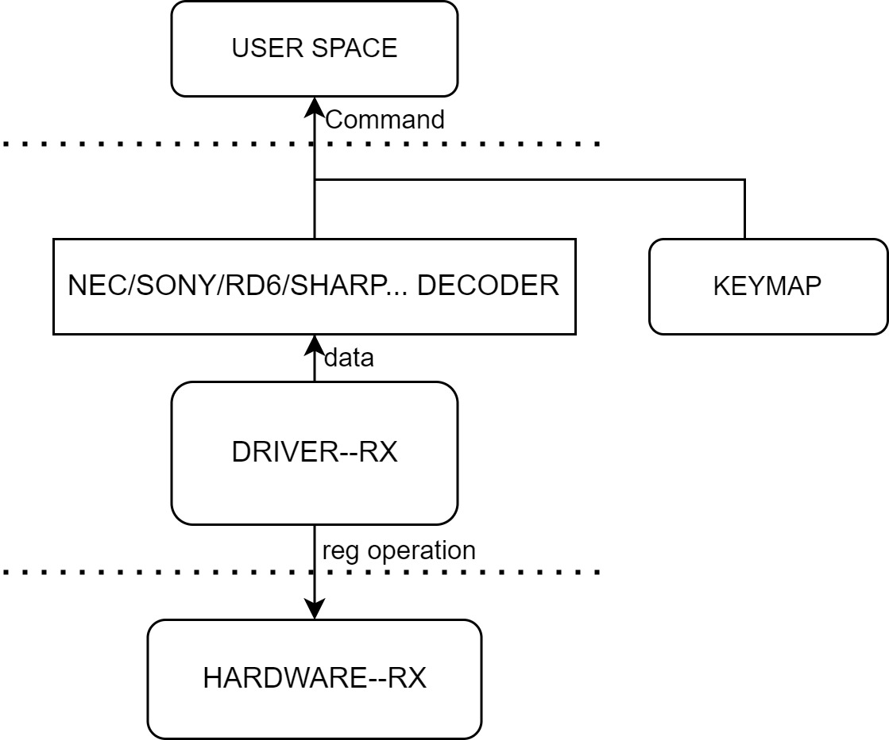

## Module Introduction
The main function of the infrared receiving module is to receive infrared signals.
### Functional Introduction

On the K1 platform, the demodulated electrical signal received by the external infrared receiver (demodulator) is decoded in the driver and the kernel IR framework and the event is reported.
### Source Code Structure Introduction
The IR-RX controller driver code is under the drivers/media/rc directory:
```
drivers/media/rc
|--rc-ir-raw.c            # Kernel IR framework interface code
|--ir-nec-decoder.c       # Kernel IR decoding electrical signal code
|--ir-spacemit.c          # K1 IR driver
```
# Key Features
| Feature |
| :-----|
| Configurable noise threshold |
| 32Bytes RX FIFO |
# Configuration Introduction
It mainly includes driver enable configuration and DTS configuration.
### CONFIG Configuration
CONFIG_IR_SPACEMIT=y
```
Symbol: IR_SPACEMIT [=y]
Device Drivers
    -> Remote Controller support (RC_CORE [=y])
        -> Remote Controller devices (RC_DEVICES [=y])
            -> SPACEMIT IR remote Recriver control (IR_SPACEMIT [=y])
```
### DTS Configuration
#### Pinctrl
You can view arch/riscv/boot/dts/spacemit/k1-x_pinctrl.dtsi in the Linux repository and refer to the configured PWM node configuration as follows:
```dts
    pinctrl_ir_rx_1: ir_rx_1_grp {
        pinctrl-single,pins = <
            K1X_PADCONF(GPIO_79, MUX_MODE1, (EDGE_NONE | PULL_UP | PAD_3V_DS4))     /* ir_rx */
        >;
    };
```
#### DTSI Configuration Example
Configure the base address and clock reset resources of the IR controller in DTSI. Normally, there is no need to change it.
```dts
    ircrx: irc-rx@d4017f00 {
        compatible = "spacemit,k1x-irc";
        reg = <0x0 0xd4017f00 0x0 0x100>;
        interrupts = <69>;
        interrupt-parent = <&intc>;
        clocks = <&ccu CLK_IR>;
        resets = <&reset RESET_IR>;
        clock-frequency = <102400000>;
        status = "disabled";
    };
```
#### DTS Configuration Example
The complete DTS configuration is as follows:
```dts
    &ircrx {
        pinctrl-names = "default";
        pinctrl-0 = <&pinctrl_ir_rx_1>;
        status = "okay";
    };
```
# Interface Description
### Test Introduction
Based on the K1 platform, an external infrared demodulator can be connected to the pin configured by the above IR. The remote control sends a signal to the demodulator, and the code value is received at the application layer.
### API Introduction
Commonly used:
```
int ir_raw_event_store_with_filter(struct rc_dev *dev, struct ir_raw_event *ev)
The interface implemented by the IR framework is called in the driver to complete the signal storage, decoding, and event reporting in the interrupt callback function.
```
# FAQ