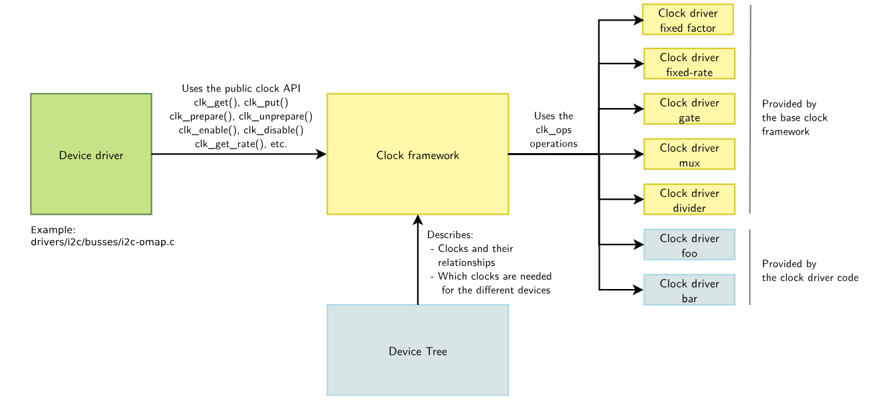

# Clock
Introduction to the functions and usage of Clock.

## Module Introduction
Clock is the controller of the clock module.
### Function Introduction


To manage clocks well, Linux provides a clock management framework called the Common Clock Framework (CCF), which provides a unified operation interface for device drivers so that device drivers do not need to care about the specific details of clock hardware implementation.  
Its structure includes the following parts:  
**clock provider**: Corresponds to the right part of the above diagram, i.e., the clock controller, responsible for providing various clocks required by the system.  
**clock consumer**: Corresponds to the left part of the above diagram, i.e., some device drivers that use clocks.  
**clock framework**: The core part of CCF, provides general APIs for clock consumers to operate clocks; implements the core logic of clock management, encapsulates hardware-related clock control logic into a set of operation functions, and is implemented by the clock provider.  
**device tree**: CCF allows the declaration of available clocks and their association with devices in the device tree.  

Clock system related devices include:
  - Oscillator (active oscillator, also known as crystal oscillator) or Crystal (passive oscillator, also known as crystal)
  - PLL (Phase Locked Loop) for frequency multiplication
  - Divider for frequency division
  - Mux for clock source selection
  - Gate for clock switch control  

There may be many such hardware modules in the system, forming a tree structure. Linux manages them as a clock tree, with the root node usually being a crystal oscillator, followed by pll, then mux or div, and finally the leaf nodes are usually gates. CCF implements various basic clock types, such as fixed_rate clock, gate clock, divider clock, and mux clock. Generally, for ease of use, some clock types are implemented according to the clock tree design.

### Source Code Structure Introduction
#### Clock Controller Driver Source Code
The clock controller driver code is under drivers/clk/spacemit:
```
drivers/clk/spacemit
|-- ccu_ddn.c                   # ddn clock type source code
|-- ccu_ddn.h
|-- ccu_ddr.c                   # ddr clock type source code
|-- ccu_ddr.h
|-- ccu_dpll.c                  # dpll clock type source code
|-- ccu_dpll.h
|-- ccu_mix.c                   # mix clock type source code
|-- ccu_mix.h
|-- ccu_pll.c                   # pll clock type source code
|-- ccu_pll.h
|-- ccu-spacemit-k1x.c          # k1 clock controller driver
|-- ccu-spacemit-k1x.h
|-- Kconfig
|-- Makefile
```
The clock controller driver implements 5 types of clocks:
- pll type, phase-locked loop type
- dpll type, ddr-related phase-locked loop type
- ddn type, fractional divider, with one stage of division (denominator) and one stage of multiplication (numerator)
- mix type, hybrid type, supports any combination of gate/mux/divider
- ddr type, special ddr-related clock type  

#### Clock index definitions
Clock index definitions are under dt-bindings:
```
include/dt-bindings/clock/spacemit-k1x-clock.h
```

## Configuration Introduction
Mainly includes driver enable configuration and dts configuration
### CONFIG Configuration
CONFIG_COMMON_CLK provides support for the Common Clock Framework. By default, this option is Y.
```
Device Drivers
	Common Clock Framework (COMMON_CLK[=y])
```
CONFIG_SPACEMIT_K1X_CCU provides support for the K1 Clock controller driver. By default, this option is Y.
```
 Device Drivers
	Common Clock Framework (COMMON_CLK[=y])
	        Clock support for Spacemit k1x SoCs (SPACEMIT_K1X_CCU [=y])
```
### DTS Configuration
The dts configuration for the clock controller is as follows:
```
/ {
        clocks {
                #address-cells = <0x2>;
                #size-cells = <0x2>;
                ranges;

                vctcxo_24: clock-vctcxo_24 {
                        #clock-cells = <0>;
                        compatible = "fixed-clock";
                        clock-frequency = <24000000>;
                        clock-output-names = "vctcxo_24";
                };
                vctcxo_3: clock-vctcxo_3 {
                        #clock-cells = <0>;
                        compatible = "fixed-clock";
                        clock-frequency = <3000000>;
                        clock-output-names = "vctcxo_3";
                };
                vctcxo_1: clock-vctcxo_1 {
                        #clock-cells = <0>;
                        compatible = "fixed-clock";
                        clock-frequency = <1000000>;
                        clock-output-names = "vctcxo_1";
                };
                pll1_2457p6_vco: clock-pll1_2457p6_vco {
                        #clock-cells = <0>;
                        compatible = "fixed-clock";
                        clock-frequency = <2457600000>;
                        clock-output-names = "pll1_2457p6_vco";
                };
                clk_32k: clock-clk32k {
                        #clock-cells = <0>;
                        compatible = "fixed-clock";
                        clock-frequency = <32000>;
                        clock-output-names = "clk_32k";
                };

                pll_clk_cluster0: clock-pll_clk_cluster0 {
                        #clock-cells = <0>;
                        compatible = "fixed-clock";
                        clock-frequency = <10000000>;
                        clock-output-names = "pll_clk_cluster0";
                };

                pll_clk_cluster1: clock-pll_clk_cluster1 {
                        #clock-cells = <0>;
                        compatible = "fixed-clock";
                        clock-frequency = <10000000>;
                        clock-output-names = "pll_clk_cluster1";
                };
        };

        soc: soc {
                ...
                ccu: clock-controller@d4050000 {
                        compatible = "spacemit,k1x-clock";
                        reg = <0x0 0xd4050000 0x0 0x209c>,
                                <0x0 0xd4282800 0x0 0x400>,
                                <0x0 0xd4015000 0x0 0x1000>,
                                <0x0 0xd4090000 0x0 0x1000>,
                                <0x0 0xd4282c00 0x0 0x400>,
                                <0x0 0xd8440000 0x0 0x98>,
                                <0x0 0xc0000000 0x0 0x4280>,
                                <0x0 0xf0610000 0x0 0x20>,
                                <0x0 0xc0880000 0x0 0x2050>,
                                <0x0 0xc0888000 0x0 0x30>;
                        reg-names = "mpmu", "apmu", "apbc", "apbs", "ciu", "dciu", "ddrc", "apbc2", "rcpu", "rcpu2";
                        clocks = <&vctcxo_24>, <&vctcxo_3>, <&vctcxo_1>, <&pll1_2457p6_vco>,
                                <&clk_32k>;
                        clock-names = "vctcxo_24", "vctcxo_3", "vctcxo_1", "pll1_2457p6_vco",
                                "clk_32k";
                        #clock-cells = <1>;
                        status = "okay";
                };
                ...
        };
};


```

## API Description

### API Introduction
CCF provides general clock operation interfaces for device drivers
- get  
Get clock handle
```c
/*
* clk_get - get clk
* @dev: device
* @id: clock name of dts "clock-names"
*/
struct clk *clk_get(struct device *dev, const char *id);

/*
* clk_get - get clk
* @dev: device
* @id: clock name of dts "clock-names"
*/
struct clk *clk_get(struct device *dev, const char *id);

/*
* devm_clk_get - get clk
* @dev：device
* @id：clock name of dts "clock-names"
*/
struct clk *devm_clk_get(struct device *dev, const char *id);

/*
* of_clk_get_by_name - get clk by name
* @np：device_node
* @id：clock name of dts "clock-names"
*/
struct clk *of_clk_get_by_name(struct device_node *np, const char *name);
```
For the above interfaces, if the second parameter is omitted, the first clock configured in the "clocks" entry in dts will be obtained by default.
- put  
Release clock handle
```c
/*
* clk_put - put clk
* @dev: device
* @id: clock name of dts "clock-names"
*/
void clk_put(struct clk *clk);

/*
* devm_clk_put - put clk
* @dev: device
* @id: clock name of dts "clock-names"
*/
void devm_clk_put(struct device *dev, struct clk *clk);
```
- prepare  
Prepare the clock, usually some preparation work before enabling the clock
```c
/**
 * clk_prepare - prepare a clock source
 * @clk: clock source
 * This prepares the clock source for use.
 * Must not be called from within atomic context.
 */
int clk_prepare(struct clk *clk);
```
- unprepare  
Unprepare the clock, usually some cleanup work after disabling the clock
```c
/**
 * clk_unprepare - undo preparation of a clock source
 * @clk: clock source
 * This undoes a previously prepared clock.  The caller must balance
 * the number of prepare and unprepare calls.
 * Must not be called from within atomic context.
 */
void clk_unprepare(struct clk *clk);
```
- enable  
Enable the clock
```c
/**
 * clk_enable - inform the system when the clock source should be running.
 * @clk: clock source
 * If the clock can not be enabled/disabled, this should return success.
 * May be called from atomic contexts.
 * Returns success (0) or negative errno.
 */
int clk_enable(struct clk *clk);
```
- disable  
Disable the clock
```c
/**
 * clk_disable - inform the system when the clock source is no longer required.
 * @clk: clock source
 * Inform the system that a clock source is no longer required by
 * a driver and may be shut down.
 * May be called from atomic contexts.
 * Implementation detail: if the clock source is shared between
 * multiple drivers, clk_enable() calls must be balanced by the
 * same number of clk_disable() calls for the clock source to be
 * disabled.
 */
void clk_disable(struct clk *clk);
```
clk_prepare_enable is a combination of clk_prepare and clk_enable, clk_disable_unprepare is a combination of clk_unprepare and clk_disable, it is recommended to use these two interfaces.
- set rate  
Set clock frequency
```c
/**
 * clk_set_rate - set the clock rate for a clock source
 * @clk: clock source
 * @rate: desired clock rate in Hz
 * Updating the rate starts at the top-most affected clock and then
 * walks the tree down to the bottom-most clock that needs updating.
 * Returns success (0) or negative errno.
 */
int clk_set_rate(struct clk *clk, unsigned long rate);
```
- get rate  
Get the current clock frequency
```c
/**
 * clk_get_rate - obtain the current clock rate (in Hz) for a clock source.
 *                This is only valid once the clock source has been enabled.
 * @clk: clock source
 */
unsigned long clk_get_rate(struct clk *clk);

```
- set parent  
Set parent clock
```c
/**
 * clk_set_parent - set the parent clock source for this clock
 * @clk: clock source
 * @parent: parent clock source
 * Returns success (0) or negative errno.
 */
int clk_set_parent(struct clk *clk, struct clk *parent);

```
- get parent  
Get the current parent clock handle
```c
/**
 * clk_get_parent - get the parent clock source for this clock
 * @clk: clock source
 * Returns struct clk corresponding to parent clock source, or
 * valid IS_ERR() condition containing errno.
 */
struct clk *clk_get_parent(struct clk *clk);
```
- round rate  
Get the frequency closest to the target frequency that the clock controller can provide
```c
/**
 * clk_round_rate - adjust a rate to the exact rate a clock can provide
 * @clk: clock source
 * @rate: desired clock rate in Hz
 * This answers the question "if I were to pass @rate to clk_set_rate(),
 * what clock rate would I end up with?" without changing the hardware
 * in any way.  In other words:
 *   rate = clk_round_rate(clk, r);
 * and:
 *   clk_set_rate(clk, r);
 *   rate = clk_get_rate(clk);
 * are equivalent except the former does not modify the clock hardware
 * in any way.
 * Returns rounded clock rate in Hz, or negative errno.
 */
long clk_round_rate(struct clk *clk, unsigned long rate);
```
### Usage Example
If a module needs to use clock functions, it needs to configure the clocks and clock-names properties in dts, and then use the CCF API in the driver to perform clock-related operations.
- Configure dts  
Find the corresponding clock index in include/dt-bindings/clock/spacemit-k1x-clock.h and configure it in the module dts.
Take can0 as an example, can0 has two clocks, one is the module working clock CLK_CAN0, and the other is the bus clock CLK_CAN0_BUS. The dts configuration is as follows:
```
                flexcan0: fdcan@d4028000 {
                        compatible = "spacemit,k1x-flexcan";
                        reg = <0x0 0xd4028000 0x0 0x4000>;
                        interrupts = <16>;
                        interrupt-parent = <&intc>;
                        clocks = <&ccu CLK_CAN0>,<&ccu CLK_CAN0_BUS>; # configure the index of can0 clock
                        clock-names = "per","ipg";                    # configure the names corresponding to clocks, the driver can get the corresponding clock by this string
                        resets = <&reset RESET_CAN0>;
                        fsl,clk-source = <0>;
                        status = "disabled";
                };

```
- Add header file and clk handle  
```
#include <linux/clk.h>
```
```
struct flexcan_priv {

        struct clk *clk_ipg;
        struct clk *clk_per;
};
```

- Get clock  
Generally, the clock handle is obtained through devm_clk_get during the driver probe phase. When the driver probe fails or is removed, the driver automatically releases the corresponding clock handle.
```
        clk_ipg = devm_clk_get(&pdev->dev, "ipg");               # get the clock handle corresponding to the bus clock CLK_CAN0_BUS
        if (IS_ERR(clk_ipg)) {
                dev_err(&pdev->dev, "no ipg clock defined\n");
                return PTR_ERR(clk_ipg);
        }

        clk_per = devm_clk_get(&pdev->dev, "per");               # get the clock handle corresponding to the working clock CLK_CAN0
        if (IS_ERR(clk_per)) {
                dev_err(&pdev->dev, "no per clock defined\n");
                return PTR_ERR(clk_per);
        }

```
- Enable clock  
Enable the clock node through clk_prepare_enable
```
        if (priv->clk_ipg) {
                err = clk_prepare_enable(priv->clk_ipg);         # enable bus clock CLK_CAN0_BUS
                if (err)
                        return err;
        }

        if (priv->clk_per) {
                err = clk_prepare_enable(priv->clk_per);         # enable working clock CLK_CAN0
                if (err)
                        clk_disable_unprepare(priv->clk_ipg);
        }

```
- Get clock frequency  
Get the clock frequency through clk_get_rate
```
clock_freq = clk_get_rate(clk_per);                  # get the current frequency of working clock CLK_CAN0
```
- Set clock frequency  
Modify the clock frequency through clk_set_rate, the first parameter is the clock handle struct clk*, the second parameter is the target frequency
```
clk_set_rate(clk_per, clock_freq);                   # set the frequency of working clock CLK_CAN0
```
- Disable clock  
Disable the clock through clk_disable_unprepare
```
clk_disable_unprepare(priv->clk_per);                # disable working clock CLK_CAN0
clk_disable_unprepare(priv->clk_ipg);                # disable bus clock CLK_CAN0_BUS
```

## Debug Introduction
Debugging can be done through debugfs
- Print clock tree  
/sys/kernel/debug/clk/clk_summary is commonly used to print the clock tree structure, view the status, frequency, parent clock, etc. of each clock node.
```
root# cat /sys/kernel/debug/clk/clk_summary
```
- View specific clock node  
You can also view the status, frequency, parent clock, etc. of a specific clock node. Take can0_clk as an example:
```
root:/sys/kernel/debug/clk/can0_clk # ls -l
-r--r--r--    1 root     root             0 Jan  1 08:03 clk_accuracy
-r--r--r--    1 root     root             0 Jan  1 08:03 clk_duty_cycle
-r--r--r--    1 root     root             0 Jan  1 08:03 clk_enable_count
-r--r--r--    1 root     root             0 Jan  1 08:03 clk_flags
-r--r--r--    1 root     root             0 Jan  1 08:03 clk_max_rate
-r--r--r--    1 root     root             0 Jan  1 08:03 clk_min_rate
-r--r--r--    1 root     root             0 Jan  1 08:03 clk_notifier_count
-r--r--r--    1 root     root             0 Jan  1 08:03 clk_parent
-r--r--r--    1 root     root             0 Jan  1 08:03 clk_phase
-r--r--r--    1 root     root             0 Jan  1 08:03 clk_possible_parents
-r--r--r--    1 root     root             0 Jan  1 08:03 clk_prepare_count
-r--r--r--    1 root     root             0 Jan  1 08:03 clk_prepare_enable
-r--r--r--    1 root     root             0 Jan  1 08:03 clk_protect_count
-r--r--r--    1 root     root             0 Jan  1 08:03 clk_rate
root:/sys/kernel/debug/clk/can0_clk# cat clk_prepare_count          #查看enable状态
0
root:/sys/kernel/debug/clk/can0_clk# cat clk_rate                   #查看当前频率
20000000
root:/sys/kernel/debug/clk/can0_clk# cat clk_parent                 #查看当前父时钟
pll3_20
root:/sys/kernel/debug/clk/can0_clk#
```
- 改变时钟配置  
在driver/clk/clk.c中加上CLOCK_ALLOW_WRITE_DEBUGFS宏定义，就可以对debugfs下的一些clk节点进行写操作，否则只有读操作权限
```
/sys/kernel/debug/clk/can0_clk # ls -l
-r--r--r--    1 root     root             0 Jan  1 08:03 clk_accuracy
-r--r--r--    1 root     root             0 Jan  1 08:03 clk_duty_cycle
-r--r--r--    1 root     root             0 Jan  1 08:03 clk_enable_count
-r--r--r--    1 root     root             0 Jan  1 08:03 clk_flags
-r--r--r--    1 root     root             0 Jan  1 08:03 clk_max_rate
-r--r--r--    1 root     root             0 Jan  1 08:03 clk_min_rate
-r--r--r--    1 root     root             0 Jan  1 08:03 clk_notifier_count
-rw-r--r--    1 root     root             0 Jan  1 08:03 clk_parent              #可读可写
-r--r--r--    1 root     root             0 Jan  1 08:03 clk_phase
-r--r--r--    1 root     root             0 Jan  1 08:03 clk_possible_parents
-r--r--r--    1 root     root             0 Jan  1 08:03 clk_prepare_count
-rw-r--r--    1 root     root             0 Jan  1 08:03 clk_prepare_enable      #可读可写
-r--r--r--    1 root     root             0 Jan  1 08:03 clk_protect_count
-rw-r--r--    1 root     root             0 Jan  1 08:03 clk_rate                #可读可写
/sys/kernel/debug/clk/can0_clk # cat clk_rate                                    #查看频率
20000000
/sys/kernel/debug/clk/can0_clk # echo 40000000 > clk_rate                        #设置频率为40MHz
/sys/kernel/debug/clk/can0_clk # cat clk_rate                                    #确认设置结果
40000000
/sys/kernel/debug/clk/can0_clk # cat clk_parent                                  #查看父时钟
pll3_40
/sys/kernel/debug/clk/can0_clk # echo 0 > clk_parent                             #设置父时钟为index为0的时钟源
/sys/kernel/debug/clk/can0_clk # cat clk_parent                                  #确认设置结果
pll3_20
/sys/kernel/debug/clk/can0_clk # cat clk_prepare_enable                          #查看prepare_enable状态
0
/sys/kernel/debug/clk/can0_clk # echo 1 > clk_prepare_enable                     #prepare并enable时钟节点
/sys/kernel/debug/clk/can0_clk # cat clk_prepare_enable                          #确认设置结果
1
/sys/kernel/debug/clk/can0_clk # echo 0 > clk_prepare_enable                     #unprepare并disable时钟节点
/sys/kernel/debug/clk/can0_clk # cat clk_prepare_enable                          #确认设置结果
0
/sys/kernel/debug/clk/can0_clk #
```
## FAQ
