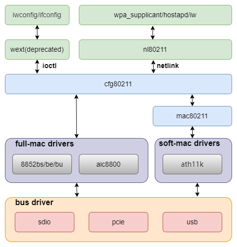

# WIFI
Introduction to WIFI porting and usage.
## Module Introduction
On the K1 platform, WIFI functionality is mainly implemented via external WIFI modules, mainly supporting modules with PCIE, SDIO, and USB interfaces.
### Function Introduction

The WIFI framework diagram can be divided into the following layers:



### Source Code Structure Introduction

WIFI-related source code can be divided into three parts:
1. WIFI driver, provided by the WIFI vendor, mainly implements WIFI functionality.
2. Platform-related part, mainly implements module power supply and enable interfaces for WIFI driver calls.
3. Interface driver, mainly implements WIFI data transmission interface functions, such as PCIE, SDIO, and USB interfaces.

WIFI driver source code is generally placed in the following directory:
```
drivers/net/wireless
|-- aic8800             # aic vendor driver
|-- realtek             # realtek vendor driver
    |-- rtl8852be       # rtl8852be
    |-- rtl8852bs       # rtl8852bs
|-- wuqi                # wuqi vendor driver
```
Platform-related source code:
```
drivers/soc/spacemit/spacemit-rf
|-- spacemit-pwrseq.c   # Common part for WIFI and Bluetooth
|-- spacemit-wlan.c     # WIFI power, gpio and clock related interface implementation
|-- spacemit-bt.c       # bt power, gpio and clock related interface implementation
```
Interface-related source code refers to the documentation of each interface driver.

## Key Features
### sdio interface features
| Feature | Description |
| :-----| :----|
| Compatible with SDIO v4.10 | Compatible with 4bit SDIO 4.10 specification |
| Supports SD 3.0 mode | Supports SDR12/SDR25/DDR50/SDR50/SDR104 modes |
| Supports PIO/DMA | Supports PIO, SDMA, ADMA, ADMA2 transfer modes |

### Performance Parameters
| Module Model | TX(Mb/s) | RX(Mb/s) |
| :-----| :----| :----: |
| rtl8852bs | 460 | 480 |
| aic8800d80 | 410 | 470 |

Test method

```
Same LAN segment
Server: iperf3 -s
Client: iperf3 -c 192.168.1.xxx -t 72000
```

## Configuration Introduction
Mainly includes driver enable configuration and dts configuration
### CONFIG Configuration
CONFIG_SPACEMIT_RFKILL provides platform support for WIFI modules. By default, this option is Y.
```
Device Drivers
        SOC (System On Chip) specific Drivers
                Spacemit rfkill driver (SPACEMIT_RFKILL [=y])
```


### dts Configuration
#### sdio pinctrl

Generally, slot2 is used for sdio, corresponding to pinctrl_mmc2。

```
pinctrl_mmc2: mmc2_grp {
        pinctrl-single,pins =<
                K1X_PADCONF(GPIO_15, MUX_MODE1, (EDGE_NONE | PULL_UP | PAD_1V8_DS2))	/* mmc2_data3 */
                K1X_PADCONF(GPIO_16, MUX_MODE1, (EDGE_NONE | PULL_UP | PAD_1V8_DS2))	/* mmc2_data2 */
                K1X_PADCONF(GPIO_17, MUX_MODE1, (EDGE_NONE | PULL_UP | PAD_1V8_DS2))	/* mmc2_data1 */
                K1X_PADCONF(GPIO_18, MUX_MODE1, (EDGE_NONE | PULL_UP | PAD_1V8_DS2))	/* mmc2_data0 */
                K1X_PADCONF(GPIO_19, MUX_MODE1, (EDGE_NONE | PULL_UP | PAD_1V8_DS2))	/* mmc2_cmd */
                K1X_PADCONF(GPIO_20, MUX_MODE1, (EDGE_NONE | PULL_UP | PAD_1V8_DS2))	/* mmc2_clk */
        >;
};
```

If WIFI wakeup is required, wlan_hostwake needs to be configured as pinctl mode:
```
pinctrl_wlan_wakeup: wlan_wakeup_grp {
        pinctrl-single,pins =<
                K1X_PADCONF(GPIO_66, MUX_MODE0, (EDGE_FALL | PULL_DOWN | PAD_3V_DS2))   /* wifi edge detect */
        >;
};
```

#### Power Configuration

sdio needs to configure two power supplies, vmmc-supply and vqmmc-supply, corresponding to card function and io power supply, respectively. vqmmc-supply is recommended to be 1.8v, and the actual voltage is selected according to the sdio card mode。


```
&sdhci1 {
        vmmc-supply = <&dcdc_3>;
        vqmmc-supply = <&ldo_1>;
};
```

#### tuning Configuration

sdio needs tuning in high-speed mode, and the tx parameters need to be adjusted for different hardware versions.

#### sdio dts Configuration Example

The complete sdio configuration is as follows：

```
/* SDIO */
&sdhci1 {
        pinctrl-names = "default";
        pinctrl-0 = <&pinctrl_mmc2>;
        bus-width = <4>;
        non-removable;
        vqmmc-supply = <&dcdc_3>;
        no-mmc;
        no-sd;
        keep-power-in-suspend;

        spacemit,sdh-host-caps-disable = <(
                        MMC_CAP_UHS_DDR50 |
                        MMC_CAP_NEEDS_POLL
                        )>;
        spacemit,sdh-quirks = <(
                        SDHCI_QUIRK_BROKEN_CARD_DETECTION |
                        SDHCI_QUIRK_BROKEN_TIMEOUT_VAL
                        )>;
        spacemit,sdh-quirks2 = <(
                        SDHCI_QUIRK2_PRESET_VALUE_BROKEN |
                        SDHCI_QUIRK2_BROKEN_PHY_MODULE
                        )>;
        spacemit,rx_dline_reg = <0x0>;
        spacemit,tx_delaycode = <0x7f>;
        spacemit,rx_tuning_limit = <50>;
        spacemit,sdh-freq = <375000000>;
        status = "okay";
};
```
The default value of sdio tx_delaycode is 0x7f, which actually needs to be adjusted according to the specific scheme and wiring differences.

#### Platform dts Configuration

The complete platform configuration is as follows：
```
rf_pwrseq: rf-pwrseq {
        compatible = "spacemit,rf-pwrseq";
        //vdd-supply = <&ldo_7>;
        //vdd_voltage = <3300000>;
        io-supply = <&dcdc_3>;
        io_voltage = <1800000>;
        pwr-gpios  = <&gpio 67 0>;
        status = "okay";

        wlan_pwrseq: wlan-pwrseq {
                compatible = "spacemit,wlan-pwrseq";
                regon-gpios = <&gpio 116 0>;
                interrupt-parent = <&pinctrl>;
                interrupts = <268>;
                pinctrl-names = "default";
                pinctrl-0 = <&pinctrl_wlan_wakeup>;
        };

        bt_pwrseq: bt-pwrseq {
                compatible = "spacemit,bt-pwrseq";
                reset-gpios     = <&gpio 63 0>;
        };
};
```

At present, many modules on the market are WIFI and Bluetooth two-in-one, and the power supply part of WIFI and Bluetooth is often shared. The shared part is recommended to be configured in rf_pwrseq, and only the part affecting WIFI is configured in wlan_pwrseq.

For single WIFI modules, only wlan_pwrseq needs to be configured, rf_pwrseq does not need to be configured, but the rf_pwrseq node must be enabled.

When turning on the WIFI power, the shared power and gpio state will be enabled first. The platform will maintain the corresponding reference count. When turning off, only when both WIFI and Bluetooth are turned off will the shared power and gpio state be truly turned off.

rf_pwrseq：
- vdd-supply configures the module's power supply, according to the actual hardware configuration.
- vdd_voltage is used to set the module's power supply voltage.
- io-supply configures the module's io power supply, according to the actual hardware configuration.
- io_voltage is used to set the module's io power supply voltage.
- pwr-gpios is the module enable pin, which will be pulled high by default after configuration, and supports multiple gpio configurations.
- clock is the shared clock configuration of the module.
- power-on-delay-ms sets the delay after the module is powered on, default is 100ms.

wlan_pwrseq：
- regon-gpios is the enable pin for the WIFI part, which will be pulled high when calling spacemit_wlan_set_power(1).
- interrupts configures the WIFI interrupt wakeup pin, indicating wakeup by pinctl.
- power-on-delay-ms sets the delay after WIFI is powered on, default is 10ms.

bt_pwrseq：
- reset-gpios is the enable pin for Bluetooth, which will be pulled high when enabling the corresponding rfkill for Bluetooth.
- clock is the clock configuration for Bluetooth.
- power-on-delay-ms sets the delay after Bluetooth is powered on, default is 10ms.

## API Introduction

### API Introduction
Platform interfaces, including WIFI power on/off, getting interrupts, sdio scanning, etc.
- void spacemit_wlan_set_power(bool on_off)

   Set WIFI power, 0 for off, 1 for on
- int spacemit_wlan_get_oob_irq(void);

   Get platform irq interrupt number
- void spacemit_sdio_detect_change(int enable_scan);

   Scan sdio bus

## Debug Introduction

### sysfs

```
The value of sdio tx_delaycode is specified in the scheme dts by default, and can be dynamically modified through this node under sysfs, which is convenient for debugging and verification.
echo 0x7f > /sys/devices/platform/soc/d4280800.sdh
Dynamic modification must take effect before the wifi driver is loaded.
```
### debugfs
```
Commonly used to query the working status of sdio, including frequency, bit width, mode, etc.
cat /sys/kernel/debug/mmc1/ios
clock:          204800000 Hz
actual clock:   187500000 Hz
vdd:            21 (3.3 ~ 3.4 V)
bus mode:       2 (push-pull)
chip select:    0 (don't care)
power mode:     2 (on)
bus width:      2 (4 bits)
timing spec:    6 (sd uhs SDR104)
signal voltage: 1 (1.80 V)
driver type:    0 (driver type B)
```
## Test Introduction

First, make sure the wpa_supplicant service is running properly.
```
wpa_supplicant -iwlan0 -Dnl80211 -c/wpa_supplicant.conf -B
```
wpa_supplicant.conf reference configuration:
```
ctrl_interface=/var/run/wpa_supplicant
wowlan_triggers=any
```
wowlan_triggers is wow-related configuration, and needs to be configured to support WIFI wakeup.

Use wpa_cli to interact with the wpa_supplicant service. If the ctrl_interface in wpa_supplicant.conf is not the default /var/run/wpa_supplicant, you need to explicitly specify it with -p when running wpa_cli.
```
 wpa_cli -iwlan0 -p/var/run/wpa_supplicant
 scan
 scan_results
```
A normal scan will output something like:
```
bssid / frequency / signal level / flags / ssid
f6:12:b3:d4:65:ef       2462    -37     [WPA2-PSK-CCMP][WPS][ESS][P2P]  wilson
78:85:f4:82:01:3c       2462    -66     [WPA2-PSK-CCMP][WPS][ESS]       HUAWEI-LX45AG_HiLink
02:0e:5e:76:a5:6e       2412    -69     [WPA-PSK-CCMP+TKIP][ESS]        ChinaNet-1mMr
30:8e:7a:2f:64:8c       2437    -69     [WPA-PSK-CCMP+TKIP][WPA2-PSK-CCMP+TKIP][ESS]    K03_1tlftb
dc:16:b2:57:9e:65       2437    -78     [WPA2-PSK-CCMP][ESS]    \x00\x00\x00\x00\x00\x00\x00\x00
dc:16:b2:57:9e:60       2437    -78     [WPA-PSK-CCMP][WPA2-PSK-CCMP][WPS][ESS] TK-ZJB
48:0e:ec:ad:52:4d       2462    -78     [WPA-PSK-CCMP][WPA2-PSK-CCMP][WPS][ESS] TP-LINK_524D
3c:d2:e5:c6:08:9b       2452    -83     [WPA2-PSK-CCMP][ESS]
3e:d2:e5:16:08:9b       2452    -83     [WPA-PSK-CCMP+TKIP][WPA2-PSK-CCMP+TKIP][ESS]    young
80:ea:07:dc:f2:be       2462    -88     [WPA-PSK-CCMP][WPA2-PSK-CCMP][ESS]      HZXF
9a:00:74:84:d1:60       2412    -85     [WPA-PSK-CCMP+TKIP][WPA2-PSK-CCMP+TKIP][ESS]   ChinaNet-ieR7
dc:f8:b9:46:ec:30       2472    -85     [WPA-PSK-CCMP+TKIP][WPA2-PSK-CCMP+TKIP][ESS]   ChinaNet-MiZK
```
Connect to the desired ap network
```
> add_network
0
> set_network 0 ssid "wilson"
OK
> set_network 0 key_mgmt WPA-PSK
OK
> set_network 0 psk "wilson2001"
OK
> enable_network 0
```

## FAQ
Question 1

Phenomenon: sdio device can be detected, but initialization fails.

Log:
```
mmc1: error -110 whilst initialising SDIO card
```
Solution
1. Modify the sdio tx_delaycode parameter for verification.

Question 2

Phenomenon: sdio read/write error.
```
[ 23.662558] rtl8852bs mmc1:0001:1: rtw_sdio_raw_read: sdio read failed (-110)
[ 23.669829] rtl8852bs mmc1:0001:1: RTW_SDI0: READ use CMD53
[ 23.675507] rtl8852bs mmc1:0001:1: RTW_SDIO: READ from 0x00270, 4 bytes
[ 23.682193] RTW SDIO: READ 0000000: 63 00 00 81
```
Solution：
1. Modify the sdio tx_delaycode parameter for verification.
2. If method 1 is invalid, you can try to reduce the frequency. Add MMC_CAP_UHS_SDR104 in sdh-host-caps-disable to disable SDR104 mode.
