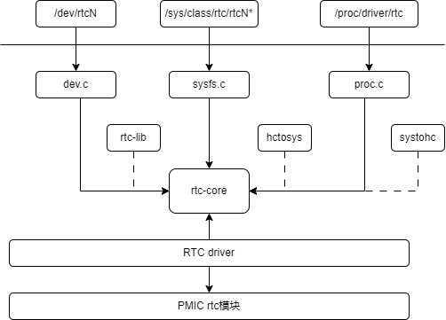

# RTC

Introduction to the functions and usage of rtc.

## Module Introduction

RTC (real-time-clock) is mainly used for timekeeping, generating alarms, and maintaining system time. RTC usually has a backup battery, so even if the system is powered off, the rtc can continue to work normally under the backup battery.

### Function Introduction

  

1. dev/sysfs/proc is the interface layer, responsible for providing operation nodes and related interfaces to user space
2. rtc-core layer provides a set of APIs for rtc drivers, completing device and driver registration, etc.
3. rtc driver layer, specifically responsible for the implementation of the rtc driver, such as setting time, setting alarms, etc.

### Source Code Structure Introduction

```
drivers/rtc/
├── class.c
├── dev.c
├── interface.c
├── Kconfig
├── lib.c
├── Makefile
├── proc.c
├── rtc-core.h
├── rtc-spt-pmic.c
├── sysfs.c
```

## Key Features

### Features

| Feature |
| :-----|
| Supports calendar, alarm, second counting |

## Configuration Introduction

Mainly includes driver enable configuration and dts configuration

### CONFIG Configuration

```
 CONFIG_RTC_DRV_SPT_PMIC:

 If you say yes here you will get support for the
 RTC of Spacemit spm8xxx PMIC.

 Symbol: RTC_DRV_SPT_PMIC [=y]
 Type  : tristate
 Defined at drivers/rtc/Kconfig:721
 Prompt: Spacemit spm8xxx RTC
 Depends on: RTC_CLASS [=y] && I2C [=y] && MFD_SPACEMIT_PMIC [=y]
 Location:
  -> Device Drivers
   -> Real Time Clock (RTC_CLASS [=y])
    -> Spacemit spm8xxx RTC (RTC_DRV_SPT_PMIC [=y])      
```

### dts Configuration

```
&i2c8 {
        pinctrl-names = "default";
        pinctrl-0 = <&pinctrl_i2c8>;
        status = "okay";

        spm8821@41 {
                compatible = "spacemit,spm8821";
                reg = <0x41>;
                interrupt-parent = <&intc>;
                interrupts = <64>;
                status = "okay";
    ....

                ext_rtc: rtc {
                        compatible = "pmic,rtc,spm8821";
                };
        };
};
```

## API Description

The character device node /dev/rtcN is generated when the RTC driver is registered. When used in the application layer, just follow the standard RTC programming method in the Linux system.

### API Introduction

```
#define devm_rtc_register_device(device) \
        __devm_rtc_register_device(THIS_MODULE, device)
int __devm_rtc_register_device(struct module *owner, struct rtc_device *rtc)  -- rtc device registration

```

## Test Introduction

```
For details, refer to:
Documentation/ABI/testing/rtc-cdev

The test method is described below in pseudo code:

1. fd = open("/dev/rtcN", xxx)
2. ioctl(fd, RTC_SET_TIME, ...) --> set rtc time
3. ioctl(fd, RTC_RD_TIME, ...)  --> get rtc time
4. ioctl(fd, RTC_ALM_SET, ...)  --> set rtc alarm
5. ioctl(fd, RTC_AIE_ON, ...)  --> enable rtc
6. ioctl(fd, RTC_ALM_READ, ...)  --> read rtc alarm 
```

## FAQ
