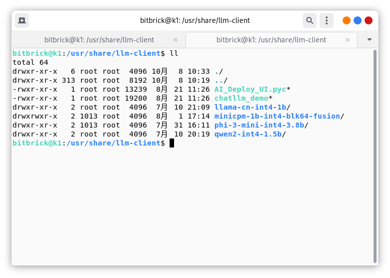
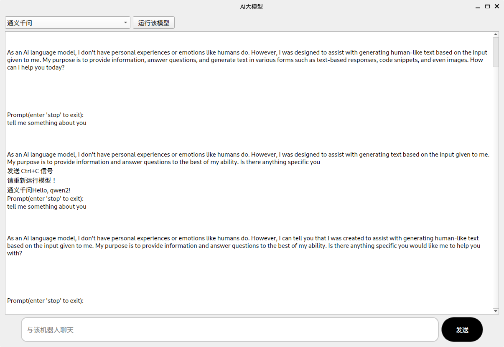

# 在K1上运行大语言模型
 K1 有2.0t的算力，我们可以在它上面运行端侧大语言模型，今天我们就提供一种在K1上运行LLM的方法。
## 安装llm-client
在Bianbu OS 中打开命令行输入如下命令即可安装llm-client
~~~
sudo apt update
sudo apt install llm-client
~~~
安装完成之后就会在桌面看到一个可以运行的图标

运行即可。
Note: 如果桌面没有找到这个图标，我们也可以去`/usr/share/llm-client`路径下手动执行这个程序
~~~
python3 AI_Deploy_UI.pyc
~~~

运行之后就会看到如下界面：

选择某个模型，点击`运行该模型`即可愉快的跟llm进行对话啦！
