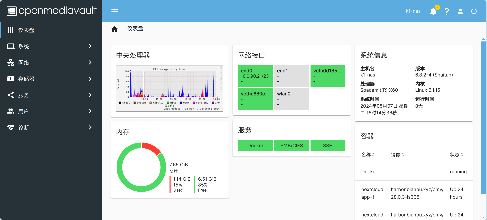

# 在K1上使用NAS

## 安装

Bianbu NAS 是在 Bianbu 操作系统基础上精简并深度优化的一款专为 NAS 产品设计的系统。它集成了应用程序（如 openmediavault、docker 和常用软件）、框架、库、运行时环境、Linux 内核、引导加载程序（U-Boot）和监管程序接口（OpenSBI）等多种组件。该系统的目标是为客户提供 NAS 软件的参考设计，并支持驱动和应用程序的开发。

[NAS镜像下载地址](https://archive.spacemit.com/image/k1/version/bianbu/v1.0.15/bianbu-23.10-nas-k1-v1.0.15-release-20240907161818.img.zip)

安装方式请参照如下链接：
https://docs.bit-brick.com/docs/k1/getting-started/install


## 系统登录

系统 `root` 账户密码默认为：`bianbu`。

串口查看 NAS 设备 IP 地址 `HOST_IP`：

```Bash
ifconfig
```

获取 IP 地址之后，通过 SSH 登录系统：

```Bash
ssh root@HOST_IP
```

### Openmediavault Web管理界面登录

Bianbu NAS 由 Openmediavault 应用提供完整的 NAS 功能，Openmediavault 提供 Web 使得用户可以方便地管理 NAS 服务。

- Openmediavault Web 管理员帐号：`admin`
- 密码：`openmediavault`

NAS 设备上电上网之后，浏览器输入 http://HOST_IP 访问 Openmediavault 应用的 Web 管理界面。



### Wi-Fi AP

Bianbu  NAS 集成了 Wi-Fi AP 功能，刷机自启，允许客户端通过 Wi-Fi 连接到 NAS 设备，并通过 DHCP 服务自动分配到 IP 地址。

- Wi-Fi AP 默认 SSID：`BianbuAP`（密码：`12345678`）
- Wi-Fi AP 默认 IP：`10.0.0.1`

连接上 Wi-Fi 之后，浏览器输入 [http://10.0.0.1](http://10.0.0.1/) 访问 Openmediavault 应用的 Web 管理界面。

## 必要设置

### 更新软件源

第一次下载软件包之前，更新软件源（`apt update`）是必要的。之后也建议定期更新软件源，以确保系统始终下载到最新的软件。

- 点击“系统 -> 更新管理 -> 设置”， 勾选“预发布更新”，点击“保存”，等待更新。


## 挂载rootfs

Bianbu NAS 通过 `sharerootfs` 插件管理 rootfs，如果要挂载 rootfs 请先下载 `sharerootfs` 插件。

- 点击“系统 -> 插件”，选中 `sharerootfs` 插件，点击下载按钮。


- 下载 `sharerootfs` 插件之后，点击“存储器 -> 文件系统”，可以看到 rootfs 已挂载。


更多信息可以参考 [bianbu NAS](https://bianbu.spacemit.com/bianbu-nas/base_setup)