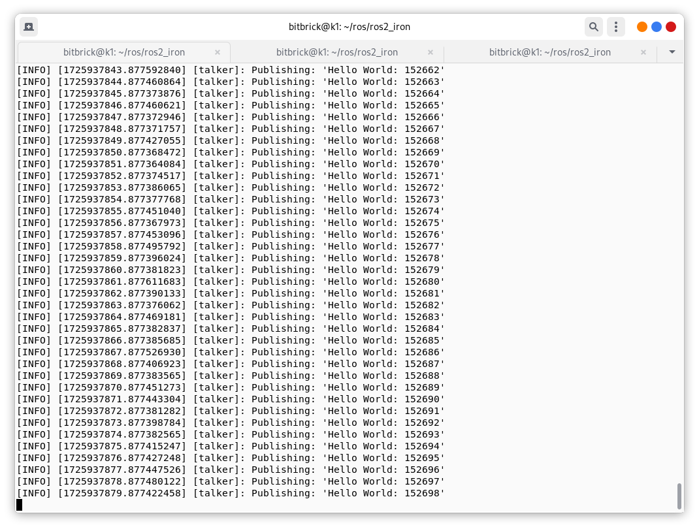
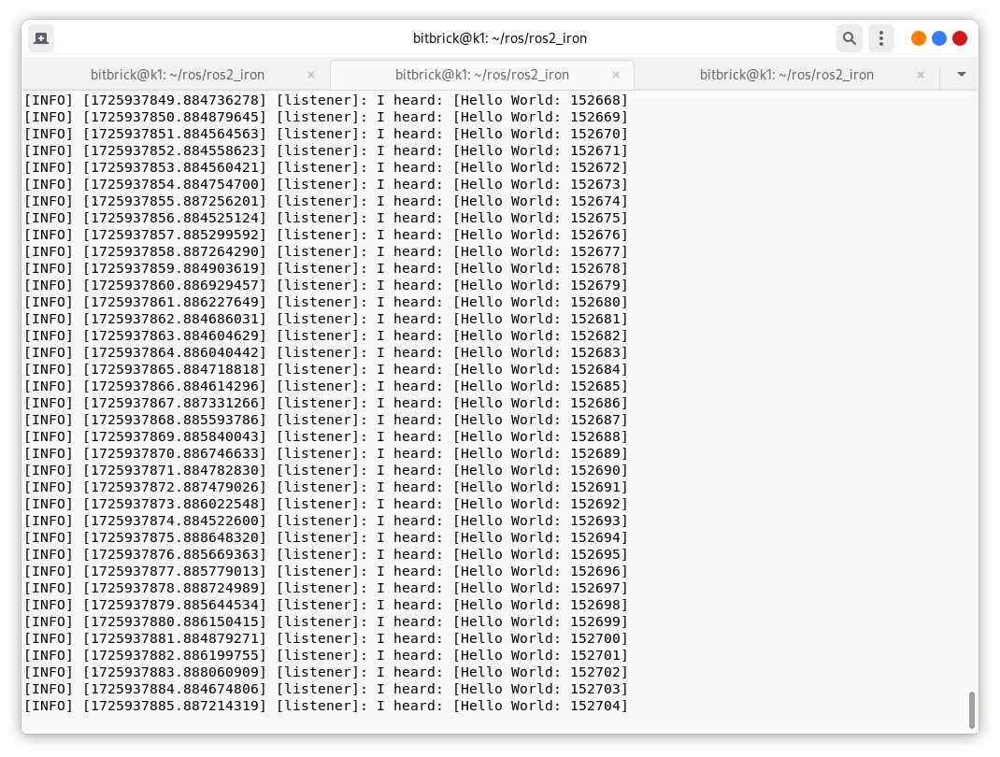
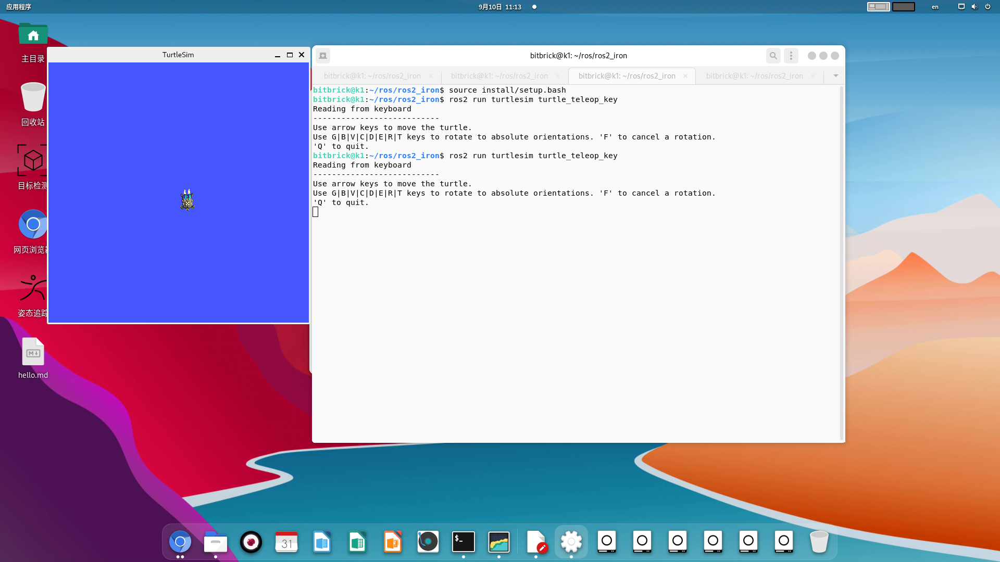

# ROS2 安装
由于ROS2官方没有提供基于risc-v的ROS2的安装包，所以需要自己编译安装。以下就是在Pi One上安装ROS2的全过程，首先你需要在虚拟机中至少有25GB的硬盘空间来从源代码安装ROS 2。在继续之前，请确保你有足够的空间。

## 系统设置
### 设置地区
这与官方说明中的步骤完全相同：
```bash
locale  # 检查UTF-8

sudo apt update && sudo apt install locales
sudo locale-gen en_US en_US.UTF-8
sudo update-locale LC_ALL=en_US.UTF-8 LANG=en_US.UTF-8
export LANG=en_US.UTF-8

locale  # 验证设置
```

### 启用所需的软件库
这里有些不同。我认为我们只能做以下操作：

```bash
sudo apt install software-properties-common
sudo add-apt-repository universe
```

## 安装依赖
好的，我们尝试安装所有必需的东西，但不使用ros-dev-tools。我们将使用apt和pip：
```bash
sudo apt update && sudo apt upgrade && sudo apt install -y \
    build-essential \
    cmake \
    git \
    apt-utils \
    ca-certificates \
    conntrack \
    curl \
    dh-python \
    dhcpcd5 \
    ebtables \
    ethtool \
    git-lfs \
    gnupg2 \
    ifupdown \
    iptables \
    iproute2 \
    iputils-ping \
    libasio-dev \
    libbullet-dev \
    libconsole-bridge-dev \
    libtinyxml2-dev \
    libeigen3-dev \
    lsb-release \
    net-tools \
    openssh-client \
    python3-dev \
    python3-distlib \
    python3-empy \
    python3-lark \
    python3-notify2 \
    python3-numpy \
    python3-pip \
    python3-pytest-cov \
    python3-setuptools \
    python3-yaml \
    samba \
    socat \
    systemd \
    vim \
    wget 
```
**注意**：可能我们并不需要所有这些依赖项。你可以随意选择一些不安装（并且和我们分享 ）

仍然有一些依赖项在没有ROS 2软件库的情况下是无法获得的。我们使用pip来安装它们：
```bash
sudo pip install vcstool \
    rosdep \
    catkin-pkg-modules \
    rosdistro-modules \
    colcon-common-extensions
```

到目前为止一切顺利。让我们继续构建ROS 2。

注意：
如果你不能正常安装这些依赖，可以使用`apt`来安装其中的一些依赖，但需要先添加一个ubuntu ports的`source.list`，如下所示：
`/etc/apt/sources.list.d/ubuntu.list`
```bash
deb http://ports.ubuntu.com/ubuntu-ports/   mantic main restricted universe multiverse
# deb-src https://mirrors.tuna.tsinghua.edu.cn/ubuntu-ports/  mantic main restricted universe multiverse
deb http://ports.ubuntu.com/ubuntu-ports/   mantic-updates main restricted universe multiverse
# deb-src https://mirrors.tuna.tsinghua.edu.cn/ubuntu-ports/  mantic-updates main restricted universe multiverse
deb http://ports.ubuntu.com/ubuntu-ports/   mantic-backports main restricted universe multiverse
# deb-src https://mirrors.tuna.tsinghua.edu.cn/ubuntu-ports/  mantic-backports main restricted universe multiverse

# 以下安全更新软件源包含了官方源与镜像站配置，如有需要可自行修改注释切换
deb http://ports.ubuntu.com/ubuntu-ports/  mantic-security main restricted universe multiverse
# deb-src http://ports.ubuntu.com/ubuntu-ports/  mantic-security main restricted universe multiverse

# 预发布软件源，不建议启用
deb http://ports.ubuntu.com/ubuntu-ports/   mantic-proposed main restricted universe multiverse
# # deb-src https://mirrors.tuna.tsinghua.edu.cn/ubuntu-ports/  mantic-proposed main restricted universe multiverse

```
添加之后我们就有两个源，分别是`bianbu.list`和`ubuntu.list`

然后使用`apt`命令安装部分pip安装不了的依赖：
```bash
sudo apt-get install python3-catkin-pkg
sudo apt-get install python3-rosdistro
sudo apt install vcstool 
```

## 构建ROS 2
### 获取ROS 2代码
与官方文档中的步骤相同：

```bash
mkdir -p ~/ros2/ros2_iron/src
cd ~/ros2/ros2_iron
vcs import --input https://raw.githubusercontent.com/ros2/ros2/iron/ros2.repos  src
```

如果你遇到错误 "Failed to connect to raw.githubusercontent.com port 443 after 13 ms: Connection refused"，你可以参考 https://www.guyuehome.com/37844 
处理方法：
```bash
sudo vi /etc/hosts
#####################
127.0.0.1	localhost
127.0.1.1	iron-virtual-machine
### 添加以下解析
185.199.108.133  raw.githubusercontent.com
```

### 使用rosdep安装依赖
这里开始变得有点棘手：
```bash
sudo rosdep init
rosdep update
rosdep install -r --from-paths src --ignore-src -y --skip-keys "fastcdr rti-connext-dds-6.0.1 urdfdom_headers"
```
仔细看：我添加了 -r 选项来忽略失败。rosdep假设我们有访问ROS库的权限并使用apt来安装一些依赖。apt在寻找一些依赖时会失败。幸运的是，我们之前已经使用pip下载了它们。无论如何，rosdep会打印出失败的软件包，所以你可以在之前使用pip安装过的软件包中进行双重检查，确保我们可以继续进行。

注意：如果你使用的是基于Ubuntu的发行版（如Linux Mint）但不识别为Ubuntu，你会得到一个错误消息 Unsupported OS `[bianbu]`。在这种情况下，将 `--os=ubuntu:jammy` 附加到上面的命令。

### 在工作区构建代码

我现在正卡在这里。如果你运行以下命令：
```bash
colcon build --symlink-install
```
它开始构建一些依赖项……但最终会因为mimick_vendor而失败。本质上，mimick_vendor试图编译Mimick包4，该包不支持risc-v架构。然而，这个包的原始分支有一个开放的PR 5确实提供了对RISC-V的支持。遗憾的是，作者似乎不太活跃。不过，我已经开了几个问题，询问ROS 2 Mimick的维护者添加这个功能。

从现在开始，我将调整ROS依赖列表指向提供risc-v支持的这个分支，并看看我是否可以继续安装。我会随时更新。

正如我之前提到的，Mimick库不支持risc-v 64架构。但是，GitHub用户@ziyao233帮助了我并打开了一个PR来修复这个问题17（非常感谢！）。因此，在构建代码之前，我们必须调整mimick_vendor依赖项：
```bash
vi ~/ros2_iron/src/ros2/mimick_vendor/CMakeLists.txt
   # 转到第61行，并将提交哈希修改为 https://github.com/ziyao233/Mimick/tree/ros2-fixed： 
  set(mimick_version "90d02296025f38da2e33c67b02b7fa0c7c7d460c")
    # 转到第63行，并将git仓库修改为 https://github.com/ziyao233/Mimick： 
    GIT_REPOSITORY https://github.com/ziyao233/Mimick.git 
```
我们现在准备就绪。
```bash
colcon build --symlink-install
```

### 设置环境
```bash
source ~/ros2/ros2_iron/install/local_setup.bash
```

## 尝试一些示例
如果你安装了ros-foxy-desktop，你可以尝试一些示例。

在一个终端中，source setup文件然后运行一个C++ talker：
```bash
ros2 run demo_nodes_cpp talker
```
在另一个终端中source setup文件然后运行一个Python listener：

```bash
ros2 run demo_nodes_py listener
```
你应该看到talker说它正在发布消息，listener说它听到了这些消息。这验证了C++和Python API都在正常工作。nice！


示例 2：

小海龟仿真示例
让我们再次尝试ROS中的经典示例——小海龟仿真器。

分别在两个终端中运行以下指令：
```bash
ros2 run turtlesim turtlesim_node
ros2 run turtlesim turtle_teleop_key
```

