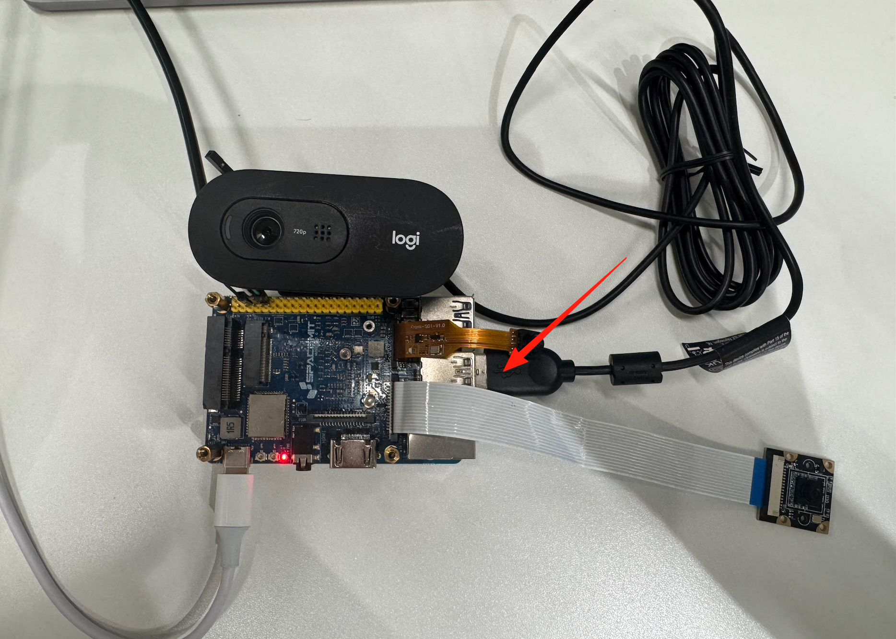
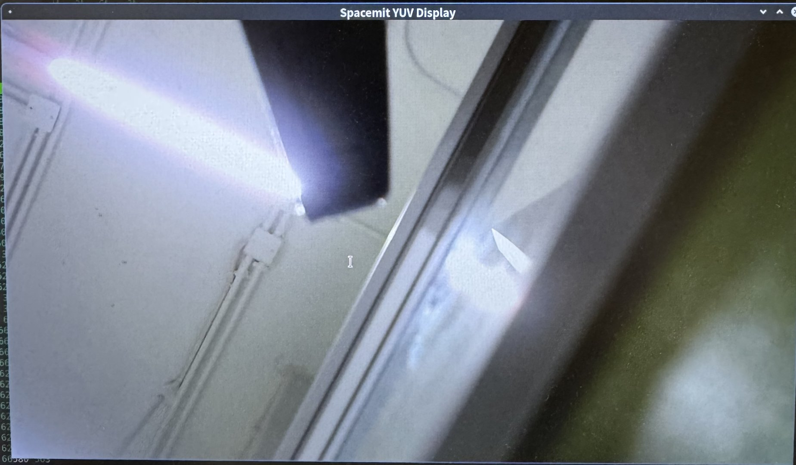

# 3.1.2 USB USB Camera Usage Instructions

## 环境配置

请将 USB 摄像头模组连接至开发板的 USB 接口，如下图所示：



同时，开发板与显示器之间请使用 HDMI 线缆进行连接，以便输出图像画面。

## C++ 接口

以下示例展示了如何通过 JDK 提供的 C++ 接口实现 USB 摄像头图像的采集、解码和显示：

```c++
// 打开摄像头节点
auto camera = JdkUsbCam::create(device, width, height, V4L2_PIX_FMT_MJPEG);

// 创建 JPEG 解码器
auto decoder = std::make_shared<JdkDecoder>(width, height, CODING_MJPEG, PIXEL_FORMAT_NV12);

// 初始化显示模块（vo）
auto jdkvo = std::make_shared<JdkVo>(width, height, PIXEL_FORMAT_NV12);

// 获取一帧图像数据
auto frame = camera->getFrame();

// 解码 JPEG 图像
auto decFrame = decoder->Decode(frame);

// 将图像帧发送至显示模块
auto ret = jdkvo->sendFrame(decFrame);
```

## 快速开始

本节介绍如何在开发板上使用 JDK 提供的 USB 摄像头采集 SDK 进行编译与运行。

1）将源码包 [`jdk_usbcam.tar`](https://archive.spacemit.com/ros2/code/jdk_usbcam.tar) 下载至开发板本地，并解压：

```bash
tar xvf jdk_usbcam.tar
```

解压后目录结构如下：

```bash
jdk_usbcam/
├── Makefile
├── .clang-format
├── .DS_Store
├── src/
│   └── main.cpp
└── workspace/
```

2）进入源码目录，编译 SDK：

```bash
cd jdk_usbcam
make all
```

编译成功后，执行文件 `jdk_usbcam` 将生成于 `workspace/` 目录下：

```bash
./workspace/jdk_usbcam
```

3）加载 `jdk_dma` 驱动模块：

```
insmod /opt/jdk/ko/jdk_dma.ko
```

4）执行采集程序，并指定 USB 摄像头设备节点（如 `/dev/video20`）：

```bash
./workspace/jdk_usbcam /dev/video20
```

终端将输出一系列初始化和采集日志，例如：

```
VIDIOC_STREAMON succeeded
[MPP-DEBUG] 10800:module_init:159 +++++++++++++++ module init, module type = 9
[MPP-DEBUG] 10800:find_v4l2_linlonv5v7_plugin:83 yeah! we have v4l2_linlonv5v7_codec plugin---------------
[MPP-DEBUG] 10800:module_init:199 ++++++++++ V4L2_LINLONV5V7 (/usr/lib/libv4l2_linlonv5v7_codec.so)
[MPP-DEBUG] 10800:module_init:199 ++++++++++ open (/usr/lib/libv4l2_linlonv5v7_codec.so) success !
[MPP-DEBUG] 10800:al_dec_create:337 init create
[MPP-DEBUG] 10800:al_dec_init:398 input para check: foramt:0x4745504a output format:0x3231564e input buffer num:12 output buffer num:8
[MPP-DEBUG] 10800:al_dec_init:421 video fd = 4, device path = '/dev/video0'
[MPP-DEBUG] 10800:createCodec:115 create a codec, width=1280 height=720 align=1 inputtype=2 outputtype=9 inputformat=4745504a outputformat=3231564e inputbufnum=12 outputbufnum=8
[MPP-DEBUG] 10800:createPort:80 create a port, type=2 format_fourcc=1195724874
[MPP-DEBUG] 10800:createPort:80 create a port, type=9 format_fourcc=842094158
[MPP-DEBUG] 10800:getTrySetFormat:196 width=1280 height=720 align=1 pixel_format=4745504a
[MPP-DEBUG] 10800:printFormat:294 PRINTFORMAT ===== type: 2, format: 1195724874, width: 1280, height: 720, bytesperline: 0, sizeimage: 1048576
[MPP-DEBUG] 10800:getTrySetFormat:196 width=1280 height=720 align=1 pixel_format=3231564e
[MPP-DEBUG] 10800:printFormat:283 PRINTFORMAT ===== type: 9, format: 842094158, width: 1280, height: 720, nplanes: 2, bytesperline: [1280 1280 0], sizeimage: [921600 460800 0]
[MPP-DEBUG] 10800:allocateBuffers:340 Request buffers. type:2 count:12(12) memory:1
[MPP-DEBUG] 10800:allocateBuffers:340 Request buffers. type:9 count:8(8) memory:4
[MPP-DEBUG] 10800:streamon:558 Stream on 1751956058513
[MPP-DEBUG] 10800:streamon:558 Stream on 1751956058513
[MPP-DEBUG] 10800:al_dec_init:449 init finish
[MPP-DEBUG] 10800:VO_CreateChannel:43 create VO Channel success!
[MPP-DEBUG] 10800:module_init:159 +++++++++++++++ module init, module type = 101
[MPP-DEBUG] 10800:check_vo_sdl2:121 yeah! have vo_sdl2---------------
[MPP-DEBUG] 10800:find_vo_sdl2_plugin:86 yeah! we have vo_sdl2_plugin plugin---------------
[MPP-DEBUG] 10800:module_init:207 ++++++++++ VO_SDL2 (/usr/lib/libvo_sdl2_plugin.so)
[MPP-DEBUG] 10800:module_init:207 ++++++++++ open (/usr/lib/libvo_sdl2_plugin.so) success !
[MPP-ERROR] 10800:al_vo_init:93 SDL could not initialize! SDL_Error: wayland not available
[MPP-ERROR] 10800:al_vo_init:128 k1 vo_sdl2 init fail
[MPP-DEBUG] 10800:VO_Init:66 init VO Channel, ret = -400
[MPP-ERROR] 10800:JdkVo:32 VO_init failed, please check!
[MPP-INFO] 10801:runpoll:321 Now k1 hardware decoding ...
select: Resource temporarily unavailable
Failed to capture frame 0
NO data, return.
[MPP-DEBUG] 10801:handleEvent:453 get V4L2_EVENT_SOURCE_CHANGE event, do notify!
[MPP-DEBUG] 10800:handleOutputBuffer:1509 Resolution changed:0 new size: 1280 x 720
[MPP-DEBUG] 10800:streamoff:571 Stream off 1751956060839
[MPP-DEBUG] 10800:allocateBuffers:340 Request buffers. type:9 count:0(0) memory:4
[MPP-DEBUG] 10800:getTrySetFormat:196 width=1280 height=720 align=1 pixel_format=3231564e
[MPP-DEBUG] 10800:printFormat:283 PRINTFORMAT ===== type: 9, format: 842094158, width: 1280, height: 720, nplanes: 2, bytesperline: [1280 1280 0], sizeimage: [921600 460800 0]
[MPP-DEBUG] 10800:allocateBuffers:340 Request buffers. type:9 count:12(12) memory:4
[MPP-DEBUG] 10800:streamon:558 Stream on 1751956060850
[MPP-ERROR] 10800:queueBuffer:461 Failed to queue buffer. type = 9 (Invalid argument)
[MPP-ERROR] 10800:al_dec_return_output_frame:652 queueBuffer failed, this should not happen, please check!
[MPP-DEBUG] 10800:VO_Process:82 vo one packet, ret = 0
index:1,dma_fd:33 width:1280,height:720,size:1382400
[MPP-DEBUG] 10800:VO_Process:82 vo one packet, ret = 0
index:2,dma_fd:33 width:1280,height:720,size:1382400
[MPP-DEBUG] 10800:VO_Process:82 vo one packet, ret = 0
index:3,dma_fd:33 width:1280,height:720,size:1382400
```

## 运行效果

程序运行后，摄像头采集的图像将在显示器上实时显示，如图所示：



