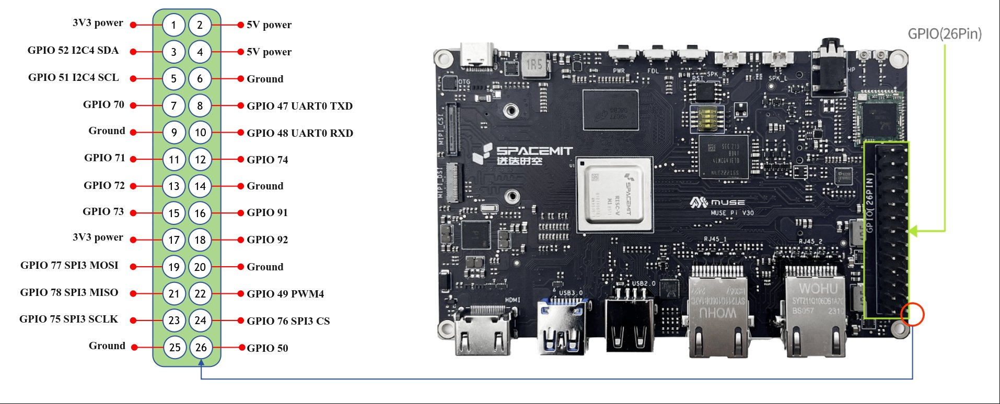
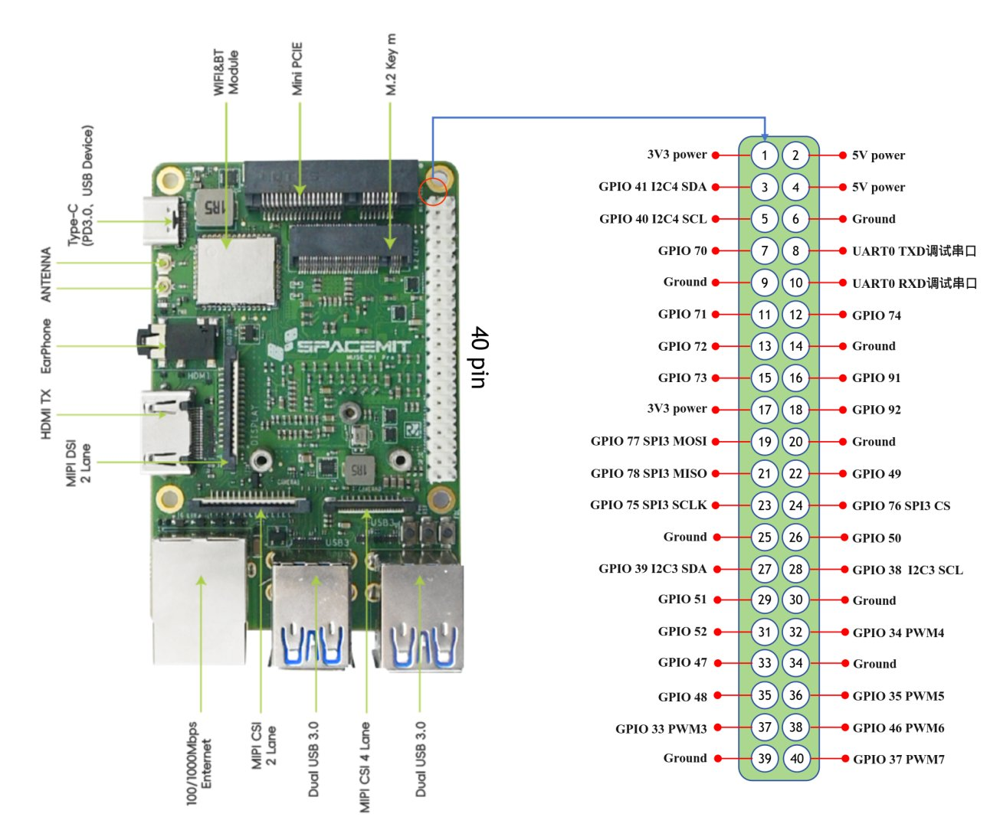
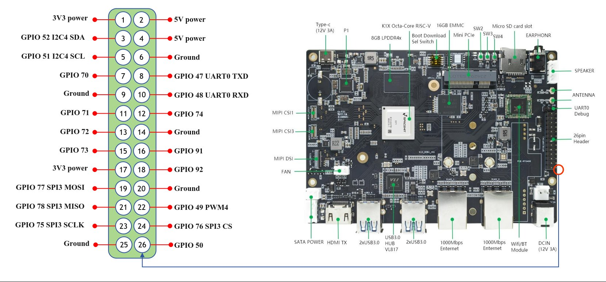

# 3.3.1 Pin Definition Description

Bianbu Robot 支持多种主控板型，均提供标准化引脚接口，便于用户连接外设并进行功能扩展。各主控板的引脚定义如下所示：

## MUSE Pi

## MUSE Pi Pro

## BPI-F3

## MUSE BOOK

## MUSE Card

## RV4B

**引脚功能说明：**

- 输入（Input）：表示引脚可接收电平信号，常用于通过 `gpiozero` 等库读取按钮等外设状态。
- 输出（Output）：表示引脚可输出高低电平（0V 或 3.3V），通常用于控制 LED 灯、继电器等设备。
- PWM（Pulse Width Modulation）：表示引脚支持 PWM 波形输出，可用于控制舵机、电机，或实现呼吸灯等渐变光效。