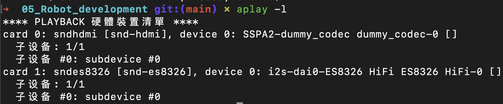
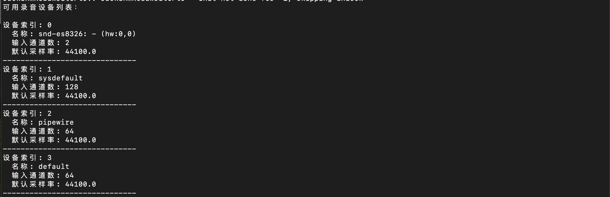

# 5.2.1 Voice Activity Detection

## Feature Introduction

This section introduces how to use Voice Activity Detection (VAD) models to automatically detect human speech and control recording behavior. The system will start recording when speech is detected and automatically stop when silence is detected.

Project repository: [⭐ Bianbu AI Demo Zoo | NLP](https://gitee.com/bianbu/spacemit-demo.git)

## Preparation

### Download Model Files

```bash
wget -O ~/.cache/sensevoice.tar.gz https://archive.spacemit.com/spacemit-ai/openwebui/sensevoice.tar.gz 
tar -xzf ~/.cache/sensevoice.tar.gz -C ~/.cache
rm ~/.cache/sensevoice.tar.gz
```

### Clone Repository Code

```bash
git clone https://gitee.com/bianbu/spacemit-demo.git
```

### Install Dependencies

```bash
sudo apt update
sudo apt install onnxruntime python3-spacemit-ort
sudo apt install python3-numpy
sudo apt install python3-pyaudio
```

## Detect System Recording Devices

### Method 1: Using `arecord`

Run the following command to view the system's recording device list:

```bash
arecord -l
```



Record the device index number you need to use.

### Method 2: Run Script for Automatic Search

Execute the following script to enumerate recording devices in the system:

```bash
python3 01_search_device.py
```

