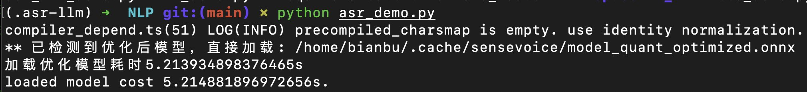

# 5.2.2 Speech to Text

## Feature Introduction

This section introduces the basic functionality of Automatic Speech Recognition (ASR) and its example usage. After users input voice through a microphone, the system can automatically recognize and convert it to text.

Project repository: [⭐ Bianbu AI Demo Zoo | NLP](https://gitee.com/bianbu/spacemit-demo.git)

## Preparation

### Clone Code

```bash
git clone https://gitee.com/bianbu/spacemit-demo.git
cd spacemit_demo/examples/NLP
```

### Install Environment Dependencies

It is recommended to use a virtual environment for dependency isolation:

```bash
sudo apt install python3-venv

python3 -m venv .venv
source .venv/bin/activate

pip install -r requirements.txt
```

### Detect System Recording Devices

Refer to the [Recording Device Detection](5.2.1_Voice_Activity_Detection.md#detect-system-recording-devices) section to check the available recording devices in the system.

## Execute Example Code

Run the ASR example:

```bash
python 03_asr_demo.py
```



After the program starts, press Enter to begin recording. The integrated VAD functionality will automatically determine if there is human speech and stop recording during silence.

## Parameter Description

| Parameter Name | Description            | Usage                                                        |
| -------------- | ---------------------- | ------------------------------------------------------------ |
| `sld`          | Silence Duration Threshold (seconds) | Continuous silence time ≥ `sld` seconds will be considered as end of speech; set to `0` to disable |
| `max_time`     | Maximum Recording Time (seconds) | Recording will automatically terminate when this duration is reached to avoid excessively long speech |
| `channels`     | Audio Channel Count    | Usually set to `1` (mono), mono input is recommended for speech recognition |
| `rate`         | Sample Rate (Hz)       | Number of samples per second, such as `16000` or `48000`, must match model input |
| `device_index` | Input Device Index     | Specify recording device, can be obtained through `arecord` or `search_device.py` |