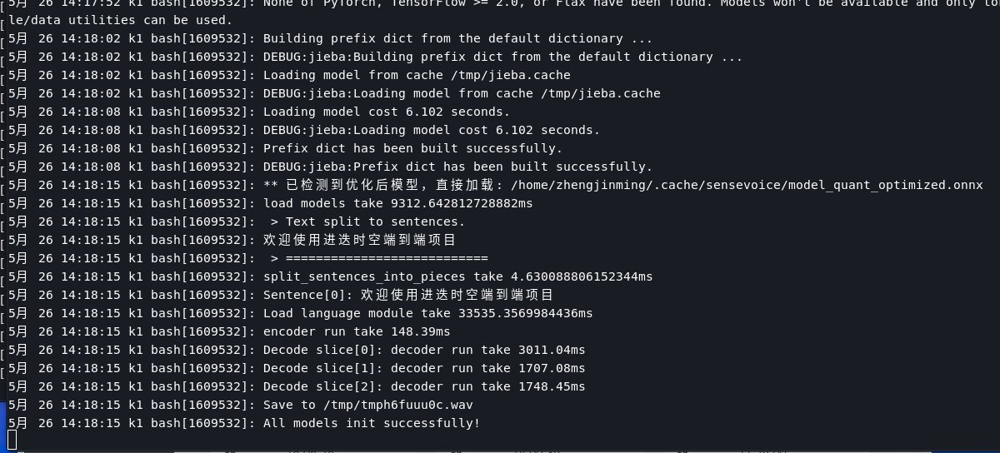
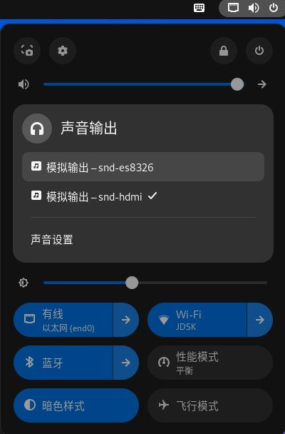

# 5.2.5 Text to Speech

## Feature Introduction

This chapter introduces the basic functionality and usage of Text-to-Speech (TTS).

## One-Click Deployment (Optional)

This project provides a one-click installation Deb package.

Please ensure the device firmware version is not less than 2.2rc2.
Firmware download address: [https://archive.spacemit.com/image/k1/version/bianbu/](https://archive.spacemit.com/image/k1/version/bianbu/)

### Install Deb Package

```bash
sudo apt update
sudo apt install asr-llm-tts
```

After installation, the device needs to be restarted to activate the system service. After restart completion, execute:

```bash
journalctl --user -u demo_serve -f
```

Observe the system log until the following information appears:



When the log displays `'All models init successfully!'`, it indicates that the TTS service has started and is ready to use.

### Usage

Run in terminal:

```bash
tts
```

Press Enter to start using the text-to-speech functionality.

## Preparation

### Clone Code

```bash
git clone https://gitee.com/bianbu/spacemit-demo.git
```

### Install Environment

```bash
sudo apt install python3-venv

python3 -m venv .venv
source .venv/bin/activate

pip install -r requirements
```

## Search System Playback Devices

### Method 1: Using `aplay`

```bash
root@bianbu:~# aplay -l
**** List of PLAYBACK Hardware Devices ****
card 0: sndhdmi [snd-hdmi], device 0: SSPA2-dummy_codec dummy_codec-0 []
  Subdevices: 1/1
  Subdevice #0: subdevice #0
card 1: sndes8326 [snd-es8326], device 0: i2s-dai0-ES8326 HiFi ES8326 HiFi-0 []
  Subdevices: 1/1
  Subdevice #0: subdevice #0
```

Based on the output results, determine the playback device index number and modify the corresponding playback device index in the code.

### Method 2: Using `pactl` Tool to Query Default Playback Device

Install tool:

```bash
sudo apt install pulseaudio-utils
```

Query playback device list:

```bash
root@bianbu:~# pactl list short sinks
64	alsa_output.platform-snd-card_1.stereo-fallback	PipeWire	s16le 2ch 48000Hz	SUSPENDED
66	alsa_output.platform-c0900100.udc.stereo-fallback	PipeWire	s16le 2ch 48000Hz	SUSPENDED
252	alsa_output.platform-snd-card_0.stereo-fallback	PipeWire	s16le 2ch 48000Hz	SUSPENDED
321	alsa_output.usb-C-Media_Electronics_Inc._USB_Audio_Device-00.analog-stereo	PipeWire	s16le 2ch 48000Hz	SUSPENDED
```

Test audio playback to corresponding devices to confirm effective playback devices:

```bash
# A. Test playback to card_0
pw-play --target alsa_output.platform-snd-card_1.stereo-fallback /usr/share/sounds/alsa/Front_Center.wav

# B. Test playback to card_1
pw-play --target alsa_output.platform-c0900100.udc.stereo-fallback /usr/share/sounds/alsa/Front_Center.wav

# C. Test playback to card_3
pw-play --target alsa_output.platform-snd-card_0.stereo-fallback /usr/share/sounds/alsa/Front_Center.wav

# D. Test playback to card_4 (external USB speaker)
pw-play --target alsa_output.usb-C-Media_Electronics_Inc._USB_Audio_Device-00.analog-stereo /usr/share/sounds/alsa/Front_Center.wav
```

After confirming the device, set the default playback device:

```bash
pactl set-default-sink alsa_output.usb-C-Media_Electronics_Inc._USB_Audio_Device-00.analog-stereo
```

### Method 3: Switch Playback Device via Graphical Interface (Recommended when display is available)



Click on the device in the interface to switch the default playback device.

## Start Text-to-Speech Program

```bash
python 07_tts_demo.py
```

Enter text in the command line, and the program will convert the text to speech and play it.