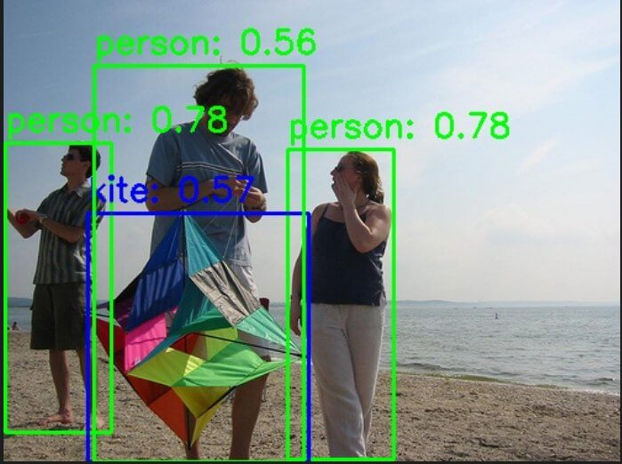
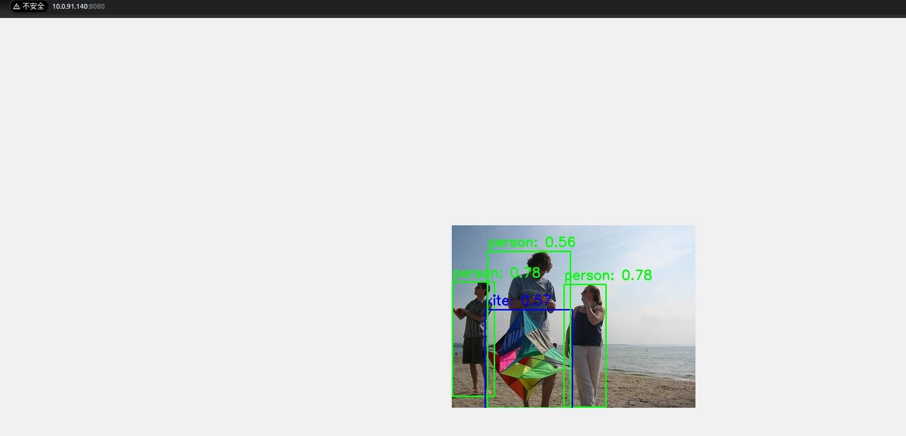
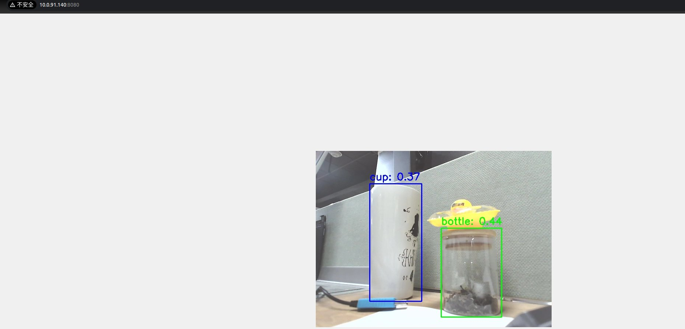

# 5.3.1 Model Inference

## 功能简介

本章节介绍深度学习模型推理节点的基本使用方式，支持以下功能：

- 输入本地图片进行模型推理，输出渲染图像并保存至本地；
- 通过 Web 界面实时可视化推理结果；
- 通过 MIPI 或 USB 摄像头输入视频流，在 Web 页面中显示目标检测结果。

本章节以目标检测模型为例，更多 DNN 算法参考 [5.4 常用算法库](../5.4_Robot_Algorithm_Library/index.md)。

## 支持平台

| 平台类型               | 操作系统                      |
| :--------------------- | :---------------------------- |
| SpaceMiT RISC-V 系列板 | bianbu desktop 24.04 (Humble) |
| x86 平台               | Ubuntu 22.04 (Humble)         |

## 环境准备

### 安装依赖项

```bash
sudo apt install python3-opencv ros-humble-cv-bridge ros-humble-camera-info-manager \
ros-humble-image-transport python3-spacemit-ort
```

### 平台要求

**SpaceMiT RISC-V：**

- 已烧录 bianbu desktop 24.04 系统镜像；
- 已完成 Bianbu Robot 安装。

**x86 平台：**

- 已安装 Ubuntu 22.04；
- 已配置 ROS2 Humble 及 Bianbu Robot SDK 环境。

## 支持的模型配置列表

可执行以下命令，查看当前系统中已支持的模型配置：

```bash
ros2 launch br_perception infer_info.launch.py
```

示例输出：

```
[YAML files in 'br_perception']:
  - config/segmentation/unet.yaml
  - config/detection/yolov8.yaml
  - config/detection/yolov6.yaml
  - config/detection/yolov11_640.yaml
  - config/detection/yolov5.yaml
  - config/detection/yolov11_320.yaml
  - config/classification/resnet18.yaml
  - config/classification/resnet50.yaml
  - config/classification/mobilenet_v2.yaml
```

后续推理时，将 `config_path` 设置为相应的 `.yaml` 文件路径，即可使用对应模型。

## 图片推理

### 激活 ROS2 环境

```
source /opt/bros/humble/setup.bash
```

### 准备图片与模型

```bash
cp /opt/bros/humble/share/jobot_infer_py/data/detection/test.jpg .
```

### 执行推理

```bash
ros2 launch br_perception infer_img.launch.py config_path:='config/detection/yolov6.yaml' img_path:='./test.jpg'
```

推理结果将输出至 `det_result.jpg`：



同时终端打印如下：

```
[INFO] [launch]: Default logging verbosity is set to INFO
[INFO] [infer_img_node-1]: process started with pid [275002]
[infer_img_node-1] x_min:1, y_min:116, width:86, height:235, label:person, confidence:0.78
[infer_img_node-1] x_min:230, y_min:121, width:86, height:252, label:person, confidence:0.78
[infer_img_node-1] x_min:68, y_min:173, width:179, height:202, label:kite, confidence:0.57
[infer_img_node-1] x_min:73, y_min:53, width:170, height:322, label:person, confidence:0.56
[infer_img_node-1] The object detection results are saved in: det_result.jpg
[INFO] [infer_img_node-1]: process has finished cleanly [pid 275002]
```

### Web 可视化推理结果

启动推理（终端1）：

```bash
source /opt/bros/humble/setup.bash
ros2 launch br_perception infer_img.launch.py config_path:='config/detection/yolov6.yaml' img_path:='./test.jpg' publish_result_img:=true result_img_topic:='result_img' result_topic:='/inference_result'
```

Web 可视化推理结果（终端2）：

```bash
source /opt/bros/humble/setup.bash
ros2 launch br_visualization websocket_cpp.launch.py image_topic:='/result_img'
```

终端将提示浏览器地址：

```
...
Please visit in your browser: http://<IP>:8080
...
```

打开浏览器访问 `http://<IP>:8080` 即可查看实时推理渲染图像：




#### 消息查看与订阅

推理结果通过 `/inference_result` 话题发布，可执行下述命令订阅查看：

```bash
ros2 topic echo /inference_result
```

输出如下：

```bash
header:
  stamp:
    sec: 1745571001
    nanosec: 597668762
  frame_id: camera_link
results:
- x_min: 109
  y_min: 99
  width: 149
  height: 316
  label: bottle
  conf: 0.4000000059604645
- x_min: 270
  y_min: 209
  width: 150
  height: 249
  label: bottle
  conf: 0.4000000059604645
- x_min: -1
  y_min: 424
  width: 326
  height: 55
  label: sink
  conf: 0.30000001192092896
---
```

#### 查看消息格式定义

```bash
ros2 interface show jobot_ai_msgs/msg/DetectionResultArray
```

结构示例：

```yaml
std_msgs/Header header
    builtin_interfaces/Time stamp
        int32 sec
        uint32 nanosec
    string frame_id

jobot_ai_msgs/DetectionResult[] results
    int32 x_min
    int32 y_min
    int32 width
    int32 height
    string label
    float32 conf
```

#### Python 订阅推理结果示例

```python
from rclpy.node import Node
from std_msgs.msg import Header
from jobot_ai_msgs.msg import DetectionResultArray, DetectionResult
import rclpy

class DetectionSubscriber(Node):
    def __init__(self):
        super().__init__('detection_sub')
        self.subscription = self.create_subscription(
            DetectionResultArray,
            '/detections',
            self.listener_callback,
            10)

    def listener_callback(self, msg: DetectionResultArray):
        self.get_logger().info(f"Frame: {msg.header.frame_id}")
        for det in msg.results:
            self.get_logger().info(
                f"[{det.label}] ({det.x_min},{det.y_min}) "
                f"{det.width}x{det.height} conf={det.conf:.2f}"
            )

def main(args=None):
    rclpy.init(args=args)
    node = DetectionSubscriber()
    rclpy.spin(node)
    node.destroy_node()
    rclpy.shutdown()

main()
```

## 视频流推理

### 启动相机节点

```bash
source /opt/bros/humble/setup.bash
ros2 launch br_sensors usb_cam.launch.py video_device:="/dev/video20"
```

### 启动视频推理

#### 推理终端

```bash
source /opt/bros/humble/setup.bash
ros2 launch br_perception infer_video.launch.py config_path:='config/detection/yolov6.yaml' sub_image_topic:='/image_raw' publish_result_img:=true result_topic:='/inference_result'
```

#### Web 可视化终端

```bash
source /opt/bros/humble/setup.bash
ros2 launch br_visualization websocket_cpp.launch.py image_topic:='/result_img'
```

访问浏览器地址 `http://<IP>:8080`，可看到如下推理结果：



#### 无可视化模式（仅获取数据）

如果您只想要拿到模型推理的结果，执行下述命令即可：

```bash
ros2 launch br_perception infer_video.launch.py config_path:='config/detection/yolov6.yaml' sub_image_topic:='/image_raw' publish_result_img:=false result_topic:='/inference_result'
```

### 消息订阅和查看

参考 [《消息订阅和查看》](#消息查看与订阅)章节过程打印消息数据、查看消息格式、并通过 python 订阅推理结果。

## 参数说明

### infer_img.launch.py 参数

| 参数名称             | 说明                                          | 默认值                         |
| -------------------- | --------------------------------------------- | ------------------------------ |
| `config_path`        | 模型配置文件路径                              | `config/detection/yolov6.yaml` |
| `img_path`           | 输入图片路径                                  | `data/detection/test.jpg`      |
| `publish_result_img` | 是否发布图像推理渲染结果                      | `false`                        |
| `result_img_topic`   | 发布的图像话题名，需开启 `publish_result_img` | `/result_img`                  |
| `result_topic`       | 发布的推理结果话题名                          | `/inference_result`            |

### infer_video.launch.py 参数

| 参数名称             | 说明                                          | 默认值                         |
| -------------------- | --------------------------------------------- | ------------------------------ |
| `config_path`        | 模型配置文件路径                              | `config/detection/yolov6.yaml` |
| `sub_image_topic`    | 输入图像话题名（通常为相机输出）              | `/image_raw`                   |
| `publish_result_img` | 是否发布图像推理渲染结果                      | `false`                        |
| `result_img_topic`   | 发布的图像话题名，需开启 `publish_result_img` | `/result_img`                  |
| `result_topic`       | 发布的推理结果话题名                          | `/inference_result`            |
