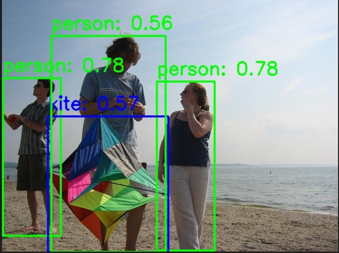
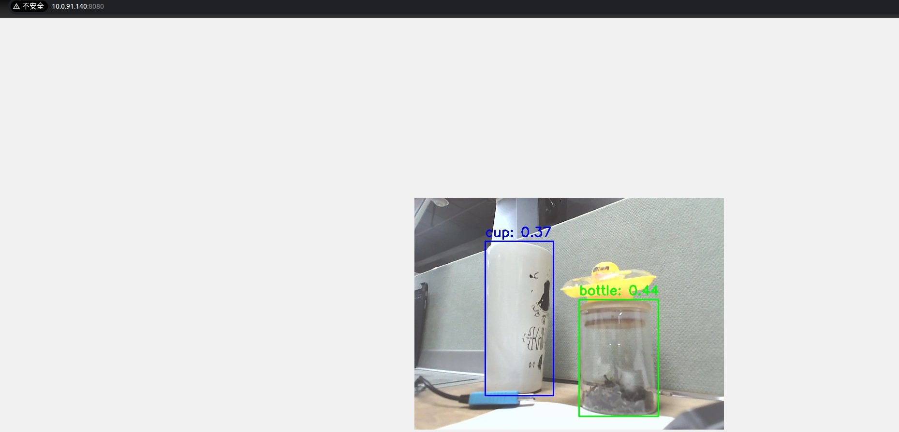

# 5.3.2 Object Detection

## YOLO 模型简介

本示例展示如何基于 SpaceMiT 智算核，使用图片或视频流作为输入，执行 YOLO 系列目标检测模型的推理，并通过 ROS 2 发布检测结果（包括目标类别与边界框坐标）。

### 支持模型版本

- YOLOv5
- YOLOv6
- YOLOv8
- YOLOv11 等

ONNX 格式模型可通过 [⭐ Bianbu AI Demo Zoo ](https://gitee.com/bianbu/spacemit-demo#cv%E6%A8%A1%E5%9E%8B%E6%80%A7%E8%83%BD) 下载获取，所有模型基于 [COCO 数据集](http://cocodataset.org/) 训练，支持 80 类常见目标，如人物、动物、水果、交通工具等。

### 应用优势

- 推理速度快
- 精度高，泛化能力强
- 部署简单，资源占用低

### 应用场景

- 自动驾驶：行人和车辆识别
- 智能家居：垃圾分类、监控识别
- 智慧安防：异常行为检测、跌倒识别

## 环境准备

### 安装依赖

```bash
sudo apt install python3-opencv ros-humble-cv-bridge ros-humble-camera-info-manager \
ros-humble-image-transport python3-spacemit-ort
```

### 导入 ROS2 环境

```bash
source /opt/bros/humble/setup.bash
```

## 模型配置查看

可执行以下命令，查看当前系统中已支持的模型配置：

```bash
ros2 launch br_perception infer_info.launch.py | grep 'detection'
```

示例输出：

```
  - config/detection/yolov8.yaml
  - config/detection/yolov6.yaml
  - config/detection/yolov11_640.yaml
  - config/detection/yolov5.yaml
  - config/detection/yolov11_320.yaml
```

后续推理时，将 `config_path` 设置为相应的 `.yaml` 文件路径，即可使用对应 YOLO 模型。

## 图片推理

### 准备图片

```bash
cp /opt/bros/humble/share/jobot_infer_py/data/detection/test.jpg .
```

### 本地保存推理结果

```bash
ros2 launch br_perception infer_img.launch.py \
  config_path:='config/detection/yolov6.yaml' \
  img_path:='./test.jpg'
```

输出结果将保存在当前目录的 `det_result.jpg` 中，如图所示。



### Web 可视化推理结果

启动推理发布节点（终端 1）：

```bash
ros2 launch br_perception infer_img.launch.py \
  config_path:='config/detection/yolov6.yaml' \
  img_path:='./test.jpg' \
  publish_result_img:=true \
  result_img_topic:='result_img' \
  result_topic:='/inference_result'
```

启动 Web 可视化服务（终端 2）：

```bash
ros2 launch br_visualization websocket_cpp.launch.py image_topic:='/result_img'
```

终端提示访问地址：

```
...
Please visit in your browser: http://<IP>:8080
...
```

打开浏览器输入 `http://<IP>:8080`，即可查看实时推理图像结果。


### 消息订阅和查看

参考 [《消息订阅和查看》](5.3.1_Model_Inference.md#消息查看与订阅)章节过程打印消息数据、查看消息格式、并通过 python 订阅推理结果。

## 视频流推理

### 启动相机（USB 示例）

```bash
ros2 launch br_sensors usb_cam.launch.py video_device:="/dev/video20"
```

### 启动推理并发布结果

启动推理（终端 1）：

```bash
ros2 launch br_perception infer_video.launch.py \
  config_path:='config/detection/yolov6.yaml' \
  sub_image_topic:='/image_raw' \
  publish_result_img:=true \
  result_topic:='/inference_result'
```

Web 显示（终端 2）：

```bash
ros2 launch br_visualization websocket_cpp.launch.py image_topic:='/result_img'
```

终端提示访问地址：

```
...
Please visit in your browser: http://<IP>:8080
...
```

打开浏览器输入 `http://<IP>:8080`，即可查看实时推理图像结果。



### 无可视化（仅数据输出）

如果你只想要拿到模型推理的结果，运行下述命令：

```bash
ros2 launch br_perception infer_video.launch.py \
  config_path:='config/detection/yolov6.yaml' \
  sub_image_topic:='/image_raw' \
  publish_result_img:=false \
  result_topic:='/inference_result'
```

通过 `ros2 topic echo /inference_result` 话题获取数据。

### 消息订阅和查看

参考 [《消息订阅和查看》](5.3.1_Model_Inference.md#消息查看与订阅)章节过程打印消息数据、查看消息格式、并通过 python 订阅推理结果。

## 参数说明

图片推理和视频流推理的参数说明请参考 [《参数说明》](5.3.1_Model_Inference.md#参数说明)。
