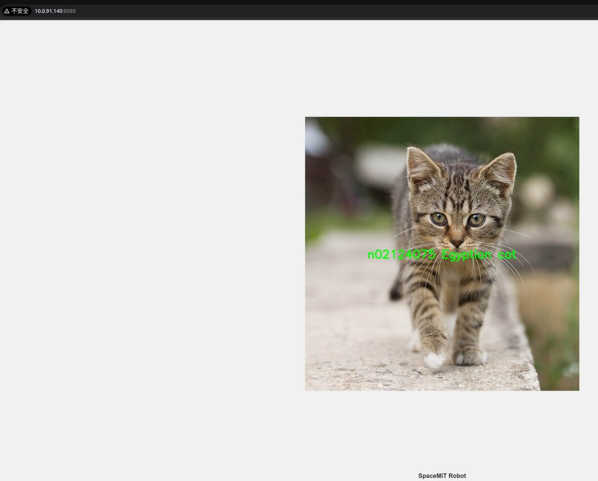

# 5.3.3 Image Classification

## MobileNetV2 简介

本示例展示如何使用图片或视频作为输入，借助 SpaceMiT 智算核执行 MobileNetV2 图像分类模型推理，并通过 ROS 2 发布分类结果消息。

MobileNetV2 支持基于 ImageNet 数据集的 1000 类通用图像识别，涵盖 人物、动物、交通工具、食品、水果等多种常见类别，具备良好的性能与轻量特性，适用于边缘设备部署。

MobileNetV2 的典型应用场景有：

- 物体识别与内容分类
- 图像检索与推荐系统
- 智能硬件图像理解
- OCR 前置图像筛选

## 环境准备

### 安装依赖项

```bash
sudo apt install python3-opencv ros-humble-cv-bridge ros-humble-camera-info-manager \
ros-humble-image-transport python3-spacemit-ort
```

### 导入 ROS 2 环境

```bash
source /opt/bros/humble/setup.bash
```

## 模型配置查看

可通过如下命令查看当前已支持的图像分类模型配置路径：

```bash
ros2 launch br_perception infer_info.launch.py | grep 'classification'
```

输出示例：

```
  - config/classification/resnet18.yaml
  - config/classification/resnet50.yaml
  - config/classification/mobilenet_v2.yaml
```

将配置路径作为 `config_path` 参数使用，即可加载对应的图像分类模型。

## 图片推理

### 准备图片

```bash
cp /opt/bros/humble/share/jobot_infer_py/data/classification/kitten.jpg .
```

### 控制台输出分类结果

```bash
ros2 launch br_perception infer_img.launch.py \
  config_path:='config/classification/mobilenet_v2.yaml' \
  img_path:='./kitten.jpg'
```

示例输出：

```
[INFO] [launch]: All log files can be found below /home/zq-pi3/.ros/log/2025-04-28-14-19-29-545318-spacemit-k1-x-MUSE-Pi-board-527992
[INFO] [launch]: Default logging verbosity is set to INFO
[INFO] [infer_img_node-1]: process started with pid [527993]
[infer_img_node-1] class predict: n02124075 Egyptian cat
[INFO] [infer_img_node-1]: process has finished cleanly [pid 527993]
```

说明：前缀 `n02124075` 是 ImageNet 中的类别编号，后面为对应类别名称。

### Web 可视化结果（可选）

启动图像推理（终端 1）：

```bash
ros2 launch br_perception infer_img.launch.py \
  config_path:='config/classification/mobilenet_v2.yaml' \
  img_path:='./kitten.jpg' \
  publish_result_img:=true \
  result_img_topic:='result_img' \
  result_topic:='/inference_result'
```

启动 Web 可视化服务（终端 2）：

```bash
ros2 launch br_visualization websocket_cpp.launch.py image_topic:='/result_img'
```

终端输出：

```
...
Please visit in your browser: http://<IP>:8080
...
```

打开浏览器访问 `http://<IP>:8080`，即可查看分类渲染图像。



### 消息订阅和查看

参考 [《消息订阅和查看》](5.3.1_Model_Inference.md#消息查看与订阅)章节过程打印消息数据、查看消息格式、并通过 python 订阅推理结果。

## 视频流推理

### 启动 USB 相机

```bash
ros2 launch br_sensors usb_cam.launch.py video_device:="/dev/video20"
```

### Web 可视化推理流程

推理并发布（终端1）：

```bash
ros2 launch br_perception infer_video.launch.py \
  config_path:='config/classification/mobilenet_v2.yaml' \
  sub_image_topic:='/image_raw' \
  publish_result_img:=true \
  result_topic:='/inference_result'
```

WebSocket 可视化（终端2）：

```bash
ros2 launch br_visualization websocket_cpp.launch.py image_topic:='/result_img'
```

打开浏览器访问 `http://<IP>:8080`，即可查看分类渲染图像。

### 无可视化，仅数据输出

如果仅需获取模型推理结果（无需图像渲染），可使用以下命令：

```bash
ros2 launch br_perception infer_video.launch.py \
  config_path:='config/classification/mobilenet_v2.yaml' \
  sub_image_topic:='/image_raw' \
  publish_result_img:=false \
  result_topic:='/inference_result'
```

## 参数说明

图片推理和视频流推理的参数说明请参考 [《参数说明》](5.3.1_Model_Inference.md#参数说明)。
