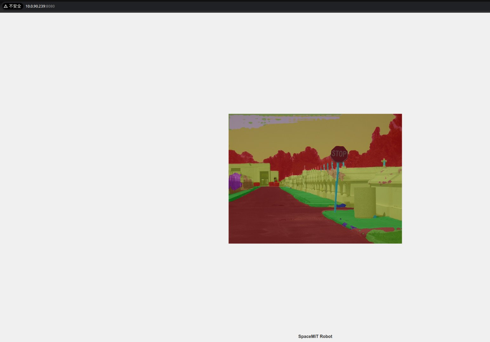

# 5.3.4 Image Segmentation

## UNet 简介

本示例展示如何基于轻量化的 UNet 语义分割模型，结合 SpaceMiT 智算核实现高效的图像分割。模型可接受静态图像或视频流输入，输出为像素级语义标签（灰度图）及伪彩渲染图，通过 ROS2 发布分割结果，便于下游感知与控制模块调用。

该模型基于 [Cityscapes 数据集](https://www.cityscapes-dataset.com/) 训练，采用 ONNX 格式部署，支持对城市道路场景中的典型要素（如人、车、道路、交通标志等）进行精准分割。

UNet 的典型应用场景有：

- 自动驾驶感知（道路/目标分割）
- 城市街景结构解析与数字地图构建
- 遥感图像地物分类与土地利用识别
- 医学图像分割（如器官、病灶）
- 工业检测中的缺陷识别与预处理

## 环境准备

### 安装依赖项

```bash
sudo apt install python3-opencv ros-humble-cv-bridge ros-humble-camera-info-manager \
ros-humble-image-transport python3-spacemit-ort
```

### 导入 ROS 2 环境

```bash
source /opt/bros/humble/setup.bash
```

## 查看支持的分割模型

通过以下命令查看已支持的图像分割模型配置路径：

```bash
ros2 launch br_perception infer_info.launch.py | grep 'segmentation'
```

输出示例：

```
- config/segmentation/unet.yaml
```

## 图片推理

### 准备输入图片

```bash
cp /opt/bros/humble/share/jobot_infer_py/data/segmentation/test_unet.jpg .
```

### 推理并保存图像结果

```bash
ros2 launch br_perception infer_img.launch.py \
  config_path:='config/segmentation/unet.yaml' \
  img_path:='./test_unet.jpg'
```

示例输出：

```
[INFO] [launch]: All log files can be found below /home/zq-pi/.ros/log/2025-05-26-09-45-18-005008-spacemit-k1-x-MUSE-Pi-board-5995
[INFO] [launch]: Default logging verbosity is set to INFO
[INFO] [infer_img_node-1]: process started with pid [5996]
[infer_img_node-1] Inference time: 4665.87 ms
[infer_img_node-1] The semantic segmentation results are saved in: seg_result.jpg
[infer_img_node-1] The semantic segmentation pseudo-color image is saved to seg_pseudo_color.png
[INFO] [infer_img_node-1]: process has finished cleanly [pid 5996]
```

输出文件包括：

- seg_result.jpg：原图与预测结果叠加图
- seg_pseudo_color.png：伪彩图（各语义类别以彩色编码表示）

示例图：

| 原始图像                     | 分割叠加图                    | 伪彩图                              |
| ---------------------------- | ----------------------------- | ----------------------------------- |
|  |  |  |

### Web 可视化推理结果

启动分割推理（终端1）：

```bash
ros2 launch br_perception infer_img.launch.py \
  config_path:='config/segmentation/unet.yaml' \
  img_path:='./test_unet.jpg' \
  publish_result_img:=true \
  result_img_topic:='result_img' \
  result_topic:='/inference_result'
```

终端1输出示例：

```
[INFO] [launch]: All log files can be found below /home/zq-pi/.ros/log/2025-05-26-10-05-41-203368-spacemit-k1-x-MUSE-Pi-board-7077
[INFO] [launch]: Default logging verbosity is set to INFO
[INFO] [infer_img_node-1]: process started with pid [7084]
[infer_img_node-1] Inference time: 4712.77 ms
[infer_img_node-1] The image inference results are published cyclically
[infer_img_node-1] The image inference results are published cyclically
[infer_img_node-1] The image inference results are published cyclically
```

启动 WebSocket 可视化服务（终端2）：

```bash
ros2 launch br_visualization websocket_cpp.launch.py image_topic:='/result_img'
```

浏览器访问提示地址  `http://<IP>:8080` 以查看分割结果。



### 消息订阅和查看

参考 [《消息订阅和查看》](5.3.1_Model_Inference.md#消息查看与订阅)章节过程打印消息数据、查看消息格式、并通过 python 订阅推理结果。

## 视频流推理

### 启动摄像头设备

```bash
ros2 launch br_sensors usb_cam.launch.py video_device:="/dev/video20"
```

### 启动视频流分割

开启终端1，执行下述命令启动视频流分割：

```bash
ros2 launch br_perception infer_video.launch.py \
  config_path:='config/segmentation/unet.yaml' \
  sub_image_topic:='/image_raw' \
  publish_result_img:=true \
  result_topic:='/inference_result'
```

### Web 可视化

开启终端2，执行下述命令可视化分割结果：

```bash
ros2 launch br_visualization websocket_cpp.launch.py image_topic:='/result_img'
```

浏览器访问提示地址 `http://<IP>:8080` 即可查看实时分割结果。


### 无可视化，仅获取语义分割结果

如无需 Web 显示，仅获取类别索引图：

```bash
ros2 launch br_perception infer_video.launch.py \
  config_path:='config/segmentation/unet.yaml' \
  sub_image_topic:='/image_raw' \
  publish_result_img:=false \
  result_topic:='/inference_result'
```

可通过以下命令实时查看灰度图分割结果：

```bash
ros2 topic echo /inference_result
```

## 参数说明

图片推理和视频流推理的参数说明请参考 [《参数说明》](5.3.1_Model_Inference.md#参数说明)。
